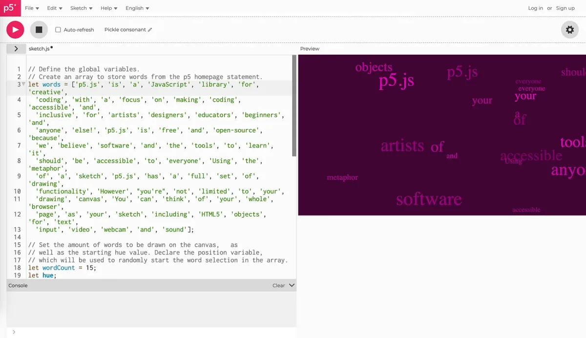
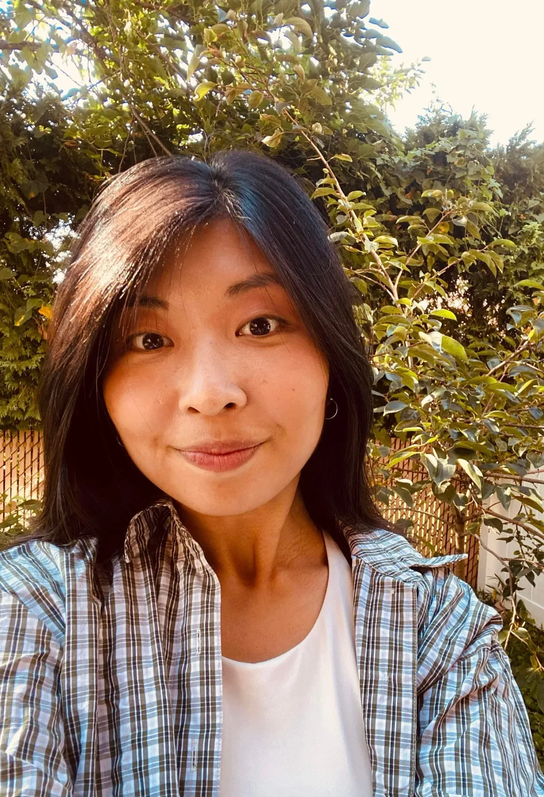

*Screenshot of a sketch on the p5.js Editor.*

Are you an artist, coder, or learner interested in making meaningful contributions to open-source software? In this beginner-friendly workshop, [Rachel Lim](https://p5js.org/people/), the Project Lead of the [p5.js Editor](https://editor.p5js.org/), will introduce the fundamentals of open-source collaboration. She will guide participants through software installation and writing their first [GitHub issue](https://github.com/processing/p5.js-web-editor/issues) for the p5.js Editor!

While this workshop focuses on writing GitHub issues, contributing to open-source isn’t just about coding — there are many ways to support and grow projects, such as improving documentation, helping with outreach, or organizing community events. Please subscribe to the [Processing Foundation newsletter](https://processingfoundation.myflodesk.com/newslettersubscription) to stay tuned to future workshops that empower you to contribute in technical and non-technical ways.

**This workshop is free, and participants from all levels are welcome.**

### Event Details

#### **When**

Sunday, June 1, 2025, at 9:30 am-12:30 pm ET

#### **Where**

Online. This workshop accommodates a maximum of 10 participants and is first-come, first-served!

[Eventbrite RSVP](https://www.eventbrite.com/e/open-source-software-contributor-workshop-p5js-editor-tickets-1320142233959?aff=oddtdtcreator)

#### **Facilitator**

*p5.js Editor Project Lead, Rachel Lim.*

**Rachel Lim (she/her)** is a Korean-American programmer whose works explore vulnerability, discomfort, and grief with gentleness and humor. She has been the p5.js Editor Project Lead since 2022. She holds a master’s degree from the Interactive Telecommunications Program at NYU, where she also received a BA in Art History. In her spare time, she loves crafting knick-knacks and running outdoors.

### **Workshop Outcomes**

This workshop aims to help participants unfamiliar with open-source projects feel equipped to engage with and contribute to these projects effectively. By the end of this workshop, participants should:

-   Understand the fundamental components of an open-source project (i.e Contributor Documentation, Code of Conduct, Licensing).
-   Overview of different issues an open-source project could face financially, legally, or interpersonally.
-   How to navigate a GitHub repository.
-   How to make code contributions such as opening and responding to issues on GitHub.
-   Understanding how a joint discussion of these questions and effective communication strategies could foster healthy, inclusive, and accessible online environments.
-   Awareness of different contribution pathways beyond coding.
