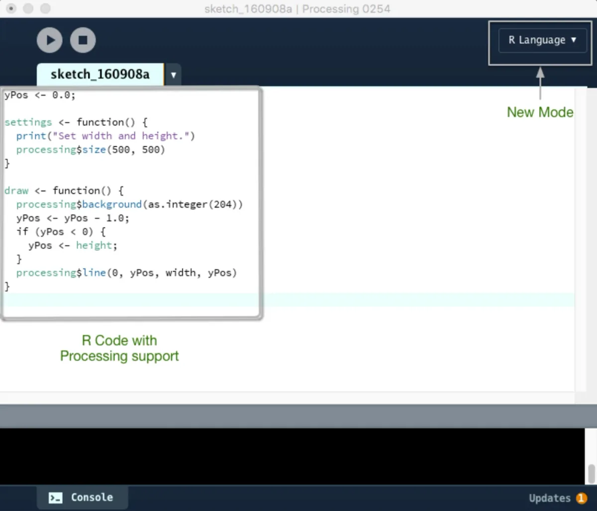
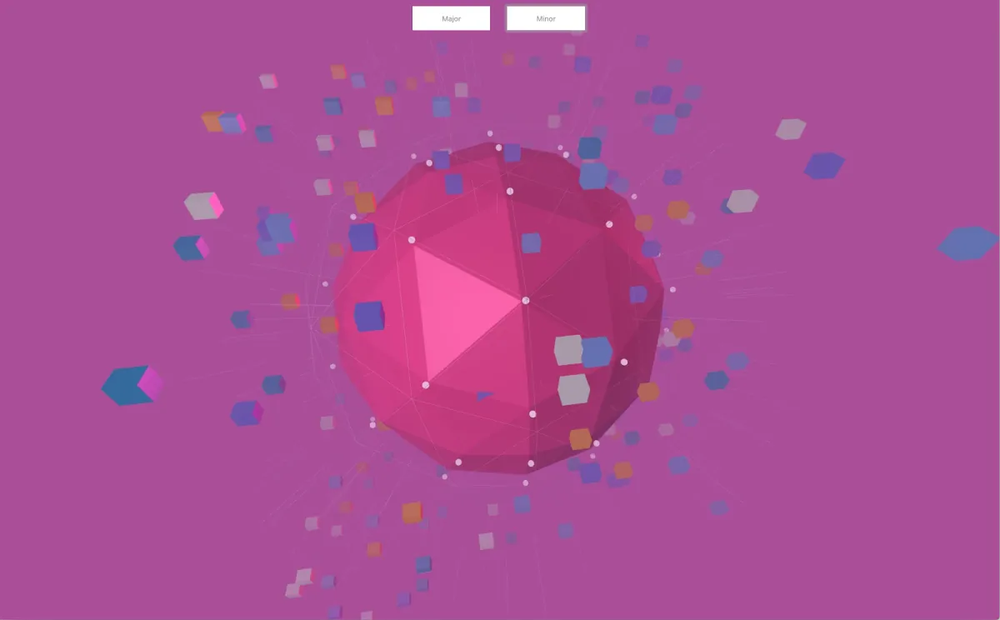
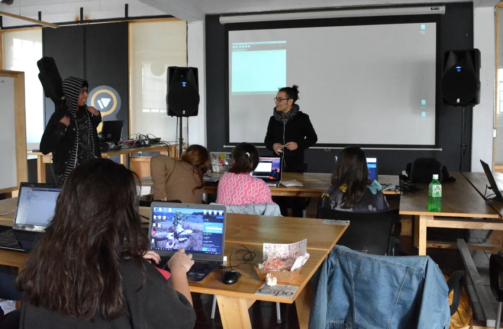
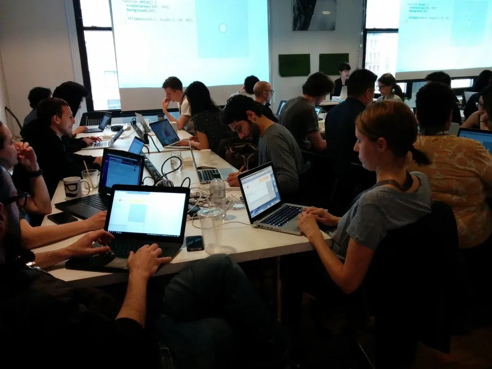

We are participating this summer in [Google Summer of Code](https://summerofcode.withgoogle.com/) and [Rails Girls Summer of Code](https://railsgirlssummerofcode.org/), two programs that aim to get students involved in open source software by providing a summer stipend to work on a project of their choice. Students submitted proposals to work on an aspect of Processing, p5.js, Processing.py, and Processing for Android. We were able to offer sixteen positions from a field of ninety applications.

Each student is paired with a mentor who will guide the efforts over the summer. The mentors include Tega Brain, Andres Colubri, Jeremy Douglass, Ben Fry, Gottfried Haider, Claire Kearney-Volpe, Golan Levin, Lauren McCarthy, Manindra Moharana, Luisa Pereira, Casey Reas, Daniel Shiffman, Jason Sigal, Cassie Tarakajian, Lee Tusman, and David Wicks. We are thrilled to have their expertise and support.

Here’s an overview of the projects…

**Processing**

[Prayash Thapa](http://effulgence.io/work/) is working to revamp the editor by adding features such as automatic bracket completion, tab-detection, autocompletion, and inline API documentation.

[Abhik Pal](https://abhikpal.github.io/) is creating p5py, a native Python package based on the core ideas and API of Processing. While Processing.py currently takes python code and compiles it to Java, p5py will run completely in Python, allowing integration with other existing Python modules.

[Ce Gao](https://github.com/gaocegege) is creating an experimental new mode in Processing for R Language, which allows users to write Processing sketches using the R language. Follow along with the project here: [https://github.com/gaocegege/Processing.R/wiki](https://github.com/gaocegege/Processing.R/wiki)!

*Mockup of in-progress Processing R mode*

**Processing for Android**

[Sara Di Bartolomeo](https://picorana.github.io/projects) is building “Cardboard Mode Demo” — a virtual reality application aimed at demonstrating and documenting the possibilities of the new Processing Android Cardboard Mode.

*[Playmobil M\*rda](https://picorana.github.io/projects), prior Processing work by Sara Di Bartolomeo*

[Sarjak Thakkar](https://github.com/tsarjak) is building an Image Processing Library to ease differentiation of colors for color blind people. A major piece of this project will be developing an algorithm for image conversion that supports all types and all levels of color blindness.

[Rupak Das](https://github.com/rupak0577/) is transitioning the Processing for Android build process from using ANT scripts to Gradle, a newer build tool that will be more compatible with the current Android SDK, and allow for greater customization and ease in navigating the build process.

**p5.js**

[Jeevan Farias](http://jvn.tf/) is furthering development of the p5.Sound library. He will add the functionality to generate more complex audio effects, and create a series of modules for algorithmic sound composition.

*[Musiverse](http://effulgence.io/Musiverse/), prior work by Prayash Thapa using p5.Sound library*

[Alice Chung](https://almchng.itch.io/) is expanding on the p5.js Friendly Debugger, which was originally begun at the p5.js Contributor’s Conference, and further developed by Processing Foundation Fellows Jess Klein and Atul Varma. The Friendly Debugger will check function calls for correct parameter input, identify common JavaScript and p5.js errors, and provide feedback in a friendly and inclusive way.

[Kate Hollenbach](http://www.katehollenbach.com/) and [Stalgia Grigg](http://stalgiagrigg.name/) are both working to overhaul the 3D rendering WebGL mode to remove bugs, improve performance, and extend functionality. Specific areas of focus include texture mapping, improved camera control, and improved developer documentation.

[Cristóbal Valenzuela](http://cvalenzuelab.com/) is building a set of p5.js tools around mapping. He will create an addon that’s able to overlay the p5.js canvas over raster tiles maps — like OpenStreetMap, Leaflet, Mapbox, or Google Maps — and enable the ability to zoom, pan, and move around a map and visualize p5 elements on top of it. He will also create examples and tutorials for working with static map images, and creating mapping, cartography, and geolocation-based visual representations.

[Saksham Saxena](https://github.com/sakshamsaxena) is working on infrastructural aspects of p5.js, including creating a modularised build design of p5.js along with an option to download the respective separate standalone components of p5.js from the website, an automated release process of p5.js, and a standardised issue template.

[Aarón Montoya-Moraga](http://montoyamoraga.io/) is continuing his Spanish translation and community outreach work. He will work on development of the website and internationalization infrastructure in order to translate p5.js and Processing reference materials. We are preparing for launch of these later this summer. He will also complete a translation of the Getting Started with p5.js book.

*Learning Processing at [Coded, Escuela de Artes y Oficios Electrónicos](http://codedescuela.cl/paginas/talleres.html), co-founded in Chile by Aarón Montoya-Moraga (image credit: Claudia Montecinos, Coded Escuela)*

**p5.js Web Editor**

Three projects will lend support for the p5.js Web Editor, which is currently in development, led by Processing Foundation Fellow Cassie Tarakajian. Teammates [Katyayani Singh](https://github.com/Katy310/) and [Saumya Balodi](https://github.com/saumya1906/), and [Zach Rispoli](http://zrispo.co/) are working on general development to get the web editor to a stable beta release. He will also work on community-oriented aspects of the tool, including easy publishing to other web platforms, such as OpenProcessing. [Jen Kagan](https://kaganjd.github.io/portfolio/) is focusing on improving the debugging and development experience in the p5 web editor by implementing autocomplete code suggestions, and improving the existing console.

*Trying out the p5.js Web Editor at ITP Camp, in a workshop led by Cassie Tarakajian*

**Much more to come!**

The students’ work kicked off at the beginning of June, and will continue throughout the summer. Stay tuned for updates!
