To celebrate, the Processing Foundation organized [Processing Community Day 2021](https://processingfoundation.org/advocacy/pcd-2021), a distributed, worldwide party held on August 20–22, 2021. For PCD2021, the community could participate in a number of ways, from hosting an event online or in their city, to contributing to the [20th Anniversary Processing Community Catalog](https://processingfoundation.org/advocacy/community-catalog), to sharing creative coding projects and resources at [#pcd2021share](https://twitter.com/search?q=%23pcd2021share&src=typed_query&f=live), to creating a real or virtual birthday cake at [#pcd2021cake](https://twitter.com/search?q=%23pcd2021cake&src=typed_query&f=live). Over the next couple weeks, we’ll be posting a series of articles written by some of the folks who organized a PCD2021 event. Happy 20th birthday!

---

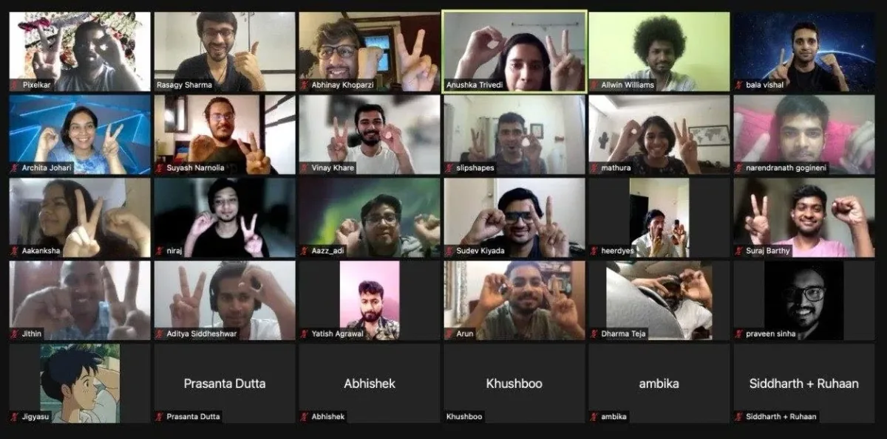

*PCD India 2021 group photo! \[**Image description**: A grid of livestream videos showing the participants in the PCD India 2021 event.\]*

The year 2021 has been trying for us all, but I think it would be fair to say that, through it, we’ve come to appreciate our communities more. It is the people around us, physically and also virtually, that we should celebrate more often and with more vigor.

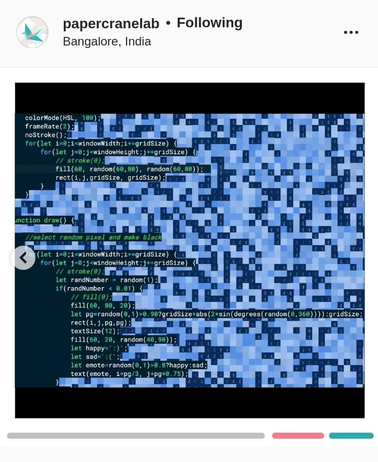

*CC Sante creative coding session. \[**Image description**: A screengrab of @papercranelab’s Instagram page showing a screengrab of the CC Sante creative coding session. The image shows coding overlaid on a pixelated background of various shades of blue.\]*

In the creative coding community in India, we do just that with a monthly event at the [CC Sante](https://www.instagram.com/p/CShJvkSrbjw/) meetup, organized by [Mathura Govindarajan](https://www.instagram.com/mathuramg/) and [Karthik Dondeti](https://www.instagram.com/karthik.dondeti/). We usually gather on the second Saturday of every month for a show and tell, followed by discussions and sometimes what we like to call “mass programming” — where everyone gets on a shared p5Live sketch and works on a simple prompt.

For the Processing Community Day this year, we thought of doing something similar, with the same format but slightly more organized. We sent out a call for proposals and made a poster and [website](https://processingindia.com/).

On the evening of Saturday, August 21, we gathered virtually — from our respective rooms and corners — to celebrate. 🎉

### Walkthrough of SOMNI

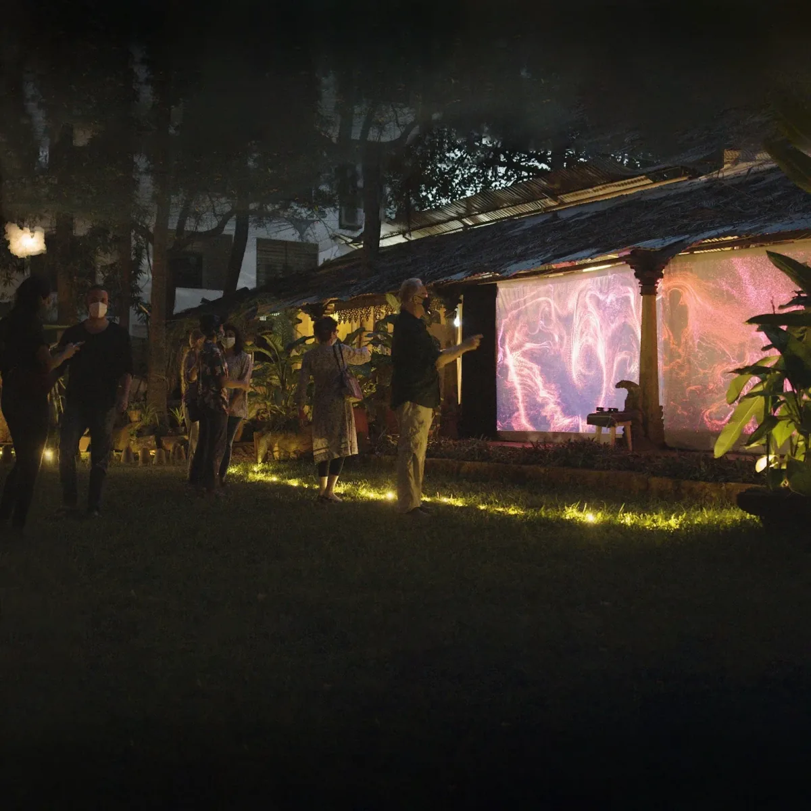

*SOMNI’s interactive walkway of light, sound, and music. \[**Image description**: Photo of visitors to the SOMNI installation. The individuals pictured are looking at and taking pictures of what appear to be brightly colored, abstract video animations playing on outdoor screens.\]*

We started with [Mrityunjay Sathyanarayanan](https://www.mjaymusic.com/) and [Vinay Khare](https://www.instagram.com/_vinaykhare_/) from [Ayahi](https://www.instagram.com/ayahi_create/?hl=en), who took us into a deep dive of their immersive audiovisual installation, [SOMNI](https://ayahi.in/somni/). They first brought the project, which is fully self-funded, to Pondicherry and later to Auroville.

Mrityunjay describes himself as a musical composer while Vinay is the technical brain behind the installation. One of them would come up with somewhat fantastical ideas while the other would brainstorm how to bring them to reality. They are both fascinated with the idea of using technology as a means of creative expression, and they started Ayahi with a broad interpretation of creative coding as encompassing fields of hardware, software, and everything in between. They wanted to see how people who had not had much experience with audiovisual installations would react to something like SOMNI, and how far they could push their own boundaries in bringing this experience to life.

COVID-19 regulations brought a fascinating constraint to the project, since the creators had to enable social distancing and touch-free interactions. Since the project is fully self-funded, hardware and materials were used as modules, free to be taken apart and built into something else. The installation featured clouds made out of loofahs, columns of light controlled by music generation, hanging bulbs that responded to visitors’ heart rates, and spatial flow fields just waiting for someone to dance.

### Visualizing DNA Sequence as Abstract Art

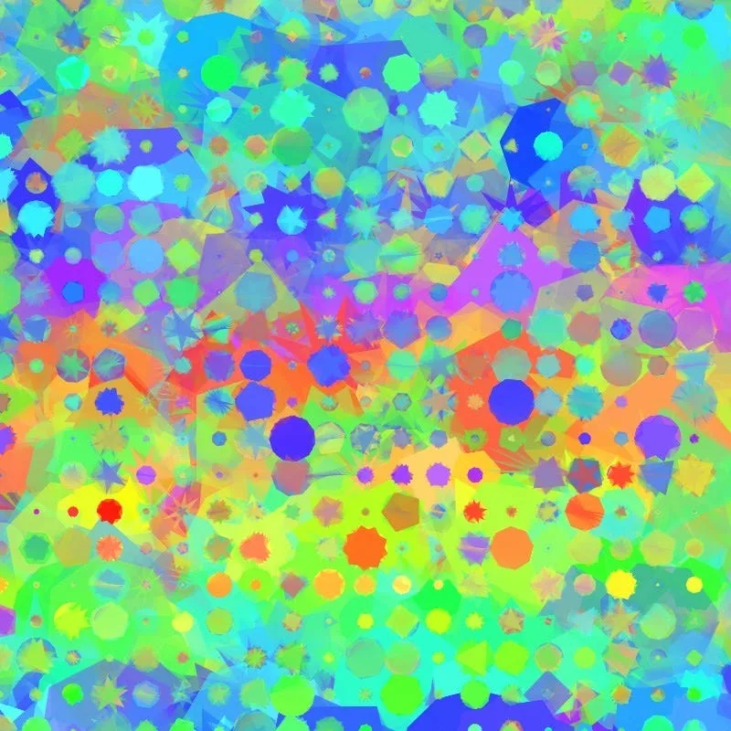

*A visualization of DNA. \[**Image description**: An example of an abstract visualization of DNA, showing multicolored spots, stars, and shapes that appear over a bright, multicolored background.\]*

Next came [Archita](https://www.instagram.com/the_crude_artist/) to take us through her project, which combines DNA sequencing with art. Having a background in biotechnology before she started her Masters in Design, Johari first landed upon the idea of imagining fantastical creatures with a given set of characteristics, which she then sought to visualize. However, she was not happy with her initial results, and methodically made a list of pros and cons, ultimately realizing that it would be better to begin her research by focusing on DNA.

She explored the DNA of COVID-19, mapping its genome into colors, and then stumbled upon the idea of using very particular genes (i.e. much smaller sequences of DNA), like the gene responsible for the scent of a rose. Mapping DNA components to numbers allowed her to look at her artwork and intuitively know which base pair of DNA components is dominant in the picture! 😮

### **Sewing with Code**

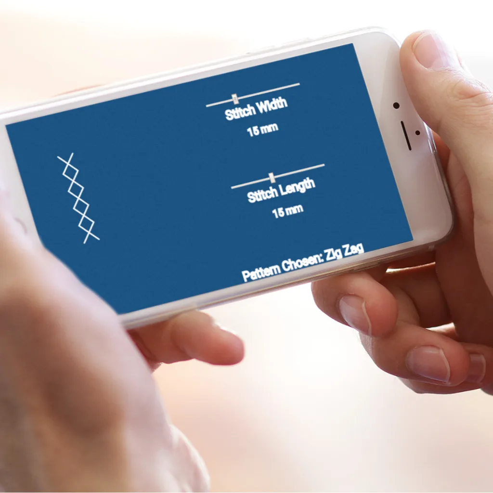

*Prototype of a stitch using p5.js. \[**Image description**: Photo of a pair of hands holding an iPhone. The iPhone screen shows the pattern of a sewing stitch alongside text that details the length and width of the stitch.\]*

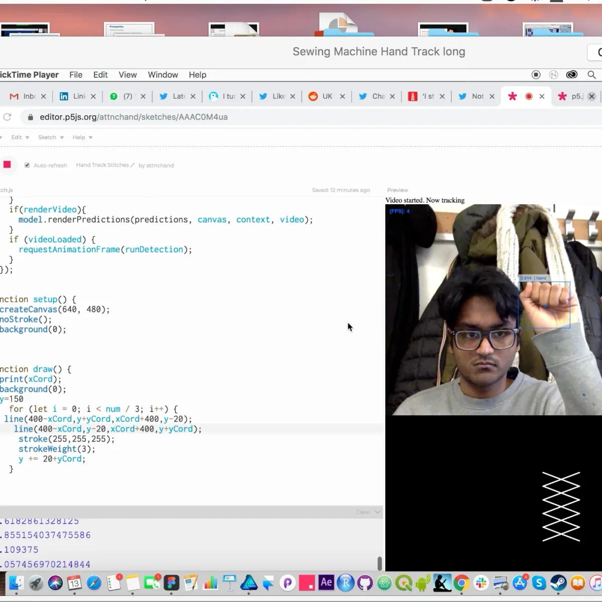

*Experiments with handtrack.js and p5.js. \[**Image description**: A screengrab of code, overlaid with a screenshot of a livestream image of someone holding up his hand in the shape of a fist, beneath which another screen shows the white pattern of a stitch against a black background.\]*

From DNA, we moved onto sewing. [Chandra](http://chandra.fun/) talked us through the intricacies of sewing machines and their interfaces, and how his project looked at simplifying the technology to give hobbyists easy access to this fun and creative physical activity. During the initial research and interviewing process, he realized that sewing machines can be intimidating even to daily users, and so wondered how the design of the interface and its visual language could be simplified to make it more accessible. While working on prototypes, he realized that creative coding frameworks like p5.js could be used not only for expressions of visual art, but also for analog interactions and interfaces.

### NFTs for Computational or Generative Artist

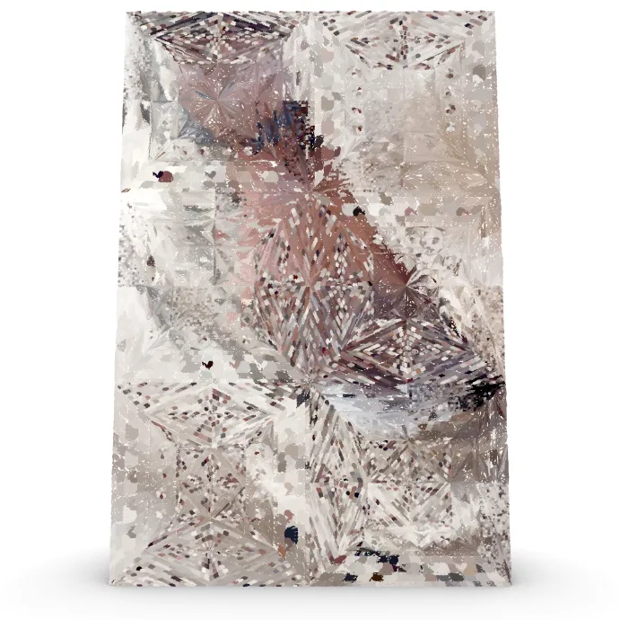

*Still from *Pixelated Raza*, a video piece by Pixelkar. \[**Image description**: A digital rendering of what appears to be a three-dimensional block of shattered glass with reflections of pink and white appearing in its surface.\]*

Next up, [Pixelkar](https://www.instagram.com/pixelkar/) introduced us to the world of NFTs and blockchains, and how computational artists can earn a living by selling their artwork through these new and evolving channels. While outlining the technicalities of blockchains and decentralized systems, he explained how artists stand to earn royalties from every secondary sale of their artwork on NFT platforms. The artist owns reproduction rights in such a transaction. Since this is a hotly debated topic among artists and technologists alike, there were quite a few questions that came up during the short discussion that followed. I urge you to dive into the references section at the end to know more about NFTs.

### Sentiments of Emojis

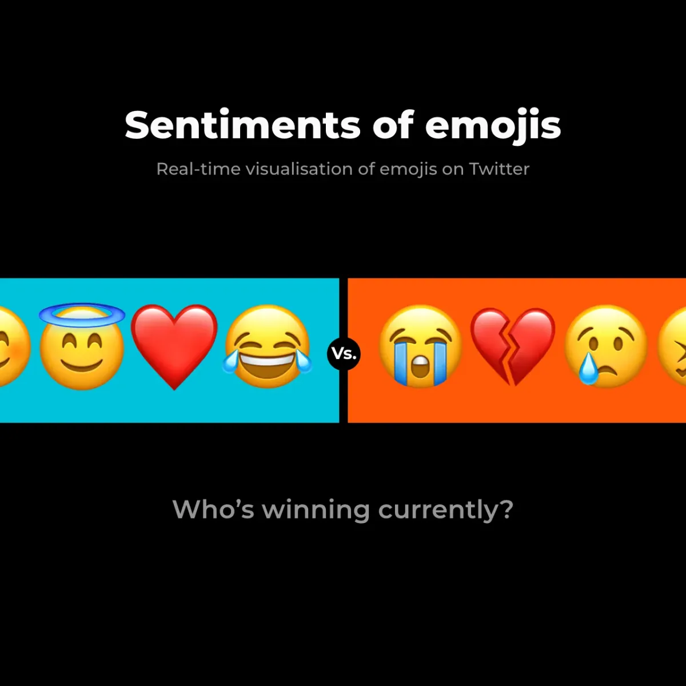

*Realtime emoji tracker. \[**Image description**: Snapshot of a black screen with two side-by-side horizontal bands in red and blue, upon which appear a series of emojis. The blue band features emojis that represent feelings of love and joy, while the red band features emojis that represent sadness and heartbreak. The text “Sentiments of emojis” appears over the emojis. Beneath them appears the text, “Who’s winning currently?”\]*

We finished the talks with a presentation by [Allwin Williams](https://allwinwilliams.com/) who spoke about the [realtime emoji tracker](https://allwinwilliams.com/emoji-sentiments-twitter/) that he built using Twitter. Taking as its central question what our collective emoji usage says about us, he developed an emoji live-tracking data service.

In order to understand this enormous data set more effectively, he built an emoji meter, which then led him to think about how best to tell a story. He decided to categorize the emojis with labels — some more explicit than others. He experimented with different ways of visualizing the data alongside these labels, and found some to be more effective than others at being able to tell a story.

He also did analysis on more personal data, examining the use of emojis in exported friend group chats on Whatsapp. This led to a conversation with the group participants about the results of the analysis.

Since the tracker is live, it is possible to observe the data during eventful days, like, for example, when India wins or loses a cricket match. See for yourself how we collectively respond through emojis.🕺

Upon wrapping up the talks, we moved into breakout rooms — one for beginners to showcase their recent explorations and generally interact with each other, another for slightly more serious conversations ranging from financing your own projects, to building maker spaces that enable collaboration and contextualizing computational art in non-Western histories.

We ended the evening with a programming session involving about 20 people and decided to make a cake! 🍰

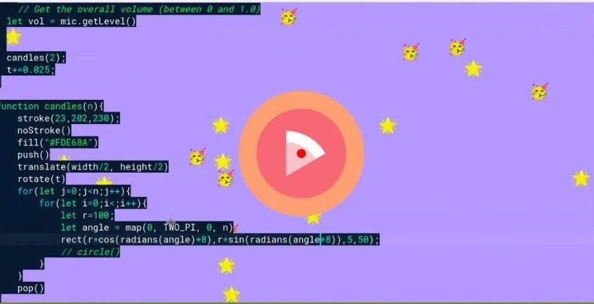

*PCD India 2021 Cake! \[**Image description**: Screengrab of a purple screen with a flat rendering of a piece of cake in the middle of two concentric circles appearing over it. A stream of code runs down the left side of the screen, and some celebratory cat emojis appear to float across the purple screen.\]*

And although we didn’t get the time to talk about this during the session, [Dharma](https://www.instagram.com/dhrmatj/) Dharma Teja, who distributes [Alpha6 Corporation](https://instagram.com/alpha6corporation) and [Danley Sound Labs](https://instagram.com/danleysoundlabs?utm_medium=copy_link), brought this year’s poster to life by plotting and then laser-cutting it! 🎉 Dharma also has a keen interest in STEAM projects and works on them with government schools, NGOs, and social enterprises in India.

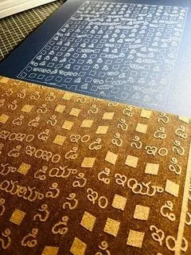

*A plot and wood emboss of PCD India 2021 poster in Kannada. \[**Image description**: Photo of a series of squares and symbols that appear embossed in wood and imprinted onto a black surface.\]*

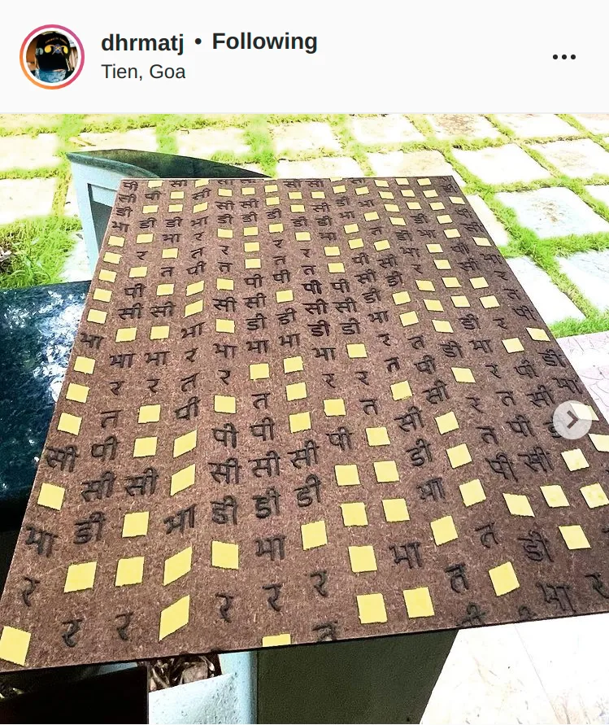

*Painted wood emboss of PCD India 2021 poster in Devanagari. \[**Image description**: Screenshot of @dhrmatj’s Instagram post showing a photo of a wooden panel embossed and painted with a series of squares and symbols.\]*

### Coding with Friends

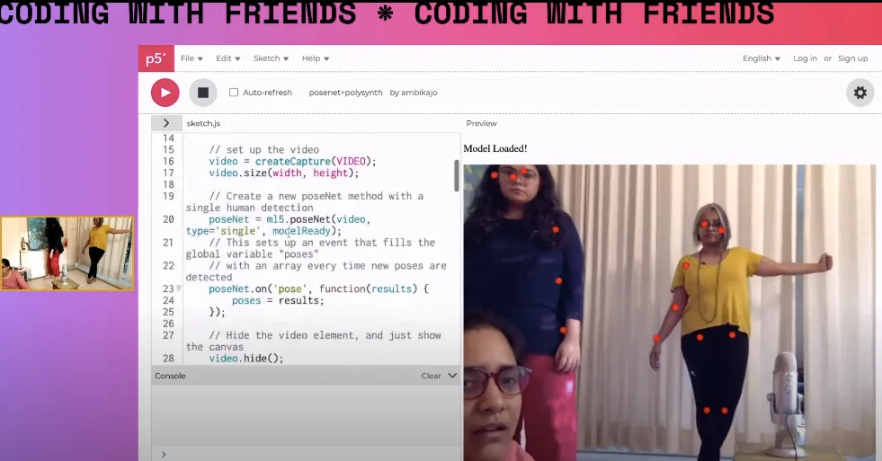

*Coding with friends — Vaibhavi and Nanditi. \[**Image description**: A screenshot showing the Coding with Friends platform. A stream of p5.js code appears over a purple screen. A livestream video showing Ambika, Vaibhavi, and Nanditi appears alongside the code.\]*

On Sunday, August 22nd, we had a special [twitch stream](https://www.twitch.tv/computational_mama) from Ambika, aka [Computational Mama](https://www.instagram.com/computational_mama/), who is a Processing Foundation Fellow this year. Along with her friends, [Nanditi](https://www.instagram.com/nanditi.k/) and [Vaibhavi](https://www.instagram.com/ivahbiav/), she used the [posenet](https://learn.ml5js.org/#/reference/posenet) model from [ml5.js](https://learn.ml5js.org) to try and make music using human body movement. 🎉🎵

Below are some snippets of conversations from the stream, and you can find it in full on youtube [here](https://www.youtube.com/watch?v=EoLs36sGqHI).

***Vaibhavi****: \[p5.js\] is like your little child. That means that we can also fool it because we fool children all the time. (Collective laughter)*

***Nanditi****: We’ve got a set of major and minor (chords), so what do you want to map where? Vaibhavi, please, whatever you do, just balance it otherwise I’ll be like ehhh. (Does unstable pose)*

***Ambika****: Do more satsang and then later you’ll feel like you’ve gotten old. We are redefining satsang. Oh, but if we do a clap then both chords will play together. (Audible excitement)*

***Ambika:*** *…back then I was not sleeping because I was pregnant, very pregnant, like I couldn’t move around, so I used to put \[my laptop\] on my tummy and code. (Everyone wows.)*

***Nanditi****: I can’t imagine how smart \[your son\] Yugen will be. Maybe he’s been talking in JavaScript we don’t know — that’s why we’re like, “We can’t understand!” (Everyone laughs)*

That was all for this year. 👋 There are more references below if the rabbit hole is a place you like. 🐇

### References

#### **Ayahi**

-   [SOMNI documentation](https://www.youtube.com/watch?v=DnZEtX9k8y8)
-   Excerpt from interview with SOMNI

**Q: Do you think the experience would be better or worse if the COVID regulations were not in place?**

**A**: The limitations ended up delimiting the scope of the project, which helped us make an effective and powerful experience. Without them, we probably wouldn’t have been able to execute what we did in the timeframe that we had; our heads as artists would have been more up in the clouds, probably.

**Q: Most memorable hurdles/hacks/learnings for others?**

**A**: Completely forgot to mention this — outdoor installations have a huge disadvantage because you’re dependent on the weather. Make sure you read the forecast and have contingency plans!! While we knew rains were around and designed our electronics to be waterproof, nothing can prepare you for when it actually starts pouring. On our opening day in Auroville, the entire exhibition was completely washed off by sudden and heavy rains. We were running around like ants putting covers over electronics and bringing whatever we could indoors. We spent the entire next day blow-drying all our electronics and brushing off the soil. We had to postpone it until a few weeks later.

Tips: Good quality trash can bags are great for water protection because they are big. Enclose electronics in plastic containers, preferably sealed with hot glue. (Even then water might get in.) Emergency drill exercises can be helpful.

**Q: How did you manage working with multiple sensors?**

**A**: Each experience was standalone in the sense that it had a separate computer that connected to the devices. The kinect and leap motion were connected individually. The PIR motion sensors, on the other hand, were all connected to a NodeMCU, and that relayed the data to the system. We would be happy to dive deeper into the tech part if you wish.

**Q: How much of what you envisioned were you able to execute uncompromised? And how much of it manifested along the way?**

**A**: Seventy-five percent manifested on the way. Most design choices were made through experimentation. We had a basic direction, but as to the final look and feel — it boiled down to what we were able to manifest. We also had time and resources working against us, so we needed to take things as they came.

**Q: Do you guys keep all the tech tied up to the project or would you source things available in the different venues?**

**A**: Well, given that we also were looking at an experience package model for SOMNI, we built it with the mindset of keeping it modular and adaptable to any venue. Most of the bigger tech — like speakers, projectors, computers, and iPads — were either borrowed or personal. Between the first and second iteration the speakers and projectors were different since they were provided by the venue itself. Anything that is customized for the experience, like light columns or boxes, is built such that it can be disassembled and reconfigured.

**Q: Who was your audience? Did prior knowledge of that (if so) affect your creative choices?**

**A**: We expected only friends and family and probably some others. But when word began to spread, and since our installation was over the weekend (Pondy attracts thousands of tourists from all over), we had a huge rush of people we didn’t expect. Still, we made the decision to keep the entrance completely free and make the thing donation-based, if they enjoyed the experience. Our aim was to get as many people as possible, from as diverse a demographic as possible — which is what we got. From the artistic point of view, we knew that Pondy and Auroville have very open cultures for new ideas, so we did have that luxury to be more abstract with our creative choices than, say, a commercial setting in some other urban town. But other than that, we were only guided by our own vision of what we wanted to do, and hoped it would gel with the audience.

#### **Archita Johari**

-   [p5.js sketches](https://editor.p5js.org/aj.architajohari/sketches)
-   [Behance](https://www.behance.net/archita_johari)
-   Excerpt from interview with Archita:

**Q: What is a codon?**

**A**: It is a combination of three consecutive nucleotides of DNA strand, which binds with tRNA to make protein.

#### **Chandra**

-   [Twitter handtracking](https://twitter.com/ncresq/status/1205433706644725761?s=21)
-   [Dribbble](https://dribbble.com/shots/10753620-Stitch-Selection-Interface-Prototype)
-   [Handtrack](https://github.com/victordibia/handtrack.js/)
-   [MiMu gloves](https://mimugloves.com/)
-   Excerpt from interview with Chandra:

**Q: Does the sewing machine run Chrome?**

**A**: For your question on OS, the sewing machine concept was intended to run on something simple I guess, like a Raspberry Pi. Given we were working on a student project and on a time limit, we never got around to thinking about that.

**Q: Apart from using Processing in the process, how feasible do you think it would have been to use Processing in the final product?**

**A**: Processing in the final product — maybe very viable. We were already using the p5.js library to render the various shapes. That may continue.

#### **Pixelkar**

-   [Lynkfire](https://lynkfire.com/Pixelkar)
-   [WazirX NFT](https://nft.wazirx.org/drop)
-   [Art Blocks](https://www.artblocks.io/)
-   [NFT resources](https://linktr.ee/NFTResources)
-   [Processing fundraiser](https://hic.link/processing)

#### **Allwin Williams**

-   [YouTube](https://www.youtube.com/channel/UCUWvUfgtST148NIHc0DV24g)
-   [Medium](https://medium.com/nerd-for-tech/sentiments-of-emojis-21860c4f8881)
-   [Emojitracker](http://emojitracker.com/)
-   [We Feel Fine](http://wefeelfine.org/)
-   Excerpt from interview with Allwin Williams:

**Q: Is it location-specific? Does it take tweets from all over the world?**

**A**: It’s all over the world. A different narrative can be built if it’s location-specific. That would be an interesting concept to explore though.

#### **More Resources**

-   [The Coding Train](https://thecodingtrain.com/)
-   [Plant Music](https://www.instagram.com/shanemendonsa/)
-   [more Plant Music 💃](https://www.youtube.com/watch?v=f273DxMhQk0)
-   [and more Plant Music 🎉](https://www.youtube.com/watch?v=wYU18eiiFt4)
-   [Culture Connects workshop on NFTs](https://www.thewildcity.com/news/18622-culture-connects-announces-nft-workshops-digital-art-conversations-performances-by-dualist-inquiry-kiss-nuka-more)

🍰🍰🍰🍰🍰

-   [P5LIVE](https://teddavis.org/p5live/?cc=dnvxt)
