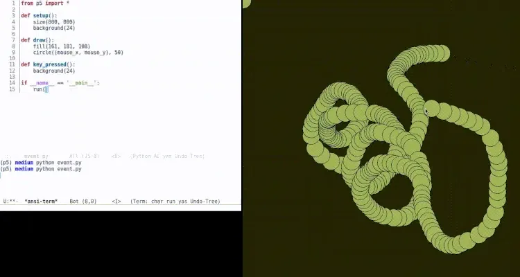
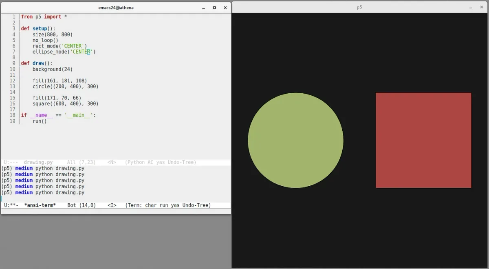
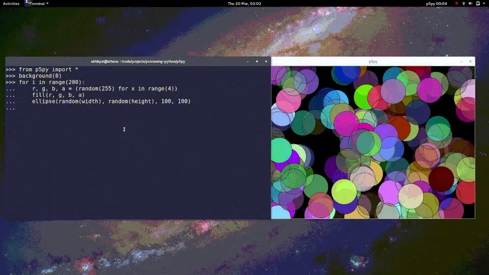

*2017 marks the Processing Foundation’s sixth year participating in* [*Google Summer of Code*](https://summerofcode.withgoogle.com/)*. We were able to offer sixteen positions to students. Now that the summer is wrapping up, we’ll be posting a few articles by students describing their projects.*

### p5: A Python implementation of the Processing API

by [Abhik Pal](https://github.com/abhikpal)  
mentored by [Manindra Moharana](http://www.mkmoharana.com/)

*(This post was originally published in a slightly different form* [*on Abhik’s blog*](https://abhikpal.github.io/blog/2017/08/27/p5-google-summer-of-code-progress-report)*.)*

---

After graduating from high school in the summer of 2016, I spent some time teaching programming to a small-ish group of 7th to 9th graders. The goal was to introduce them to Python so they could start working on small projects that ran on Raspberry Pis. Most of the programs we wrote with the students were text-based, and we soon realized that this often made it harder for students to understand what was going on. I looked for something that was more visual but wasn’t able to find a suitable enough library in the Python ecosystem.

Most powerful libraries are either used to write games (PyGame, etc) and assume some level of familiarity with Python, or are scientific visualization libraries. I couldn’t find anything that was high-level yet easy to use for beginners. So when I saw that the Processing Foundation would “love for someone to take on a native (C Python) version of Processing,” I decided to send in a proposal.

The main goal of the project was to create a Python library based on Processing. While Processing’s emphasis on teaching programming in a visual context does make it easier for beginners, the fact that it’s based on Java often makes it look needlessly complex to most beginners. The main motivation behind creating p5 was to leverage Python’s readability and Processing’s emphasis on coding in a visual context to make programming easier to teach.

The Python mode for Processing was also created for similar reasons, however, since Python mode was based on Jython, it limited the ways people could use Python. This was another motivation for creating p5: we wanted a library that used the Processing API while at the same time giving people access to Python’s large ecosystem of libraries.

We were able to meet most of our goals for the Google Summer of Code period. These included:

-   Creating a system that could work with Processing-like sketches, i.e., if the user defines a mouse\_pressed() function, p5 should be able to automatically attach a handler to it; if the user defines a draw() function, p5 should call it repeatedly, etc.

**A sample p5 sketch.**

-   Adding support for for basic 2D drawing — creating rectangles, lines, points, circles, etc. We also added two new features to the our API:
-   Tuple and list support for drawing functions: Since tuples, lists, and vectors are often used to store coordinates in space, we changed the original Processing API to use tuple-like objects by default. So, if a user wants to draw a line from start = (0, 0) to end = (100, 120), they can just call line(start, end) instead of line(start\[0\], start\[1\], end\[0\], end\[1\]).
-   New functions: Added new methods to draw circles and squares.

**P5 supports two new drawing functions: circle() and square()*!*

-   Adding Processing-like color parsing support. We also extend the API using Python’s keyword arguments so users can use commands like fill(red=255, green=127, blue=51, alpha=127) to define their colors.
-   Adding utility functions to perform basic mathematical operations, computing trig-functions, and generating points for curves and bezier splines. We also tweaked Processing’s PVector class to make it more intuitive to use. For example, the syntax for adding vectors in p5 is vec\_sum = vec\_1 + vec\_2 where vec\_1 and vec\_2 are vectors.
-   [Releasing p5](https://github.com/p5py/p5/releases/tag/v0.3.0a1) to the Python Package Index.
-   [Adding example code](https://github.com/p5py/p5-examples) and [documentation](https://p5.readthedocs.io/en/latest/) to help people get started.

We had initially planned on adding support for displaying text and images, but unfortunately weren’t able to do so in the GSoC period. Before week eight of the coding period, our code was using immediate mode rendering and our sketches would slow down under load. Instead of implementing new features like image support and text support, we decided to address the optimizing issue first and re-wrote the renderer to use retained mode rendering and use numpy for all internal computations.

Even though we met most of our goals for the GSoC period, p5 is far from being complete. Before we start adding more features, we would like to fix issues [#9](https://github.com/p5py/p5/issues/9) and [#10](https://github.com/p5py/p5/issues/10) first. Right now, p5 is practically useless on computers running Mac OS. Most sketches stop refreshing after drawing a couple of frames. Since most of the development work is done on a Linux machine, we haven’t been able to debug this properly. (We would really appreciate help from Mac users who are willing to test things out for us and help us debug this!)

Although our end goal is to implement the full Processing API in Python, we’d like to focus on the following features in the next couple of months:

-   Add support for live coding of sketches through the python REPL.

**P5 on the interactive python REPL.**

-   Add support for images.
-   Add support for text and fonts.

We really want more people to get involved with writing code! Head over to the the [project’s Github repository](https://github.com/p5py/p5) if you’d like to help out.
