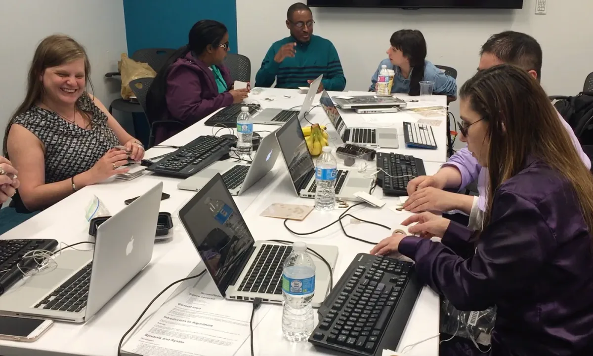
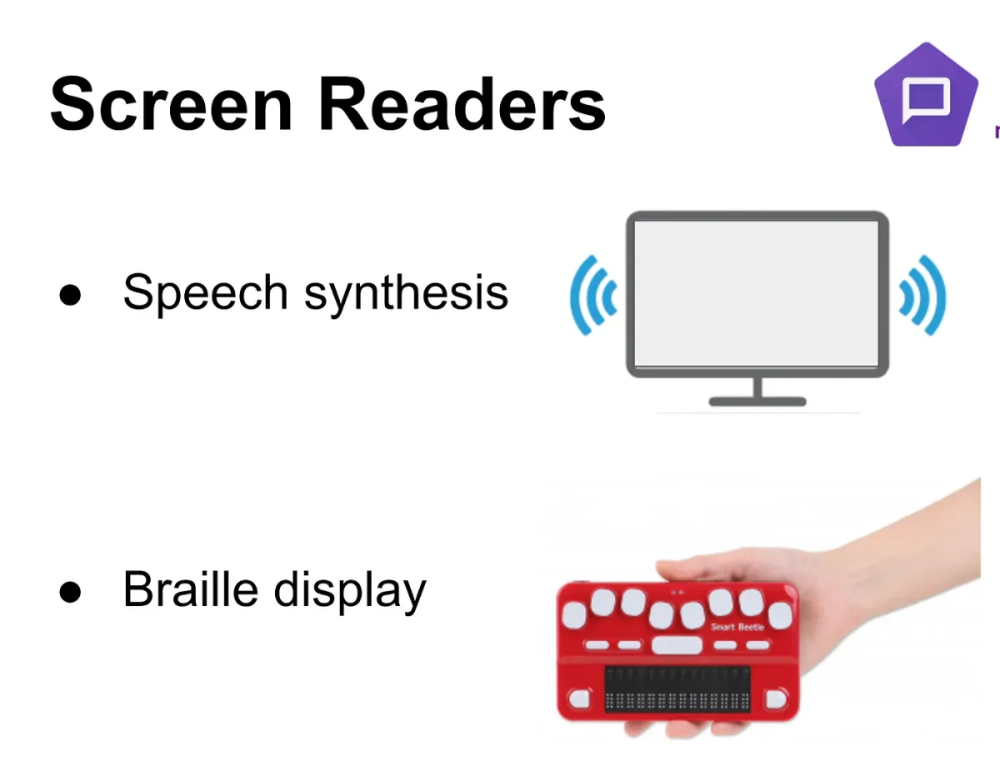
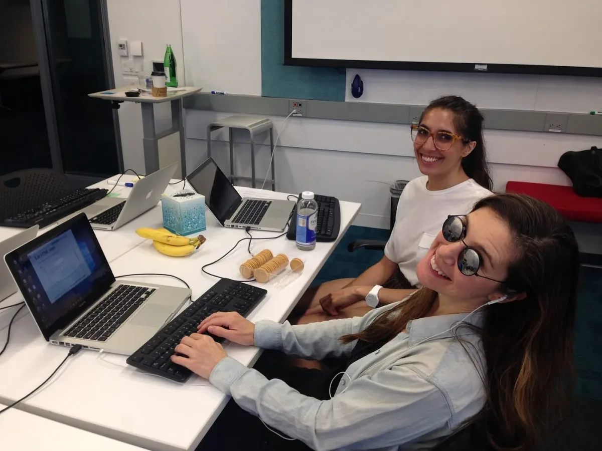
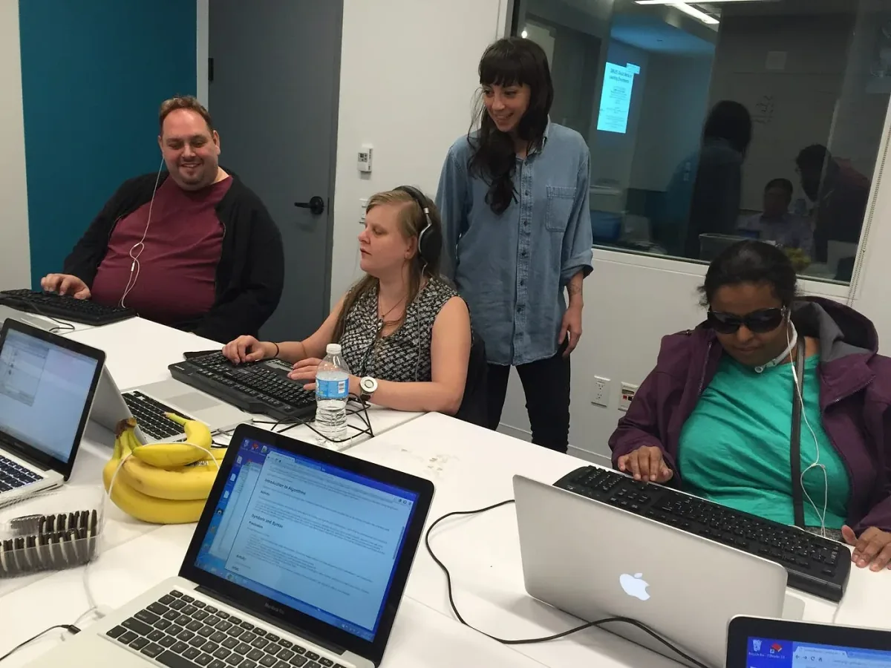
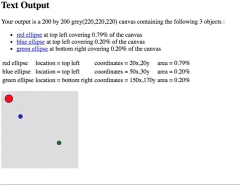
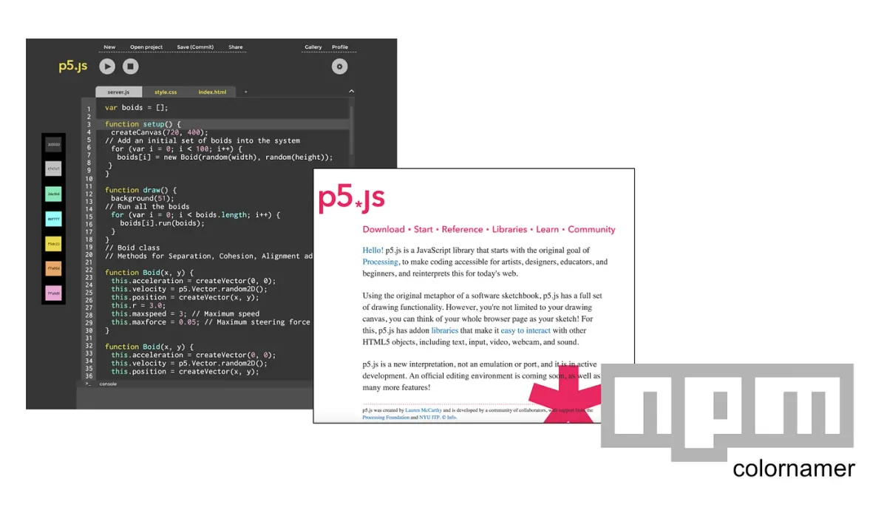

***Description:** Six workshop members sit around a table with laptops in front of them. They discuss and try a coding exercise.*

**Figure 1.** Image of workshop/focus group participants

Over the last two years, a small community has been growing and working on the
accessibility of P5.js. At its core, the P5 Accessibility project is a
community-based attempt to make P5.js and its learning resources accessible to
people that are blind or have low-vision. The Processing Foundation has
supported the work, which relies on a broad network of both sighted and blind
experts and end-users.

The project started where I work at
[NYU’s Ability Project](http://ability.nyu.edu), an interdisciplinary research
and development space. In this studio, our faculty and student teams develop
assistive and rehab technologies based on the premise that these _technologies
serve people best when they participate in its design_. People from the
community tell us their ideas for technological interventions, and we work with
them to develop solutions. Although physically based in the Tandon School of
Engineering, students from across NYU (engineering, occupational therapy, and
design students) collaborate with end-users to develop assistive and rehab
technologies.

One of these projects was a collaboration between myself and Chancey Fleet, a
blind technology expert and educator who works at a New York Public Library.
Together, we worked to develop a diagramming tool that would allow her to plan a
banquet, and save and share her plans digitally. The project ended up being a
bit of a disaster.

Not only did we need to program a sonified, touch-screen, web application as
coding novices, we also struggled to find cohesive, newbie-friendly
documentation of accessible development practices. For me, there was also the
challenge of learning how Chancey used her computer and cellphone. Many people
that are blind, Chancey included, use screenreaders with synthesized voices or
braille displays that relay information about the content on their screens.
Screenreaders, it turns out, are not that easy to use
([although worth a try](https://www.apple.com/voiceover/info/guide/)).

_**Description:** Diagram depicts representations of speech synthesis and
braille outputs. Sound waves coming from a monitor indicate speech synthesis,
and a small, red refreshable braille display is used as an example of screen
reader outputting to braille._

**Figure 2.** Diagram of Screen Readers

In addition to being in unfamiliar territory myself, another factor impeded our
progress. If the prototyping process was to be truly participatory, Chancey
needed to brush up on javascript and HTML. We looked into the plethora of
code-learning resources online and found that most were inaccessible to her
screen reader. Even the “good” ones, the ones that teams of very smart people
had worked hard to make accessible, remained unfriendly and cumbersome to use
because although their lesson descriptions were accessible their videos, edit
fields, or screenshots of code snippets were not.

The lack of good documentation around accessible development practices _and_ the
lack of accessible code-learning resources slowed us down and frustrated us to
the point that the project was stopped halfway. Although our banquet diagramming
app was never fully realized, from this work emerged a sense of immediacy around
accessible code learning.

Our solution was to combine the design challenges into one mega project. We
approached the Processing Foundation, and they accepted our application to their
2016 fellowship program. The Processing Foundation’s mission — to “promote
software literacy” and “empower people of all interests and backgrounds to learn
how to program and make creative work with code” — aligned nicely with the
project goals.

We began the project with input from experts and focus groups that have
facilitated a redesign of the [P5.js](http://p5js.org/) learning resources and
web-based code editor to ensure that they are accessible to people with low
vision and blindness.

### Expert Interviews:

We interviewed five professional HCI (Human Computer Interaction) researchers
and developers with special interest in accessibility for people with visual
impairments. Each of these stakeholders have visual impairments themselves, and
offered great insights into the issues of this type of undertaking and examples
of previous attempts.

### Focus Groups and Code Learning Workshops:

We held five workshops in which people with visual impairments came and learned
web development and also tested our P5.js web-editor prototypes as they have
developed with feedback.

_**Description:** Smiling student volunteer and participant sit at a desk with
laptops in front of them._

**Figure 3.** Student volunteer and participant during workshop

_**Description:** Claire stands behind three workshop participants sitting at a
table with laptops in front of them._

**Figure 4.** Participants check on each other’s work during coding exercises.

### Implementation:

Led by Mathura Govindarajan, Luis Morales-Navarro, and Cassie Tarakajian, we
have been continually developing the accessibility of the P5 development
environment (IDE) and its user interface elements/interactions across a variety
of browsers, operating systems, and assistive technologies (AT).

The outputs of P5 sketches have been a particular challenge to convey in an
accessible format. As canvas elements are impenetrable by screenreaders (the
only HTML5 element that is), we worked on creating a “Shadow DOM” that
dynamically interprets the visual and spatial outputs on screen. Our Shadow DOM
outputs are hidden but accessible to screenreaders.

The three outputs that we have developed are 1) accessible text (english
language description), 2) tabular (in a table format), or 3) tonally based
(panning and frequency used to convey position and speed) descriptions of the
visual content on the canvas. In their current state, the accessible outputs
handle fairly simple sketches and can be activated in P5’s web-based IDE’s
Preferences menu.

_**Description:** Animated gif showing text and table outputs of a simple sketch
with animation. Updating text and tabular data reads the position and size of
ellipses in a canvas on the bottom left of the screen. A red ellipse is at the
top left of the canvas and, green and blue ellipses bounce vertically from top
to bottom of the canvas._

**Figure 5.** Visual example of text and table outputs of a simple sketch with
animation

We have also created a high contrast mode for the IDE and developed our own
“Color Namer” that translates RGB values to color descriptions. With the
assistance of Lauren McCarthy, we have worked on an audit and remediation of
P5’s resource website accessibility. This small but dedicated team is currently
working on making an accessible widget for the editor, so that it can be
embedded in online lessons and tested with high school students.

_**Description:** Screenshot of high-contrast editor mode, screenshot of P5
website, and color namer logo_

**Figure 6.** P5 accessibility-specific software work

**If you have any questions or wish to contribute to the project, please email
us at** [ability@nyu.edu](mailto:ability@nyu.edu)

### Resources

Brown, J. S., Collins, A., & Duguid, P. (1989). Situated cognition and the
culture of learning. Educational researcher, 18(1), 32–42.

Bellotti, V., & Smith, I. (2000, August). Informing the design of an information
management system with iterative fieldwork. In Proceedings of the 3rd conference
on Designing interactive systems: processes, practices, methods, and techniques
(pp. 227–237). ACM.

Edwards, W. K., Bellotti, V., Dey, A. K., & Newman, M. W. (2003, April). The
challenges of user-centered design and evaluation for infrastructure.
InProceedings of the SIGCHI conference on Human factors in computing systems
(pp. 297–304). ACM.

Gerber, Elaine. Conducting Usability Testing With Computer Users Who Are Blind
Or Visually Impaired, 2002 CSUN Conference Proceedings, (Session# 189).
Retrieved from
[http://www.csun.edu/~hfdss006/conf/2002/proceedings/189.htm](http://www.csun.edu/~hfdss006/conf/2002/proceedings/189.htm)

Pea, Roy D. Practices of distributed intelligence and designs for education.
Gavriel Salomon. Distributed cognitions Psychological and educational
considerations, Cambridge university press, pp.47–87, 1993.

Pullin, Graham. Design meets disability. MA: MIT Press, 2009.

Stefik, Andreas; Hundhausen, Christopher; Patterson, Robert;, An empirical
investigation into the design of auditory cues to enhance computer program
comprehension,International Journal of Human-Computer Studies, 69, 12, 820–838,
2011, Elsevier.

Stefik, Andreas; Siebert, Susanna;, An empirical investigation into programming
language syntax, ACM Transactions on Computing Education (TOCE), 13, 4, 19,
2013, ACM.
