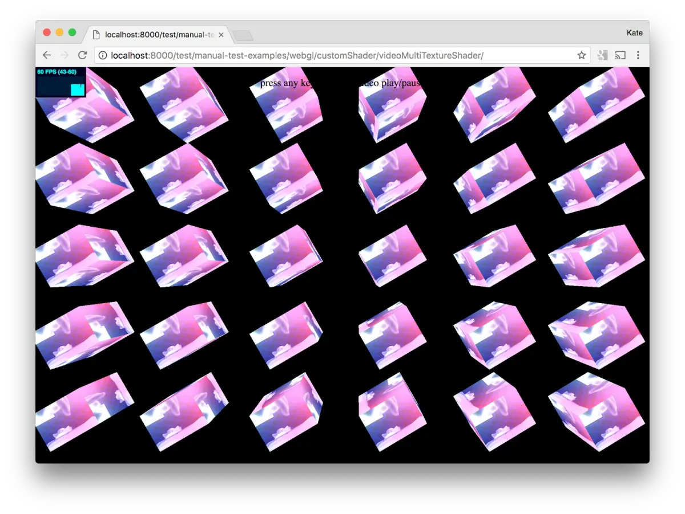
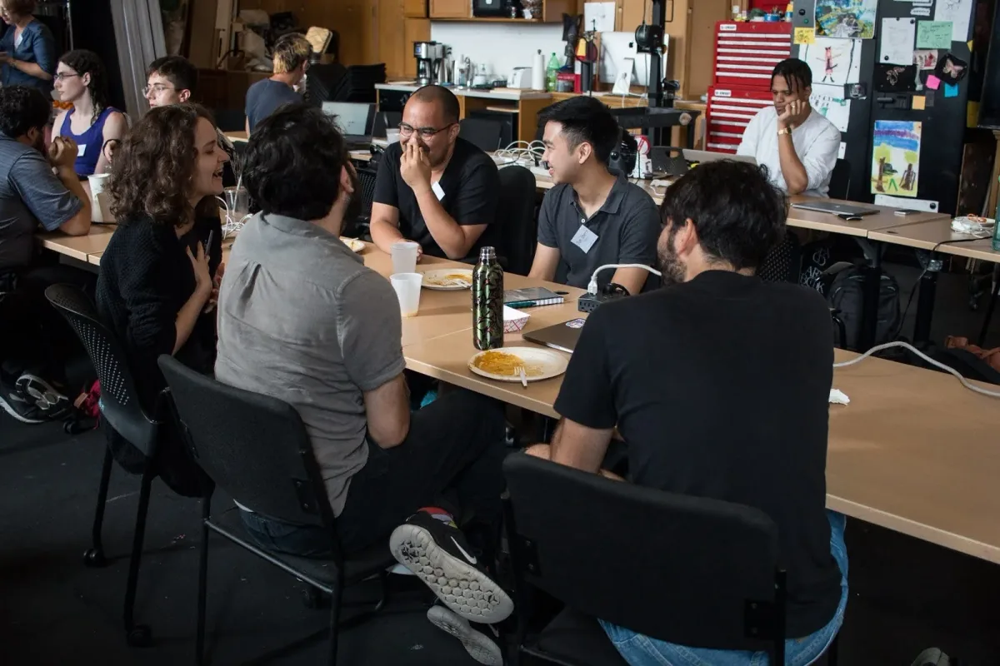
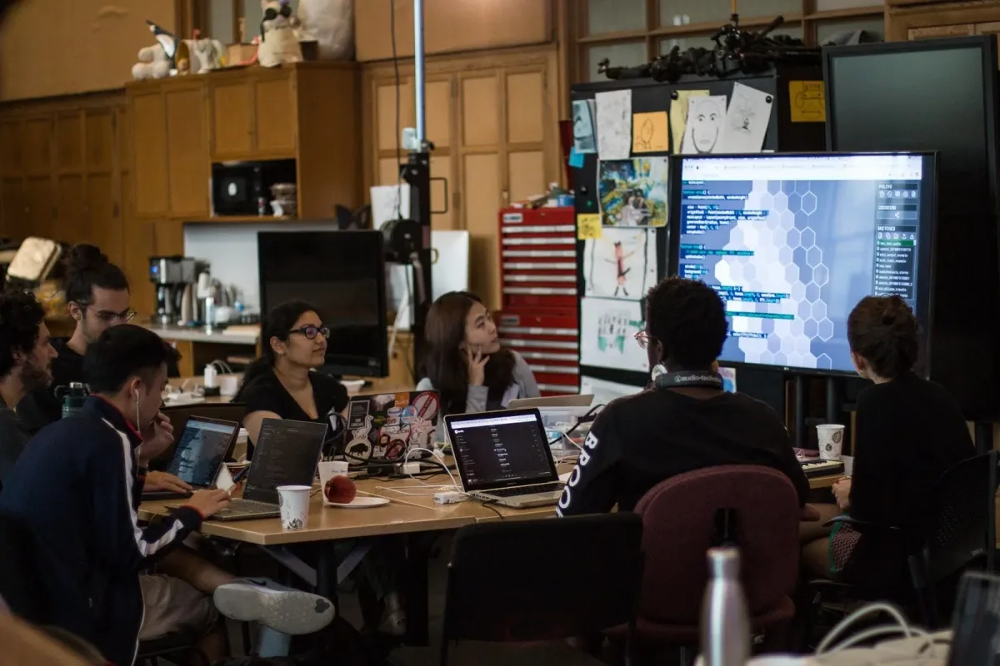
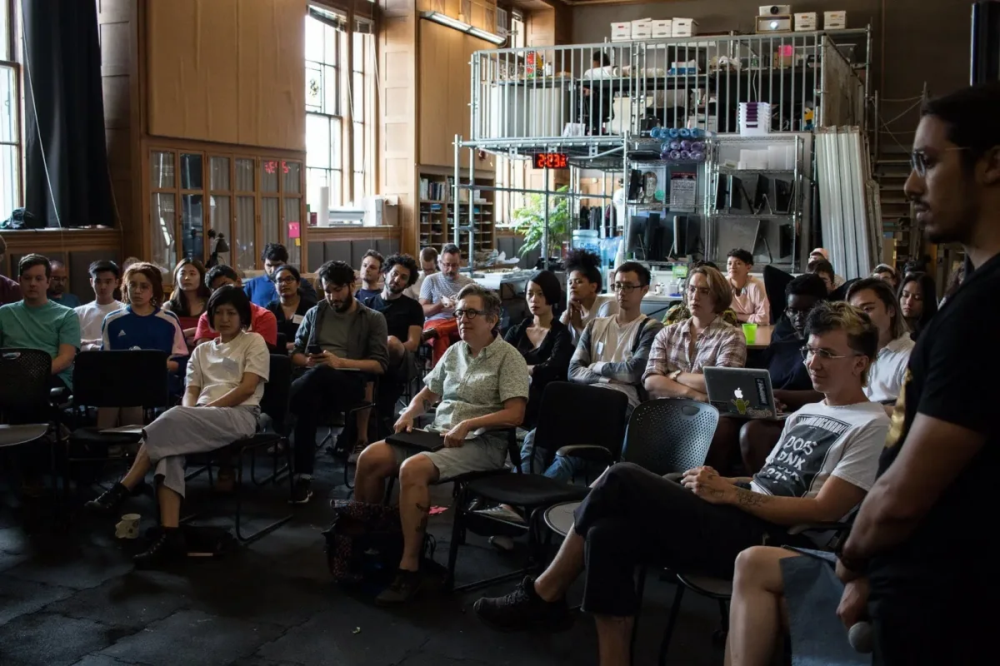
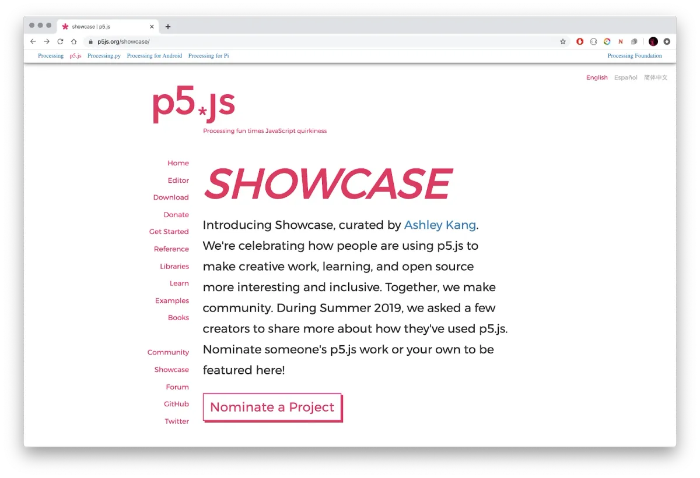
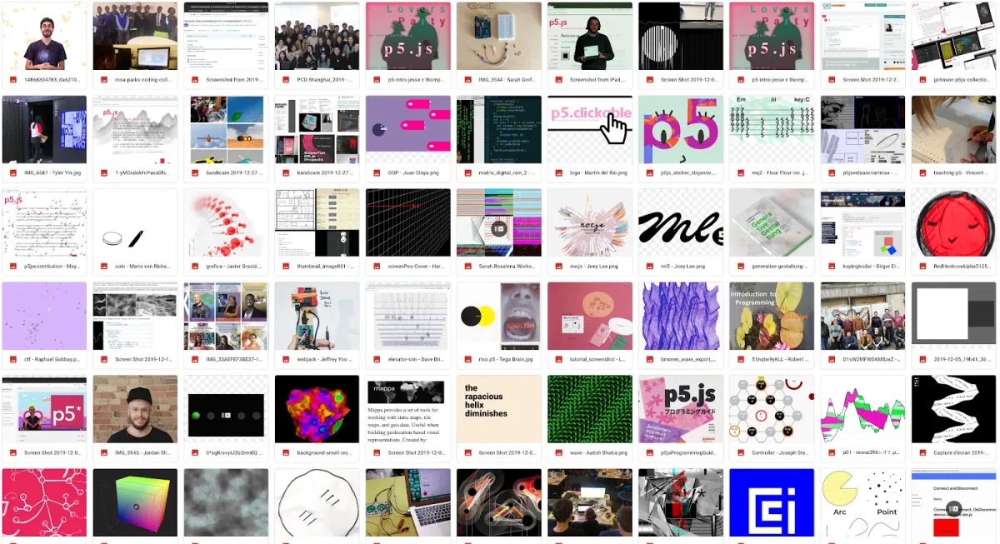

Este artículo traducido por [Aarón Montoya-Moraga](https://montoyamoraga.io/) y [Luis Morales-Navarro](http://lm-n.com/). ¡Gracias!

**You can read an** [**English version of the post here**](https://medium.com/processing-foundation/p5-js-1-0-is-here-b7267140753a)**. Você pode ler a** [**versão em português deste artigo aqui**](https://medium.com/processing-foundation/chegou-p5-js-1-0-cb0647f632a5)**. 日本語版は**[**こちら**](https://medium.com/processing-foundation/%E3%81%8A%E3%81%BE%E3%81%9F%E3%81%9B-p5-js-1-0-%E5%85%AC%E9%96%8B-f8fb9bf1a734)**です！**

¡Estamos muy emocionadxs de anunciar el lanzamiento de p5.js 1.0! [p5.js](http://p5js.org/) es una biblioteca de JavaScript que busca hacer que expresarnos creativamente y programar en la web sean más accesible e inclusivo para artistas, diseñadores, educadores y principiantes. Aunque han pasado siete años desde que iniciamos p5.js, fue hasta hace un año que intencionalmente empezamos a desarrollar 1.0, cuando Kate Hollenbach creó una hoja de ruta para lograrlo. De ahí en adelante, el esfuerzo fue liderado por [Stalgia Grigg](https://medium.com/processing-foundation/interview-with-stalgia-grigg-2019-p5-js-fellow-6fc40252e0) y [Evelyn Masso](https://medium.com/processing-foundation/interview-with-evelyn-masso-2019-p5-js-fellow-7ac6769704df), trabajando con Lauren McCarthy, Cassie Tarakajian, Kenneth Lim, y miles de contribuidores alrededor del mundo que se unieron para trabajar en todos los aspectos del proyecto incluyendo código, documentación, enseñanza, haciendo arte, escribiendo y mucho más. Reflexionando en los [valores del proyecto p5.js](https://p5js.org/es/community/), 1.0 no es solamente un hito en cuanto a código, es también uno que se basa en un trabajo significativo de documentación y comunidad.

### Revisión de la biblioteca

En el último año, trabajando hacia la versión 1.0, hemos publicado 5 versiones que representan 1,488 commits (cada commit puede considerarse como una sola ronda de cambios en uno o más archivos). [Puedes descargar la nueva versión en p5js.org](https://p5js.org/download/). Hay tantas cosas nuevas que tratamos de capturar las características clave y los cambios a continuación. Si contribuiste con algo que no está en la lista, avísanos a hello@p5js.org y lo agregaremos. :)

-   ¡Soporte para dibujos animados de GIF usando la función image()!
-   Adición de métodos de dibujo amigables para principiantes como circle() y square(), que permiten dibujar círculos y rectángulos, respectivamente.
-   Soporte para (y requisito de) texto alternativo dentro de los métodos de dibujo de imágenes.
-   Actualización de todos los materiales orientados al usuario, materiales orientados al contribuyente y toda la base de código y los procesos de compilación que lo acompañan para usar ES6, dirigido por Hirad Sab.
-   Introducción de nuevas herramientas en el proceso de construcción para garantizar la capacidad de mantenimiento del código y priorizar la accesibilidad. Esto incluye cosas como linting y validación HTML para cumplir con las [especificaciones WCAG](https://www.w3.org/WAI/standards-guidelines/wcag/).
-   Una [biblioteca p5.Seria](https://github.com/p5-serial/p5.serialport)l mejorada creada por [Shawn Van Every](http://www.walking-productions.com/notslop/abou/), [Jen Kagan](https://kaganjd.github.io/portfolio/), y [Tom Igoe](http://tigoe.net/) que permite la comunicación entre el boceto p5.js y Arduino (u otros dispositivos).

*Visión general de la biblioteca p5.SerialPort. \[Descripción de la imagen: Un diagrama que muestra la transmisión de información y conexiones dispositivos Arduino y clientes web\].*

-   Actualizaciones a la funcionalidad de audio/video y la [biblioteca p5.sound](https://p5js.org/reference/#/libraries/p5.sound) dirigida por Jason Sigal tomando en cuenta los nuevos requisitos de los navegadores.
-   [Mejoras en el sistema de errores amigables (FES)](https://p5js.org/contributor-docs/#/friendly_error_system). El FES es un sistema que los principiantes pueden activar en la biblioteca p5.js que verifica los tipos de argumentos y detecta errores comunes, y proporciona explicaciones más accesibles sobre cómo arreglar el código en la consola. Actualizamos esto para proporcionar errores amigables más útiles e intuitivos en toda la biblioteca.
-   Adición de soporte de internacionalización para mensajes de error amigables.
-   Robustecimiento del modo de dibujo WebGL. Esto incluyó limpiar la representación del texto, el dibujo de geometría y la iluminación, mejorar las capacidades de mapeo de texturas y simplificar y documentar toda la tubería de gráficos WebGL.

*Una muestra de una colección de pruebas de p5.js para probar y mejorar el renderizado con WebGL. \[Descripción de la imagen: Una matriz de 6x5 cubos rotando en un espacio negro, cada uno de ellos con una textura rosada abstracta.\]*

-   Fusión de nuestra biblioteca DOM externa con la biblioteca principal para permitir una gama de funcionalidades usando elementos HTML como cámara web, entrada de micrófono, video, audio, elementos de entrada y selección de archivos.
-   Numerosas correcciones de errores y mejoras de documentación en todas las áreas.
-   Revisión, simplificación y documentación del proceso de compilación y herramientas para la sostenibilidad.
-   Realización de pruebas unitarias exhaustivas en toda la biblioteca para garantizar que el código siga funcionando con nuevos cambios.
-   Implementación de bots, acciones y plantillas de GitHub, incluido un bot de bienvenida amigable y [plantillas de problemas](https://github.com/processing/p5.js/issues/new/choose) para ayudar a nuevos contribuyentes.
-   Una nueva característica que permite a los contribuyentes [iniciar encuestas en Twitter desde GitHub](https://github.com/processing/p5.js/tree/master/tweets) para reducir las barreras de acceso, participación y discusión en la comunidad.
-   Un conjunto rediseñado de [documentos de contribuyentes](https://github.com/processing/p5.js/tree/master/contributor_docs) y un [sitio web de documentos de contribuyentes](https://p5js.org/contributor-docs/#/) que documentan cómo se organiza y gobierna el proyecto, y cómo participar.

*Captura de pantalla del mensaje de bienvenida a la documentación de contribuyentes. \[Descripción de la imagen: Captura de pantalla del mensaje, que dice bienvenido en inglés, y el texto está rodeado de flores [texto completo](https://github.com/processing/p5.js/blob/master/contributor_docs/README.md).\]*

### Editor p5.js

A través de todo este trabajo, el [editor de p5.js](https://editor.p5js.org/) dirigido por Cassie Tarakajian ha sido clave para ayudar a personas de todas las edades y habilidades a comenzar a crear, editar y compartir rápidamente bocetos de p5.js. El editor [se lanzó oficialmente](https://medium.com/processing-foundation/hello-p5-js-web-editor-b90b902b74cf) hace poco más de un año y ha seguido creciendo desde entonces, ¡más de un millón de bocetos han sido creados en la plataforma!

<iframe src="https://www.youtube.com/embed/dtHxDggkBYc?feature=oembed" width="700" height="393" frameborder="0" scrolling="no"></iframe>

### Conferencia de contribuyentes p5.js

Uno de los pasos clave para este lanzamiento fue una Conferencia de contribuyentes de p5.js celebrada en agosto en el [Frank-Ratchye STUDIO for Creative Inquiry](http://studioforcreativeinquiry.org/) en Carnegie Mellon University en Pittsburgh. Dimos la bienvenida a un grupo de personas extremadamente enérgico, diverso y generoso que van desde contribuyentes de toda la vida hasta personas completamente nuevas en el proyecto. Grupos de trabajo se enfocaron en varias áreas temáticas: Acceso; Música y Código en Performance; el Estado de la Tecnología; e Internacionalización.

*Conferencia de contribuyentes de p5.js, día 1, co-organizadora shawné michaelain holloway se dirige a los participantes. \[Descripción de la imagen: Una persona del equipo de co-organizadores está en un podio con un micrófono en su mano derecha mientras los participantes de la conferencia la escuchan explicar el cronograma de eventos y actividades de la Conferencia de contribuyentes de p5.js\]*

Algunos logros incluyeron:

-   Un prototipo de [interfaz notebook para p5.js.](https://github.com/aparrish/nb5js-proof-of-concept) Creado por Allison Parrish.
-   El diseño de un sistema de bibliotecas para el editor de p5.js. Creado por Cassie Tarakajian y Luca Damasco.
-   Prototipos para conectar p5 a otras bibliotecas. Creado por Alex Yixuan Xu y Lauren Valley.
-   [Herramientas para contribuyentes globales de p5.js.](https://docs.google.com/document/d/1NPSVTWlTxWv8_rWLr8j91Qf8CcJA5ns8I8zFjCCmwuk/edit#heading=h.ea0uhs87h6fk) Creado por Aarón Montoya-Moraga, Kenneth Lim, Guillermo Montecinos, Qianqian Ye, Dorothy R. Santos, y Yasheng She.

Conferencia de contribuyentes de p5.js, día 1, los participantes conversan y comparten. \[Descripción de la imagen: En primer plano, cinco participantes conversan y se ríen juntos mientras que los participantes en segundo plano están participando de otras conversaciones o trabajando.\]

-   Un grupo de trabajo sobre [cómo escribir código creativo no-violento](https://docs.google.com/presentation/d/19xxc2zWWdFMAQjT6tRdN5ZU13vAKSwM7jojaC2U4F6Q/edit) y una revista liderada por Olivia Ross.
-   Un panel sobre género y afro-descendencia en espacios virtuales liderado por American Artist, con shawné michaelain holloway y LaJuné McMillian.
-   Una reforma del sitio web para accesibilidad. Incluyendo actualizaciones para accesibilidad usando lectores de pantalla, y mejoras a las páginas principal, descargas, empezar y referencia. Con contribuciones de Claire Kearney-Volpe, Sina Bahram, Kate Hollenbach, Olivia Ross, Luis Morales-Navarro, Lauren McCarthy y Evelyn Masso.

*Conferencia de contribuyentes de p5.js, día 2, Sina Barham, un científico informático y académico presenta su investigación sobre accesibilidad. \[Descripción de la imagen: la fotografía fue tomada desde una oficina localizada sobre el lugar de la conferencia, y muestra a los participantes sentados alrededor de mesas móviles, mirando hacia una proyección en una pantalla grande, donde se muestran los contenidos del presentador.\]*

-   [p5grid](https://github.com/aahdee/p5grid). La implementación de patrones flexibles con formas de triángulos, cuadrados, hexágonos y octógonos para p5.js. Creado por Aren Davey.
-   [p5.multiplayer](https://github.com/L05/p5.multiplayer). Una serie de plantillas para construir juegos para varios jugadores en distintos dispositivos donde múltiples clientes se conectan a un servidor. Creado por L05.
-   Experimentos utilizando [P5LIVE](https://teddavis.org/p5live/), pruebas de una implementación temprana de softCompile, interface OSC y conectividad aumentada con un demo para su uso con MIDI. ¡Un ambiente de vj colaborativo para codificar en vivo con p5.js! Creado por Ted Davis.
-   Presentaciones colaborativas por Luisa Pereira, Jun Shern Chan, Shefali Nayak, Sona Lee, Ted Davis, Carlos Garcia y Natalie Braginsky.
-   Talleres de data scraping y narrativas no-lineales liderados por Everest Pipkin y Jon Chambers.

*Conferencia de contribuyentes de p5.js, día 3, participantes discuten sobre trabajo creado con la plataforma p5Live y su creador Ted Davis. \[Descripción de la imagen: participantes miran una pantalla grande con figuras geométricas con colores variantes según gradientes.\]*

Tomamos tiempo de la conferencia para hablar sobre el futuro de p5.js, especialmente sostenibilidad y gobernanza. Juntxs, tomamos la decisión de explorar un modelo rotativo de liderazgo que abriría el proyecto a nuevas perspectivas y direcciones. También haría que el acto de liderar fuera menos oneroso, reduciendo las barreras de entrada. Con esta decisión, quedó claro que teníamos que hacer un esfuerzo significativo en documentación y infraestructura para facilitar la transición entre lxs líderes.

*Participantes en la presentación pública de la Conferencia de contribuyentes de p5.js. \[Descripción de la imagen: participantes escuchan atentamente y sonríen hacia una persona presentadora.\]*

*Participantes de la Conferencia de contribuyentes de p5.js. \[Descripción de la imagen: un grupo diverso de participantes sonríe y hace gestos a la cámara\]*

### Documentación

Basándonos en la conferencia y debates en línea, trabajamos para documentar el proyecto, sus estructuras organizativas y de gobierno, y las diversas formas de contribuir. A través de estos documentos, presentamos ideas clave para estructurar nuestro proyecto en torno a diversidad, inclusión y la construcción de comunidad. La documentación se puede encontrar en distintos lugares:

-   [Sitio web de p5.js](https://p5js.org/es) — La estructura del sitio web y el lenguaje fue actualizado para ser más intuitivo y amigable para principiantes. También reestructuramos el sitio web completo para ser más accesible y que cumpla con WCAG. Esto incluyó agregar herramientas al proceso de construcción del sitio web que validan las páginas HTML y nos alertan de problemas de accesibilidad.
-   Páginas de [Referencia](https://p5js.org/es/reference/) y [Ejemplos](https://p5js.org/es/examples/) de p5.js — La documentación exhaustiva y amigable es un aspecto clave de p5.js. Se agregaron y actualizaron entradas de referencia y ejemplos para que la funcionalidad sea más clara y fácil de aprender.
-   [Documentos de contribuyentes](https://github.com/processing/p5.js/tree/master/contributor_docs) — Trabajamos en una carpeta de documentación para contribuyentes que guía a la gente a empezar a contribuir, explica la estructura del repositorio, cómo añadir documentación, crear bibliotecas, procesos de lanzamiento, toma de decisiones, evaluaciones comparativas, pruebas, y más.
-   [Herramientas para contribuidores globales de p5.js](https://docs.google.com/document/d/1NPSVTWlTxWv8_rWLr8j91Qf8CcJA5ns8I8zFjCCmwuk/edit#heading=h.ea0uhs87h6fk) — Una guía para contribuyentes internacionales y una reflexión sobre qué significa contribuir a p5.js. Este documento habla de oportunidades y problemas, incluyendo las implicaciones colonialistas/(neo)imperialistas subyacentes al hacer que p5.js esté “disponible globalmente”.
-   [Cómo escribir código creativo no-violento](https://docs.google.com/presentation/d/19xxc2zWWdFMAQjT6tRdN5ZU13vAKSwM7jojaC2U4F6Q/edit#slide=id.p) — Una zine que reflexiona en el gran paisaje del código creativo, y en cómo abrazar la inclusión radical, la decolonización, y cómo descentralizar a las comunidades dominantes dentro de estos proyectos y comunidades.

Diferentes contribuyentes trabajaron en muchos proyectos documentales y educativos para fortalecer y diversificar la comunidad de p5.js.

-   [Qianqian Ye](https://medium.com/processing-foundation/interview-with-2019-fellow-qianqian-ye-799c0115c295) quiere que p5.js sea más accesible en China, especialmente para los grupos minoritarios como mujeres y gente que no se identifica de forma masculina. Para contrarrestar el hecho que la mayor parte de los materiales educativos en línea como Youtube están censurados en China, ella grabó tutoriales de p5.js en video en mandarín y los compartió en sitios de video chinos. También se alió con programadoras creativas en China para realizar talleres de p5.js para niñas, mujeres y gente no-binaria, además de publicar entrevistas con referentes y modelos de la comunidad de p5.js en redes sociales chinas.

*Tutoriales de un minuto de p5.js, en mandarín, para mujeres aprendiendo a programar en China, a través de diferentes plataformas. \[Descripción de la imagen: una matriz de capturas de pantalla de videos de Qtv, que muestran a Quianqian Ye a la derecha de cada imagen, y mostrando la pantalla de su computador.\]*

*Captura de pantalla de un desafío de caligrafía con pincel. \[Descripción de la imagen: una captura de pantalla que muestra a Qianqian a la derecha y también la pantalla de su computador, que muestra código en p5.js que produce un trazo de caligrafía.\]*

-   [Manaswini Das, Nancy Chauhan, y Shaharyar Shamshi](https://medium.com/processing-foundation/interview-with-2019-fellows-manaswini-das-nancy-chauhan-and-shaharyar-shamshi-172127c2e277) trabajaron en empoderar gente en la comunidad india de diversos orígenes para que aprendieran a programar. A través de sus esfuerzos de traducción a Hindi, fueron capaces de proveer de herramientas a la comunidad india en su lenguaje nativo, y de preparar educadorxs al colaborar con diversas ONG e individuxs para construir una comunidad diversa en torno a software.

*Shaharyar Shamshi lidera un taller de p5.js para estudiantes de pregrado en el Instituto Nacional de Tecnología de Hamirpur. \[Descripción de la imagen: un profesor apunta hacia una proyección del sitio web de p5.js al frente de la sala de clases. Filas de estudiantes con sus computadores abiertos observan.\]*

-   [Matilde Wysocki](https://medium.com/processing-foundation/interview-with-2019-fellow-matilda-wysocki-b02f5fef8442) desarrolló un currículum de p5.js y le enseñó a gente joven sin vivienda de la comunidad trans y no-binaria, programación básica como un medio de expresión personal y alfabetización digital en un contexto de seguridad personal y de privacidad queer.
-   Yeseul Song tradujo el sitio web de p5.js a coreano, aumentando así nuestro conjunto de traducciones que ya incluye a español, chino e hindi (en progreso).

*Sitio web de p5.js traducido a coreano. \[Descripción de la imagen: la página web de p5js con fondo blanco y texto en una combinación de negro y magenta, traducido a coreano.\]*

-   [Layla Quiñones](https://medium.com/processing-foundation/interview-with-2019-teaching-fellow-layla-quinones-3039f10ae761) y [Emily Fields](https://medium.com/processing-foundation/interview-with-2019-teaching-fellow-emily-fields-f324d605def6), mentoreadas por Saber Kahn, nuestro Director de comunidad Educativa, escribieron un currículum que enseña a estudiantes cómo integrar sonido, animación, movimiento e interactividad a artefactos computacionales creativos escritos en p5.js. Su trabajo se enfocó en el desarrollo de herramientas para profesorxs que tienen poca experiencia en enseñar temas de ciencias de la computación en sus propias comunidades.

*Experimentando con un bosquejo de p5.js usando un paraguas y un sensor Kinect. \[Descripción de la imagen: una chica sostiene un paraguas con luces. Ella extiende su mano y mira hacia arriba una lluvia digital que cae.\]*

*En el instituto de Ciencias de la Computación CS4ALL en NYC, Layla Quinones entrenó a profesorxs de escuela intermedia para que pudieran impartir el curso de Web Creativa, que usa p5.js para enseñar pensamiento computacional a estudiantes. \[Descripción de la imagen: cuatro personas en una sala de clases. La profesora al frente con pelo oscuro, tiene ambos brazos extendidos y se dirige a la clase.\]*

-   Finalmente, [Ashley Kang](https://medium.com/processing-foundation/p5-js-showcase-4a3756528542) creó una galería de p5.js para exhibir proyectos de p5.js al redeor del mundo, con un enfoque en artistas, programadores y creadores de orígenes subrepresentados. Esta galería se lanzará más adelante en este mes, en conjunto con la versión 1.0 de la biblioteca p5.js

*Galería de p5.js creada por Ashley Kang \[Descripción de la imagen: captura de pantalla de [p5js.org/showcase](http://p5js.org/showcase) con texto explicando el proyecto y un botón para nominar\]*

### Siguientes pasos

Una de las decisiones clave que hicimos en la Conferencia de Contribuyentes fue que de ahora en adelante, “p5.js no agregará nuevas capacidades, excepto por aquellas que aumenten el acceso”. Esperamos que este compromiso enfoque el futuro de la biblioteca en torno a nuestras prioridades de inclusión, diversidad y accesibilidad. Imaginamos que esto abrirá muchas conversaciones sobre las diferentes formas en las que podemos aumentar el acceso, y sobre el rango de barreras y la estructuras que atentan contra él. Tenemos una visión a gran escala de cómo la biblioteca p5.js puede fomentar significativamente hacia una web más accesible, y queremos seguir investigando y prototipando esto junto a programadores con discapacidades, artistas, estudiantes, e instituciones.

*Conferencia de contribuyentes de p5.js, día 5, Evelyn Masso y Lauren McCarthy presentan trabajo realizado con el grupo de accesibilidad. \[Descripción de la imagen: Los participantes miran a la proyección que dice en inglés “p5.js no agregará nuevas capacidades, excepto por aquellas que aumenten el acceso\*”\]*

También estaremos publicando nuestra zine de contribuyentes de p5.js 1 en marzo. Este libro celebrará a todes les contribuyentes de p5.js y el trabajo que hemos hecho juntes. ¡Mantente sintonizadx para más información sobre esto!

*Colección de imágenes de contribuciones a la zine de contribuyentes a p5.js 1.0. \[Descripción de la imagen: matriz con imágenes con una gran gama de imágenes y colores.\]*

Finalmente, aceptamos el desafío que nos hemos impuesto — ¡abrir el proyecto en una nueva manera al implementar un modelo de liderazgo rotativo! [Lauren McCarthy dejará su rol](https://medium.com/processing-foundation/making-space-for-the-future-of-p5-js-d3c6bd3da9ac) de líder del proyecto, dándole espacio a emocionantes nuevas ideas y líderes en el proyecto. Estén atentos a una llamada abierta para el rol de Líder del proyecto p5.js este mes.

¡Más novedades pronto! Estamos buscando profundizar más en todo este trabajo después de nuestro lanzamiento 1.0, y en atraer a la comunidad en formas más profundas y expansivas. Por ahora, queremos darles los más grandes agradecimientos a ustedes, artistas, creadores, educadores, seguidores y contribuyentes por ser parte de esto. p5.js no sería lo que es, y no seríamos quienes somos, sin ustedes. ❤

*Contribuyente Kate Hollenbach con sus estudiantes. \[Descripción de la imagen: grupo de estudiantes posando en frente del sitio web de p5.js, sonriendo y saludando.\]*
