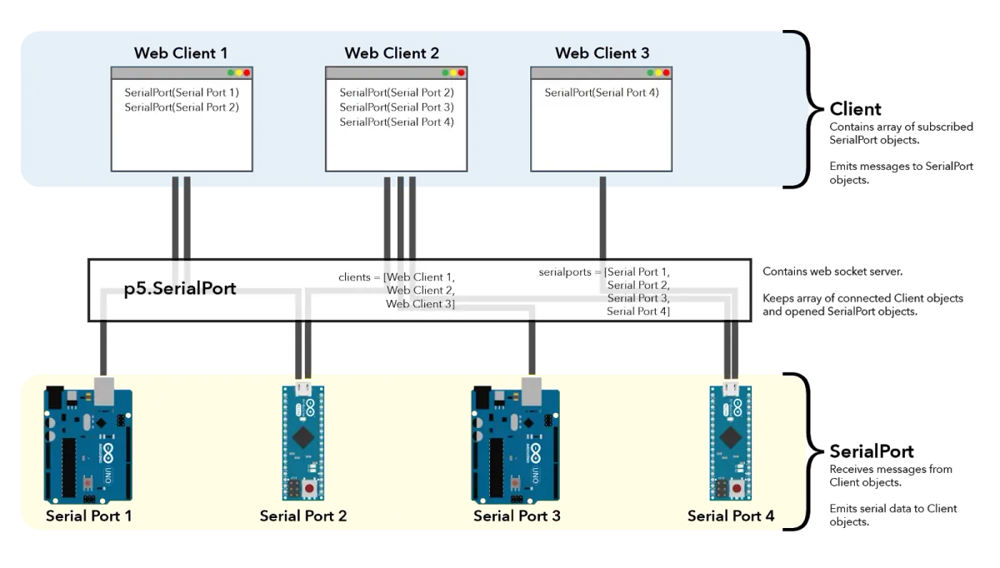
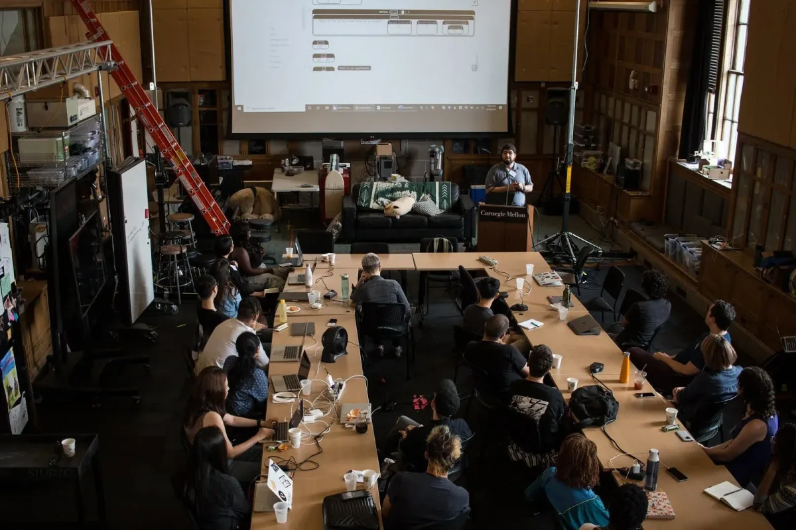
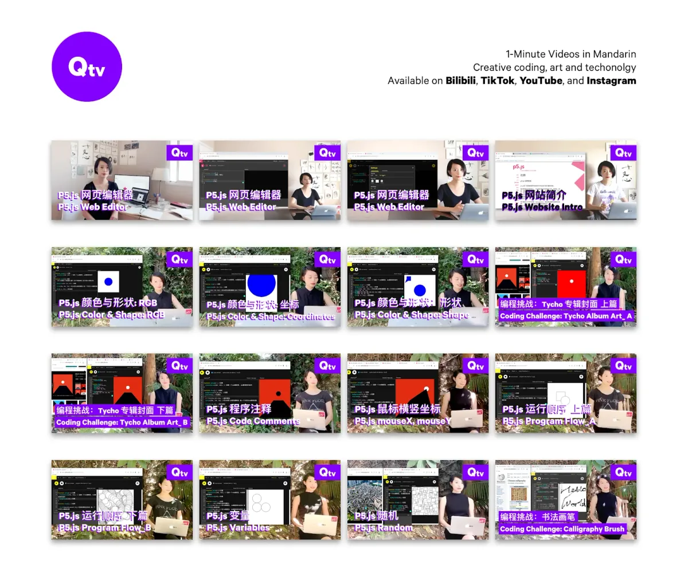
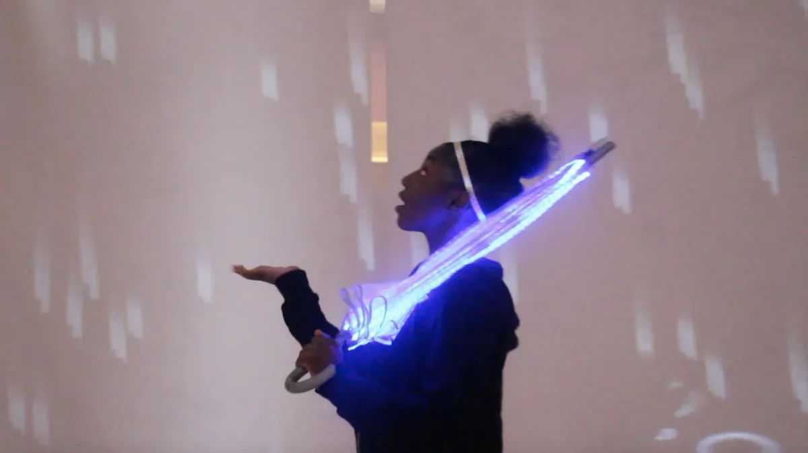
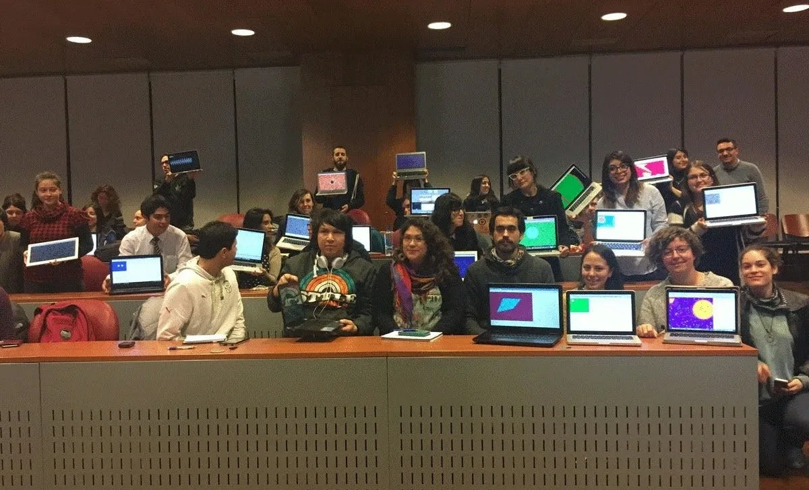

原文：[Lauren McCarthy](https://medium.com/processing-foundation/p5-js-1-0-is-here-b7267140753a)  
翻訳：[Ayato](https://twitter.com/dn0t_), [deconbatch](https://twitter.com/deconbatch/), [reona396](https://twitter.com/reona396), [takawo](https://twitter.com/takawo/)（アルファベット順）

**Puedes leer** [**la versión en español de este artículo aquí**](https://medium.com/@ProcessingOrg/p5-js-1-0-est%C3%A1-aqu%C3%AD-42344aa2b4fd)**. You can read the** [**English version of this post here**](https://medium.com/processing-foundation/p5-js-1-0-is-here-b7267140753a)**. Você pode ler a** [**versão em português deste artigo aqui**](https://medium.com/processing-foundation/chegou-p5-js-1-0-cb0647f632a5)**.**

p5.js のバージョン1.0が公開されました！[p5.js](http://p5js.org/) はクリエイティブな表現やウェブ上でのコーディングを可能にし、アーティスト、デザイナー、教育者、初心者全てに向けた JavaScript ライブラリです。プロジェクト開始から7年が経ちましたが、Kate Hollenbach が一年前にロードマップを作成してからバージョン 1.0 にとりかかりました。それから [Stalgia Grigg](https://medium.com/processing-foundation/interview-with-stalgia-grigg-2019-p5-js-fellow-6fc40252e0) と [Evelyn Masso](https://medium.com/processing-foundation/interview-with-evelyn-masso-2019-p5-js-fellow-7ac6769704df) が中心となり、Lauren McCarthy, Cassie Tarakajian, Kenneth Lim そして世界中の何千ものコントリビュータがコード、ドキュメンテーション、教育、アウトリーチ、物書き、作品制作等に参加しました。[p5.js の目的](http://p5js.org/community/)を反映するように、1.0 はコードを中心としてのマイルストーンのみならず、ドキュメンテーションやコミュニティ関連のすばらしい活動があってこそのものです。

### ライブラリのオーバーホール

1.0 に向けて一年ほど活動をした中で、1,488のコミット（1コミットは一つ以上のファイルを編集する作業として捉えることができます）を含む5つのリリースを行いました。[p5js.org から最新のリリースをダウンロードできます。](https://p5js.org/download/)たくさんの更新があったため、その中でも代表的な機能や変更を以下に記します。もし何か貢献したものの抜けがありましたら hello@p5js.org に連絡いただければ追加いたします🙂

-   image() 関数の GIF アニメーションのサポート
-   circle() や square() 等初心者にもやさしい関数の追加
-   描画関数の alt-text（画像の代わりになる文章による説明）のサポート（今後は必須となります！）
-   Hirad Sab が中心となり、ES6 に対応するようにユーザ向け及びコントリビュータ向けの素材やコードベース全体と必要なビルド方法のアップデート
-   コードのメンテナンス性とアクセシビリティを優先するためビルドプロセスに新しいツールの導入。[WCAG 仕様](https://www.w3.org/WAI/standards-guidelines/wcag/)に対応するようリンティングや HTML バリデーション等を含みます。
-   p5.js スケッチと Arduino （及びシリアル通信対応デバイス）の通信をするための改善版 [p5.Serial（シリアル）ライブラリ](https://github.com/p5-serial/p5.serialport) を [Shawn Van Every](http://www.walking-productions.com/notslop/abou/), [Jen Kagan](https://kaganjd.github.io/portfolio/), [Tom Igoe](http://tigoe.net/) が制作

*p5.SerialPortライブラリの概要*

-   ブラウザの仕様に沿うように Jason Sigal らによるオーディオビジュアル機能と [p5.sound ライブラリ](https://p5js.org/reference/#/libraries/p5.sound) のアップデート
-   [Friendly Error System (FES、フレンドリー・エラー・システム)の向上](https://p5js.org/contributor-docs/#/friendly_error_system)。初学者は FES を有効にすることで引数の型をチェックしたり頻出のエラーを見つけたり、コードを修正するためのより親切な説明をコンソールに表示することができます。より有用かつ直感的で親切なエラーをライブラリ全体で提供するためにこの機能をアップデートしました。
-   親切なエラーメッセージのため国際版サポートの追加
-   より安定した WebGL 描画モードのため、テキストのレンダリングやジオメトリの描画、ライティング、テクスチャマッピングの機能追加、WebGL パイプライン全体の単純化とドキュメンテーションを行いました。

*WebGL レンダリングのテストと改善を目的とした、p5.js のブラウザ内での一連のテストの様子の様子。［画像の説明：黒背景の空間にそれぞれが抽象的なピンクのテクスチャでマッピングされた 6x5 グリッドの立方体が描画されている。］*

-   DOM の外部ライブラリをコアにマージすることでウェブカメラやマイク入力、ビデオ、オーディオ、入力フォームやファイル選択の HTML 要素を使ったさまざまな機能を追加
-   全ての分野において数々のバグ修正とドキュメンテーション
-   今後の持続性のため、リリース版のビルドプロセスのコードレビュー、単純化、ドキュメンテーション
-   新たな変更があってもコードが動作するようにライブラリ全体での包括的なユニットテストの実装
-   新たなコントリビュータの手助けとして親切なウェルカムボットや [イシューテンプレート](https://github.com/processing/p5.js/issues/new/choose) を含む、GitHub ボット、アクション、テンプレートの実装
-   より広い層のコミュニティが参加しディスカッションするにあたって障壁を低くするために [GitHub イシューから Twitter アンケートを作成する](https://github.com/processing/p5.js/tree/master/tweets)機能の追加
-   プロジェクトがどうオーガナイズされまとめられているか、そしてどうやって参加するか説明する[コントリビュータ向けドキュメント](https://github.com/processing/p5.js/tree/master/contributor_docs)と[コントリビュータ向けドキュメントのウェブサイト](https://p5js.org/contributor-docs/#/)のデザインの刷新

*コントリビュータ向けドキュメントにて歓迎する README ファイルのスクリーンショット。［画像の説明：花の絵文字が添えられた「ようこそ！」から始まる README のスクリーンショット。ファイルは[こちら](https://github.com/processing/p5.js/blob/master/contributor_docs/README.md)］*

### p5.js エディタ

あらゆる業績の中でも Cassie Tarakajian を中心に開発された [p5.js Editor](https://editor.p5js.org/) は年齢や能力の垣根を超えて様々な人がより簡単に p5.js スケッチを作成、編集、シェアするためにのキーとなっています。[正式なローンチ](https://medium.com/processing-foundation/hello-p5-js-web-editor-b90b902b74cf)から1年弱が経ちましたが、このオンラインエディタ上ですでに100万作品以上が発表されています！

  <iframe src="https://www.youtube.com/embed/dtHxDggkBYc?feature=oembed" frameborder="0" scrolling="no"></iframe>

### p5.jsコントリビュータカンファレンス

このリリースの重要な足がかりとして、p5.js のコントリビュータカンファレンスをアメリカ・ピッツバーグのカーネギーメロン大学の [Frank-Ratchye STUDIO for Creative Inquiry](http://studioforcreativeinquiry.org/) で開催しました。長い間貢献いただいている方々から新しくプロジェクトに参加された方を含め、精力的かつ多面的に、そして献身的に貢献してくださったグループを歓迎しました。ワーキンググループでは、アクセシビリティ、パフォーマンスにおける音楽とコード、クリエイティブ技術の展望、国際化といったトピックに焦点を当てました。

*P5.js コントリビュータカンファレンス1日目、共同主催者の shawné michaelain holloway が参加者に向けて話しているシーンです。［画像の説明：共同主催者の一人が右手にマイクを持って壇上に立っています。彼女は p5.js コントリビュータカンファレンスの内容やイベントスケジュールについて説明しており、参加者たちは耳を傾けています。］*

カンファレンスでは以下のような発表がありました:

-   Allison Parrish の [p5.js のノートブックインターフェース](https://github.com/aparrish/nb5js-proof-of-concept) のプロトタイプ
-   Cassie Tarakajian と Luca Damasco による p5 エディタ用 p5.js ライブラリシステムのデザイン
-   Alex Yixuan Xu と Lauren Valley 制作の、p5 とその他のライブラリを連携するプロトタイプ
-   Aarón Montoya-Moraga, Kenneth Lim, Guillermo Montecinos, Qianqian Ye, Dorothy R. Santos, and Yasheng She による[p5.js グローバル・コントリビュータ・ツールキット](https://docs.google.com/document/d/1NPSVTWlTxWv8_rWLr8j91Qf8CcJA5ns8I8zFjCCmwuk/edit#heading=h.ea0uhs87h6fk)

*p5.jsコントリビュータカンファレンスの1日目、意見を交わす参加者たち。 ［画像の説明：写真手前では5人の参加者たちが笑顔で意見を交わしています。写真奥では会話中の他のグループや、作業中の人もいます。］*

-   Olivia Rossによる、暴力性のないコーディング活動のグループと [zine](https://docs.google.com/presentation/d/19xxc2zWWdFMAQjT6tRdN5ZU13vAKSwM7jojaC2U4F6Q/edit)
-   American Artist, shawné michaelain holloway, LaJuné McMillian による、バーチャル空間における黒人たちとジェンダーに関するパネルディスカッション
-   Stalgia Grigg, LaJuné McMillian, Aatish Bhatia, Jon Chambers による新作インスタレーション
-   p5.js ウェブサイトのアクセシビリティ全体についての検討。スクリーンリーダーアクセシビリティのアップデートや、ホーム画面・ダウンロード画面・getting started 画面・リファレンス画面の改良についても検討が及びました。コントリビュータは Claire Kearney-Volpe, Sina Bahram, Kate Hollenbach, Olivia Ross, Luis Morales-Navarro, Lauren McCarthy, Evelyn Masso です。

*カンファレンス2日目。コンピュータ・サイエンスの学者である Sina Barham がアクセシビリティに関する彼の研究に関してプレゼンしている様子。［画像の説明：カンファレンスミーティングの上階のオフィスエリアの写真で、参加者が移動式の机を囲って発表者のスライドの映った大きなプロジェクション画面を見ている様子が写っている］*

-   [p5grid](https://github.com/aahdee/p5grid) は Aren Davey が制作したライブラリで、三角形、四角形、六角形、および八角形の柔軟性の高いグリッドを実装しています。
-   [p5.multiplayer](https://github.com/L05/p5.multiplayer) は L05 による、マルチデバイス・複数ユーザによるゲームを構築するための複数のクライアントから指定されたページにアクセスできるテンプレートのセットです。
-   softCompile の実験的な実装、OSC インターフェイスや MIDI セットアップのデモなどの [P5LIVE](https://teddavis.org/p5live/) を使った実験。Ted Davis による p5.js を利用した共同ライブコーディングによるVJ環境です！
-   Luisa Pereira, Jun Shern Chan, Shefali Nayak, Sona Lee, Ted Davis, Carlos Garcia, Natalie Braginsky によるコラボレーション・パフォーマンス
-   Everest Pipkin と Jon Chambers によるデータスクレイピングと非線形的（訳注：線形性は白人男性的と捉えられるため、非線形性・非時系列は多様性において重要なテーマ）な物語のワークショップ

*カンファレンス3日目。p5Live プラットフォームで作られた作品に関して会話している参加者らと制作者の Ted Davis。［画像の説明：様々な色と形でできた幾何学模様の映る大きなモニターを見ている参加者たち］*

私たちは p5.js の未来、特に持続可能性やメンテナンス性について語り合う中で、有意義な時間を過ごしました。そしてそれと共に、新しい考え方や方向性のためにリーダーを固定化せず交代していくモデルについて探っていくことを決めました。リーダー役の負担を減らし、手を挙げることに対する障壁を無くしていくことにもつながります。この決定を通して、リーダー間でスムーズな引継ぎができるように、ドキュメントとインフラの確立が必要だということもはっきりしました。

*カンファレンスにてプレゼン発表を熱心に聞く参加者たちの様子。［画像の説明：参加者たちは真剣にスピーカーの声に耳を傾け微笑んでいます。］*

*p5.js コントリビュータカンファレンスの参加者たち。［画像の説明：多様なな参加者のグループがカメラの前で笑顔になったりポーズをとっています］*

### ドキュメンテーション

カンファレンスとオンラインディスカッションを元に、私たちはこのプロジェクトの組織構造や管理の仕組み、貢献のための様々な方法のドキュメンテーションに取り組みました。これらのドキュメントを通じて、コミュニティの構築、多様性、包括性に関するプロジェクトを構築するための鍵となるアイディアを公開しています。これらのドキュメントはいくつかの場所にあります。

-   [p5.js ウェブサイト](https://p5js.org/) — ウェブサイトの構成と文章が更新され、より直感的で初心者の方にも使いやすくなりました。また、サイト全体を見直してアクセシビリティを高め、WCAG (Web Content Accessibility Guidelines) 準拠としました。HTML ページをバリデーションしてアクセシビリティの問題を洗い出すツールをサイトのビルドプロセスに追加したことも含まれます。
-   p5.js [リファレンス](https://p5js.org/reference/)と[サンプルページ](https://p5js.org/examples/) — 包括的でわかりやすいドキュメンテーションは p5.js の重要な側面です。機能をより明確にし、学習がより容易となるように、リファレンスの項目とサンプルを追加・更新しました。
-   [コントリビュータ ドキュメント](https://github.com/processing/p5.js/tree/master/contributor_docs) — コントリビュータのガイドとなるように、コントリビュータとしての始め方、リポジトリの構成、ドキュメントの追加、ライブラリの作成、リリースのプロセス、意思決定、ベンチマーク、テストなどに関するドキュメント化に取り組みました。
-   [p5.js Global Contributor’s Toolkit（グローバル・コントリビュータ・ツールキット）](https://docs.google.com/document/d/1NPSVTWlTxWv8_rWLr8j91Qf8CcJA5ns8I8zFjCCmwuk/edit#heading=h.ea0uhs87h6fk) — 国際的なコントリビュータ向けのガイドと p5.js に貢献することにどういう意味があるのかの省察です。p5.js を本当の意味で国際化する際に障害となる植民地主義や帝国主義など深く根付いた考えを含めて、貢献することの機会と問題についてテーマにしています。
-   [暴力性のないクリエイティブコードの書き方](https://docs.google.com/presentation/d/19xxc2zWWdFMAQjT6tRdN5ZU13vAKSwM7jojaC2U4F6Q/edit#slide=id.p) — クリエイティブコードに関するより大きな展望や、多様な人を受け入れること、脱植民地主義、これらのプロジェクトで中心となっているコミュニティを分散していくことをテーマとした冊子です。

p5.js コミュニティのつながりを強め、多様化するために様々なコントリビュータがいくつもの文書や教育プロジェクトに取り組みました。

-   [Qianqian Ye](https://medium.com/processing-foundation/interview-with-2019-fellow-qianqian-ye-799c0115c295) は中国において、特に、過小評価された女性や男性ではないグループの中で、p5.js をより身近なものにすることを目指しています。YouTube などほとんどのオンライン上の教育リソースが中国では検閲されていることを受け、彼女は北京語で p5.js の初心者向けチュートリアルビデオを作り、それらを中国国内の動画サイト上で共有しました。また、彼女は中国の女性クリエイティブコーダーの人たちと協力して女性やノンバイナリー向けの p5.js ワークショップを開催し、p5.js コミュニティの手本となる人々とのインタビューを中国の SNS 上に掲載しました。

*中国のコーディングを学びたい女性向けの一分間の p5js チュートリアル動画。様々なプラットフォーム上で展開されている。［画像の説明：Qtv のサムネイル。画面半分は PC 画面で、右側にはクリエイターの Qianqian Ye が写っている。］*

*毛筆ブラシのコーディングチャレンジのスクリーンショット。［画像の説明：画面右がQianqianで、左には毛筆ブラシの p5.js コードを含む画面が写っている。］*

-   [Manaswini Das, Nancy Chauhan, Shaharyar Shamshi](https://medium.com/processing-foundation/interview-with-2019-fellows-manaswini-das-nancy-chauhan-and-shaharyar-shamshi-172127c2e277) は、あらゆる背景を持つインド人コミュニティの人々がプログラミングを学ぶ機会を得られるよう活動しました。ヒンディー語への翻訳作業を通じてインドのコミュニティに母国語でツールを提供し、ソフトウェアを中心として多様なコミュニティを構築するため様々な NGO や個人と協力して教育者の育成をしています。

*インド工科大学 Hamirpur の学部学生たちに p5.js ワークショップを開いている Shaharyar Shamshi の様子。［画像の説明：クラスの正面に投影されている p5.js ウェブサイトを先生が指さしている。ノート PC を開く学生が列になり座っている。］*

-   [Matilde Wysocki](https://medium.com/processing-foundation/interview-with-2019-fellow-matilda-wysocki-b02f5fef8442) は p5.js の学習カリキュラムを開発し、ホームレス TGNC（Trans and Gender NonConforming youth：トランスジェンダー、性同一性障害である若者）に、個人のセキュリティ面やクイア的なプライバシーに関して、自己表現とデジタルリテラシーの手段としての基本的なプログラミングを教えました。その提唱者として、デジタルリテラシーや個人の自信のためにコミュニティがコンピュテーショナルデザインと機械学習に触れる機会をつくりました。
-   Yeseul Song は現行の p5.js Web サイトとリファレンスのスペイン語、中国語、ヒンディー語（進行中）サポートに追加して韓国語への翻訳をしました。

*韓国語に翻訳された p5.js のホームページ。［画像の説明：p5.js のホームページのスクリーンショットで、白背景に黒とマゼンタの韓国語に翻訳されたテキストが用いられている。］*

-   教育コミュニティディレクターの Saber Khan の助言のもと、[Layla Quinones](https://medium.com/processing-foundation/interview-with-2019-teaching-fellow-layla-quinones-3039f10ae761) と [Emily Fields](https://medium.com/processing-foundation/interview-with-2019-teaching-fellow-emily-fields-f324d605def6) は音やアニメーション、動きやインタラクティビティなどをクリエイティブコーディングに融合させる方法に関するカリキュラムを作成しました。このカリキュラムは、低所得地域で教壇に立つ、普段コンピュータサイエンスを教えることのあまりない先生たちのためのツールとして注力されてきました。

*傘と Kinect を使って p5.js のスケッチの実験をしている学生。［写真の説明：若い女性が光る傘を持っています。彼女は手を差し出し、デジタルの雨を見上げています。］*

*ニューヨークにある CS4ALL のコンピュータサイエンス研究所で、Layla Quinones は中学校の教師らにクリエイティブウェブコースを教えている。ここでは p5.js を使って計算論的思考 (Computational Thinking) を指導している。［画像の説明：教室に4人の女性がおり、教壇に立つ黒髪の女性は両腕を前にあげて話している。］*

-   最後に [Ashley Kang](https://medium.com/processing-foundation/p5-js-showcase-4a3756528542) は世界中の p5.js を使ったプロジェクトの紹介ギャラリーを作成しています。その中では主にまだ日の目を見ないアーティストやコーダー、またメーカーなどに注目を当てています。このショーケースサイトは 1.0 のリリースに伴って今月（2020年3月）の後半にローンチ予定です。

*Ashley Kang による p5.js のショーケースサイト。［画像の説明：プロジェクトの紹介テキストとノミネート用ボタンが写った [p5js.org/showcase](http://p5js.org/showcase) のスクリーンショット］*

### 次のステップ

コントリビューター・カンファレンスで行った重要な決定の一つは「p5.js はより多様な利用者に向けたものを除いて今後新しい機能を追加しない」というものでした。我々はこの公約により、今後のライブラリがより多くの人を受け入れること、多様性、そしてアクセシビリティを優先することに焦点を当てると願っています。これにより、より多様な利用者のために何ができるのか、それに対する様々な障害と構造についての多くのディスカッションのきっかけになるのではないかと思います。我々は、p5.js ライブラリがいかにしてウェブアクセシビリティを大幅に広げられるかの大きなビジョンを持っています。そして我々は障害を持つプログラマーやアーティスト、学生、福祉施設と協力してリサーチとプロトタイプの作成を継続していきたいと思います。

*p5.js コントリビューター・カンファレンス 5日目。Evelyn Masso と Lauren McCarthy がアクセシビリティパートの成果を発表。［写真の説明：「p5.js はより多様な利用者に向けたものを除いて今後新しい機能を追加しない」と書かれたスライドを見る参加者］*

また、2020年3月には p5.js 1.0 コントリビューター Zine を発行します。この本は p5.js の全てのコントリビュータと私たちが一緒に成し遂げた成果を讃えるものです。詳細はもうすぐ発表しますのでご期待ください！

*p5.js 1.0コントリビュータの Zine のコントリビュータの画像のコレクション。［画像の説明：様々な内容や色の画像が並んでいる］*

最後に、これから私たち自らに課したチャレンジに挑みたいと思います。リーダーシップの引継ぎモデルを導入することで、プロジェクトを新しいやり方でオープンなものにします。[Lauren McCarthy はプロジェクトリーダーの役職から退き](https://medium.com/processing-foundation/making-space-for-the-future-of-p5-js-d3c6bd3da9ac)、エキサイティングな新しいアイデアとプロジェクトリーダーのためのスペースを作ります。今月中に p5.js のプロジェクトリーダーを公募する予定です。私たちは、1.0 のリリース後、この課題についてより深く掘り下げ、より深く、広くコミュニティと関わっていくことを楽しみにしています。この場を借りて、アーティスト、メイカー、教育者、学生、サポーターやコントリビュータの皆様のご協力に感謝します。あなたがいることで、p5.js は p5.js であり、私たちが私たちでいられるのです。 ❤

*コントリビュータの Kate Hollenbach と学生たち。［画像の説明：学生グループは p5.js のウェブサイトの前で手を振って笑いながらポーズしています。］*

*サンティアゴ（チリ）にて Aarón Montoya-Moraga によるワークショップで p5.js を学んだアーティストたち*
