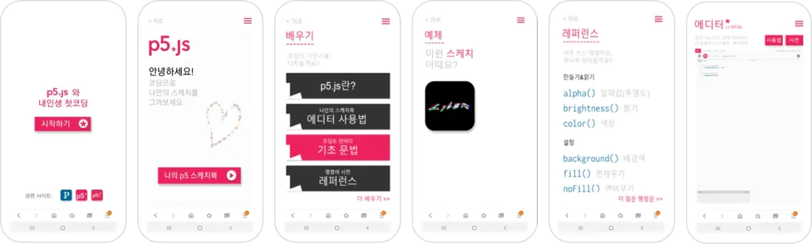
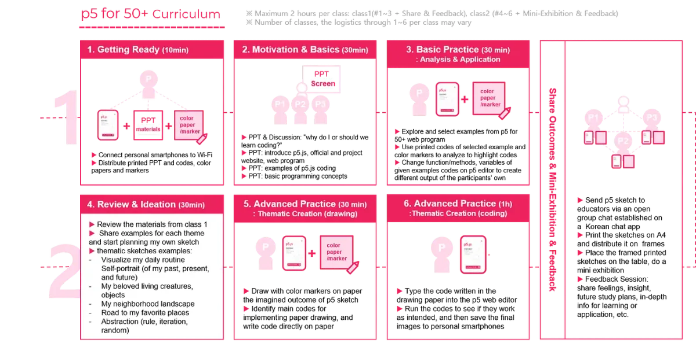
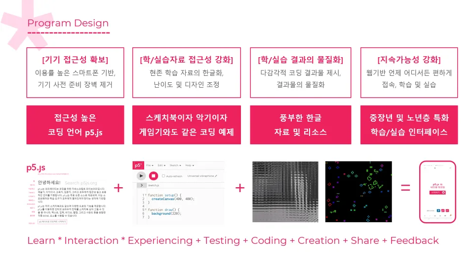

The 2020 Processing Foundation Fellowships sponsored six projects from around the world that expanded the p5.js and Processing softwares and nurtured their communities. In collaboration with NYU’s [Interactive Telecommunications Program](https://tisch.nyu.edu/itp), we also sponsored four Fellows to work on [ml5.js](https://ml5js.org/). Because of COVID-19, many of the Fellows had to reconfigure their projects, and this year’s cohort, both individually and as a whole, sought to address issues of accessibility and inclusion in their projects. Over the next couple months, we’ll be publishing our annual wrap-up articles on how the Fellowship projects went, some written by the Fellows in their own words, and some in conversation with Director of Advocacy Johanna Hedva. You can read about our past Fellows [here](https://medium.com/processing-foundation/https-medium-com-tag-pf-fellowships-la/home).

---

*For their Fellowship, [Inhwa Yeom](https://yinhwa.art/) & [Seonghyeon Kim](https://github.com/okdalto/) made [p5for50.plus](https://p5for50.plus/), for teaching p5.js to people age 50 and up in South Korea. Their project includes a website, app, curriculum materials, and a planned series of workshops. They also worked toward a Korean translation of p5.js: [p5js.org/ko](https://p5js.org/ko/). More information on that translation and the process behind it will be released tomorrow, here on our Medium channel. They were mentored by [Qianqian Ye](https://www.qianqian-ye.com/).*

**Johanna Hedva: Hi Inhwa & Seonghyeon! Tell me about your Fellowship project. What were your intentions and goals, and what did you accomplish?**

**Inhwa Yeom & Seonghyeon Kim**: Hi, Johanna! The major goal of our project, *p5 for 50+***,** was to contribute to enhancing the generation of people age 50+ in South Korea, in terms of their physical, emotional, and lingual accessibility to coding education — using p5.js! Basically, we aimed to address the issues of digital gap and illiteracy that people around age 50 face in a non-English-speaking society. To this end, we have concretized our Fellowship program with four distinctive yet closely connected outcomes:

#### [1, p5for50.plus](https://p5for50.plus) as Project Archives

[p5for50.plus](https://p5for50.plus/) is our project website where we integrated our research archives, resources for learning p5.js, and more. We owe much of the website to our mentor [Qianqian Ye](https://www.qianqian-ye.com/), who constantly emphasized the importance of keeping it open and accessible, as well as its archival functionality. In her [2019 Processing Foundation Fellowship project](https://medium.com/processing-foundation/interview-with-2019-fellow-qianqian-ye-799c0115c295), across various social media platforms, she published online learning materials for non-English-speaking womxn in China. One of her very first learners was her mother. We had a lot to relate to and share with Qianqian!

In planning the website, we mainly focused on addressing the 50+ population’s needs and challenges in coding education, and how they can start learning p5.js via this website. To document the age group’s actual voice and insight, Qianqian recommended that we open a [포럼 Forum](https://p5for50.plus/category/international-forum/) page where we can collect people’s opinions worldwide. Then, we interviewed 13 people (average age: 62.5) from Daejeon. The interviewees expressed high interest in “learning new technology” and “outdoor activities where they can socialize with others who share similar challenges.” This gave us confidence to pursue the *p5 for 50+* project. The findings from the interviews are archived in [리서치 Research](https://p5for50.plus/category/research/) page of our project website.

#### 2, Prototype a low-barrier learning interface for 50+

*The p5 for 50+ web app.*

From our research, we discovered a strong need for a learning interface specially designed for 50+ people. Our interviewees demonstrated “higher confidence in using a smartphone than desktop PCs or laptops,” so we wanted to create a mobile-based web app. We wanted them to access p5.js materials and the web editor simply through a single URL on their smartphones — *anytime and anywhere they wanted*.

So, this [prototype](https://p5for50.plus) is like a simplified version of [p5js.org/ko](https://p5js.org/ko). We kept the structure and design elements of p5js.org — but used less text and bigger fonts, made more visual elements and interactions come to the front, and placed more focus on the basic concepts of computer programming, with an easier use flow. The official website of p5.js is re-introduced as “advanced information” through hyperlinks.

We proposed the *p5 for 50+* web app as a stepping stone towards [p5js.org/ko](https://p5js.org/ko/), to boost the age group’s confidence in (self-)learning through smartphones. We hope that the users feel at ease and have fun with exploring the web app, and then eventually move on to p5js.org through hyperlinks for more in-depth knowledge — without being overwhelmed by the depth of it at first sight. By mentioning “overwhelmed” here, we want to recall our past days as beginner coders, when we had to spend quite a lot of time just to understand a single term, like “library,” in the context of computer programming. We might have weathered through those “illiterate” moments thanks to our digital capability, but some people need to secure more confidence in order to keep challenging themselves.

#### **3, p5 for 50+ Workshop Plans**

*Curriculum design for p5 for 50+ workshop.*

The project website and web app were concretized over the course of planning our in-person *p5 for 50+* workshop with our mentor Qianqian. What we particularly appreciate about her mentorship is that we could plan the workshop in consideration of what Qianqian asked us to ponder: the (re-)engagement in the workshop and its sustainability. We remember when she quoted our advisor [Lauren McCarthy](https://lauren-mccarthy.com/)’s webinar, [“You, Me and My Computer”](https://www.youtube.com/watch?v=_gaXHCdGilk): “Teaching coding sometimes is about not losing people… it is about how to keep them engaged instead of scaring them away.” Combining the insight from our mentor and advisor meetings, with our research, we devised some principles for designing our *p5 for 50+* workshop curriculum, mainly in consideration of keeping them engaged:

1.  Clarify the benefits of learning coding at their age
2.  Keep the teaching materials visually and lingually accessible
3.  Provide playful and immersive learning experience with a variety of multi-sensory p5 interactions
4.  Materialize the process and outcome of learning coding
5.  Thematize practice tasks that use personal memory, to enhance attachment and cognitive effects of p5 sketches
6.  Provide a time and space for social interaction

We also referred to cognition reinforcement education programs for the older adults, as well as the learning methodology demonstrated at our advisor and mentor’s previous workshops. For instance, Lauren led the “[Smarter Home](https://lauren-mccarthy.com/Smarter-Home)” workshop in 2019, where a fair amount of the participants were middle-aged and older adults who engaged in month-long collaborative p5 artwork projects. And Qianqian led her collaborative workshop “[Digital Weaving, Physical Computing](https://womenscenterforcreativework.com/events/digital-weaving-physical-computing/)” (2019) where participants transformed their codes into tangible materials. The detailed information of our curriculum design can also be found at the [리서치 Research](https://p5for50.plus/category/research/) page of our project website.

#### **4, Korean translation of the p5.js website**

*A screenshot of [p5js.org/ko](https://p5js.org/ko/), the Korean translation of p5js.org, with Seonghyon Kim’s “Hunminjeongeum 2020“ as the background artwork.*

All of our works above would have been impossible without the Korean translation of p5js.org. It is important to note that English comes as a double-bind for non-Anglophones when learning coding, since code is written in English and most of the learning materials and online forums circulate in English. The translation is dedicated to the entire Korean-speaking population around the world, and we hope to see more language groups engage with p5 in further accessible and legible manners. For more information on the translation process, check out tomorrow’s Medium announcement!

**JH: Can you give us a sense of why your project was important for your intended community? What needs did your project address?**

**IY & SK:** Some people might ask, “Why creative coding education for people 50+?” Nowadays in South Korea, digital interfaces and interactions consist of a substantial part of our daily life. However, more than half of the older population feel as though they cannot access what has become the dominant way of communicating with their surroundings. Even more difficulties are found among those who went through their public and formal education before the 1970s, which was the dawn of computer education in Korea. To cope with these circumstances, the government has recently offered digital education, for instance on learning computer software programs and smartphones. However, fewer than one percent of the welfare programs teach coding.

Contrary to the direction of the welfare policy, we hypothesized throughout our project that increasing the opportunity for learning coding would be particularly helpful for the 50+ group. In a way, it is about learning a language for communicating directly with a computational entity, understanding how the computer “thinks” and how it responds. In that sense, we consider p5.js to be a perfect starter language, especially for those unfamiliar with machines, because the inputs, outputs, processing, and entire logical flow can be intuitively delivered with a variety of interactions.

However, our hypothesis can only be proved under the condition that the physical, emotional, and lingual accessibility for learning coding significantly enhances. In fact, coding education has actively been adopted in both public and formal, and private and informal institutions over the last decade in Korea. And learning resources are getting bountiful both on- and off-line. However, those materials and curriculums are not very suitable for 50+ people. In our project outcomes, we tried to include their average English and digital utilization level to re-adjust the learning materials, as well as consider their technical access to devices. We also re-designed the learning interface and experience to be more accessible for low-vision.

**JH: What was the most difficult issue you encountered in the project? How did you work through it?**

**IY & SK:** We felt some complication in using the term “50+”, since we did not want to preclude the diversity of middle-aged and older communities to a mere range of numbers. Still, we thought “50+” righteously indicates the fact that the digital literacy and utilization rate in Korea rapidly decreases among those people who are currently in their 50s and beyond.

Another difficulty lay in imagining what the interest, expectation, and aspiration of those people would be. Although we consider being 50+ as our own near future, and feel related to them as such, they have gone through thicker layers of time and experiences than we can hardly dare to fathom. Hence, reaching out to 13 older adults marked a crucial part of our project.

We wished we could meet more 50+ people at in-person workshops, but due to COVID-19, the schedule and venues were consistently delayed. For now, it is scheduled in late September. We are fully aware of the fact that this age group is particularly vulnerable to the pandemic, and we want to make sure of everyone’s safety before anything else.

**JH: What’s next for this project? Will you continue the work you began? Where would you like to take the project next?**

**IY & SK:** First and foremost, we are working towards September for the optimization and to add more examples on the web app. This is for a practical usage of the web app, not only for our upcoming in-person workshop, but also for anyone who needs it.

Speaking of the in-person workshop, we have been invited to hold the workshop “p5 for 50+: My First Coding with Smartphone” for two weeks at Asia Culture Center, Gwangju, in late September. Based on this experience, we hope to better cater to their needs of coding education, and develop further curriculum and interfaces. The quantitative and qualitative evaluation of our web app will happen during this time as well.

The key idea of the evaluation is to see if the p5 for 50+ learning interface and materials are both physically and emotionally accessible for the first-timers of this age group. We will see if it brings sufficient interest to sustain self-learning on p5.js during and after the in-person workshop or, maybe without the workshop in this “untact” era.

Additionally, we are sharing our overall experience of this project at JavaScript Conference Korea 2020 this September. Again, due to COVID-19, the conference is going virtual, so our presentation will be live-streamed and shared on its official [Youtube](https://www.youtube.com/channel/UCkHwMMujxwX2s_nxXFsUcLQ).

Finally, we consider “accessible platforms for creative and collaborative learning” as a life-long research interest. We will continue our research on how to better connect with 50+ learners and those who are interested in p5 for 50+ education.

