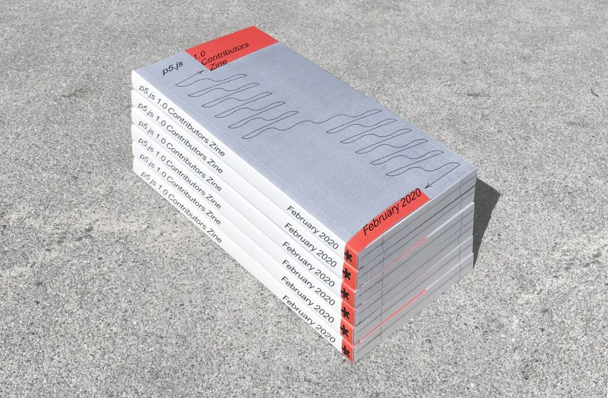
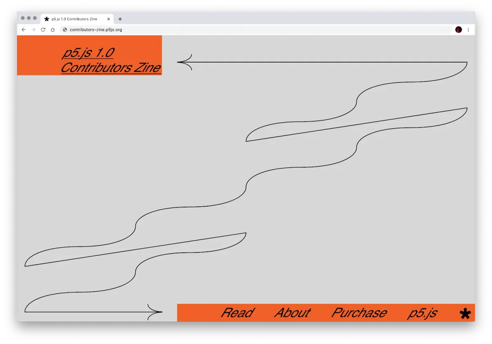
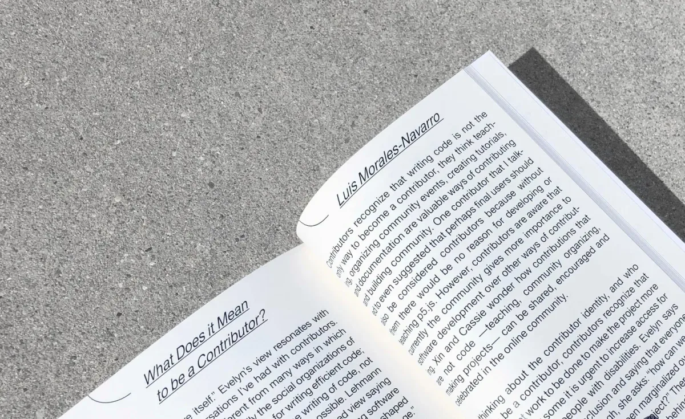
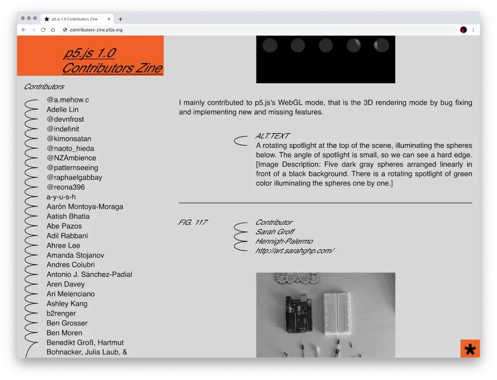
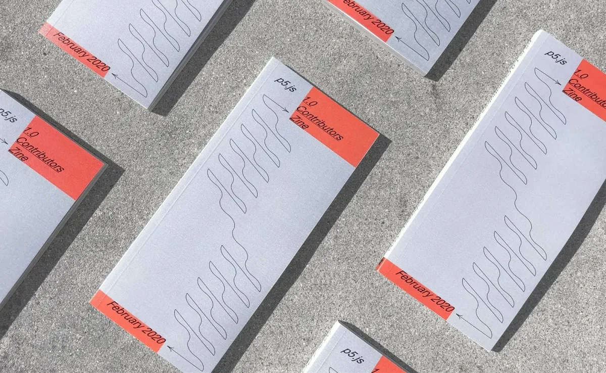

### p5.js Contributors, in Solidarity with Black Lives Matter

*p5.js 1.0 Contributors Zine designed and photographed by Stefanie Tam.*

In this difficult but inspiring time, we are thinking especially of our Black community members. We want to say Happy Juneteenth! We urge those that don’t know about this day to learn more and continue the work toward ending racism.

We are even more galvanized and committed to our work toward a more equitable and inclusive art and code space. We continue to look for and dismantle barriers in our field and in ourselves. To fundraise in solidarity with Black Lives Matter, we are selling copies of the p5.js 1.0 Contributors Zine for $40, which [you can purchase here](https://processingfoundation.press/product/p5-js-1-0-contributors-zine-entries/). All proceeds will be donated to [Afrotectopia](https://www.afrotectopia.org/) and [POWRPLNT](https://www.powrplnt.org/), Black-led organizations who work in technology and the arts.

This past February we achieved our [p5.js 1.0 Release](https://medium.com/processing-foundation/p5-js-1-0-is-here-b7267140753a#:~:text=p5.,designers%2C%20educators%2C%20and%20beginners.&text=js%20project%20values%2C%201.0%20is,on%20the%20documentation%20and%20community.). Over the seven years since the project began, thousands of contributors from all over the world have worked toward this huge accomplishment. p5.js started with an intention to hold inclusion, diversity, and access as core values of every decision made — from software to design to outreach. We seek to erase the line between user and contributor, and to expand the definitions of both. To the p5.js community, “contributing” means many different things, including teaching, documentation, writing code, making art, writing, design, activism, curating, bug reporting, organizing, and more.

To celebrate the 1.0 milestone, we created a 1.0 Contributors Zine, a collection of how p5.js has manifested through art, code, community events (both online and IRL), workshops, educational programs, and publications. This zine is a recognition of the many individual contributors that have worked over the last seven years to bring p5.js to the 1.0 Release.

We’re proud not only of the work we’ve done, but of the community and ethics we have built, and that we continue to rebuild as we learn through the years. This community — more than code — is what p5.js is.

The zine is a limited print edition of 200 copies (we have distributed discounted copies to all those that contributed content).

[**You can purchase a copy here.**](https://processingfoundation.press/product/p5-js-1-0-contributors-zine-entries/)

The zine was designed by [Stefanie Tam](http://stefanietam.com/). It contains 141 entries collected via an open submission, documenting different types of contributions to the project. These entries are accompanied by essays by Casey REAS, Aren Davey, Luis Morales-Navarro, Taeyoon Choi, Dorothy R. Santos, Claire Kearney-Volpe, Olivia McKayla Ross, Xin Xin, Stalgia Grigg, Aarón Montoya-Moraga, and Johanna Hedva, with illustrations by Alice M. Chung. Jesse Cahn Thompson, Karina Lopez, and Lauren Lee McCarthy contributed to the editing.

Additionally, we’re happy to launch an accessible digital version of the zine. This site was designed by Stefanie Tam, and implemented by Lauren Lee McCarthy, with accessibility guidance from Claire Kearney-Volpe.

[**You can view the digital zine here!**](http://contributors-zine.p5js.org/)

We’d like to share below some excerpts from the reflections written for the zine. Additionally, three of the essays—by [Taeyoon Choi](https://medium.com/processing-foundation/oddkins-aea6a7084760), [Claire Kearney-Volpe](https://medium.com/processing-foundation/p5-access-keep-it-coming-d07facefd50a), and [Johanna Hedva](https://medium.com/processing-foundation/notes-on-activism-6c88463e86eb)—are published in full on our Medium.

**Aren Davey**

I sometimes prefer to call the p5.js community a family instead. It’s more tight-knit than other online development communities, and its members are genuinely interested in the progress and evolution of others. I might not have the same amount of experience as most of the members, but that doesn’t make me less of a contributor. Everyone here is ready to assist others who need it and ensure that they go to places that they have never thought of before. This family exposed me to things I wouldn’t have seen without their help and has helped me develop as an artist and a contributor. No longer is my art practice felt as an afterthought; it is a significant piece of myself worth exploring, developing, and investing in, and I’m very glad the p5.js family helped me come to that conclusion. [Read the full text.](http://contributors-zine.p5js.org/#reflection-aren-davey)

**Olivia McKayla Ross**

It’s always an option to throw our laptops into the ocean and bow out, but we have chosen not to. We agreed to strategize how we as practitioners and toolmakers can reindigize creative coding, starting in the areas where we have the most agency — ourselves and our works. Reindigenization is not a repeat of the past, it is the revolutionary/evolutionary RETURN to ways of life with and for the land.

Drawing from a collective list of references, we’ve drafted a set of guidelines, questions, and prompts to help us and others reflect and refine our work in this spirit. The term “nonviolent creative code” was proposed to guide this work. In this context, we use the term violence to include actions that keep us from the earth, from ourselves, and from each other.

Honor the Land. Who is the community who lives here? Who is the audience of your work? Are those two populations different or the same? Why? Are you living or working on occupied land? Who is the indigenous population where you are? Is this art taking up material space? How have you considered managing the waste generated by this project? Consider the materiality of the server, the data center, the cable, the rare-earth mineral mine, the factory, the oil field, the air conditioner, and the other things that are holding up this practice. Where can you decouple those links? What is lost when reduced to data? What is there about your place that is not saved in the online database or archive? How does it feel here?

Honor the Body…

Honor the Small…

Honor the People…

Honor the Exchange…

[Read the full text.](http://contributors-zine.p5js.org/#reflection-olivia-mckayla-ross)

**Taeyoon Choi**

How does one speak up to challenge the establishment? I think nuance and candor are essential to starting a conversation. No one likes to be criticized, but everyone loves to be understood. When I was learning to code, a friend told me, “treat your computer like your younger sibling.” This approach of care and play is essential in exploratory and poetic computing. I think a similar approach is necessary for navigating the tech community. As the p5.js project grows in its scale and diversity, I want to ask: Who do we make our oddkins? [Read the full text on Medium.](https://medium.com/processing-foundation/oddkins-aea6a7084760)

**Hasseb Zeeshan**

I am 9 years old. I love making 3D simulations using p5.js WEBGL. The reason that I love making 3D simulations is because you can change, modify, and create almost all of the objects around you, from a ball with texture, to an entire interactive world with planes, cars, and boats. The best part about p5.js WEBGL is that everything can move, touch, and interact with the user, and you can make anything from your imagination. [Read the full text.](http://contributors-zine.p5js.org/#contributor-hasseb-zeeshan)

**Johanna Hedva**

When it comes to measuring the “success” of activism, I’ve learned that the more exhausted you are, the more successful your activism has probably been. This is because, at its heart, activism is about trying to do something that’s never been done before — and the most important part of that sentence is the word “trying.” Exhaustion is the sign that you tried, that you gave it all you had. It’s not a done deal, it’s only ever an attempt.

It’s not just that the world and its institutions are structured in opposition to what your activism is trying to do. It’s that, *because* activism is about radically re-doing how we do things, and have done them for generations, it will necessarily fail far more than otherwise, because no one has ever *done* this before. And not only is it new, but it agitates against a world that doesn’t want to change. It’s trying to do something that those in power, consciously or not, don’t want to do. Of course it’s gonna fail. [Read the full text on Medium.](https://medium.com/processing-foundation/notes-on-activism-6c88463e86eb)

**Aarón Montoya-Moraga**

thank you p5.js friends for caring about each other  
thank you for making this world a happier more ethical place with more art  
[Read the full text.](https://contributors-zine.p5js.org/#reflection-aar%C3%B3n-montoya-moraga)

