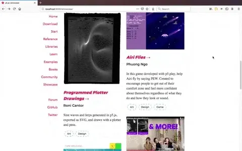
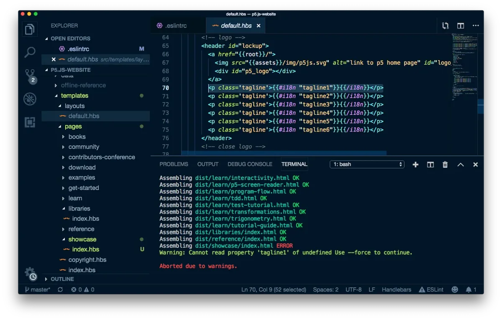
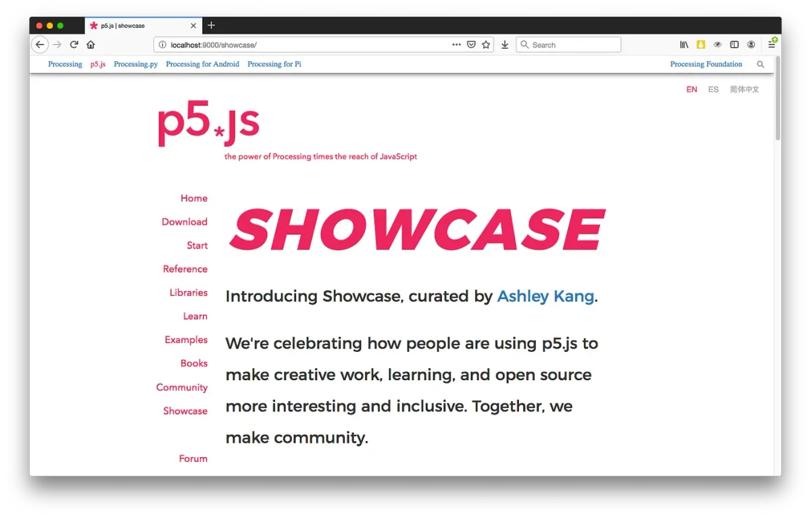

This summer was the Processing Foundation’s eighth year participating in Google Summer of Code, where we work with students on open-source projects that range from software development to community outreach. Over the next few weeks, we’ll be posting articles written by some of the GSoC students, explaining their projects in detail. The series will conclude with a wrap-up post of all the work done by this year’s cohort.

---

*A gif of the new Showcase page on p5s.org, featuring a way to nominate a project and six projects that Ashley Kang nominated in August 2019: Programmed Plotter Drawings by Roni Cantor, Airi Flies by Phuong Ngo, Chillin’ by Dae In Chung, Qtv by Qianqian Ye, p5.js Shaders by Casey Conchinha and Louise Lessél, and Moving Responsive Posters by Moon Jang and Xin Xin.*

In January 2019, I participated in Processing Community Day @ Los Angeles along with Color Coded, a technology learning collective I’ve been a part of since 2016, which was [invited to talk about the theme of Radical Pedagogy](https://medium.com/processing-foundation/code-as-usual-canceled-973e1b349187). An unexpected part, and ultimate highlight, of my time at PCD was the Community Open Mic at the end of the day, when participants signed up for a few minutes to share what they were working on and what they needed help with — things they’d made with Processing’s open source projects, creative coding classes they’d taught, and events they were organizing. I was reminded of how Processing’s approaches to technology and community values have shaped the work of many I appreciate as well as my own journey as a technologist since taking an ITP class as an undergraduate at NYU in 2014.

Inspired by the community I’ve met and the resources I’ve come across, this year I worked on a [Google Summer of Code project proposal to curate a showcase of projects, and to create a place for the showcase on the p5.js website (p5js.org)](https://github.com/processing/processing/wiki/Project-List#-curate-set-of-p5js-examples-for-10-release), celebrating the creative and inclusive ways people have been engaging with p5.js. Questions I wanted to explore include: How might we showcase a project that might inspire a similar contribution? How might we highlight a project in a way that recognizes the creator on their own terms? How might we make p5.js more accessible? I’m really glad I reached out to Saber Khan and Evelyn Masso for feedback on how to be more detailed in my proposal. I’m honored I was accepted this summer and mentored by Kate Hollenbach.

#### Making Decisions

For the first few weeks of GSoC, I was actually participating in ITP Camp, hosted by ITP every summer. Since camp intros, I learned more about how people were using p5.js. My experiences at camp expanded what I thought was possible with p5.js (manipulating audio and webcam pixels with Jiwon Shin, making a machine learning-powered game with Yining Shi and Joey Lee, connecting Bluetooth devices with Yining Shi and Jingwen Zhu, using a plotter to print graphics with Roni Cantor) and talking to campers and ITP students like Dana Elkis about my GSoC project gave me insight on this question: What do I want people to take away from the p5.js Showcase?

With that question as a starting point, along with the others listed above, I began by gathering over 60 creators and their p5.js projects, identifying several categories: Art, Code, Curriculum, Design, Documentation, Game, Library, Organizing, Tool, Tutorial. This shaped how I would design the p5.js Nomination Form and establish a process for people to nominate someone else’s project or their own.

*The p5.js website codebase set up locally on Ashley’s computer, as seen in Visual Studio Code. In the early days of the project, compiling the code after creating a new directory called “showcase” and associated file “index.hbs” produced an error message related to how internationalization works for the site: “Warning: Cannot read property ‘tagline1’ of undefined Use — force to continue.”*

The most challenging part of the project was answering questions related to content, design, *and* engineering: Who is the project for? How might this project be useful to someone who is getting started and doesn’t really know how p5.js might be meaningful to them? And questions posed from the perspective of someone who doesn’t identify as a designer: what do I need to consider in terms of visual and user experience design? Would my project be considered “technical enough”? I started by creating [wireframes in Figma](https://www.figma.com/file/WkRoMv5Nf9yzzzwY7cz2JbbR/p5.js-Showcase?node-id=0%3A1) based on examples like Glitch, the ml5.js Community page, and MailChimp’s Read This Summer. However, I found that [prototyping in CodePen](https://codepen.io/kangashley/pen/RXGKyX) best guided how I would contribute code to the [existing codebase](https://github.com/processing/p5.js-website/). This gave me wiggle room to better understand things like semantic HTML, CSS specificity and variables, CSS layout (Flexbox, CSS Grid), and web animation (CSS, SVG), with much help from Can I Use, MDN Docs, and blog posts by designers and developers (I learn best when I can read about it — which is why I love good docs!). Also, I wondered: Would the new Showcase be driven by tutorials or community examples?

At one point, Kate and I discussed how her students like to learn and how we like to learn. Once I made decisions on who to feature and why I was interested in their project, I felt a sense of ownership over my project. I chose the following creators and reached out to learn more about their projects because of how they explored concepts and contexts for art and design, integrated other technologies, and/or embraced learning and teaching methodologies: Roni Cantor, Phuong Ngo, Dae In Chung, Qianqian Ye, Casey Conchinha and Louise Lessél, and Moon Jang and Xin Xin.

*Here’s a preview of what’s to come: “Introducing Showcase, curated by Ashley Kang. We’re celebrating how people are using p5.js to make creative work, learning, and open source more interesting and inclusive. Together, we make community.*

#### Building for a11y and i18n

p5js.org was set up using Handlebars and YAML for content, CSS for styles, Node.js and Grunt for automating the processes of compiling and testing, and Assemble for internationalization (numeronym: i18n). A bump we came across was setting up a new directory (/showcase) and subpages (/showcase/featuring) so that it can be localized with support from Assemble and translation contributors (thank you, Lauren McCarthy, for helping Kate and I make sense of this!).

Another growing concern was accessibility (a11y) — how would someone using an assistive technology like a screen reader or a device like their phone experience the Showcase? As much as I wanted to have fun with fonts, colors, and animations, what would that mean for a11y? Something that really encouraged me was expressing how important a11y was to me as a technologist and finding someone like Kate to advocate for me to practice this. In August, Kate attended the p5.js Contributors Conference and connected me to Sina Bahram and Claire Kearney-Volpe, who were working on an accessibility audit of the p5.js website. Our conversation helped me revisit the structure of the Showcase pages and pay more attention to semantic elements and image alt text.

#### Contributing after GSoC

I made it this far because of all who helped me along the way ([acknowledged here](https://github.com/processing/p5.js/blob/master/developer_docs/project_wrapups/ashleykang_gsoc2019.md#acknowledgements)). I’d like to continue my efforts to feature more projects by the online and offline p5.js community (especially from those who are based outside the U.S., speak languages other than English, and just started the school year!). [Hacktoberfest](https://hacktoberfest.digitalocean.com/) is back, and I’d love to get feedback on how to make Showcase even better and more accessible for the p5.js 1.0 release in early 2020.

Any idea how to set up a staging site (through GitHub Pages?) for my [local branch](https://github.com/processing/p5.js-website/pull/488)? How might we write alt text for art? How might we make accessible animations? How might we improve the layout of the project visuals more responsive? Also, please tell me more about why you’re interested in featuring a project by you or someone else on p5.js Showcase by [nominating the project here](https://forms.gle/aaqq27PDQhFACVEHA). If you have any questions or feedback, feel free to reach me on GitHub ([@kangashley](https://github.com/kangashley/)) or email ([ashleykang@csu.fullerton.edu](mailto:ashleykang@csu.fullerton.edu)). Together, we make community!
