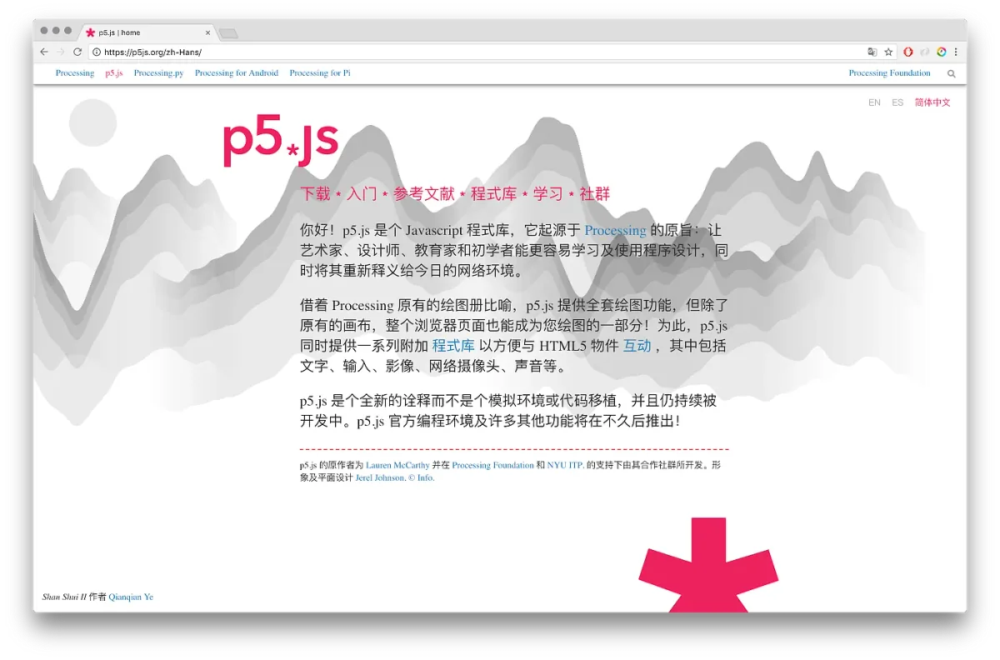
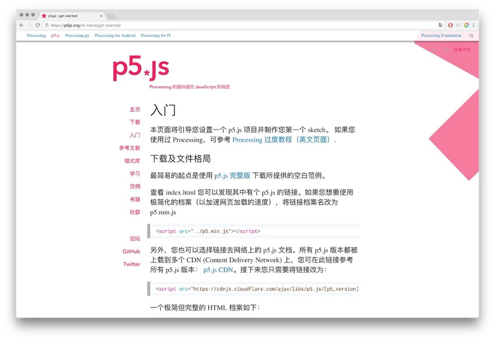
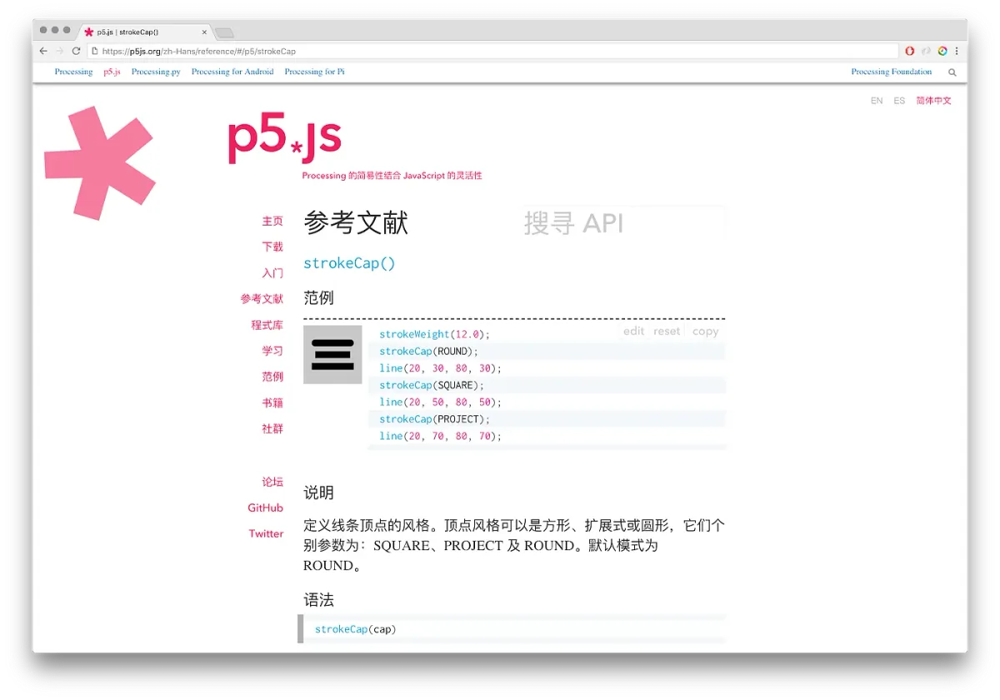

2018 Processing Foundation Fellow

To read the English translation of this article, click [here](https://medium.com/p/b56843ea096e/edit).

中文写作编辑为 [Hye Min Cho](https://hyeminchocho.com/).

---

*2018 Processing Foundation Fellowships 赞助了九个来自世界各地旨在扩展 p5.js 及 Processing 软件与社群的项目。今年的奖学金得主所发展的项目其中包括 p5.js 网站的中文翻译以及在加纳教导智能手机编程的工作坊等等。在接下来的夏天我们将会发表一系列的文章，一部分由奖学金得主所编写另一部分为与宣传主导 Johanna Hedva 的交谈，以展示及记录今年奖学金得主的工作*

---

*p5.js 网站的主页翻译成简体中文 ([p5js.org](http://p5js.org))*

**Johanna Hedva**: 您能否向我们介绍您的奖学金项目工作及在这段时间内您完成的事情？

**Kenneth Lim**: 我的项目工作的主旨有两个：第一，将 p5.js 的网站翻译成中文以扩展中文社群中的社群外展；第二，通过制作工具及定义惯例，改善当前网站的翻译框架以让未来的翻译工作及维持翻译的工作更容易。这项目的范围非常广。它的广泛性也是这个项目的难点之一。

当我们在谈论中文字体时，我们需要考虑两种依地域及文化而不同的主要种类：简体中文及繁体中文。而对于这个项目，我决定先专注于简体中文翻译，然后当这版本相对于稳定后，借着社群的回馈开始繁体中文的翻译。我决定先从简体中文开始翻译的原因是因为简体中文为我日常比较常使用的字体，因此我对其标点符号及特定文字翻译选择的微小差别比较熟悉。我已顺利将 p5.js 网站上几乎所有页面都翻译成简体中文了。现在只剩下个别范例的翻译需要在这时段后完成。

*p5.js 网站的“入门”页面翻译成简体中文*

工具方面，为了保持译文的一贯性我收集了一个[词汇集](https://docs.google.com/spreadsheets/d/1yowXBskrVbCCrKtCRel3LTta_t3oXJN_RkK4AOchLGM/edit?usp=sharing) 为翻译人员提供参考。就如编程格式文件提供程序代码的一贯性，保持翻译的一贯性将能帮助减少翻译造成的混淆度。我也同时开始制作适用于任何语言翻译的翻译跟踪系统。在编程库的持续开发当中，该网站可能会在短时间内有许多改变，而如果翻译没有持续跟进的话它将会逐渐与原版偏差。我已经制作了一个基本的翻译跟踪系统以跟踪所有主要页面的翻译，当任何原版英文页面有所改变时，翻译系统将会记录该段文字为需翻译员的注意。

参考文献及范例的页面都有不同的渲染方式，因此它们的翻译工作及制作匹配的跟踪系统将会比较困难，于是我在这段时间内也开始翻修参考文献渲染系统以将其简化及为翻译跟踪系统做准备。

在这整段期间，我虽然翻译了许多东西，但是现在还有更多需要完成的工作以使未来的翻译工作更加容易！

**JH**: 我们对 p5.js 能被翻译成其他语言感到很兴奋，同时我们也非常期待中文翻译。您可以讨论一下中文翻译的重要性吗？

**KL**: 我为能够流利地使用两种语言感到很幸运，因为我知道这不是世上所有人都有机会做到的。同因历史原因，多数关于电脑的东西都以英文为主，这常会使任何不通晓英文的人处于较不利的位置。我自己在多年前也是通过阅读任何在我学校图书馆找到的中文编程教学书籍来开始学习编程的。我希望本次翻译工作能让更多人有机会使用自己熟悉的语言学习 p5.js。

这样，不论您熟悉的语言是什么，您不需要学习太多英文即可开始学习使用 p5.js 及编程。这项目并不单单只是中文翻译，而同时也是为制作一个可以支持更多语言翻译的框架，从而降低开始使用 p5.js 的门槛。

*strokeCap() 的参考文献翻译成简体中文*

**JH**: 这项工作有些什么挑战？

**KL**: 无论任何语言，自然语言翻译仍然是需要人类处理的。机械翻译如谷歌翻译能有效地翻译短句及单词，但是它们仍然无法胜任长句子及复杂内容的句子的翻译工作。时常在翻译时一个翻译员需要了解许多原版的细微之处以做出准确的翻译决定。

我曾经是个电子游戏的本地化测试员。通常游戏翻译员只被提供原版剧本以进行翻译，而作为本地化测试员因为我们有已完成的游戏，我们还要考虑到游戏及剧本在游戏当中特定的意义。将翻译员翻译后的文字引入在该游戏的景况内时，我们经常发现该翻译并不准确，然而如果您单纯把翻译后的剧本与原版剧本比较，您会发现翻译版本字面上并没有错误。这是我在翻译时特别注意的一点：不单纯专注于文字上的意思，并考虑文字的景况。

我的一个目标是让这翻译感觉像是直接以该语言编写的，并希望一个熟悉该语言的读者能够在阅读该翻译的同时不会非常自觉在阅读一个译文。

**JH**: 短期内及随着时间发展，您怎么看这项目的未来发展？

**KL**: 短期内，第一个先要完成的是将个别范例翻译成中文。我们非常欢迎任何来自社群的帮助！

随着时间发展，我想要完成更完整的翻译跟踪系统以帮助未来的翻译工作及维持现有的翻译的工作。我希望这也会带入翻译中文的翻译及随着 p5.js 社群的发展，带入更多的翻译。我将会尽我所能继续维持 p5.js 的中文翻译。

中文写作编辑为 [Hye Min Cho](https://hyeminchocho.com/)
