For the sixth year of our annual Fellowship Program, we aimed to better support the new paradigm of remote and online contexts and socially distanced communities. We asked applicants to address at least one of four Priority Areas that, to us, felt especially important for finding ways to feel more connected right now: Accessibility, Internationalization, Continuing Support, and AI Ethics and Open Source. Additionally, we sponsored four Teaching Fellows, who developed teaching materials that will be made available for free, and are oriented toward remote learning within specific communities. We received 126 applications and were able to award six Fellowships, with four Teaching Fellowships. We are excited to note that this is our most international cohort ever, with Fellows based in Australia, Brazil, India, Mexico, Philippines, Switzerland; and in the U.S. in California, Portland, and New York. With this interview, we begin highlighting the work of the four Teaching Fellows. For an archive of our past Fellows [click here](https://processingfoundation.org/fellowships), and to read our series of articles on past Fellowships, [click here](https://medium.com/processing-foundation/https-medium-com-tag-pf-fellowships-la/home).

---

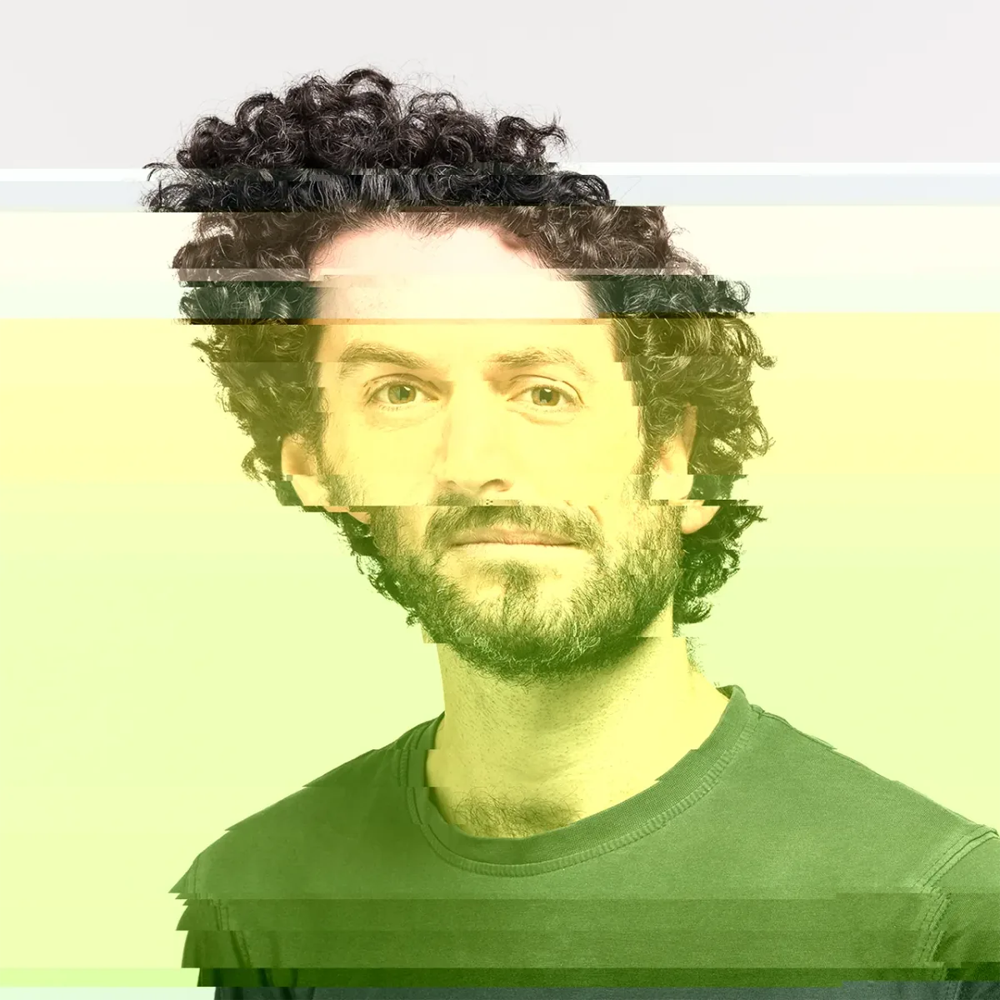

*[Ted Davis](https://teddavis.org) is a media artist/designer/educator. Since 2010 he teaches interaction design and coordinates the UIC/HGK MDes Basel program at The Basel School of Design, HGK FHNW. His open source projects (basil.js, XYscope, p5.glitch, P5LIVE) enable programming within Adobe InDesign, rendering graphics on vector displays, byte level glitching and collaborative live coding with p5.js. His 2021 Teaching Fellowship project was working on [P5LIVE which can be viewed here](https://teddavis.org/p5live/). \[**image description**: Portrait of Ted, manipulated with p5.glitch, offsetting color and position of pixels from top to bottom.\]*

**Saber Khan: I’m here with Ted Davis. He was a Teaching Fellow with Processing Foundation this summer. Ted, do you have a “Here’s me, Ted, and here’s who I am” intro you’d like to give us?**

**Ted Davis**: Sure, I’m [Ted Davis](https://teddavis.org/). I’m based in Basel, Switzerland, where I teach at an applied university in what was formerly known as the Visual Communication Institute. Now it’s the [Institute for Digital Communication Environments](https://www.fhnw.ch/en/about-fhnw/schools/academy-of-art-and-design/institute-digital-communication-environments) within the [FHNW HGK](https://www.fhnw.ch/en/about-fhnw/schools/academy-of-art-and-design). There I teach creative coding and glitch. I’ve been teaching Processing for about 10 years, and recently p5.js. My teaching also includes [basil.js](http://basiljs.ch/about/), a library that’s based on Processing, for creative coding within InDesign. I’m primarily an educator, and also a media artist on the side. I’m originally from just north of San Francisco, but I’ve been based here now for about 14 years.

**SK: How did you get from the San Francisco Bay Area to Basel?**

**TD**: I was searching for Master’s programs, when I’d learned they had just started a [Master’s program](http://mdesbasel.ch/) here that’s held in collaboration with the [University of Illinois at Chicago](https://design.uic.edu/). It was focused on the image, and I had this interest to live in Europe for some years. I was looking at different programs and then learned about this and spontaneously went. It was a quick decision, and I’ve been happily settled here ever since. I started teaching earlier than I originally thought I would. The opportunity came about and I quickly realized how much I enjoyed the instant feedback one has when sharing an idea with a room full of students.

**SK: That’s great. We’re here to talk about P5LIVE, which is in different parts of that biography you talked about, as an artist and as a developer and as a teacher. What is P5LIVE and how’d you get involved? How do you use it? What does it do?**

**TD**: [P5LIVE](https://p5live.org/) came about in the very beginning of 2019, end of 2018. It got initiated because [Processing Community Day](https://processingfoundation.org/advocacy/processing-community-day-2020) was opened up around the world that year. A group of former students had said, “[Let’s have one in Basel](https://basel.codes/2019/).” We started planning this and realized that we wanted to have talks in the morning, workshops in the afternoon. A couple of the members also have DJ music-producing backgrounds, and we wanted to have a party in the evening — we were slowly getting familiar with live coding as a scene, and [algoraves](https://en.wikipedia.org/wiki/Algorave) — and thought it would be so nice to have, at the end of the day, coding visuals for the DJ party that was being held.

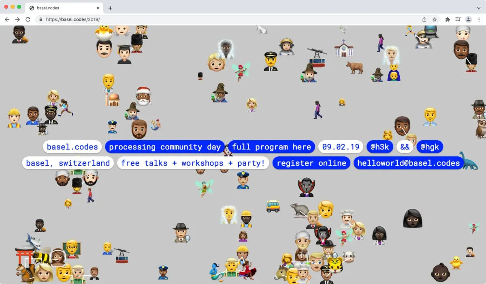

**Website for* [basel.codes Processing Community Day 2019](https://basel.codes/2019/)*. \[****image description****: Screenshot of basel.codes/2019, which shows a website with a gray background and many emojis of different people, with menu buttons that say: basel.codes, processing community day, full program here, 09.02.19, @h3k, &&, @hgk, basel switzerland, free talks + workshops + party, register online, helloworld@basel.codes”\]**

I’d used a couple of live coding editors at that time. I had experience with [Hydra](https://hydra.ojack.xyz/) in the browser. I’d also played with [Cyril](https://cyrilcode.com/), a live coding editor made in [openFrameworks](https://openframeworks.cc/). At the time I was primarily using Processing as a tool and teaching with it. I realized it’s really hard to live code the visuals. You can make amazing tools for VJing but to be able to code and see the changes right away was going to be quite tricky. I didn’t yet know about a library that someone’s made to do this, called [REPL mode](https://github.com/joelmoniz/REPLmode) for Processing, allowing iterative changes, and so I thought that in the browser I could make a tool that can use p5.js full screen in the background and put a text editor on top of it.

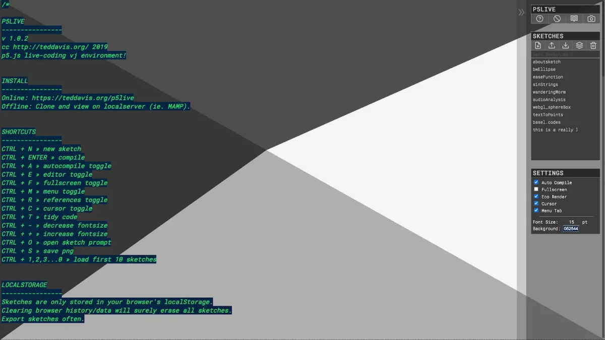

**Screenshot of P5LIVE first public release. \[****image description****: Screenshot of a window with triangles of gray in the background and text in green.\]**

It was a really quick hack, like: Let’s put a text area on top of a full screen p5.js and see if we can get the code to accept the changes. It became this iterative process of, okay, we should use a fancier editor than just the text area. The minute you can make sketches, you probably want to be able to save them, and it started as this full-screen environment for VJ purposes. I realized it was really fun to teach with this environment of auto-update live coding. I can see my changes right away, everything is full screen, so I can play with the whole screen as a canvas in a way, and let my code quickly make the changes.

  <iframe src="https://www.youtube.com/embed/rEqNDB6wY-A?feature=oembed" frameborder="0" scrolling="no"></iframe>

Pretty soon into it, I made this function called “COCODING,” because I realized we’re used to Google Docs and Etherpads, and it’s fun to collaborate on the Internet — so why not do this with code as well? What does it mean to keep a text file in sync? I brought that out in the summer of 2019. It was a nice feature to have at the beginning. Students would use it sitting side-by-side, and when they went home. It became a whole different thing during COVID-19 of forced distant teaching. It became a really useful and important feature for my teaching in remote-teaching times.

  <iframe src="https://www.youtube.com/embed/7HubjUPIftQ?feature=oembed" frameborder="0" scrolling="no"></iframe>

**SK: What status is P5LIVE in now? How do you use it in a remote class that’s synchronized to be online?**

**TD**: P5LIVE started out with this VJ focus of wanting to perform with p5.js and Processing. Since VJing came first, it required creating little functions that made it smooth when refreshing a sketch, or making changes to a sketch — so that’s one area of development that has constantly been taking place over the last two years. The teaching aspect was a big part of wanting to implement as much as possible to make teaching with it helpful, like autocomplete and things like that. With the COCODING function, it’s been a mixture of finding ways that would help students work in this co-coding environment, and ways to perform with it.

  <iframe src="https://www.youtube.com/embed/peFwRdcBJDE?feature=oembed" frameborder="0" scrolling="no"></iframe>

One person starts a channel and that becomes a unique URL that anyone can join. I’ve had up to around 30 people in a room with my students. It’s a shared text layer that everyone is changing, and those changes are then being compiled and executed locally so everyone has the same visual output. When I made it, it was fine for testing out with friends, and then I put a classroom in there and realized we create bugs super quick or chaos happens with so many people — so I had to develop features like ‘lockdown’, which meant something totally different before the pandemic. It basically let you lock the room, and whoever was the initiator of it could choose who could edit, or people could raise their hand to ask to edit, as well as being able to broadcast their mouse x and y so the teacher or initiator could demonstrate something.

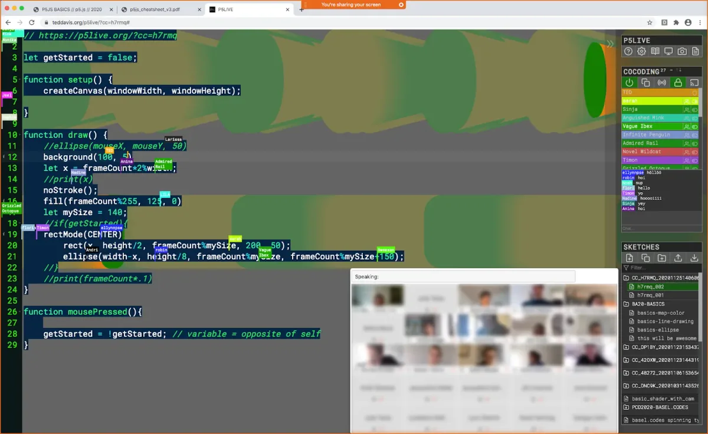

**Screenshot of P5LIVE COCODING as experienced (teacher POV) during remote teaching in Fall 2020. Twenty-six students could join a single room for a group demonstration, then pair off into pre-assigned rooms.**

Eventually I brought chat into it. At first it was just fun that people could chat in the comments, but then when teaching in a larger group and locking the room, you still need a way to be able to talk, maybe outside of the code or if your code gets long and someone leaves a comment down here, how do you know that happens? So the chat became useful for that.

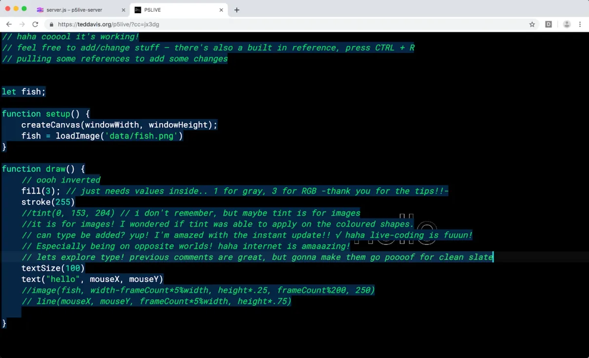

**Screenshot of a spontaneous P5LIVE COCODING session following direct message contact on social media after publishing the feature’s teaser. Before a dedicated chat window was introduced, one would converse through commented-out code.**

At the start of the pandemic, one of the features I added was called “SyncData,” to accompany the shared code. I had tried collaborating right at the beginning of the first lockdown with a friend who’s a musician and they were trying to play and send MIDI notes, and we quickly realized that I wasn’t getting their data. They set up the code to react to MIDI, but only they got the triggers. So I added a function called “SyncData,” which lets you have local code that feeds into the group. Each person can have their own local code, which lets them set up their MIDI to send messages on one channel that everyone could receive, and then I could also send messages on a different channel.

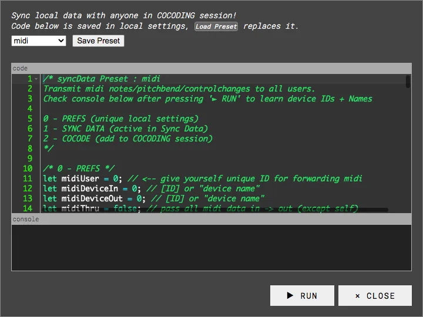

**SyncData, enabling peers of a COCODING session to share local data (midi, mouse, sensors) with the room. \[****image description****: Screenshot of window that says “Sync local data with anyone in COCODING session! Code below is saved in local settings, Load Preset replaces it.” Below this is a window of code, with buttons below that say RUN and CLOSE.\]**

**SK: Have you taken it out as an artist and a performer, and used it in that capacity? What does a non-classroom use of P5LIVE look like, for those who haven’t experienced it?**

**TD**: The very first was this PCD evening party, where we set it up on three different computers, three different projectors, which was helpful because some people felt confident coding over the DJ on the big screen, and others had no interest in that at all because of a fear of introducing a bug that would stop the visuals. We set up two more projectors, one on the ceiling, one on the side, so that it was in a less pressured space to test out code. We also hooked up the computers to share a drive, so that you could move a sketch from one of those side stations to the main station, and check it out on the big screen.

**DJ Pelin Vedis at P5LIVE “World Premiere” during basel.codes PCD19 afterparty at* [HeK](https://www.hek.ch/)*. Photo: Boris Magrini. \[****image description****: A person wearing headphones stands within a projection of p5.js code and visuals, in vivid blue, red, yellow, and black.\]**

Soon after releasing it, there was the [Mapping Festival in Geneva](https://2019.mappingfestival.com/en/workshop/workshop-11-creatlive-coding). There, I gave a workshop on live coding, and we got to live code in a techno club. It was an interesting experience because the resident VJs kept asking us to turn off the code, because in that dance setting they weren’t interested in seeing the source code. But to us, that was an important part — that it’s a transparent process. This led to the development of a feature called “visuals-only” that makes a pop-up stream of what’s happening in a second window, so you could just show the visuals.

  <iframe src="https://www.youtube.com/embed/HTL50UDo-q0?feature=oembed" frameborder="0" scrolling="no"></iframe>

That summer was also the first edition of [NØ SCHOOL NEVERS](https://www.noschoolnevers.com/) in France from [Benjamin Gaulon](http://www.recyclism.com/) and [Dasha Ilina](https://dashailina.com/). I collaborated with Dasha, who is making music with [Pure Data](https://puredata.info/) and [OSC](https://en.wikipedia.org/wiki/Open_Sound_Control). She was able to send me OSC triggers through our wifi network, and then I could live-react on those. That was the first collaborative performance with a musician using it, and that’s when I discovered that every time I was making a change, we had this moment of interruption when code recompiled, which made it, in the performative aspect, a bit intimidating to make changes. It was better to get things going and then use my mouseX and Y.

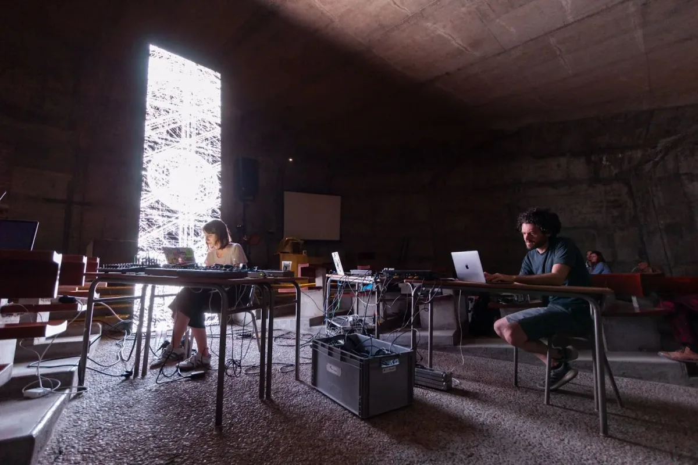

**Dasha Ilina and Ted Davis, performing at NØ SCHOOL NEVERS.* Photo: Phillip David Stearns. *\[****image description****:* A photograph of a large concrete room with high ceiling, Sainte Bernadette du Banlay, where a glowing LED-panel displays p5.js visuals. *Inside the room are tables with two people sitting at laptops. Behind them on a couch, several people look toward the left.\]**

That’s when I developed what I call a “softCompile” where, if you make changes to the draw function, it notices, hey you’re only making changes in the draw, and it can send just the updated draw into this iFrame, replacing the previous draw, which means it doesn’t have to recompile the whole sketch. If you drew something and made a change, that can stay there, and this only updates what should happen for the next draw cycle.

  <iframe src="https://www.youtube.com/embed/1Jb6AD7Khgo?feature=oembed" frameborder="0" scrolling="no"></iframe>

**SK: It sounds like a lot of features over a pretty short period of time. I’d love to hear about the development process — how you’re able to manage the time and resources, and what it’s like to be a developer of this sort.**

  <iframe src="https://www.youtube.com/embed/PZaPDJrk-so?feature=oembed" frameborder="0" scrolling="no"></iframe>

**TD**: It’s been a passion project, an obsessive thing that started out from: let’s see what would be a live editor for performing. And then it was about having fun learning all these different tools, researching which rich text editors are out there that could be useful, to the COCODING trials — everything from Firebase database versus Websockets, to learning about CRDT algorithms from papers and library implementations, to going deeper into object oriented programming in order to isolate each COCODING room.

  <iframe src="https://www.youtube.com/embed/yyy-GFD1AUE?feature=oembed" frameborder="0" scrolling="no"></iframe>

I depend so much on the open-source tools that are listed at the bottom of the [README](https://github.com/ffd8/p5live#tools-used). For every feature I had to research about four or five techniques or libraries to do that particular thing, which was super fun. I learned so much. I think my own JavaScript knowledge benefited from trying to build this. It’s like people say — to learn a language, build a game, because of all the mechanics and logic that you have to do.

  <iframe src="https://www.youtube.com/embed/tMNJyVCGITM?feature=oembed" frameborder="0" scrolling="no"></iframe>

**SK: Do you have a sense of how folks are using it — what the user base is like and what the user experience is like? I’d love to hear more about what it’s like out in the wild, outside of your direct involvement.**

**TD**: One of the fun surprises that I got was in the middle of last summer, a little bit into the pandemic. I heard from someone in Denmark who was using it for remote group meditation. They’re basically setting up COCODING to have audio-reactive visuals so that people could use their microphones.

The facilitator was making visuals that would change over time to those microphone inputs. They had a question about how they could hide the code, or keep people from editing the code who are just supposed to experience the visuals. How to be in a collaboration but in a view-only kind of way. We talked about it via email and they figured out a great hack. And then that introduced this idea of a feature where you can just say ‘&edit=0’ in the URL, and then the person arrives in the collaborative channel but without the code. They only get the visual updates. That was a super interesting use case I never would have thought of.

Another case was a band using SyncData. They were collaborating with musicians and live coding and using different kinds of instruments — and they were using this feature in a more local way on a shared wifi. I think you usually learn about how people are using it when it doesn’t work, and then they chime in and say, “I’m getting a weird bug, it’s really slowing down after X.”

I remember right when I released COCODING, I shared it on social media, and soon after someone commented, ‘This is awesome. And we killed our browser with an infinite loop.’ I realized: Wow, that’s great. Of course, if it tries to compile while you’re writing a loop, you can make an infinite loop. So I had to add a feature where, if the line you’re editing starts with ‘for’, or ‘while’ it won’t auto-compile, and that messes up other people who say, “Why doesn’t my code update?” And then I have to say, “Well, you should go down a line, or do a hardCompile.”

While teaching students, it’s common to make infinite loops, so that kicked off researching how to integrate a loop breaker, which a lot of editors have. That helps beginners because it makes it almost impossible to freeze the browser.

I was also learning through social media about people performing with it; there was this project [BRAHMAN](https://brahman.ai/), in the California desert. I remember seeing social media posts of the evenings and people doing live coding and seeing the P5LIVE editor in action there, or from live coding communities in Amsterdam, Utrecht or New York. I see it more in the performative side.

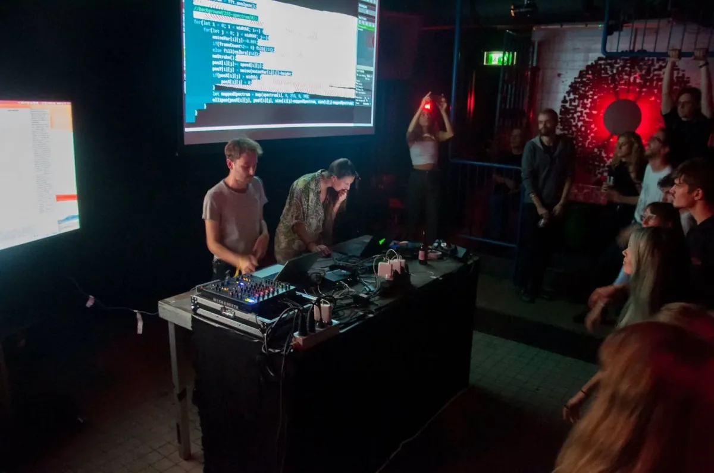

*[Sabrina Verhage](http://www.sabrinaverhage.com) *of* [Creative Coding Amsterdam](https://www.facebook.com/CreativeCodingAmsterdam) *performing with P5LIVE at a Live Coding Meetup, 2019.* Photo: Sietse van der Meer. *\[****image description****: A photograph of a live performance, with two people standing at a table on stage with laptops and a sound mixer. Behind them is a projection of the screen. An audience faces them.\]**

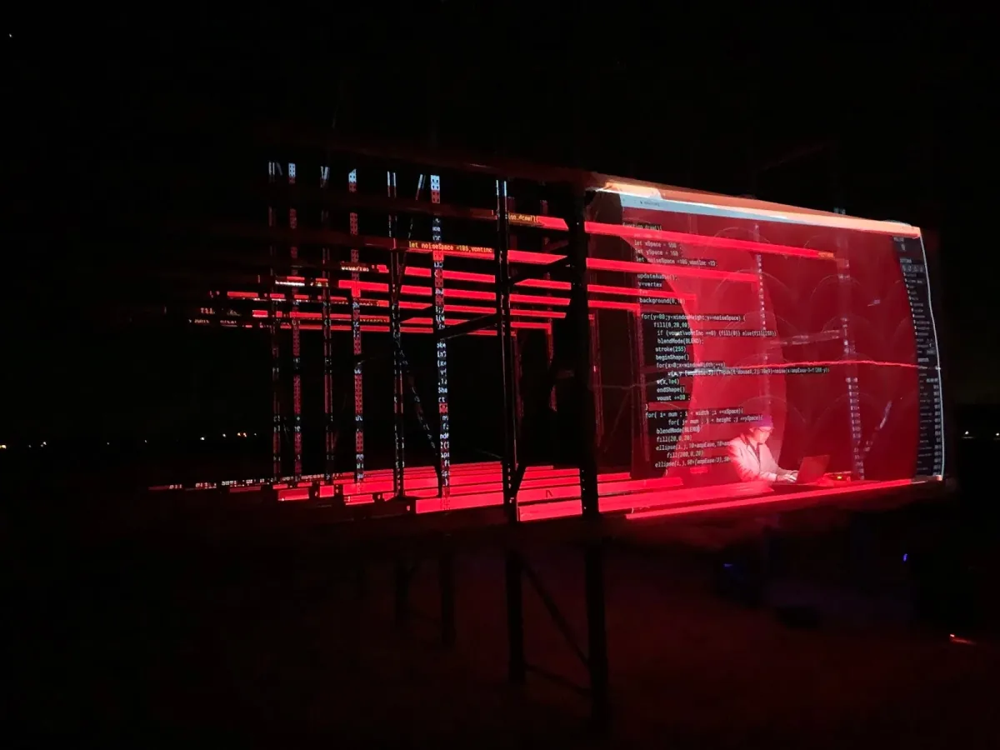

*[Cia](https://www.instagram.com/shashrvacai/) *performing with P5LIVE at BRAHMAN, 2020. Photo credit:* Image of the internet. *\[****image description****: A photograph of a live performance. A person stands at a table with a laptop in a dark room. Around them is a projection of a P5LIVE window, which is vivid red and black, and looks like the windows are stacked on top of each other.\]**

**SK: You did a Processing Teaching Fellowship this summer, and you got a lot of work done. I’d love to hear what you worked on and how you’re getting it out there.**

**TD**: Over the year and a half or so of working on this, I realized that some of the questions I was getting were things that were addressed in the README, so when I would give a workshop I would start off saying, “Here is the README where I’ve tried to document all the features it has and how to use them.” Early on, I got feedback saying, “Could you please put the shortcuts at the top of the README?” So that when they first load the program they would see what the shortcuts are for compiling or hiding the editor, the menu. That influenced how the README structure would be, but slowly as I added features it would get longer and longer, and it became this long document that no one reads.

To help people get into it, I realized I should have video demonstrations. When I’m trying to figure out how to do something — if I need to do some special function in some video editing software — I end up typing in how to do it, and then I find someone’s tutorial for just that function or feature. So the idea of the Teaching Fellowship I proposed was to turn the README into a video series.

With the Teaching Fellowship, I [broke down different aspects](https://github.com/ffd8/P5LIVE/issues/64) of the tool and tried to make them as short as possible — 10 to 15 minutes per section. I end up being able to go into nice detours while talking about this thing. We can quickly demonstrate exporting an html page from it and hosting it real quick on glitch.com, which in the README would take way too long.

**SK: I think you’re totally right, and I’m definitely one of the people that looks for the video. There’s something about why I trust the video more. In texts, things can be glossed over in a way that in video they can’t be. Video captures fuller context of how something got done in a way that text can’t if the author doesn’t choose to go into heavy detail.**

**TD**: That’s something I’ve regularly been doing to the README that is partially influenced by loading. I load the whole README into P5LIVE. When you click the “about,” it’s like parsing that README in a quasi-nicer way, but it’s in a narrower window and so that forced me to go through and try to remove as much of my overly descriptive talkiness, to try and be as concrete as possible — as few words as we can fit in the line, which I hope helps. You don’t need two sentences to learn about what the thing is doing, but maybe five words capture what it’s doing, to make it succinct but maybe less friendly or less clear, whereas in the video — you talk for 30 seconds about why and what the thing is doing.

**SK: I’m glad we are having this conversation. I think it’s something educators often think about — the different ways that information is delivered and received. It connects with what P5LIVE is doing differently. You were alluding to other things you’re hoping to do in the future around this project. Since you have delved so deep into this area, what do you see happening in this space? What would you like to see? What makes you feel like we’re headed in the right direction of having more great tools available for teaching under these types of conditions?**

**TD**: From the experience of using P5LIVE’s COCODING in my teaching from the first semester of the pandemic through the whole next year, I ended up having to build faux breakout sessions. Once I knew what the teams would be, I would build pre-links between two people. I would build a link to the hash code for a COCODING room, so that they could regularly jump into the same room and if, during class, they need some help, I could jump into their room, clicking a link from the course website and know where they were, and we could help each other.

I realized from that experience how important breakout rooms are. When we first started teaching remotely, we just had a single video chat room. Our school uses Webex, and I think it was after the summer that they introduced breakout sessions. We had this experience of having smaller meetings, or each person having their own room and people jumping in between them. I wrote a proposal for a grant at my university to further develop that idea of COCODING, to have breakout rooms. So I’ve been working on that since last spring. For now, I call it “[COCODING Classroom](https://www.youtube.com/watch?v=Bc2qpv_K1zs),” where it’s essentially co-coding with a whole bunch of breakout rooms. Educators are welcome [to sign up for early access here](https://forms.gle/m6N5up9U5jSJ5Cyr6).

  <iframe src="https://www.youtube.com/embed/D_ZE49vnwrM?feature=oembed" frameborder="0" scrolling="no"></iframe>

It solves two issues — one was that when teaching code remotely, it really helped to have two monitors. I would always encourage students to go to the thrift store to get a $20 monitor so they could watch the video chat on one and code on the other, but not everyone can do that. In this new tool, the teachers’ code is always on the left side of the screen, and the students’ is on the right, and they each have their own room that they can be sitting in to code. They can change the size of our split-screen in case the teacher stops demonstrating something; they can just collapse that window.

  <iframe src="https://www.youtube.com/embed/t4ZXT5wEMiI?feature=oembed" frameborder="0" scrolling="no"></iframe>

The second problem was that asking for help in remote teaching is so tricky. Talking with some of my students in summer, I found out that they wouldn’t ask for help because it would require me to stop sharing my screen. It was a hesitation to pause the input and so in this way, in this tool, anyone sitting inside of their room just clicks a little raised hand icon and then their name shoots to the top of the left side. The idea was the teacher could quickly use their right panel to jump into that person’s room and offer help, or quickly chat, without stopping the lesson.

As a byproduct of that, I had one beta test workshop in July. Students were jumping in between each other’s rooms and it’s like having a shared flat without doors, nothing’s locked, and you have to be nice to each other. They would jump into each other’s rooms to see what they’re working on, and say, “Oh wow, that’s an awesome function, how’d you do it?”

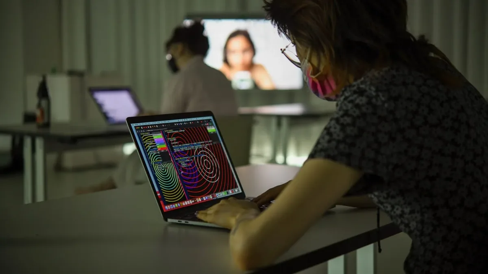

**COCODING Classroom workshop, alpha-testing initial proof-of-concept. \[****image description****: A photograph of a person working on a laptop. Their screen is filled with an animation of concentric circles. Behind them, blurred in the background, is another person working on a laptop. A screen with a person on it is behind them.\]**

**SK: Since you have been so in the space of online editor, online collaboration, what do you like that you see in the space? There are so many great things happening. I’d love to hear a little bit more about what you’ve noticed.**

**TD**: I’m so happy about how powerful the browser has become, that we can have these real-time running-wild generative visualizations and tools in the browser. It’s been so amazing, the libraries. Especially for this, p5.js and the contributors and what features and what capabilities it’s been able to bring has been huge.

I think it’s really interesting going forward, the interconnectivity of these different tools being able to build off each other, mesh with each other. The ability for us to collaborate with each other has gotten really expansive. It will be interesting when the pandemic calms down, and we can do more in physical space — what will that mean for collaboration in front of a screen? Maybe we find interesting ways of bringing the screen into our physical space, and continue to collaborate and have the physical collaboration.

  <iframe src="https://www.youtube.com/embed/Pk0sZ7HwUV0?feature=oembed" frameborder="0" scrolling="no"></iframe>

**TD**: I really look forward to how these different tools work with each other and in physical space. One of the fun parts of making P5LIVE was having a reason or a justification to reach out to the community back in the [Contributors Conference in 2019](https://processingfoundation.org/advocacy/p5-js-contributors-conference-2019). I think the larger project — of where and how one could contribute — was intimidating to me because it’s a big project. It was interesting to be able to have something to bring to that table and play with, and to be part of that community in a tool-building way.

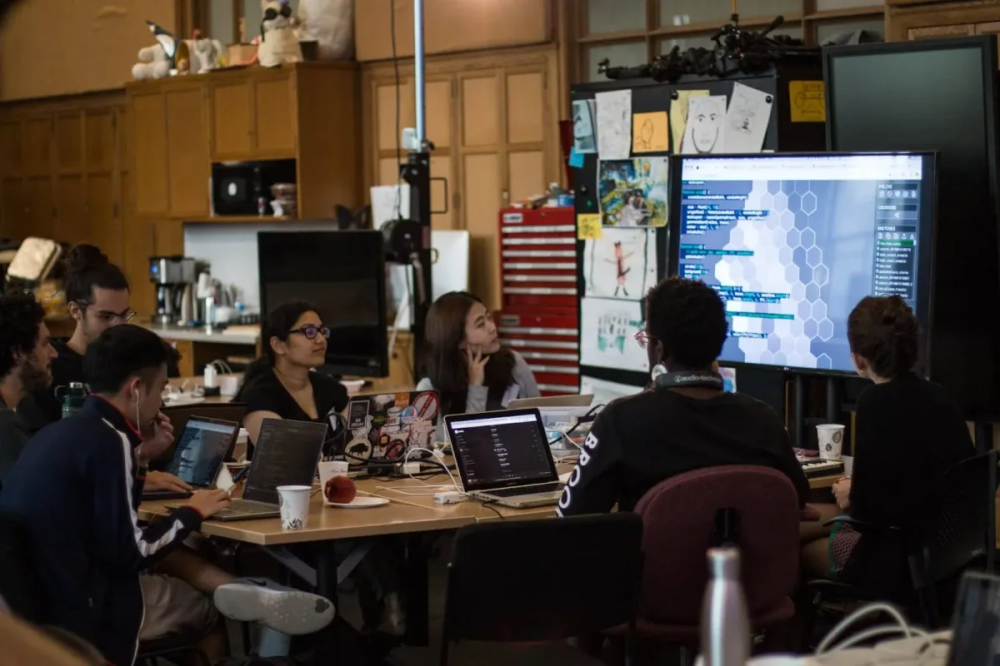

**Exploring P5LIVE to live code* [Aren Davey’s](https://twitter.com/_aahdee_) [p5grid](https://github.com/aahdee/p5grid) *within the Music and Code in Performance working group at p5.js Contributors Conference 2019.* Photo: Jacquelyn Johnson. *\[****image description****: A photograph of seven people working on laptops around a table. They look at a screen which shows a P5LIVE window.\]**

**SK: Can you talk a little about how the video-making went for you?**

**TD**: Making the videos gave me big respect for those video tutorial folks on YouTube. Until then I’d only done streams — just me recording doing a thing. What partially influenced my approach was the attempt to do one-take videos, because I have huge respect for highly edited, highly detailed videos. It was interesting in building up to it to figure out how I could do a picture and picture view live, and I ended up being able to have a second window streaming a P5LIVE sketch of my video down in the corner that mostly worked out.

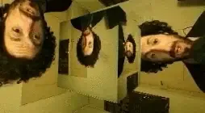

**P5LIVE instance, using visuals-only popup, in picture-in-picture mode, to overlay screen while recording walkthrough series. \[****image description****: An animated gif of Ted Davis, a person with a beard and curly hair, being animated across all faces of a cube in 3D space. His face is also animated on the surfaces of the space.\]**

Sound was the only tricky aspect to have to adjust, and trimming the start and the end, but it was interesting — the first video took a lot of time to create in terms of foot-in-mouth screwing up while talking, but the following ones were recorded with a single take. It’s a little bit like teaching where you can’t just stop and tell students, “Forget what I just said, and let’s do that again.”

**SK: You had some interesting ideas about doing live streams and things like that — are you still planning to invite friends and other folks to use P5LIVE with you online?**

**TD**: Last year when I did the [live streams](https://www.youtube.com/playlist?list=PLVFTsPTlaBzJN5ADww-TGchirUbfGvI15), I was planning to reach out to people to collaborate for that one hour per week, but getting sound took me way more time than I wanted it to. Trying to use one machine and figuring out a couple of those different things to give it quality on a technical level ended up being more complicated than I thought it would be. The COCODING adds this other layer of: Do I use an old computer and have the conversation with the person there while we’re coding and feed that image into my other computer?

It’s these fun but tricky bits to figure out how to demonstrate COCODING. It’s also how OSC and MIDI works. I should be working with a musician; once I figure that out for the video, I plan to start the streaming series again with other people because it’s so much more fun to code. The whole point of streaming was to share for any few people that were watching, but it’s really fun to share that inspiration with someone else and go in totally different places than you would alone.

**SK: Thank you, Ted. I really appreciate your time. Such a cool project. I definitely want to make sure more teachers and performers know about it. I’m really excited that you spent the summer with us to get some of this done. As a community member, I want to say thank you for all that you’ve done. I wish I was back in the classroom just to use it, so one day I hope I will be doing that.**

**TD**: Thank you so much for the mentorship over the summer!

**SK: *(Laughs)* I think you knew what you were doing!**
