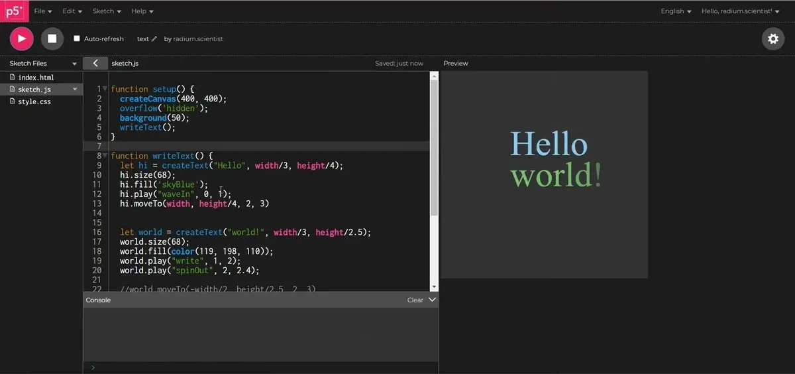
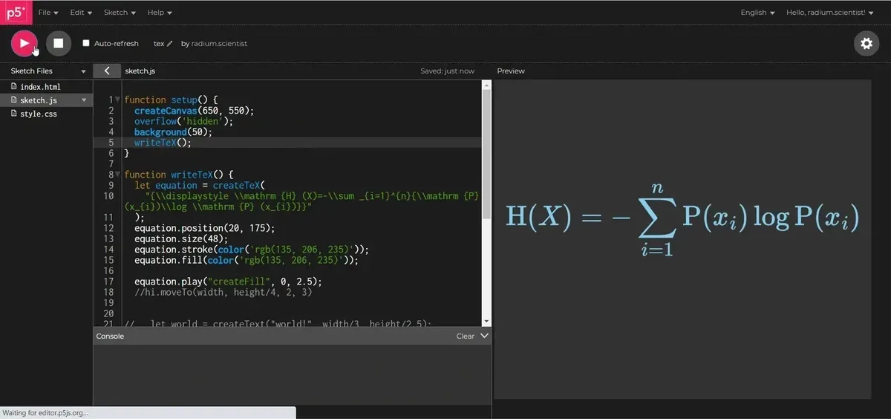
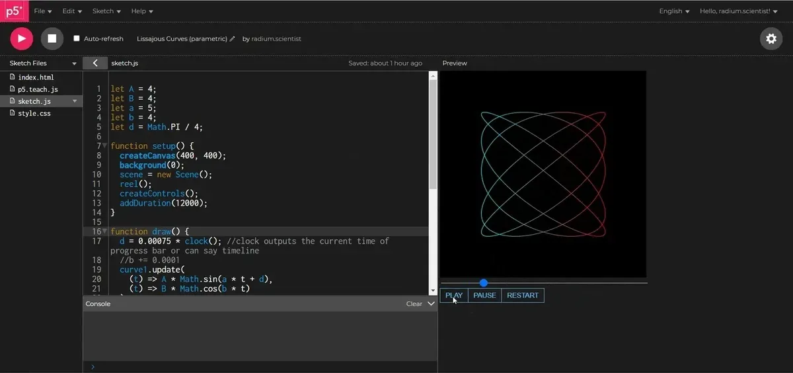
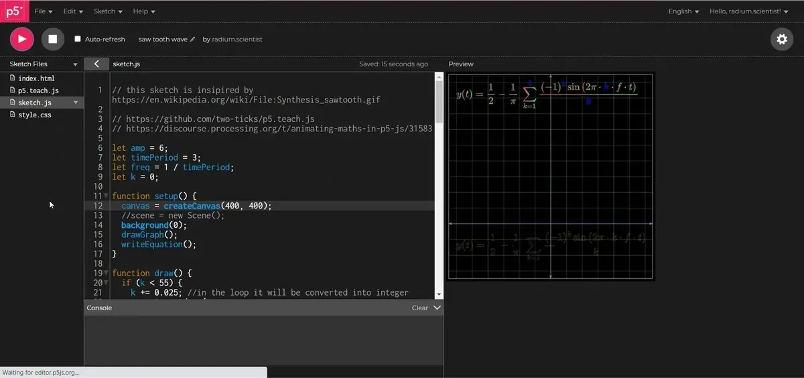

Mentored by [Jithin KS](https://github.com/JithinKS97) (GSOC 2018) and Nick McIntyre

---

*As of 2021, Processing Foundation has been participating in Google Summer of Code for a whole entire decade! Each year we’ve been honored to work with students on open-source projects that range from software development to community outreach, and this year’s cohort was no exception. Over the next couple weeks, we’ll post articles written by some of this year’s GSoC students, explaining their projects in detail and in their own words. The series will conclude with a wrap-up post of all the work done by this year’s GSoC students. Congrats, everyone, on a great summer!*

---

About four years back I was watching YouTube and came across a video by [ThinkTwice](https://www.youtube.com/ThinkTwiceLtu) called “[Geometry: Viviani’s Theorem](https://youtu.be/uf2ChRpFTZk),” which got me curious about how math animations are made. In the video’s description, the name of the software used was [Processing](https://processing.org/). Soon I found [The Coding Train](https://www.youtube.com/TheCodingTrain) and [p5.js](https://p5js.org/). I started building sketches related to signal systems. I needed to render math symbols, so I searched online and found out about [KaTeX](https://katex.org/) from Nick McIntyre’s [answer on Discourse](https://discourse.processing.org/t/latex-in-processing/19691). I found [MiM](https://math-in-motion.github.io/early-demo/#hero-area) and [Dynamic Learning](https://medium.com/processing-foundation/visualizing-stem-education-with-dynamic-learning-4106748c6fcd) while searching for science and math animation and simulations. These events motivated me to think about p5.teach, a library for TeX support. This library is hugely inspired by [manim](https://github.com/3b1b/manim) library and [reanimate](https://github.com/reanimate/reanimate).

I spent this summer working on [p5.teach](https://github.com/two-ticks/p5.teach.js), with help from my mentors Jithin KS and Nick McIntyre. Our aim was to build an addon library for teaching math through animations and simulations. The goal of the library is to support classroom learning and make TeX accessible for educators who don’t want to deal with too many technicalities. Teaching math through animation and simulation can provide a better experience to students and educators by letting them explore their own curiosity.

The major goals of this project were:

1.  Development of animation methods and controls
2.  Support for TeX

Overview:

-   TeX and text animations using [MathJax](https://www.mathjax.org/) and [anime.js](https://animejs.com/) by manipulating p5.js DOM elements and SVG elements
-   play function for animations like write, waveIn, waveOut, fadeIn, fadeOut, createFill, etc. for TeX and text
-   controls like play, pause, and restart buttons for timeline
-   style, add, play, remove, update, fill, stroke, strokeWeight, position, and size methods for MObjects
-   SVG plotting methods and animations

The library has three main components, MObjects, GObjects, and Scene.

#### **MObjects**

p5.teach helps educators create Text and TeX animations with help of anime.js. Text and TeX in the library are referred to as MObjects and can be animated, styled, added, or removed through various methods. Methods are similar to p5.js syntax, for example, the “remove” method removes the MObjects. Animations can be played with the help of the “play” method. TeX is converted into SVG by MathJax, then added to sketch with p5.DOM and animated using anime.js. Some other useful methods include resizeTo, and moveTo for animating resizing, and shifting.

*Text (MObject) created using createText() function and animated by play(), resizeTo() and moveTo() methods \[**image description:** Animated text using p5.teach in p5.js web editor. On the left half of the screen is the p5.js code, and on the right is the rendering of the sketch, containing “Hello world!” text appearing then disappearing followed by typing and zooming effect on another sentence that is “I‘m p5.teach.”\]*

*TeX (MObject) created using createTeX() function and animated by play() method \[**image description:** Animated TeX using p5.teach in p5.js web editor. On the left half of the screen is the p5.js code, and on the right is the rendering of the sketch, containing expression of Shannon’s entropy appearing on screen.\]*

#### **GObjects**

Similar to Text and TeX animations, graphs and shapes can also be animated. Graphs and shapes in the library are referred to as GObjects and can be animated, styled, added, or removed through various methods similar to MObjects. Polar and Parametric graphs can also be plotted using the library and can be customized through the configure(config) method. Shapes and graphs are SVG elements and are animated through anime.js the same way as the MObjects are animated.

*Lissajous curve (GObject) created using parametric equations and animated by play() method. Control buttons and progress bar were added through createControls() function and can be customized with CSS. \[**image description:** Animated Lissajous curve using p5.teach in p5.js web editor. On the left half of the screen is the p5.js code, and on the right is the rendering of the sketch, containing Lissajous curve with progress bar, play, pause, and restart button.\]*

*Coordinate system can be customised using the configure() method. Graph and TeX can be updated using the update() method. Gradients and other CSS properties are added using VanillaJS on SVG elements. \[**image description:** Animated graph using p5.teach in p5.js web editor. On the left half of the screen is the p5.js code, and on the right is the rendering of the sketch, containing animation of the additive synthesis of a sawtooth wave with an increasing number of harmonics.\]*

#### **Scene**

The scene contains all the objects created by the library, controls, timeline, transform functions, and variables. All objects inside the scene are in a div element with id “sceneContainer” and dimensions equal to default p5.js canvas.

Animations can be extended using the development environment and customizations can be implemented. p5.teach allows for interactivity that supports creative ideas to flourish in classrooms and remote learning scenarios. Motion is a key ingredient for learning STEM as a lot of concepts can be explained with help of changes in time, such as transformations of function, stages of mitosis, fission, and input-output relations. p5.teach in the Web Editor will allow educators and students to animate and play with text, TeX, and shapes with a reduced amount of code, so they can focus on more important things.

I will further improve the library by adding new features and adding more to the existing features in the months to come. I really had a lot of fun working on this project and learned a lot working with my mentors and the Processing community. I would like to thank my mentors Jithin KS and Nick McIntyre for their invaluable help and guidance throughout this Summer of Code. Their love for teaching, code, and STEM inspired me to do more work on the library.

Nick’s emphasis on the color-blind safe palette for default colors, and Medium articles by the p5.js community (like [this](https://medium.com/processing-foundation/making-p5-js-accessible-e2ce366e05a0), [this](https://medium.com/processing-foundation/working-on-the-p5-accessibility-project-58a781575400), and [this](https://medium.com/processing-foundation/image-processing-library-to-ease-differentiation-of-colors-for-people-with-colorblindness-cc550f0670e0)) on accessibility for blind and visually impaired people, shows how much the community is careful about accessibility. Jithin emphasized clean code, naming convention, and encapsulation. These events, suggestions, and thoughts changed my perception of programming: Programming is more than just syntax, it can tell **what you care about**.

#### Discourse Post

[Animating maths in p5.js](https://discourse.processing.org/t/animating-maths-in-p5-js/31583)

#### GitHub repo

[https://github.com/two-ticks/p5.teach.js](https://github.com/two-ticks/p5.teach.js)

#### Work Product Report

[Google Summer of Code Final Work Product Submission 2021](https://gist.github.com/two-ticks/4dda385f078abe5ac63cba98eac30e5d)
