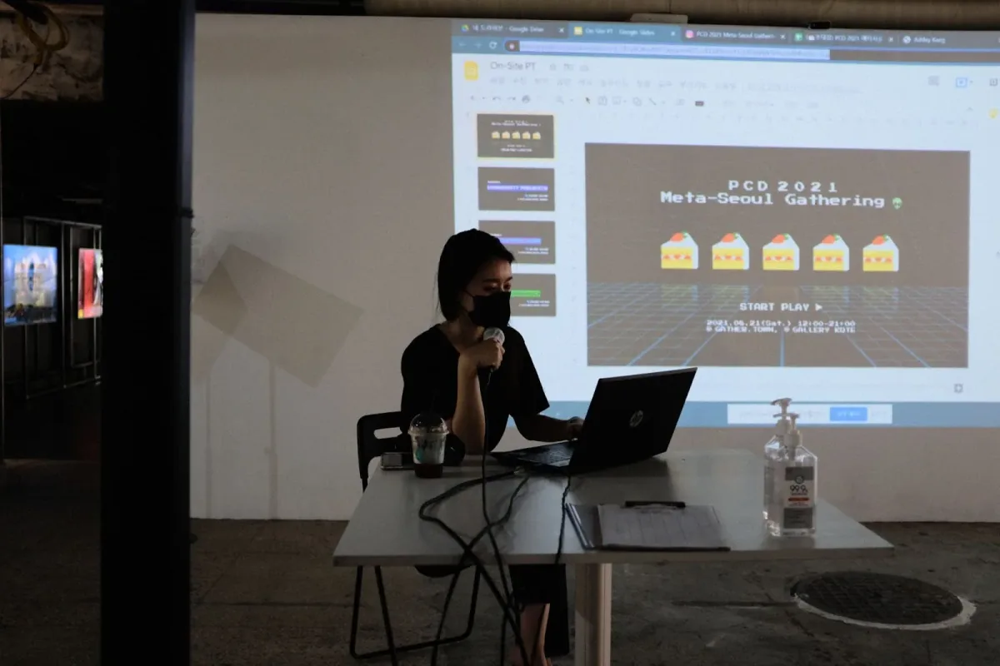
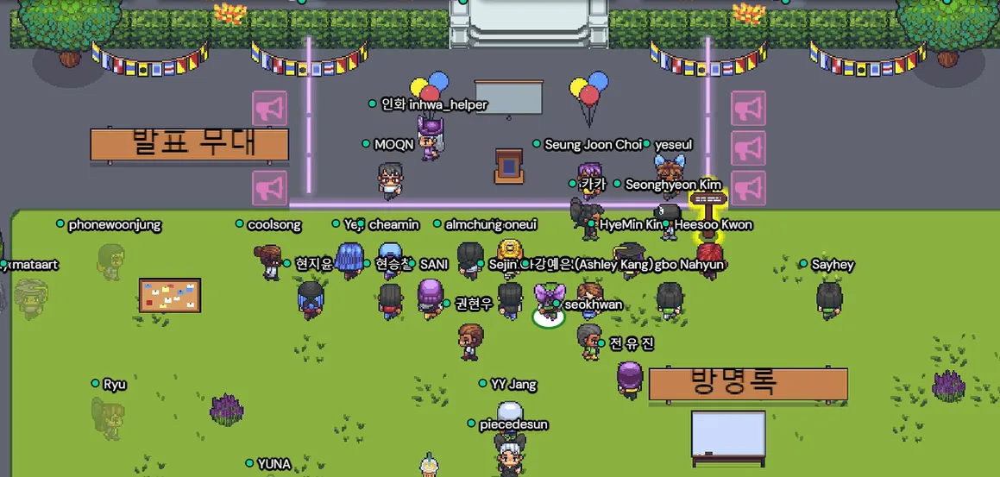
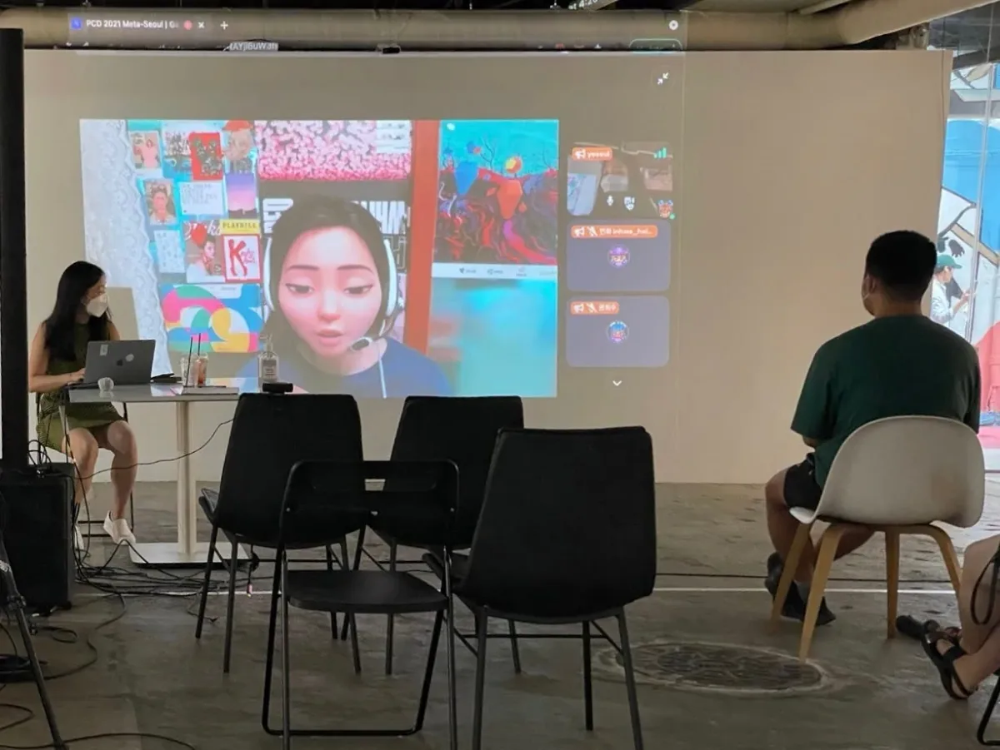
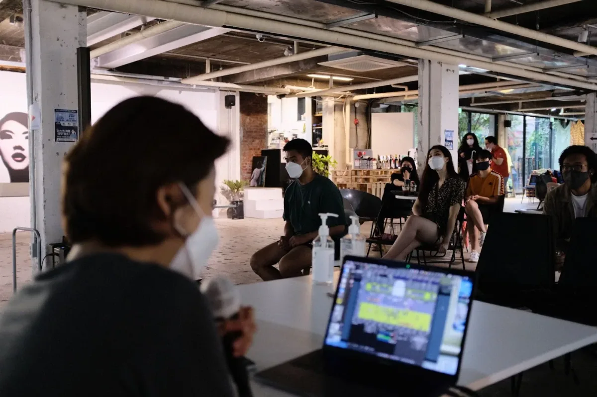
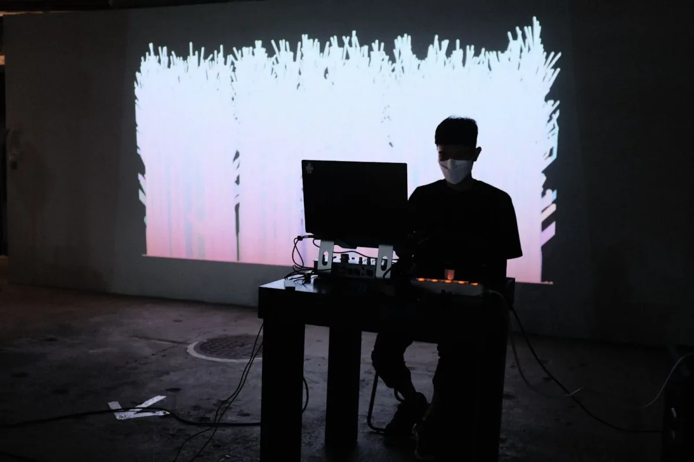
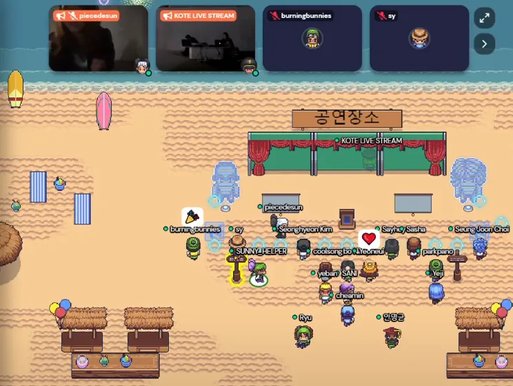

#### by [So Sun Park](https://instagram.com/sosunnyproject)

---

*This year, on August 9, the Processing software turned 20 years old. To celebrate, the Processing Foundation organized* [*Processing Community Day 2021*](https://processingfoundation.org/advocacy/pcd-2021)*, a distributed, worldwide party held on August 20–22, 2021. For PCD2021, the community could participate in a number of ways, from hosting an event online or in their city, to contributing to the* [*20th Anniversary Processing Community Catalog*](https://processingfoundation.org/advocacy/community-catalog)*, to sharing creative coding projects and resources at* [*#pcd2021share*](https://twitter.com/search?q=%23pcd2021share&src=typed_query&f=live)*, to creating a real or virtual birthday cake at* [*#pcd2021cake*](https://twitter.com/search?q=%23pcd2021cake&src=typed_query&f=live)*. This is the last article in a series written by some of the folks who organized a PCD2021 event,* [*which you can read here*](https://medium.com/processing-foundation/pcd/home)*. Happy 20th birthday!*

---

It was five years ago when I first learned Processing. I didn’t learn it at school or university. I probably learned it at one of the meetups I attended in Manhattan, or a free online course on Kadenze. At that time, I had taken a few JavaScript classes in college to fulfill certain requirements outside my concentration division. While taking classes with computer science majors was not easy, it was slightly better than being left with sore muscles after laboring at a work-study shift.

As I took more classes in subjects like computer animation or gaming, I discovered that — deep down in my heart — I wanted to become more fluent in creating something with programming. In the end, or as a beginning, I used hand-tracking sensor and Unity C# coding for my thesis demo, but my first job was not as a developer. After graduation, I was still looking for an answer to the question of whether I should pursue programming, and if I did, what I would make.

Around two days a week after work, I jogged along the Hudson River, taking in its sunset view, to a fabrication lab near Chelsea or some shiny coworking office next to Washington Square Park, to attend an event or full-kit workshop where I could learn Processing. I usually found these events on meetup.com by scrambling any keywords similar to “creative technology.” I got my hands on Processing and p5.js here and there, and most importantly, many people at the workshops encouraged me and helped me to overcome my doubts.

*Inhwa Yeom is introducing the PCD Seoul event in KOTE gallery, Seoul. Inhwa was a Processing Foundation Fellow, with Seonghyeon Kim, in 2020. **\[Image Description**: A woman sits at a table with a laptop. Behind her is a projection with a slide that says, “PCD 2021 Meta-Seoul Gathering” with illustrations of slices of cake.\]*

That was a long intro to convey how thankful I am to all those communities I came across. Those little pieces of confidence stacked up and led me to persevere with creative coding. Fast forwarding to 2021, I wanted to make a [PCD Seoul](https://instagram.com/pcd.seoul) event to give back to the community what I had received. Seoul does not currently have large public communities involved with creative technology, but rather small nodes of dispersed networks. Yet it seems clear that more and more creators, students, artists, technologists, and producers are showing interest in such a community. Still, whenever I talked with students or beginners at my exhibitions or on ClubHouse, I heard doubts and worries similar to the ones I had before (and probably still have) — a beginner’s fear.

I thought this PCD event would be a good opportunity to give a platform to emerging artists or those who are just starting out. I personally sent Instagram DMs to young creators I’ve been watching on social media, and we publicized Google forms for volunteer speakers through PCD Seoul social media accounts. Although it was a casual event, we did a pretty good job of gathering people who are already working in the creative technology field and connecting them with these new faces. Due to the short period of preparation and the limits of our networks, I reached out both to speakers who mainly use Processing or p5.js, and those who do not. I wasn’t entirely sure if that would be okay, but I believe that casting a wide net drew more people and lowered the barriers. And it definitely vibed with the welcoming statement of p5.js.

*This is the screenshot of a PCD Seoul event’s speech podium area inside Gather Town platform. \[**Image description**: An image from with the Gather Town platform, of a virtual meeting space. In computer animation, there are many avatars of users assembled in a space with images of green grass and shrubs, outside of a castle with banners on the walls.\]*

*So Sun Park gives her presentation, “A Journey Being Connected with Online Communities,” in KOTE Gallery. \[**Image description**: A photo of a woman presenting in a room. She uses a cartoon filter on the video. The video presentation is being projected on the wall and people are watching it in the KOTE gallery.\]*

We built the online venue inside Gather Town. Since we had two separate chunks of sessions — presentation and live performance — I decorated the castle’s outdoor garden with podiums, and the beach area with coconut drinks, surf boards, and the stage. The first part of the presentation consisted mostly of panels featuring individuals who had worked closely with p5.js and Processing, thanks to [Inhwa’s](https://www.instagram.com/yinhwa.art/) amazing recruiting skills. The speakers shared their experiences of translating p5.js (Joseph Hong), organizing p5.js Showcase (Ashley Kang), working on the Friendly Error System (Alm Chung), and more. As someone who submitted a sketch to p5.js Showcase before, I was surprised to learn that this started from one person’s initiative and expanded as an annual event.

After a quick break, various digital media artists shared their work. Their backgrounds included architecture, design, music, fine arts, and technology. During the talks and Q&As, we naturally shared a variety of tools that we use in our work, such as Arduino, TouchDesigner, Processing, Blender, Cinema 4D, Unity, Ableton, and more.

*The presenter from Praxis AI gave a speech in the KOTE gallery. \[**Image description**: A woman wearing a mask speaks into a microphone, sitting in front of her laptop. The audience watches the projection behind her.\]*

I would like to add to this quick summary of the talks a paragraph from a thorough review of the events by [Seung Joon Choi](https://twitter.com/erucipe), who gave a presentation about the history of computational arts and demo scene.

\* 정앎 작가님([https://almichu.cargo.site](https://almichu.cargo.site))의 FES([Friendly Error System](https://github.com/processing/p5.js/blob/main/contributor_docs/friendly_error_system.md))은 <오류와 친해지는 프로세싱 워크숍> 때 고민했던 경험이 떠올라 기억에 남았고, 김대천 작가님이 SAGE와 Ivan Sutherland 등의 역사 이야기를 짚어주셔서 반가웠습니다. 황보나현 작가님의 작업(괴상함의 아름다움 — 괴상한 시리즈, [https://www.instagram.com/h\_\_generative](https://www.instagram.com/h__generative) )도 기억에 남습니다. 그 외에도 PCD 커뮤니티에서 여러 발표, 정보들을 아카이브해서 공개할 예정이라는데 기대가 됩니다! 물론 지인인 전유진 작가님의 <지금의 미래 교육>과 지난 주에 이어 연결되는 이야기를 주고 받을 수 있어 좋았고, [http://prxs.ai](http://prxs.ai) 이야기를 직접 들어보며 거기까지 도달하게 된 지난 여정을 떠올려 보는 것도 인상깊고 재밌었습니다. [게더타운](https://gather.town/)을 통해서만 봤지만 [김치 앤 칩스](https://www.kimchiandchips.com/)의 엘리엇이 가보면 좋다고 몇 번 언급했던 인사동 KOTE([https://www.kote.kr](https://www.kote.kr))가 이런 곳이었구나 싶었어요.

*Translation*: “Alm Chung’s Friendly Error System talk was impressive because it reminded me of “Processing Workshop: Being Friendly with Bugs,” which I taught before, and the lessons that I got from it. During DaeChun Kim’s presentation, I was glad to hear some historical background stories like those of SAGE and Ivan Sutherland. Hwangbo Nahyun’s artistic works — the “Beauty of weirdness” series — were very interesting too. And I’m excited to re-watch the archives of all the panel presentations that will be publicly shared by PCD Seoul in the near future. Also, through this event, I was able to have a deeper conversation with my friend and speaker Yoojin Jeon about her talk, “Today’s Future Education.” Listening to Praxis AI’s long journey of making an easier tool for AI creation was exciting as well. I joined the event via Gather Town. But, through video chat, it was good to see the nice view of the offline venue, KOTE gallery, which Elliot Woods recommended for a visit a few times.”

*Jiyong Hwang performs his audiovisual set. \[**Image description**: A photograph of a man sitting at a computer. Behind him, a visual projection shows trees drawn with Processing.\]*

After the presentations and dinner break, it was time for the live audiovisual performances. Five amazing artists and musicians joined us — C.Cliff, Yuna, WYXX Jiyong, oops.50656 team. Yuna and oops.50656 have frequently performed with music and creative visuals, so I was excited to have them there. Although I haven’t met C.Cliff and WYXX in real life — I mean, who meets anyone in 2021 anyway, right? — I have seen their Instagram posts about creating the visuals (with Processing, Cinema 4D, etc.) that accompany their music. I thought this would be a great chance for them to share their unique work. Despite the offline venue’s technical difficulties and the fact that Gather Town was not the best platform for streaming live music, the performers were super understanding and supported one another during the show. And of course, they nailed the gig.

*This is the screenshot of participants’ avatars enjoying the audiovisual performance inside Gather Town space. \[**Image description**: An image of the virtual space within Gather Town, which shows avatars assembled in front of a stage. There are four “screens” showing the different audio visual performances.\]*

To share a quick review of the event’s operations, Gather Town was fun but maybe not the best for archiving or live streaming the audio visual performances. As for managing coinciding online and offline events, I would rather choose one of them and focus on it next time. A mix of Gather Town and YouTube Live could be something to try. If you ask me how it was to host a 12-hour event and MC it online, I would recommend you have some backup. But if you cannot find any, make sure to hydrate! :’)

Last but not least, [this document](https://paper.dropbox.com/doc/PCD-2021-Meta-Seoul-Gathering--BVMfBzMtikHbE4YIrZrMFyZKAQ-owArgBKgCXiHuikx2ln8r) shows how we scheduled the entire event. During the preparation and event, we encountered many unexpected or chaotic moments that surely made the organizers frustrated. Yet along with the staff and presenting artists, especially those at the offline venue, they helped the entire event go smoothly. Thankfully, the participants were very patient and fully enjoyed PCD Day with us. I hope this event has brought more opportunities to all of us — either internally or externally.
