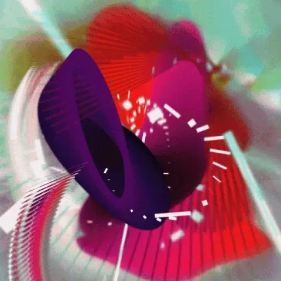

*This year, on August 9, the Processing software turned 20 years old. To celebrate, the Processing Foundation organized* [*Processing Community Day 2021*](https://processingfoundation.org/advocacy/pcd-2021)*, a distributed, worldwide party held on August 20–22, 2021. For PCD2021, the community could participate in a number of ways, from hosting an event online or in their city, to contributing to the* [*20th Anniversary Processing Community Catalog*](https://processingfoundation.org/advocacy/community-catalog)*, to sharing creative coding projects and resources at* [*#pcd2021share*](https://twitter.com/search?q=%23pcd2021share&src=typed_query&f=live)*, to creating a real or virtual birthday cake at* [*#pcd2021cake*](https://twitter.com/search?q=%23pcd2021cake&src=typed_query&f=live)*. Over the next couple weeks, we’ll be posting a series of articles written by some of the folks who organized a PCD2021 event. Happy 20th birthday!*

---

*Feedback ellipses and rectangles create trails showing their movements, making a texture of gradients in pink, purple, and green colors. Credit: Hypereikon*

To celebrate the 20th anniversary of Processing, we held a week-long series of events in Chile — part of the global Processing Community Day celebrations — that included sessions in the cities of Valdivia and Santiago, and involved several artists as participants and a designer in the role of mentor.

Ten years ago, I learned about Processing as a new tool for artists and designers, and discovered the platform had enough examples and documentation for me to be able to learn it on my own. But it was the feedback and help that I received from the online community that changed my life. Through those interactions I learned how to ask and answer queries, and how to learn collectively. It became my main tool to think about creative design processes, and in the last seven years I have used the Processing language to teach in undergraduate and graduate art and design classes in Santiago.

By the time the call to hold a 20-year celebration was published, I was wrapping up a little over two years of parental leave, so it was a wonderful time to get back to my academic pursuits — and an opportunity to teach and share my work. In the process, I learned new things about the platform’s language and community. I wanted to organize an activity without a defined format, that would adapt to the interests of those who answered the call. And if a single person or a group of 20 people responded I would adapt the format and duration of the session accordingly.

Previously, in 2019, when Alfredo Duarte invited me to hold a workshop for the first Processing Community Day in Santiago, I was curious to know if I — as a Spanish speaker — could contribute to the creation of a local community in my mother tongue, one that cultivates creativity and advances technology, and one that is a space of free access. I put out an online call and a duo of media artists from Valdivia, Chile, responded with interest.

Sebastián Rojas and María Constanza Lobos, who together make up [Hypereikon](https://twitter.com/hypereikon) — a laboratory for experimental digital creation — had concerns about how to port video feedback techniques to p5.js, where the canvas feeds itself, generating a constant flow of complex textures through figures and simple movements, thus playing with repetition, oscillatory patterns, and randomization.

During the sessions, we explored guided learning processes and documentation as a creative practice by building basic algorithms that could be easily understood and iterated over. At the end of the week, the artist duo was able to develop a series of 12 works for [Hic et Nunc](https://www.hicetnunc.xyz/), participating in the community fundraiser, and sending some to be included in the Processing Foundation Community Catalog.
