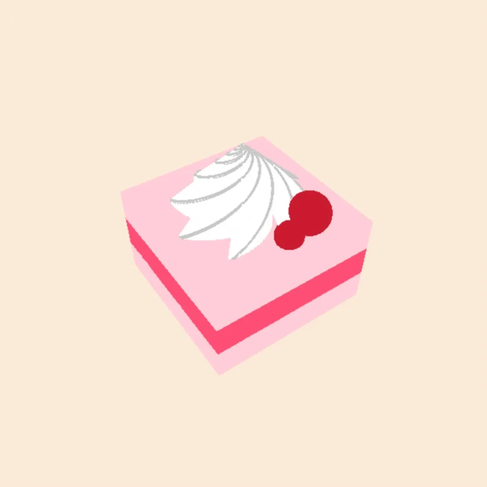
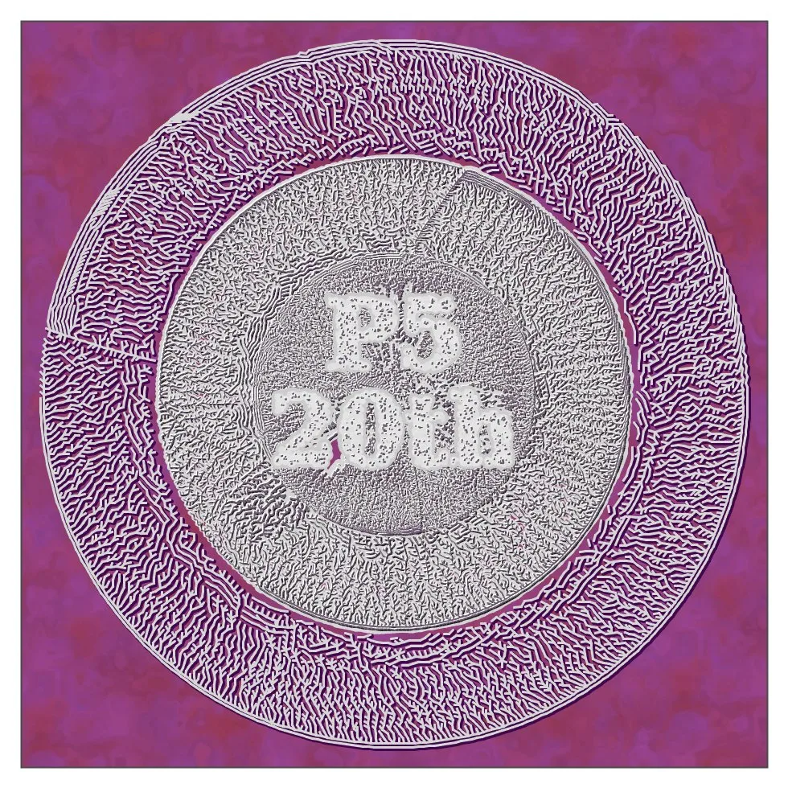
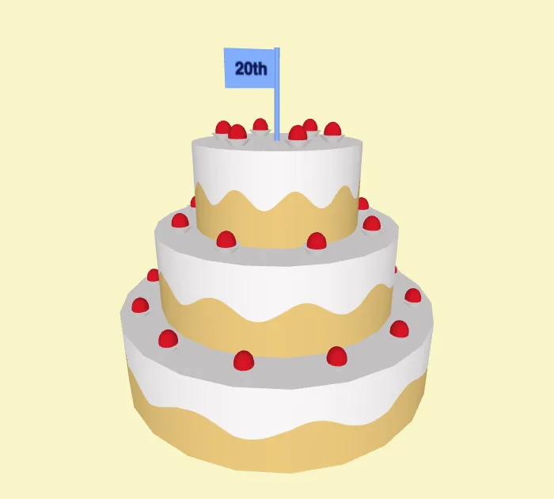
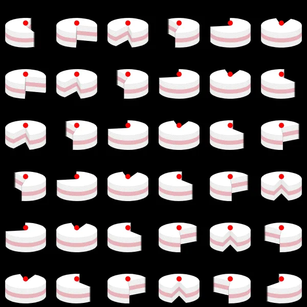

*This year, on August 9, the Processing software turned 20 years old. To celebrate, the Processing Foundation organized* [*Processing Community Day 2021*](https://processingfoundation.org/advocacy/pcd-2021)*, a distributed, worldwide party held on August 20–22, 2021. For PCD2021, the community could participate in a number of ways, from hosting an event online or in their city, to contributing to the* [*20th Anniversary Processing Community Catalog*](https://processingfoundation.org/advocacy/community-catalog)*, to sharing creative coding projects and resources at* [*#pcd2021share*](https://twitter.com/search?q=%23pcd2021share&src=typed_query&f=live)*, to creating a real or virtual birthday cake at* [*#pcd2021cake*](https://twitter.com/search?q=%23pcd2021cake&src=typed_query&f=live)*. Over the next couple weeks, we’ll be posting a series of articles written by some of the folks who organized a PCD2021 event. Happy 20th birthday!*

---

Hello, I’m Takawo Shunsuke ([@takawo](https://twitter.com/takawo/)), the organizer of Processing Community Japan. We hosted “[Processing Community Japan Hangout, Vol.6](https://pchj06.peatix.com/) ([#PCHJ06](https://twitter.com/search?q=%23PCHJ06&src=typed_query))” on August 21, 2021, as part of the worldwide Processing Community Day 2021.

We had two channels for the event; one was focused on social coding, the other was an online exchange using [Remo Conference](https://remo.co/). For the event on social coding, we asked for sketches to celebrate Processing’s 20th anniversary using the hashtag [#pcd2021cake](https://twitter.com/search?q=%23pcd2021cake&src=typed_query&f=live). Here are some of the incredible sketches:

*A 3D logarithmic spiral cake by Merry-san ([@fnXzxnwcP6iZlUn](https://twitter.com/fnXzxnwcP6iZlUn/))! It’s nice to see mathematics and cuteness living together. \[**Image description**: A rendering of a pink, striped cake in the shape of a cube, with cherries and cream on top, set against a cream-colored background.\]*

*It’s fun to imagine what [@deconbatch](https://twitter.com/deconbatch)\-san’s cake would taste like from the image you see here. Looks yummy! 😊 \[**Image description**: Two concentric, flat silver circles — the middle one more opaque and featuring the tribute “P520th” in white — set against a deep pink background.\]*

*Reona-san’s ([@reona396](https://twitter.com/reona396)) cake is 3D! The strawberries, flags, and cream layers are all represented in code. \[**Image description**: Rendering of a three-tiered cake with white icing and decorated with red fruit, topped with a blue flag that reads, “20th,” all set against a cream background.\]*

*The last one is by [@nagayama](https://twitter.com/nagayama)\-san, who portrayed a series of cakes using [#つぶやきProcessing](https://twitter.com/search?q=%23%E3%81%A4%E3%81%B6%E3%82%84%E3%81%8DProcessing&src=typed_query), where the code is written within just one tweet. \[**Image description**: A grid of 36 layer cake renderings, all white with pink stripes and decorated with red fruit. Each of the cakes has been partially consumed, and all are set against a black background.\]*

The theme of writing or drawing “cake” in code has brought out such a variety of expressions. I think this illustrates the way in which the Japanese community has been interacting through sketches and creations. So let’s continue to practice communication and co-creation through code in our community.

The other activity we organized to celebrate Processing’s anniversary was an online exchange using [Remo Conference](https://remo.co/), which was attended by more than 50 people. The participants gathered at each virtual table and discussed their #dailycoding activities and tips on creative coding — and asked questions and exchanged opinions through sketches. There were also virtual tables where people could code in a relaxed manner, and technical discussions about coding were taking place in real-time. During the event, participants were asked to adhere to the Berlin Code of Conduct.

After the onset of COVID-19, online exchanges became more popular. During the event, we heard comments from participants such as, “I was too far away to attend PCD Tokyo 2020, which was held as an offline event, but I am glad that I was able to get involved in the community by watching the online event.”

One of the more heated discussions that took place during the event was about recommended books on creative coding. We even continued to exchange information after the party. Senbaku ([@senbaku](https://twitter.com/senbaku)) published a list of books recommended for creative coders using Docsify and Github Pages. Senbaku-san will add to this list in the future, so please check it out [here](https://senbaku.github.io/). 👻

The next event, “[Processing Community Hangout Japan, Vol.7](https://pchj07.peatix.com/),” will be held on Saturday, November 13, from 19:30–21:30. The theme of the event is “Education.” We will have presentations about practices and issues in educational institutions such as universities, and introduce activities in communities. Thank you for reading. Happy coding!
