*This year, on August 9, the Processing software turned 20 years old. To celebrate, the Processing Foundation organized* [*Processing Community Day 2021*](https://processingfoundation.org/advocacy/pcd-2021)*, a distributed, worldwide party held on August 20–22, 2021. For PCD2021, the community could participate in a number of ways, from hosting an event online or in their city, to contributing to the* [*20th Anniversary Processing Community Catalog*](https://processingfoundation.org/advocacy/community-catalog)*, to sharing creative coding projects and resources at* [*#pcd2021share*](https://twitter.com/search?q=%23pcd2021share&src=typed_query&f=live)*, to creating a real or virtual birthday cake at* [*#pcd2021cake*](https://twitter.com/search?q=%23pcd2021cake&src=typed_query&f=live)*. Over the next couple weeks, we’ll be posting a series of articles written by some of the folks who organized a PCD2021 event. Happy 20th birthday!*

---

<iframe src="https://www.youtube.com/embed/J9NW14XfOfU?feature=oembed" width="1192" height="670" frameborder="0" scrolling="no"></iframe>

Ten years ago, I would never have thought that a programming language would change my life. At that time I was struggling with my chosen profession. My design studies were going well, but I lacked the perspective to develop a meaningful professional future. My doubts about my career choice were not unfounded, as my father had been a self-employed designer and entrepreneur all his life and had struggled through unimaginable ups and downs. My own dream was to combine creativity with work that would bring me into contact with people. I loved the design field, but I was missing the social component.

Through many coincidences and interesting experiences working as a self-employed designer, I discovered Processing. It was a direct match, and not only because of my interest in computers and the new ways in which Processing allowed me to express myself. It also put me in touch with a diverse, global, friendly, and vibrant community, which ultimately motivated me to dive deeper into this mysterious world and explore the possibilities of creative coding. Then, in 2018, I got my first teaching job in creative coding, which brought me full circle. From that moment on, I decided to dedicate all my energy to this field.

Today, I am very proud to be part of the Processing community. Since the beginning of 2020, I have been developing a learning platform for creative coding with a group of people from all over the world. My focus is on the possible applications of communication design in the field, as well as the philosophical aspects of creative coding. I’m enormously interested in thinking about questions of accessibility through open-source platforms and free software, cultivating diverse, global networks, and empowering young people through technology.

The people I work with today inspire me deeply. A very big highlight for me and my community was the Processing Community Day I planned in August, 2021. It all started with an unexpected Instagram message from Casey Reas himself. I had to look twice to make sure I wasn’t dreaming. Casey asked me if I wanted to organize my own event for Processing’s 20th anniversary. Of course, I immediately said yes. I was even able to get him to do an interview! Within a few days, I had put together a program with contributions from people who mean a lot to me.

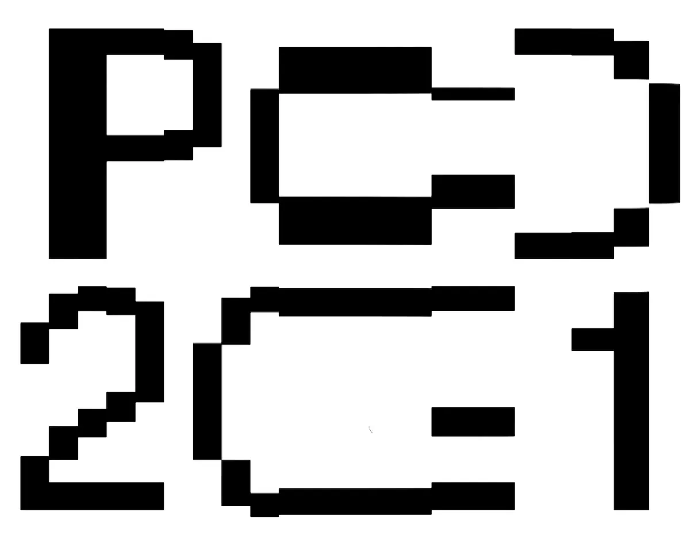

*The key visual element of PCD. \[**Image description**: A black and write, very pixelated graphic that says “PCD 2021.”\]*

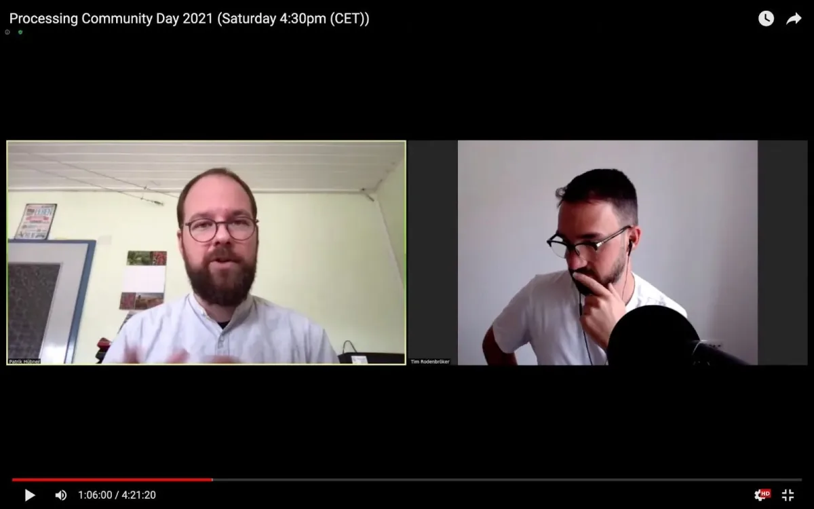

*A screenshot of my virtual conversation with Patrik Hübner for Processing Community Day in 2021. \[**Image description**: A split screen showing livestream of Patrik Hübner and Tim Rodenbröker in conversation with one another.\]*

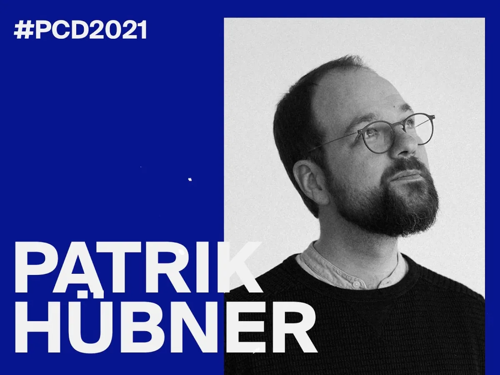

*Marketing image for Patrik Hübner’s talk as part of Processing Community Day, 2021. \[**Image description**: A black-and-white headshot of Patrik Hübner, which appears to the right of a bright blue background. The name “Patrik Hübner” is overlaid across the image, and “#PCD2021” appears at the top.\]*

Patrik Hübner was the first speaker. He’s one of my closest friends and lives in the same city as me. We more or less started creative coding at the same time. He is now enormously successful as a freelancer in this field, and shared how he uses generative design as a solution for dynamic branding and data-driven storytelling.

You can watch Patrik Hübner’s talk [here](https://youtu.be/G2D_X5cQq2M).

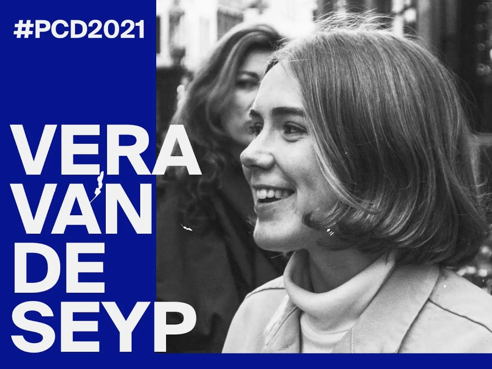

*Marketing image for Vera van de Seyp’s talk as part of Processing Community Day, 2021. \[**Image description**: A black-and-white headshot of Vera van de Seyp, which appears to the right of a bright blue background. The name “Vera van de Seyp” is overlaid across the image, and “#PCD2021” appears at the top.\]*

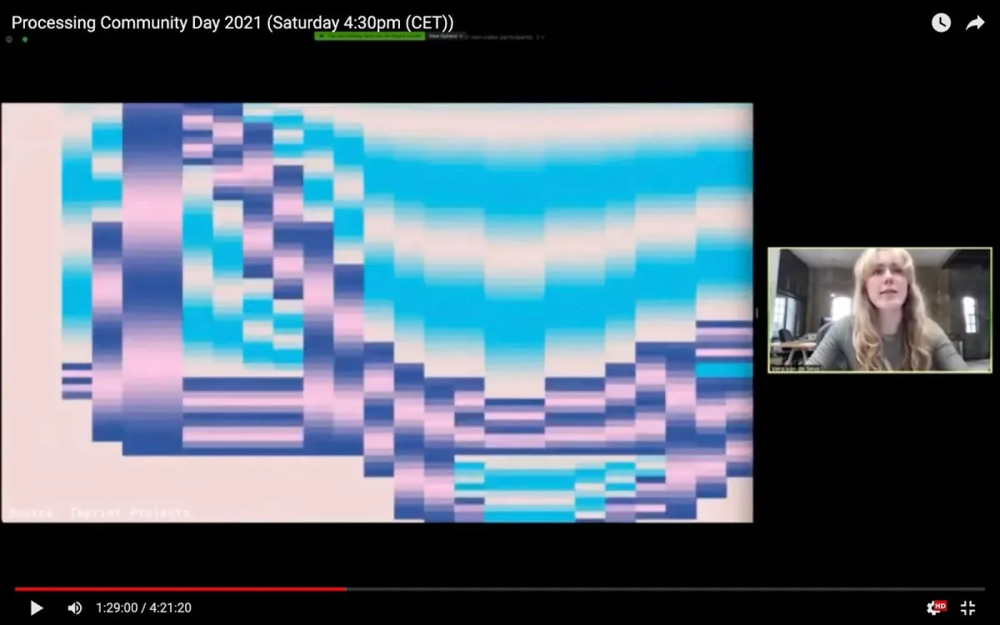

*Vera showcasing some amazing work as part of her Processing Community Day 2021 talk. \[**Image description**: A screenshot showing a livestream of Vera van de Seyp to the right, and an example of her creative coding work on the left.\]*

The second speaker was Vera van de Seyp, who I met at Dutch Design Week in Eindhoven. She is a fascinating and charismatic woman who creates inspiring work with a combination of strong technical skills, enormous creativity, and a refined aesthetic sensibility. She now teaches at the Koninklijke Academie van Beeldende Kunsten (KABK) in The Hague, and I believe that she is a great idol for her students.

Watch Vera van de Seyp’s talk [here](https://youtu.be/e8A7qx_8Rwg).

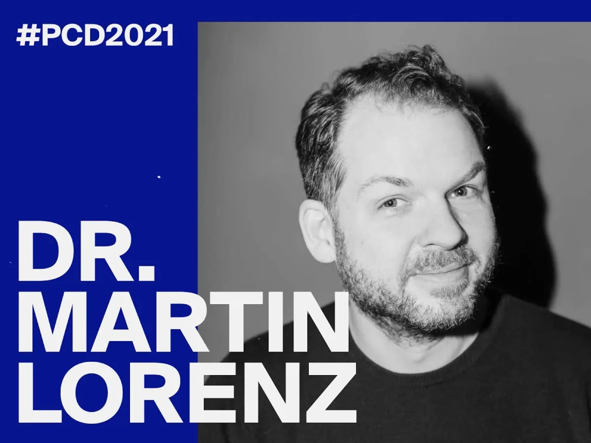

*Marketing image for Dr. Martin Lorenz’s talk as part of Processing Community Day, 2021. \[**Image description**: A black-and-white headshot of Dr. Martin Lorenz, which appears to the right of a bright blue background. The name “Dr. Martin Lorenz” is overlaid across the image, and “#PCD2021” appears at the top.\]*

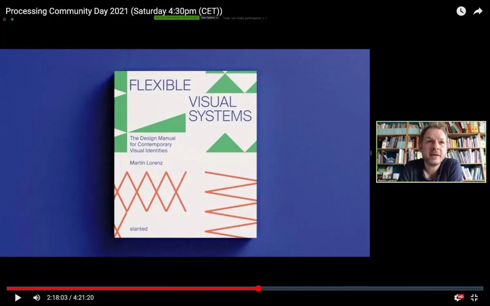

*Martin presenting his book, *Flexible Visual Systems*, available at Slanted Publishers, as part of his Processing Community Day 2021 talk. \[**Image description**: A screenshot showing a livestream of Dr. Martin Lorenz to the right, and an image of his book on the left.\]*

Dr. Martin Lorenz was speaker number three. For many months, I have had an enriching exchange about workshop ideas and online teaching with him. I knew of his work as a graphic designer even before I started my studies in 2008, and I am proud to call him a friend today. In my view, his soon-to-be-published book, *Flexible Visual Systems*, fills the big gap in theory between classical graphic design and creative coding.

Watch Dr. Martin Lorenz’s talk [here](https://youtu.be/jVyFof8gw4k).

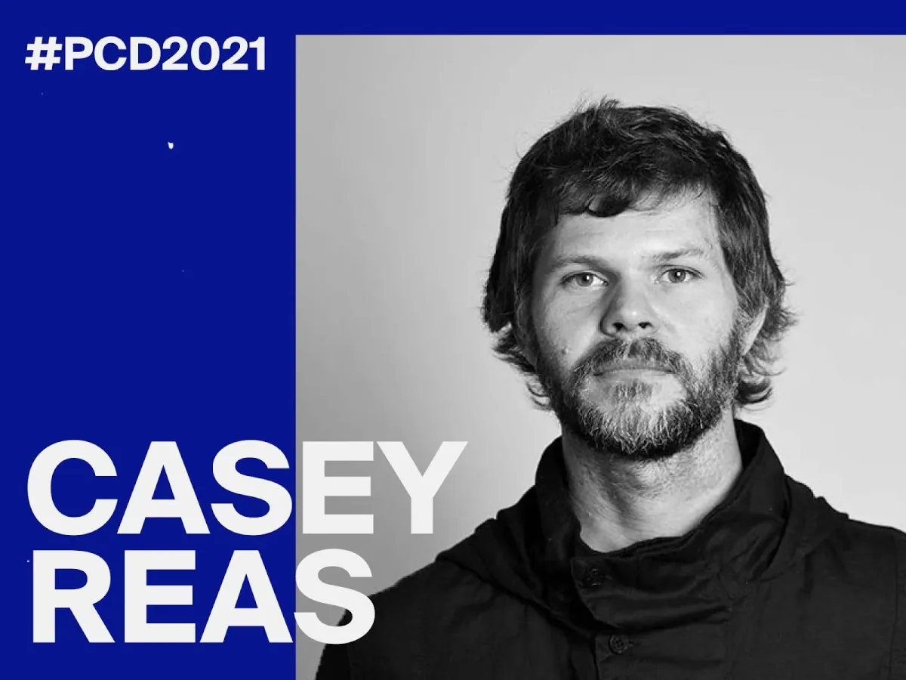

*Marketing image for my interview with Casey Reas as part of Processing Community Day, 2021. \[**Image description**: A black-and-white headshot of Casey Reas, which appears to the right of a bright blue background. The name “Casey Reas” is overlaid across the image, and “#PCD2021” appears at the top.\]*

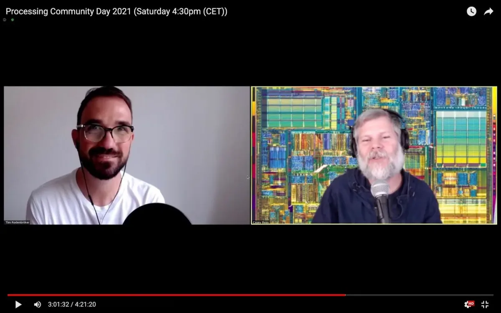

*A magic moment: Me talking to Processing co-founder Casey Reas as part of the Processing Community Day 2021. \[**Image description**: A split screen showing livestreams of Tim Rodenbröker and Casey Reas in conversation with one another.\]*

After Martin’s talk, I interviewed Casey Reas. We talked about the history of Processing and he shared a lot of personal insights. I am very impressed with how much dedication and passion he and the other members of the Processing Foundation have put into their many projects over the past years. Prior to this event, I saw Casey as a celebrity of sorts — one that you could never get close to. On August 21, he sat in front of me and complimented me on my work. That was a magical moment that gave me tremendous encouragement to continue on my path.

Watch my interview with Casey Reas [here](https://youtu.be/obzuaPSk3V8).

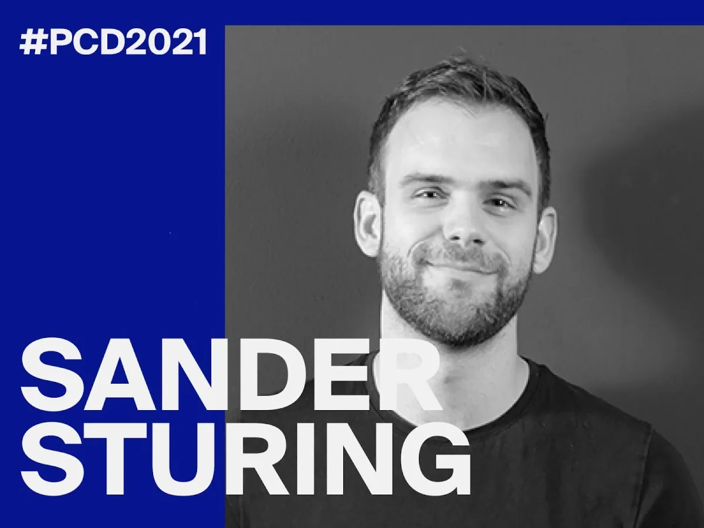

*Marketing image for Sander Sturing’s talk as part of Processing Community Day, 2021. \[**Image description**: A black-and-white headshot of Sander Sturing, which appears to the right of a bright blue background. The name “Sander Sturing” is overlaid across the image, and “#PCD2021” appears at the top.\]*

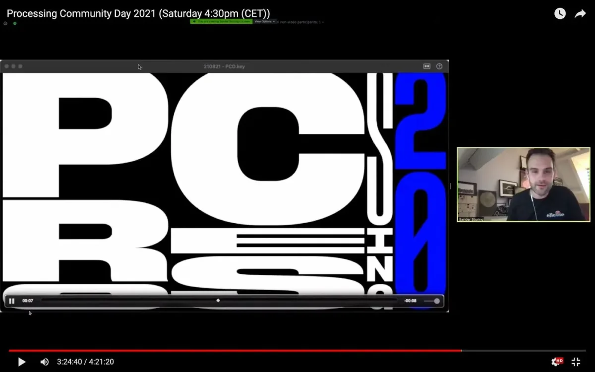

*Sander showcasing work by Dutch design practice Studio Dumbar as part of the Processing Community Day 2021. \[**Image description**: A screenshot showing a livestream of Sander Sturing to the right, and an example of his studio’s work on the left.\]*

To top it off, Sander Sturing gave an inspiring presentation about his work as a creative coder at the internationally renowned Studio Dumbar. This talk was super inspiring as it made visible how Processing can be used concretely — for branding and client projects.

Watch Sander Sturing’s talk [here](https://youtu.be/JcFqId-yyeg).

I am incredibly grateful that I can now make a living from my work as a community builder and educator. Events like Processing Community Day 2021 are the fuel that give me new energy for upcoming challenges. And who knows, maybe this pandemic will be over soon and we can continue our work and community in real life.

I would like to take this opportunity to thank everyone involved in the development of Processing Foundation projects. Your work has enriched many lives.

Watch all the talks on one page [here](https://timrodenbroeker.de/pcd2021/).

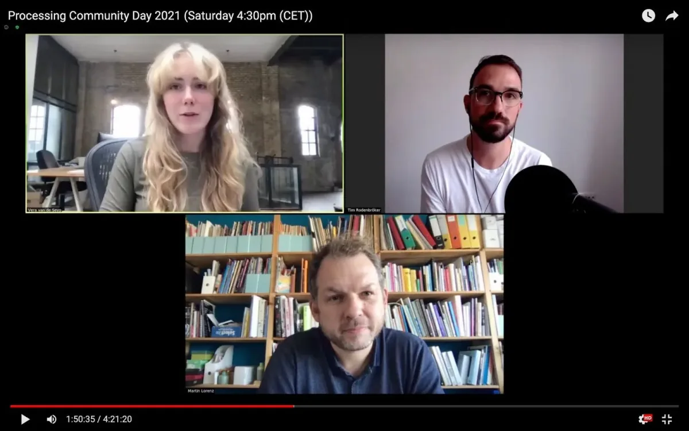

*Tim Rodenbröker in conversation with Vera van de Seyp and Dr. Martin Lorenz. \[**Image description**: A screenshot showing three livestreams of Vera van de Seyp, top left, Tim Rodenbröker, top right, and Dr. Martin Lorenz, bottom.\]*
