> *October 21st, MIT Media Lab, Cambridge, MA  
> *[day.processing.org](https://day.processing.org)

Processing Community Day is a day to come together, celebrate, reflect, and look forward. [Processing](http://processing.org) is free, open source software that lets people code visuals, animations, and interactions. Processing Community Day will bring together members of the community to discuss work, share ideas and experiences, and promote outreach to new members, particularly those who are underrepresented in creative and technological fields.   
[You can register here!](https://day.processing.org/)

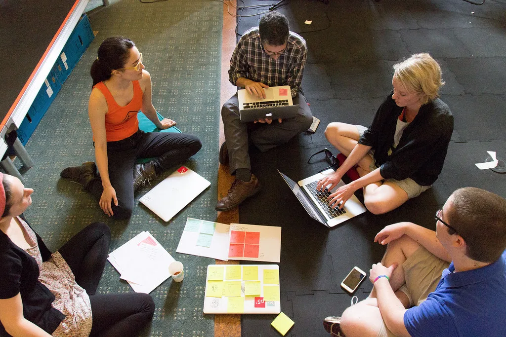

*p5.js Contributors Conference at the Frank-Ratchye STUDIO for Creative Inquiry*

#### Details

Doors open at 9:30am on Saturday, October 21. Scheduled events will take place from 10am to 5pm, with after party until 8pm. Events will include: A live coding workshop with [Daniel Shiffman](http://shiffman.net/videos/), an information design workshop with [Fathom](https://fathom.info/), talks by Processing board members and fellows, lightning talks, community workshops, and group lunch.

Cost of attendance will be $20 per person, $15 for those under 18. The ticket includes lunch and refreshments. There are also scholarship tickets for anyone in need or special circumstances. Please contact *day@processing.org* if you have any questions.

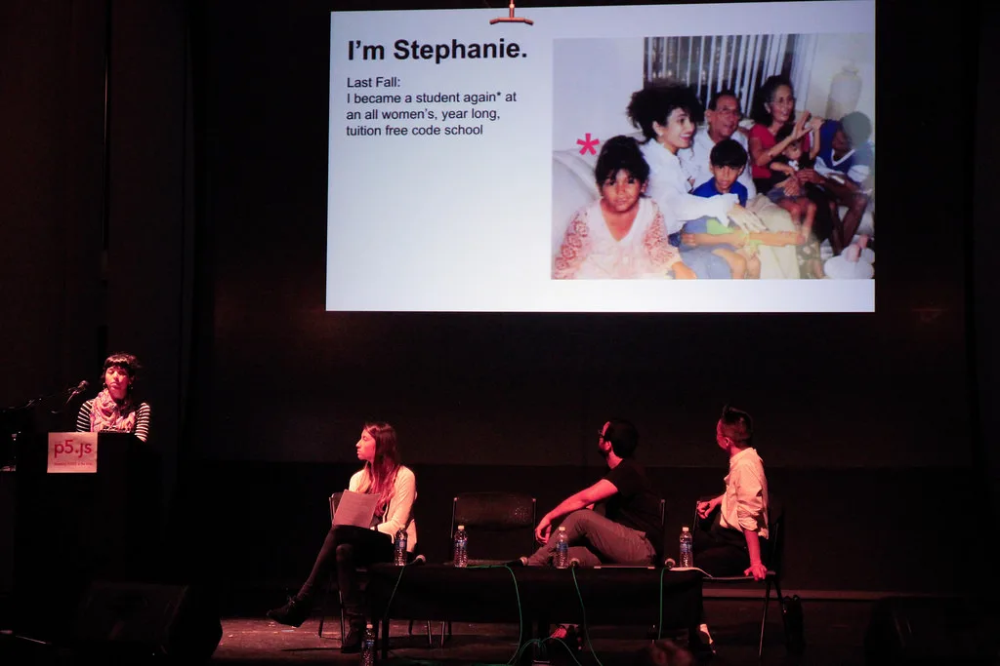

*[Stephanie Pi](https://pibloginthesky.wordpress.com/), p5.js Contributors Conference at the Frank-Ratchye STUDIO for Creative Inquiry*

### The general theme is “convening for the first time.”

This theme has two meanings: It applies to the day itself as this is the first Processing Community Day. It also applies to Processing, which allows people of all skill levels to be introduced to programming and graphics, often for the very first time.

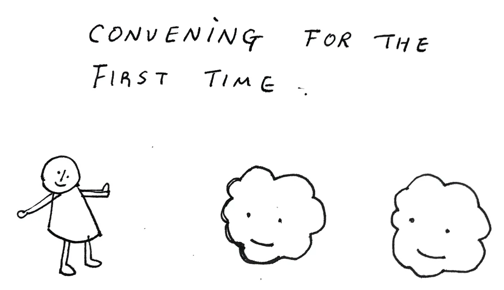

October 21st marks the first ever Processing Day in 16 years. We’ll be celebrating the community behind the project, as well as the Processing software itself and the range of projects that have grown from it.

### Why ‘Community’ day?

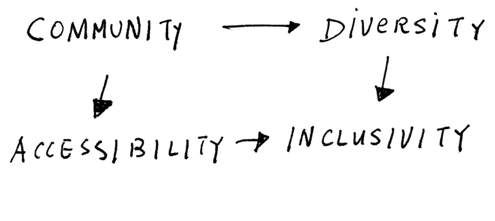

This is a day-long event for anyone and everyone interested in creative computing, software literacy, accessibility, and diversity in the fields of art, technology, and design. The event will be a mix of talks and demos by people from *all* backgrounds within the Processing community, as well as the Processing Foundation members, Fellows, and others who use Processing, p5.js, or related variants in their work.

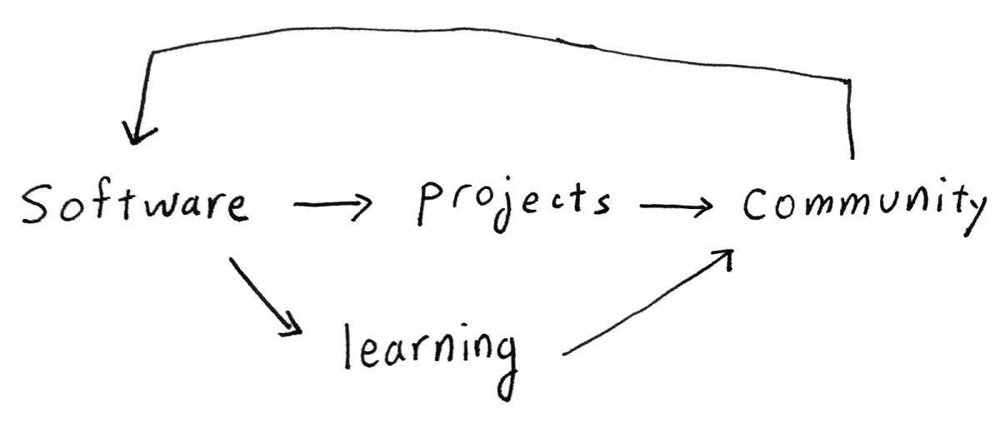

Processing software is used in many art, design and technology projects and learning environments, which both constitute a community. Processing is a popular software used by creatives; we want Processing Community Day to be about bringing the community together, and about bringing the community back to the software.

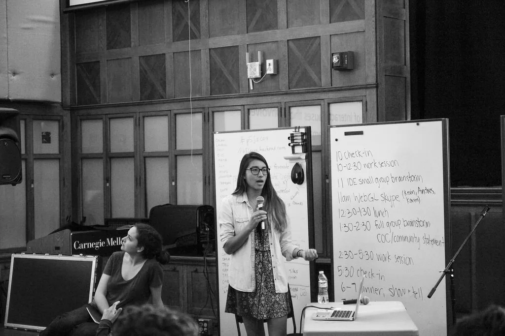

*[Maya Man](http://www.mayaman.cc/), p5.js Contributors Conference at the Frank-Ratchye STUDIO for Creative Inquiry*

### Topics

1.  **Code and platform  
    **Core developers of Processing will share updates on the codebase and framework. Ben Fry, Casey Reas, and Lauren McCarthy will share their vision for Processing and p5.js for the next five years, including foreseeable challenges and goals. Processing Foundation Fellows will showcase highlights from their research.
2.  **Collaboration and community  
    **What is the significance of open source toolkits and communities today? These topics can be contextualized by art history references for collaborative projects and for tool makers. We will hear from esteemed scholars about [Black Mountain College](http://press.uchicago.edu/ucp/books/book/chicago/E/bo18291671.htmlhttp://press.uchicago.edu/ucp/books/book/chicago/E/bo18291671.html), Buckminster Fuller, and queerness & computing.
3.  **Inclusivity and diversity  
    **What is the meaning of inclusivity and diversity for Processing and online communities? Johanna Hedva, director of advocacy at Processing Foundation, will organize a workshop about the best-practice strategies for cultivating online communities that forefront diversity. We will also hear from practitioners who are pushing the boundaries of accessibility on how we can use Processing to introduce computing to people with different abilities.

### Why?

Processing Community Day is a day about the people and projects that have come out of Processing instead of focusing mainly on the software.

It will be mostly about meeting people in real life,

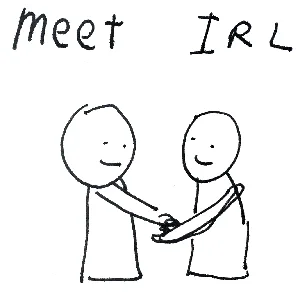

making new friends,

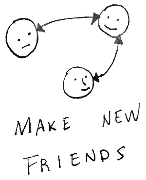

and make things together!

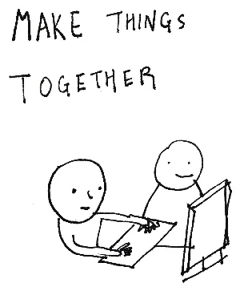

Processing Community Day is a community-focused, volunteer-driven event. This year’s Processing Community Day is directed by [Taeyoon Choi](http://taeyoonchoi.com) who’s on the Board of Advisors at the [Processing Foundation](https://processingfoundation.org). Processing Foundation is a non-for-profit organization that operates with donations from Processing users. In the spirit of open source, we are hoping to make the day as participatory as possible.

#### We need your help to realize this event. We are looking for Contributors, Activators, and Connectors!

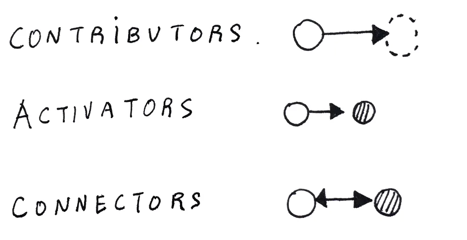

[Application](https://goo.gl/forms/n5Qn17QJ5jdodyr92) to contribute.

Contributors are those who directly contribute by providing content or sharing experience through a demo or lightning talk. Contributors can also help by sponsoring the day, which will go directly to offering scholarship tickets.

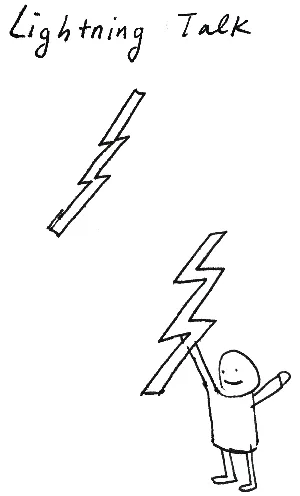

Activators bring energy to the spaces they are in, promoting community and inspiration. Activators will create enthusiastic energy about the event, before and after the day.

Connectors are those who introduce different types local communities, young and old, far and near, to Processing Community Day and invite them to learn with Processing.

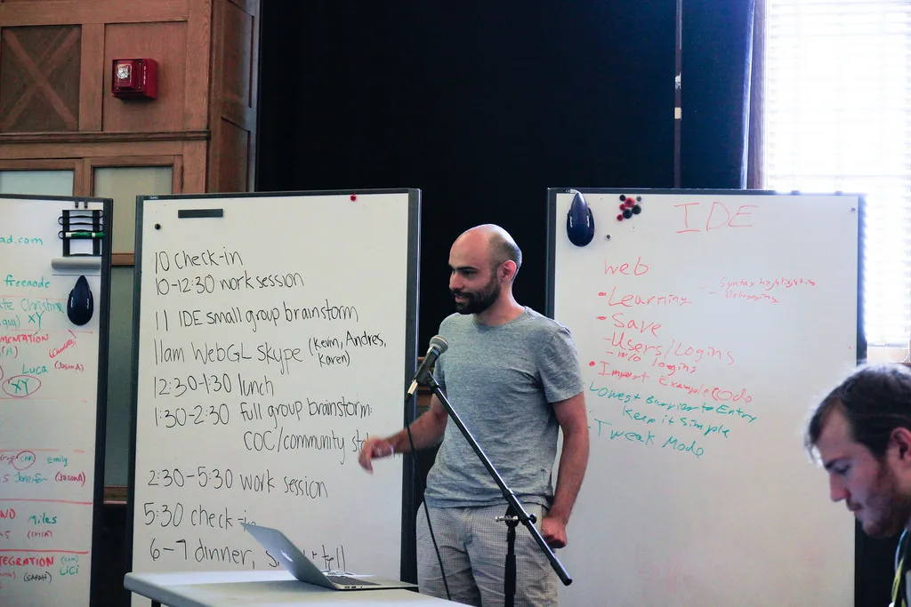

*[Sepand Ansari](http://sepans.com/), p5.js Contributors Conference at the Frank-Ratchye STUDIO for Creative Inquiry*

Consider applying to give a five-minute lightning talk about cool things you made with Processing or demonstration of your project! We are looking for projects that are made with Processing, p5.js or Processing.py, but are open to related topics and tools. You can also contribute by inviting your community, family, and friends to the event.

[Apply to contribute!](https://goo.gl/forms/n5Qn17QJ5jdodyr92)

We hope to see you there!

---

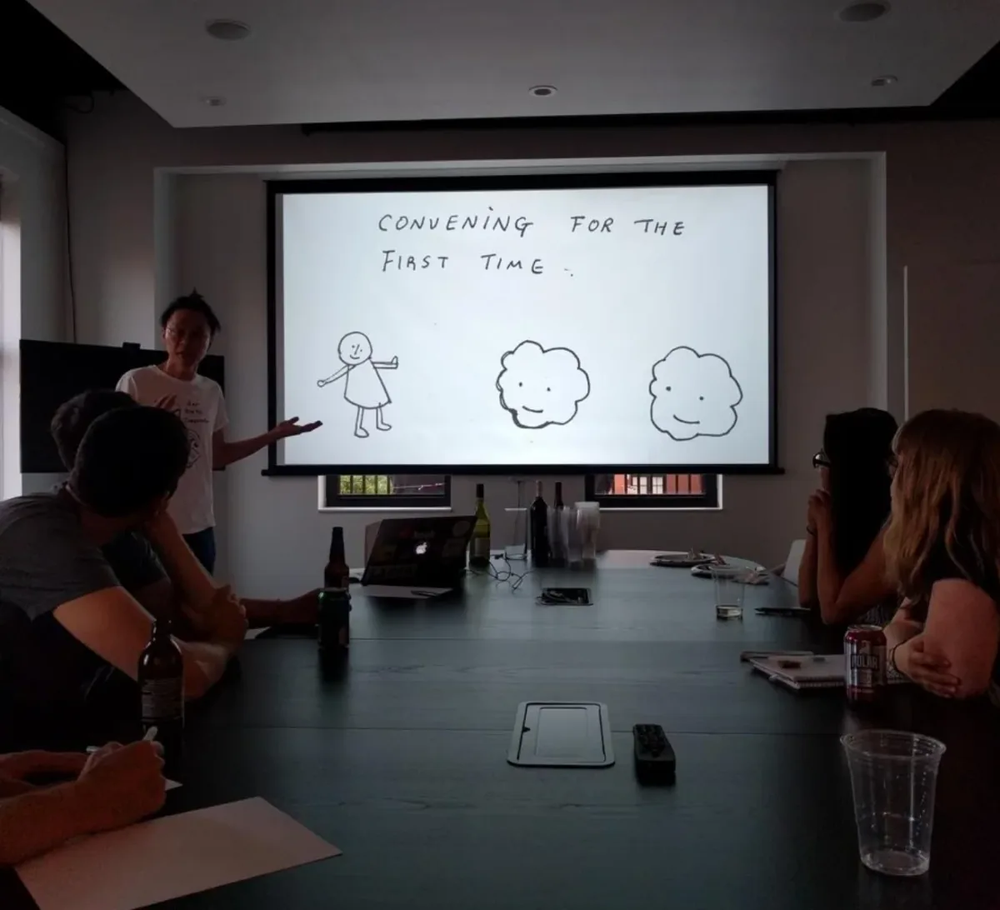

Processing Community Day Planning Meet-up at Fathom Information Design on August 1st.

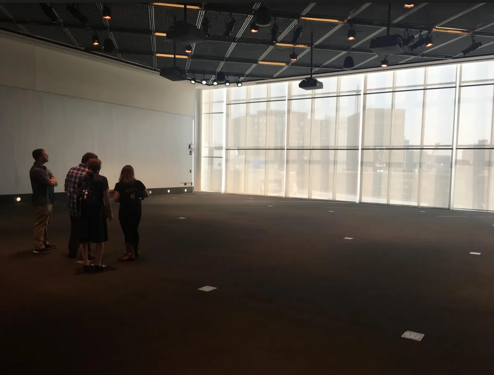

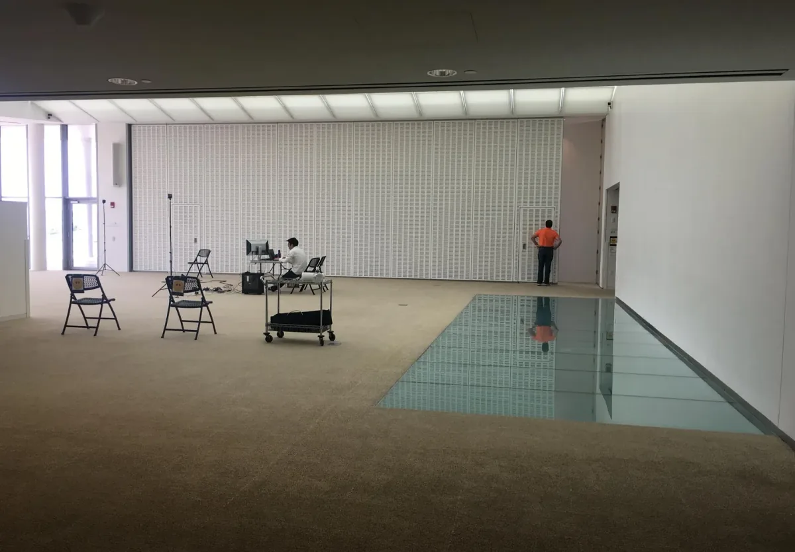

Site visit to [MIT Media Lab](https://www.media.mit.edu/). This is where the Processing Community Day will happen!

Photographs from [p5.js contributors conference](https://p5js.org/contributors-conference/) and drawings by Taeyoon Choi.
