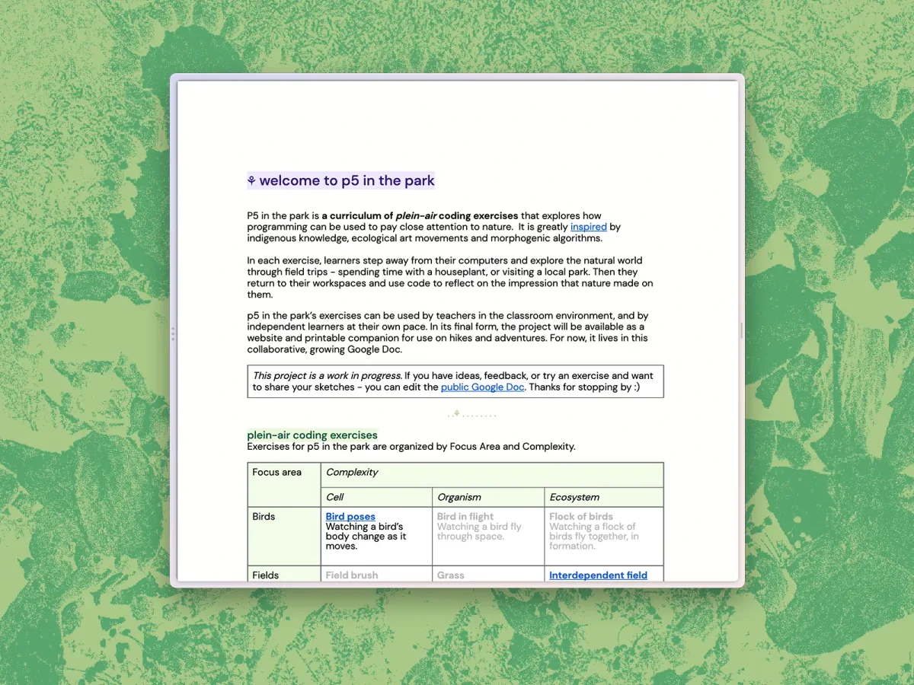
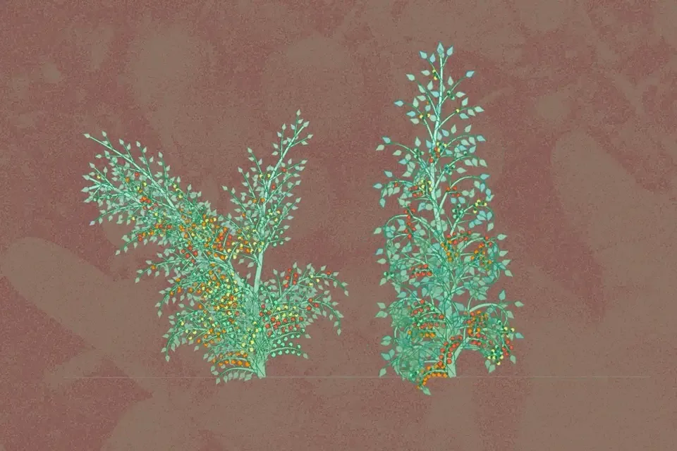
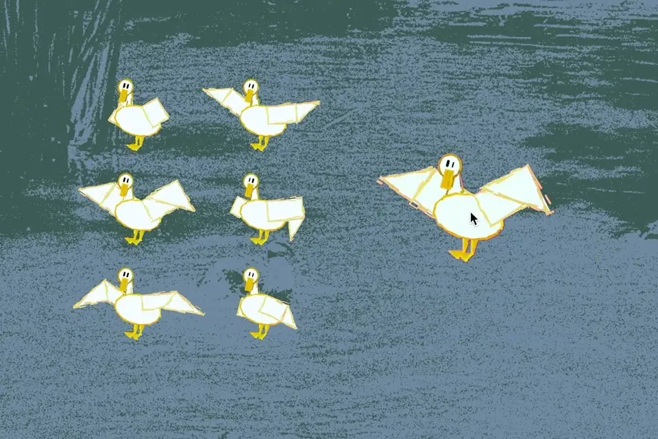

#### **Tell us about yourself.**

My name is Bhavik, I’m a designer and developer creating software that brings people close to themselves, their communities, and the natural world. I often work in collaboration with other artists, technologists, and the environment through my studio, ‘soft networks’.

I’m originally from New Delhi, India and I currently live in New Haven, Connecticut on Quinnipiac lands at the base of East Rock. As I write this, colorful fall leaves are drifting off my neighborhood’s oak trees. It’s my favorite time of year to sketch outdoors, as the bare branches make it easier to observe the fractal and emergent structure of plant growth.

#### **What was your Fellowship Project?**

My project is called, “p5 in the Park’’. It is a syllabus of exercises exploring how programming can be used to pay attention to nature. In each exercise, learners are encouraged to step away from their computers and go on a field trip — like visiting a park, or tending to a houseplant. After being immersed in the natural world, they return to their computer and use p5.js to reflect on the impressions it left on them.

Spending more time online, I felt disconnected from my local ecologies and yearned for ways to reconnect with the natural world. I found inspiration in the words of Robin Wall Kimmerer who says, “Paying attention is a form of reciprocity with the living world, receiving the gifts with open eyes and an open heart.” I was excited by exercises in Bruno Munari, “Drawing a Tree” and “The Algorithmic Beauty of Plants” that gave me tools to see plants in new ways. I began to wonder if technology could bring us closer to nature, rather than separate us from it.

My fellowship has allowed me to take the first steps to answer these questions. The project is currently in its early stages at [p5inthepark.com](http://p5inthepark.com). It is currently a few exercises across skill levels and a few sample sketches. For now, the project is most useful to educators that are looking for a new exercise to include in their classroom environments. I plan to keep working on the syllabus to make it more useful to independent learners, as well as publish it as a physical zine for people to take with them on hikes.

**Two generative tomato plants grow, set against the memory of a bountiful tomato harvest in New Haven, Connecticut. Each digital plant represents a different perspective on the same real world plant in the* author’s *backyard.**

#### **What were the challenges that you encountered while doing your project?**

My biggest challenge was balancing my initial scope of the project with where the fellowship naturally took me.

I was initially hopeful that the syllabus would be accessible to first time coders who wanted to learn p5.js on their own — similar to [Happy Coding](https://happycoding.io/). Accordingly, I spent a lot of time writing exercises that introduced functions, variables, and other coding concepts. I did a lot of research on where people first get stuck with programming, and tips to help them through their first errors. Instead of thinking about which plants were fun to look at closely, I started ignoring more complex plants because I thought they’d be too challenging to capture for beginners.

Over time these areas of focus began to take up most of my time, leaving less time for me to actually connect and learn from my environment. My mentor, Angi, helped me out of this tension. She recommended I lean into the strengths of this particular syllabus, building relationships with plants through code. She helped me realize that I could start with a smaller audience, like more seasoned programmers and educators for now, and expand audiences over time.

Overcoming this challenge was critical for me. It helped me be less focused on technology, and refocus myself on the joy and wonder of letting nature guide my process. I began to spend more time outdoors, and less time combing through computer science education research — which felt like the right priority for this project.

#### **What are some of the joyful moments that you encountered while doing your project?**

About halfway through the project — I realized that the best ideas I had for exercises came to me when I was inspired by nature. From that point on I decided to work on the project outdoors whenever possible. I felt that if I was going to encourage learners to step away from their computers, I should practice that myself, too in the creation of the syllabus. This meant taking a lot of very long walks and recording voice notes, bringing my laptop to my local park and going on hikes with a sketchbook.

A lot of my favorite ideas for exercises came from encounters I had on these field trips. “[Bird poses](https://docs.google.com/document/d/1BKgQStaX0fKoP5y0O_DygadjVsKPInS3CKWe-H0LAO4/edit#heading=h.sl4k99bentac)” was inspired by a sassy duck that would angrily flap its wings when I looked her way. “[Branching structures](https://docs.google.com/document/d/1BKgQStaX0fKoP5y0O_DygadjVsKPInS3CKWe-H0LAO4/edit#heading=h.qi5wkwo5f71h)” was motivated by a particularly sparse, tall Eucalyptus tree that was growing just outside my front door. “[Growing bouquet](https://docs.google.com/document/d/1BKgQStaX0fKoP5y0O_DygadjVsKPInS3CKWe-H0LAO4/edit#heading=h.rtsn9dguompp)” was inspired by a tomato plant that grew in my backyard, who I watered and harvested over the summer.

Encountering these moments, and sharing them with my mentor, friends, and now in the syllabus are some of my most joyful moments during the project. Through this process I not only got better at p5.js and writing a curriculum, but also at paying attention to my local ecology. It enabled me, with technologies of seeing and recording, to build meaningful relationships with non-human life around me.

**Generative duck sketches are set against the memory of a lake in Douglas Park, California. One sketch is an interactive duck that responds to mouse hovers with a sassy and intense wing flapping.**

#### **What are words of wisdom you would have for future fellows?**

The fellowship is such an amazing experience, and I’m so thankful for the opportunity. My biggest surprise was how quickly it comes and goes. At first I was overly ambitious about what I could accomplish and this occasionally led to some stressful moments. For future fellows, I’d definitely recommend thinking about the fellowship as the planting of an initial seed, rather than time to grow a full forest. I, for example, am really grateful to have had the dedicated time to work on p5 in the park and plan to continue expanding it for many years.

*Bhavik Singh is a Sikh artist and technologist from New Delhi, India. His work, a gentle tapestry of social software, creates space for small groups to slow down and intimately express themselves. Bhavik enjoys working with a permeable network of collaborators ranging across artists, technologists, activists, and nature. He is currently working on ‘soft networks’, an exploratory design and development studio imagining alternative futures for community technology.*

*Bhavik has been a designer at Google, a member of NEW INC at the New Museum, and has taught at the Cooper Union School of Art and at Hunter College, CUNY. His work is used by people all over the world every day and is featured in Art in America, Wired, the Verge, and more. He often takes long walks and spends time looking closely at trees.*

*website: softnet.works ⚘ email: hello@softnet.works, github.com/soft-networks*

*Follow Bhavik on* [twitter](http://twitter.com/soft_networks) *and* [instagram](http://instagram.com/soft_networks/)*.*
