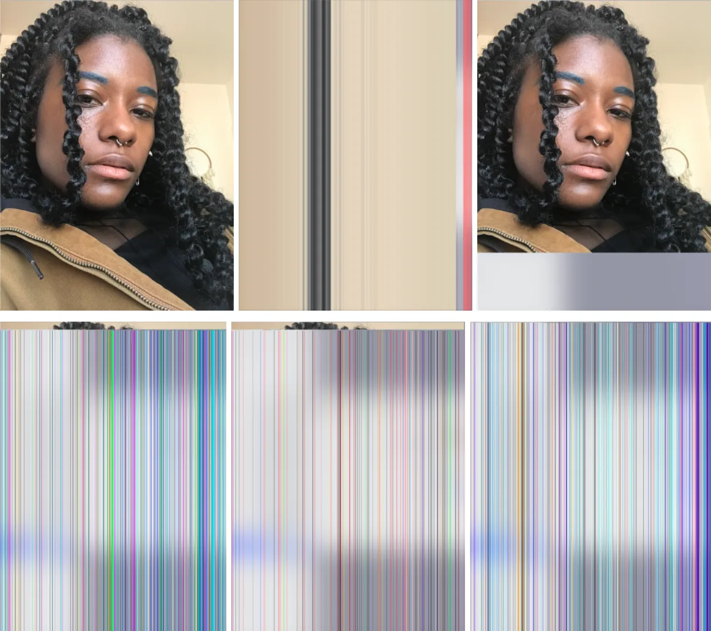
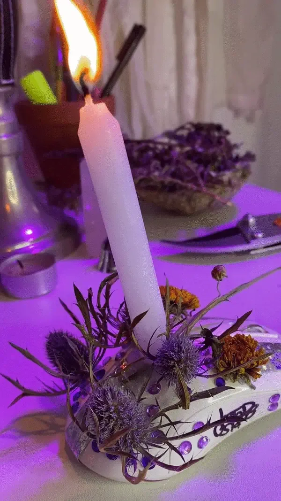
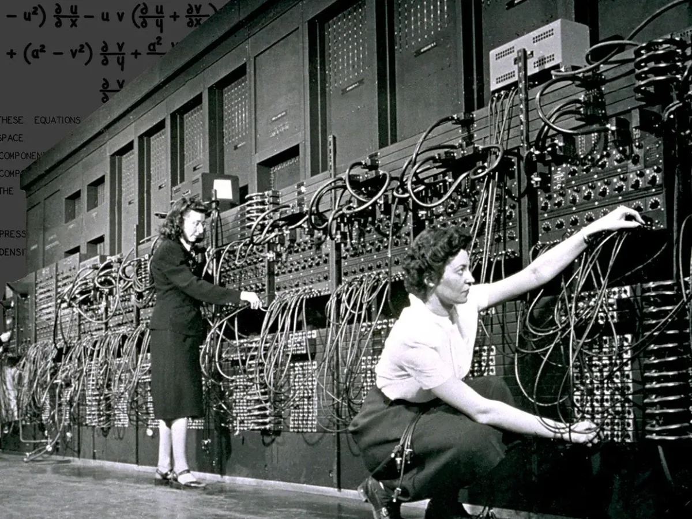

For the sixth year of our annual Fellowship Program, we aimed to better support the new paradigm of remote and online contexts and socially distanced communities. We asked applicants to address at least one of four Priority Areas that, to us, felt especially important for finding ways to feel more connected right now: Accessibility, Internationalization, Continuing Support, and AI Ethics and Open Source. Additionally, we sponsored four Teaching Fellows, who developed teaching materials that will be made available for free, and are oriented toward remote learning within specific communities. We received 126 applications and were able to award six Fellowships, with four Teaching Fellowships. We are excited to note that this is our most international cohort ever, with Fellows based in Australia, Brazil, India, Mexico, Philippines, Switzerland; and in the U.S. in California, Portland, and New York. Over the next few weeks, we’ll be posting articles written by the fellows, or interviews with them, where they describe their projects in their own words. For an archive of our past Fellows [click here](https://processingfoundation.org/fellowships), and to read our series of articles on past Fellowships, [click here](https://medium.com/processing-foundation/https-medium-com-tag-pf-fellowships-la/home).

---

*[Cy X](https://cyberwitch666.com/) (they/we) is an energy worker, earth tender, and cyber witch working within the realms of sound, video art, performance, rituals, and care work. Their Fellowship project is [PORTAL.WEB](https://cyberwitchcoven.com/), a cyber witch coven that reimagines our cyber powers through the use of emerging, Indigenous, and ancestral technologies. We seek not to establish a hierarchy of technologies but rather to work with cyber witch practices in a way that intimately engages our own radical imagination, ancestral knowledge, and inner-knowing. \[**Image description**: Cy, a dark skin agender person, is sitting on the floor wearing a pierced light grey halter top and bottoms while holding a lightly lit piece of paper of something they’d like to release. In front of them is a candelabra with five white lit candles, crystals, and an abalone shell. The ritual video is framed by the image of a dessert and words on the bottom of the screen that reads “Release the myth of independence that restrain me from seeking help.”\]*

As humans, we have been searching for meaning perhaps as long as we’ve been on this Earth, seeking through art-making, movement practices, religious practices, and intimate connections. Can you think of a time where you felt the edges of yourself expand and connect you to something greater? Some people have this moment while dancing in unison with friends and strangers at a techno rave, tapping into the collective energy of the space and everyone in it becoming one. If you ever went to Church, maybe you’ve felt moved and one with both God and everyone through the process of a group of people singing the same song in unison. For some like me, I find this connection through the intentional engagement in magic and ritual practices, consciously and at-will tapping into an energetic space when needed and desired.

As an energetic herbalist and witch, I work to cultivate relationships with the plants around me, communicating with them and aligning myself with respect. My mentors have taught me how to ask a plant permission before harvesting it, and how to give offerings to the plants around me in reverence. I have learned that tending to other-than-human beings is a legitimate relationship built with love and care. Although you can perform magical spells with only yourself, often I incorporate many things around me, such as candles, water, and plants. These things work alongside me to produce a desired change in my spiritual and material world. Instead of seeing them as a means to an end, for me they are active characters with their own unique personalities and energetic qualities, expressing their own reflection of the Source Energy (which some may call Divine Energy, Light, Soul, Lifeforce, etc.) that we are all derived from. If we can have this relationship with plants, the waters around us, and fire burning in a candle on the altar, then perhaps we can also have it with our computers, cellphones, the Internet, and beyond. What would it look like to intentionally communicate with the spirits of the silver, gold, and palladium found in our devices? What offerings could we give to our computers to show reverence so that we can better be in tune with them? Today, many of us associate our laptops and smartphones and the software on them as the archetypal form of technology, and while this is true, they are just one form, the most current iteration of technology. Technology exists outside and beyond our devices too.

I engaged in intentional magical practices before I ventured into a path of creative technology; at first I thought there was no relation between the two. I was trained to see my work as an herbalist as being in tension with the technological work I was doing. But as I began to build deeper relationships with the hardware and software around me, I instinctively began to call myself a “cyber witch.” The identity was one that felt channeled from above, received through deep listening, and sent as a task to move me toward embodying the fullness of what a cyber witch was and could be.

*\[**Image description**: Six images in a grid that begins with an image of Cy, a black agender person with long black twisted hair, getting progressively glitched until you can no longer recognize them.\]*

And what was more magical than using symbols, code, and energy to build entirely new worlds that also altered me, the environment around me, and those who experienced it? It felt just as magical as the spells I did with plants and other elementals, which produced profound effects. When I started implementing magic into my own cyber artforms, in projects like [Portal Open](https://cyberwitch666.com/Portal-Open), [Ritual for Release](https://vimeo.com/482427383), and [Black Projections Project](https://cyberwitch666.com/Black-Projections-Page), I was pleasantly surprised to find deep intention, focus, and energy work as I chose materials for portal devices, created sounds to guide me through ritual, and crafted code to create glitches. There was a sense of inner knowing even as the results propelled me to places beyond the limits of my imagination and beyond my own work. Over the years, I have been deeply moved by the digital realm, finding my way toward other portals that shifted my understanding of how this world functioned, as new worlds opened and revealed themselves. The digital realm is a visceral and profound convergence of where the imagined (virtual) meets the material: through enacting queer fantasies through digital avatars before being “out,” to experiencing full erotic embodiment from cyber sex activities, and using glamour magic online (posting a selfie for the algorithm) to direct the necessary attention my way.

> I have been deeply moved by the digital realm, finding my way toward other portals that shifted my understanding of how this world functioned, as new worlds opened and revealed themselves.

Despite this feeling of agency that tech brings, we often call our hardware and software “magical” because it’s difficult for us to fully understand their complexities, algorithms, and materialities — how they work feels occluded, which shares its root word with “occult.” In other words, emerging technologies are often elevated to a magical state simply because they feel inaccessible to the mind (think: virtual reality, machine learning, augmented reality — how these feel too complex, at times, to grasp). It makes me think of this quote, from Lisa McSherry’s essay, “What Is a Cyber Coven?”:

*“As humans \[we\] use our tools of technology and often have no idea how they work. For example, how is it that your computer understands that a particular keystroke is equivalent to a specific symbol? For a cyber witch, this lack of direct knowledge makes the process of writing a letter on the computer a potentially magickal experience. The logic of technology has become invisible — literally, occult.”*

What McSherry is describing, however much it makes intuitive sense, feels troublesome to me because the conflation of a “*lack of knowledge”* with a confusion about our technology is often an intentional part of its design. It is produced by those in power at tech corporations, to purposefully exclude others from knowledge about how the tech works. The lack of access is a product of gatekeeping and proprietary tools. I’m not advocating that we must know all the ins-and-outs of all of our technological systems, such as how the computer understands a particular keystroke, but it feels important not to have magic and technology be conflated because of an apparent lack of autonomy and control — because so much of magic is *about* intention.

Magic is also about *change*. These two things—intention and change—can and do exist simultaneously. Occultist Aleister Crowley is often associated with linking these two together through his definition of magic as the “the science and art of causing change in conformity with the will,” and many more arrived at a similar ideology before him. My energy-work mentor describes this kind of change as remembering both that the material world can impact the spiritual world (some call this the inner world), and that the spiritual world can impact the material world. We can see this through the simple act of blowing out a candle and making a wish on our birthday. There’s the spiritual or symbolic act of blowing out the candle, the wish as the intention, and the goal of having the spiritual act manifest changes in our physical and material world. It is this belief in change that drives me as a witch to do the work that I do, because it serves as a reminder that we *can* do the work—be it magical, spiritual, symbolic, or all of the above—of changing our current realities and futures.

*\[**Image description**: An animated gif of a computer mouse covered in flowers, jewels, symbols, with a lit white candle embedded in it.\]*

Let’s look at how we understand what technology is and can be. Considering the etymology and historical meaning of technology, Jon Agars, in “What is technology?” states that at one point it meant “knowledge of how to make things that would otherwise not exist.” Agars traces how its meaning seemed to broaden in the second half of the twentieth century, to range anywhere from cultural or social components, to that of a tool. It is a word with multiple meanings that shift and change over time, becoming redefined as we encounter new tools and new ways of being in this world, such as the way we communicate, how we spend our time, how we move around, etc. Something that feels apparent is again this aspect of change. To me, it seems like technology is also the act of transforming knowledge into new inventions, or using a tool to bring forth new realities.

> Technology is a word with multiple meanings that shift and change over time, becoming redefined as we encounter new tools and new ways of being in this world… Technology is the act of transforming knowledge into new inventions, or using a tool to bring forth new realities.

It must also be said that one of the earlier forms of technology were enslaved people. In the book [Habeas Viscus: Racializing Assemblages, Biopolitics, and Black Feminist Theories of the Human](http://dukeupress.edu/habeas-viscus), Alexander G. Weheliye develops a theory linking race to our understanding of the “human” by describing how racialization disciplines humanity into categories of “full humans, not-quite-humans, and nonhumans.” Within this framework, Blackness designates “a changing system of unequal power structures that apportion and delimit which humans can lay claim to full human status and which humans cannot.” This theory of “human” is precisely what relegated my people to a nonhuman status, to “machines.”

Couple this with the fact that some of our earliest “computers” were women, and we begin to see that the definition of technology has a more insidious history. In World War II, hundreds of women worked as human “computers” to calculate firing tables for soldiers, and some went on to help develop “ENIAC,” one of the earliest fully functional computers. This new technology eventually replaced the women who helped to build it, leading to a systemic issue of women being denied entry into the computer programming field.

*Marlyn Wescoff and Ruth Lichterman, two of the female programmers of ENIAC. Source: Corbis / Getty Images. \[**Image description**: A black and white photograph of two women in front of a room-sized computer. They reach into it, plugging in cables.\]*

Technology has *already* been associated with more than just the machines we commonly use today, like computers, laptops, and other devices. Black and brown people and women have been on the forefront of making things that would otherwise not exist, while also being simultaneously excluded from the generative power that is produced by their inventions. We have been the machines, the computers, the technology. If technology is a word that shifts and changes over time, who gets to decide what is and what is not technology?

Many systems of knowledge are seen as “inferior” or not legitimate to what is considered normative knowledge; due to this *less-than* status, they are not considered to be technology. Thinking of my own Afro-Indigenous ancestral technologies, my mind goes to highly complex divination systems, earth-based rituals, alchemic practices, time bending, and ancestral worship, all of which are rooted in animist practices, a belief system that there is life-force energy in everything. Although many associate Indigenous practices as being of the past, they are *just* as relevant today, and many have shaped some of the current technologies we are using right now.

For instance, binary systems used in West African Vodun and the *I Ching* Chinese divination system inspired the binary system used in modern computers. In his own documentation, the German mathematician Gottfried Wilhelm Leibniz made explicit reference to the *I Ching,* equating the hexagrams and the code of Yin and Yang used there to the 1s and 0s of binary code. The Yin and Yang were a way of understanding and articulating energetic patterns that occur on Earth and in the cosmos, linking this divination system to that of an earth-based practice. In *The I Ching Workbook,* R.L. Wing points out that the early authors of the *I Ching* spent much time observing “the stars and tides, the plants and animals, and the cycles of all natural events” in developing this system. I like to think that perhaps then our electronic devices also carry the cosmos and cycles of all natural events within them as well.

> If technology is a word that shifts and changes over time, who gets to decide what is and what is not technology?

More than our computers and emerging technologies being foundationally rooted in earth-based divination practices in their development, it is important to remember they are quite literally *of* this earth. Think about it. The materiality of our devices include earth-based materials such as crystals and metal that come from the Earth’s crust. Plastic is made from the ancient remains of plants, algae, and other beings from the ocean floor. Even though many of the materials in our devices have shifted from their original form due to alchemic processes, they exist and are from the same landscape that we are part of, both energetically and physically. Moving deeper into an understanding that all of our technologies are earth-based can provide more avenues for how we may interact with them. If we operate from the perspective of animism, that there is life-force energy present in all things, this would also extend to our devices and the materials they are created from.

This tendency toward separating ourselves and our practices from certain forms of technology has been well documented, and was and often still is debated between witches who see witchcraft as being solely a “nature-based” practice. Many have a strict perception of what “nature-based” means; as computer technology was becoming popularized in the late ’90s, some pagan sects criticized its influence or banned technology from their practice outright.

The fallacy of the human-nature divide has been well analyzed over the decades: We are now reckoning with its consequences, namely environmental devastation, an extractive disconnection with the land and each other, and racialized hierarchies of “human.” Following this, I’d like to argue that the machine-nature divide does little to serve us. What do we gain by further separating our machines and technologies from the Earth and from us? How does it inform how we think about them? What drives us to abstract our emerging technologies away from nature, connecting them only in symbolic ways? Think of how many tech terminologies have eco-based names (Amazon, the web, bug, stream, virus, root “folder,” the cloud). What does such symbolism produce, but a distance rather than a closeness?

For my 2021 Processing Foundation Fellowship, I worked on a project that aimed to bridge this divide. [Portal.Web](https://cyberwitchcoven.com/) was born out of a desire to fully understand why we construct the hierarchies and false understandings we do. How many times must we hear about how things online aren’t truly real, how technology is not “natural” and at odds with earth-based practices, how “nature” is something that exists somewhere else away from us that we must travel to? Through venturing deeper into cyber-witch practices, I am asking us to re-evaluate and approach this realm through deep listening and informed, embodied understanding. I want to provide inspiration for us to build magical relationships with the world and the many other-than-human beings that are a part of it.

Over the next year, in further collaboration with The Culture Hub, [Portal.Web](https://cyberwitchcoven.com/) will function as an ongoing research and archival project and cyber coven. Together we will come together to build altars, cast protection spells for digital hygiene, reach new worlds through sound healing, learn about the virtual and physical algorithms, and hack our own internal software through performance, reading groups, shared conversations, and other activations. Through the eradication of false binaries, perhaps we can move closer toward a life full of cyber enchantment and embrace the totality of what is available to us from a holistic magical perspective.

[cyberwitchcoven.com](https://cyberwitchcoven.com/)

---

*Cy X was mentored by* [Johanna Hedva](https://johannahedva.com/)*, Director of Advocacy, Processing Foundation*
