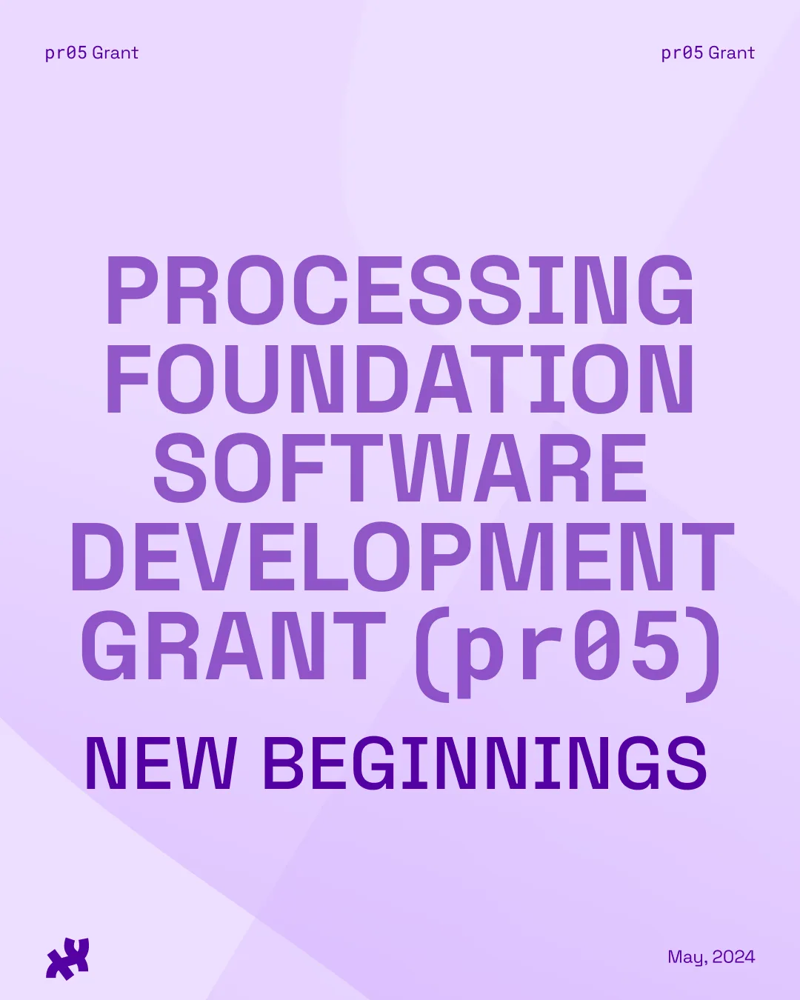

*Processing Foundation 2024 pr05 Grant ‘New Beginnings’ Open Call flier*

[Register for our Grant Info Session #1 here](https://us06web.zoom.us/meeting/register/tZEvfu-rrzotEtcGhtfxEyfLfTRKeTB9hsE4)!

We are excited to announce pr05 (pronounced “pros”), a new grant and mentorship initiative by the Processing Foundation designed to support the professional growth of early to mid-career software developers through hands-on involvement in open-source projects. This is a unique opportunity to grow as a developer while making a tangible impact on software projects used by millions of creatives, artists, educators, and students globally.

Participation in the program is entirely online and we invite developers from around the world to apply. A total of five candidates will be invited to join our 2024 cohort. Selected candidates will receive a $10,000 stipend to allow them to spend 200 hours over a period of 4 months on their contributions.

The topic of this year’s program is ‘New Beginnings’, focusing on supporting projects that will enhance and solidify the [Processing](https://processing.org) and [p5.js](https://p5js.org) ecosystems and help lay strong foundations for their futures.

Besides their technical contributions, Grantees will also join regular cohort meetings and town halls together with our 2024 Fellowship cohort.

[Apply here!](https://pr05.formstack.com/forms/pr05_grant)

#### Who is this program for?

If you are an early to mid-career programmer, coder, developer, or software engineer and are excited about contributing to open-source projects, this program is for you. Our goal is to build a diverse cohort of participants dedicated to enhancing the Processing and p5.js ecosystems, while enriching their professional journey.

**Eligibility:  
**Open to U.S.-based and international applicants. Only one application per person. Groups, collectives, and organizations cannot apply as the grant is offered to individuals.

#### Project Focus

Participants will choose from a predefined list of projects that can be completed under mentorship. In the spirit of our first program’s theme ‘New Beginnings’, we have assembled a curated list of projects selected for their potential to solidify and expand the foundations of Processing and p5.js. Each project will be mentored by a developer/contributor experienced in this specific area.

Please read the [2024 Projects List](https://github.com/processing/pr05-grant/wiki/2024-Project-List-for-%60pr05%60-=-Processing-Foundation-Software-Development-Grant) before applying.

#### Deliverables and Project Legacy

The pr05 projects must be open-source and contributions should be made as Pull Requests to the Processing Foundation repositories. We encourage applicants to think about how their project will support future developments. This includes, but is not limited to: documentation, developer experience, code commenting and reusability, CI/CD, tests, roadmaps, findings from research performed in the context of the project, etc.

#### Project Documentation

Progress updates via social media, blogs, GitHub, etc., must be posted after each bi-monthly progress meeting with the fellow’s mentor.

Projects are featured on the Processing Foundation’s website, with the grantee’s bio, images, and a link to the project. These materials must be provided by the start of the grant program and updated at the end.

A final report documenting the work performed during the program will be required to be submitted as a Pull Request to the appropriate repository in the Processing Foundation’s GitHub. Additional documentation in other formats are also welcome (a series of video tutorials, a website, etc.).

#### Mentorship

Mentors are assigned to each Grantee. Mentors are experienced software professionals and/or core contributors from the Processing and p5.js communities. The role of mentors is to provide guidance (creative, technical, and professional), as well as serve as an advocate for the grantee’s work. Grantees are expected to participate in regular virtual meetings with their mentor.

#### Community

We particularly encourage applications by individuals from communities historically underrepresented or marginalized in tech fields due to race, gender, class, sexuality, immigration/documentation status, age, geographical location, and/or disability. Our goal is to assemble a group of grantees that reflects global diversity and brings a variety of perspectives to development work. For more info about our community guidelines, please read our [Code of Conduct](https://github.com/processing/pr05-grant?tab=coc-ov-file).

#### Program Timeline

Processing Foundation Grantees are expected to commit 200 hours to proposed projects, between *July 1st* and *October 31st, 2024*. The 200 hours must take place during this timeline.

-   Application Opens: May 1st
-   Grant Info Session #1: May 6th
-   Grant Info Session #2: May 20th
-   Application Deadline: May 31st
-   Semi-Finalist Interviews: Week of June 17th
-   Selected grantees announced: June 21st
-   Program Kick-off: July 1st
-   Mid-point check-in: September 1st
-   Program End Date: October 31st

Attendance is required by Grantees at bi-monthly cohort meets, bi-monthly one-on-one mentor meetings, workshops, and town halls. Agreement regarding additional schedules and milestones is to be decided upon between the Grantee and their mentor (and advisors, if applicable) by the first week of the program.

#### Apply now!

To apply for the pr05 grant, visit our [application](https://pr05.formstack.com/forms/pr05_grant) page, fill out the form, and submit your project proposal by Friday, May 31, 2024, 11:59 PM EST.

Further questions? Please consult our [Frequently Asked Questions](https://github.com/processing/pr05-grant/wiki/Frequently-Asked-Questions) page.

#### About us

Established in 2012, the Processing Foundation is a nonprofit dedicated to promoting software learning within the arts, and artistic learning within technology-related fields. Our efforts also aim to celebrate the diverse communities that make these fields vibrant, liberatory, and innovative. To read more about our mission, visit [processingfoundation.org](http://processingfoundation.org). To learn about our foundation’s impact, visit [processingfoundation.report](http://processingfoundation.report).
