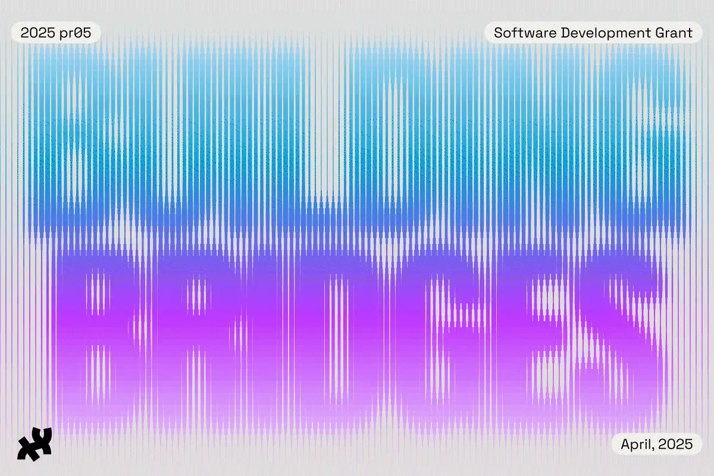

*Visual design by Nikki (Niktari) Makagiansar and Munus Shih.*

[Apply to this year’s pr05 grant by filling out this application form!](https://docs.google.com/forms/d/e/1FAIpQLSeFDPAi7RXehwOqdUFyE1PZIaLYyyegi26qIgGhHvsjcKabJw/viewform)

[Watch the recording of our Grant Info Session #1.](https://us06web.zoom.us/rec/share/XzxnD4DMUb7bjy7QkNrIexL26mqXg-fRYAV_D5mKILwj9vyIfqKa4_isGEuDxZtZ.11I4aCobOpWzbxZx?startTime=1745510407000)

[Register for our Grant Info Session #2.](https://us06web.zoom.us/webinar/register/WN_cqgvHeS4T4SeY91_NHeImA)

We are excited to announce the second edition of pr05 (pronounced “pros”), a grant and mentorship initiative by the Processing Foundation. This program supports the professional growth of early to mid-career software developers through hands-on involvement in open-source projects.

Participants will have the opportunity to contribute to software used by millions of creatives, artists, educators, and students worldwide while expanding their skills.

Take a look at last year’s cohort: [New Beginnings: Wrapping Up the First pr05 Developer Grant Program](https://medium.com/processing-foundation/new-beginnings-wrapping-up-the-first-pr05-developer-grant-program-71e82080032c)!

This year, three grantees will be invited to join our 2025 cohort. Selected candidates will receive a $10,000 stipend to spend 200 hours over 4 months on their contributions. Participation in the program is entirely online and we invite developers from around the world to apply.

This year’s theme is *Building Bridges*, with a focus on supporting interoperability across the [Processing](http://processing.org) and [p5.js](http://p5js.org) ecosystem and beyond. We have curated a list of three projects around that theme that candidates should pick from.

Besides their technical contributions, grantees will join regular cohort meetings and town halls together with our 2025 Fellowship cohort.

**Applications open May 1st (link will be updated after applications open).**

### Who is this program for?

Our goal is to build a diverse cohort of participants dedicated to enhancing the Processing and p5.js ecosystems while enriching their professional journey.

If you are an early to mid-career programmer, coder, developer, or software engineer and are excited about contributing to open-source projects, this program is for you!

We particularly encourage applications by individuals from communities underrepresented in tech fields.

For more info about our community guidelines, please read our [Code of Conduct](https://github.com/processing/pr05-grant?tab=coc-ov-file).

#### **Eligibility:**

-   Open to both U.S.-based and international applicants.
-   Applications are open to individuals only (groups, collectives, and organizations may not apply).
-   Each applicant may submit only one application.
-   Applicants must be at least 18 years old at the time of registration.
-   Applicants must have the legal right to work in their country of residence for the duration of the program.
-   Applicants must not reside in a country currently under a U.S. embargo.

### Project List

Applicants must choose from a predefined list of projects that can be completed under mentorship. Each project will be mentored by a developer/contributor experienced in this specific area. The project list will be published closer to the start of the open call.

### Mentorship

Each grantee will be assigned a mentor. Mentors are experienced software professionals and/or core contributors from the Processing and p5.js communities. They will offer project guidance and serve as an advocate for the grantee’s work.

### Expectations

We ask participants to share monthly progress updates, along with a final report and a wrap-up blog post documenting their work during the program. Additional documentation in other formats are also welcome (a series of video tutorials, a website, etc.) as desired by the grantee.

We invite grantees to connect with their cohort, offer mutual support, and take part in regular virtual meetings with their mentor throughout the program. Attendance is required by grantees at bi-monthly cohort meets, bi-monthly one-on-one mentor meetings, workshops, and town halls.

All pr05 projects must be released as open-source under a Free Software license such as LGPL 2.1 or GPL 2.0. We may ask contributors to submit their work to repositories under the Processing Foundation organization on GitHub.

### Program Timeline

Processing Foundation Grantees are expected to commit 200 hours to proposed projects between *June 30th 2025* and *October 31st 2025*. The 200 hours must take place during this timeline.

See the [detailed timeline on our pr05 program page](https://github.com/processing/pr05-grant/wiki/2025-pr05-Program-Page#2025-pr05-program-timeline).

Agreement regarding additional schedules and milestones is to be decided upon between the Grantee and their mentor by the first week of the program.

Further questions? Please consult our [Frequently Asked Questions](https://github.com/processing/pr05-grant/wiki/Frequently-Asked-Questions) page.

#### About Processing Foundation

The Processing Foundation is a 501(c)(3) non-profit organization established in 2012. We cultivate creative coding software and communities to empower learners, coders, and artists to shape equitable digital futures. Visit [our website at processingfoundation.org](http://processingfoundation.org/). To learn about our work, visit [our impact report at processingfoundation.report](http://processingfoundation.report/).
