We are so excited for the very first Processing Community Day coming up on October 21, 2017. The list of talks and workshops are posted on [day.processing.org](http://day.processing.org). Speakers including Ben Fry, Casey Reas, Lauren McCarthy, Daniel Shiffman, Johanna Hedva, Sydette Harry, Eva Díaz, Fathom Information Design, and the Processing Community Day Organizer Taeyoon Choi will take the stage.

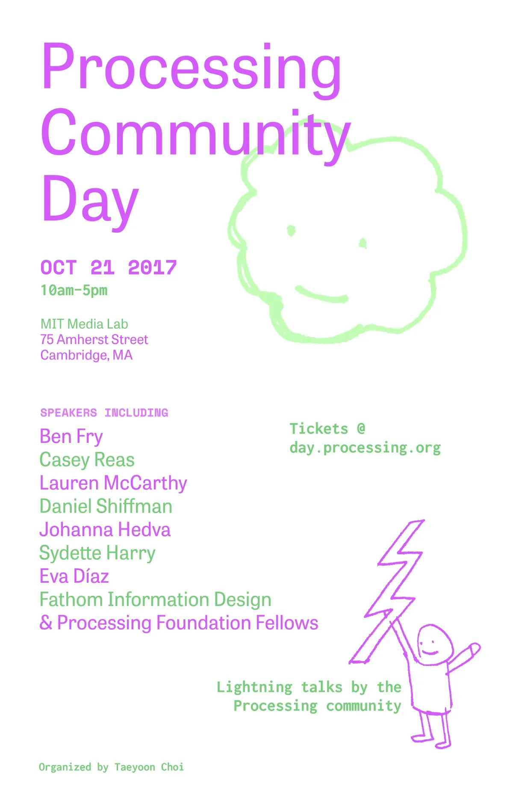

To celebrate the convening of Processing Community Day, we had an open call for presentations. The Processing Foundation Fellows will present at 11am, followed by informal Lunch Focus Groups at noon, and Lightning talks from 3:40pm until 5pm.

### Morning session

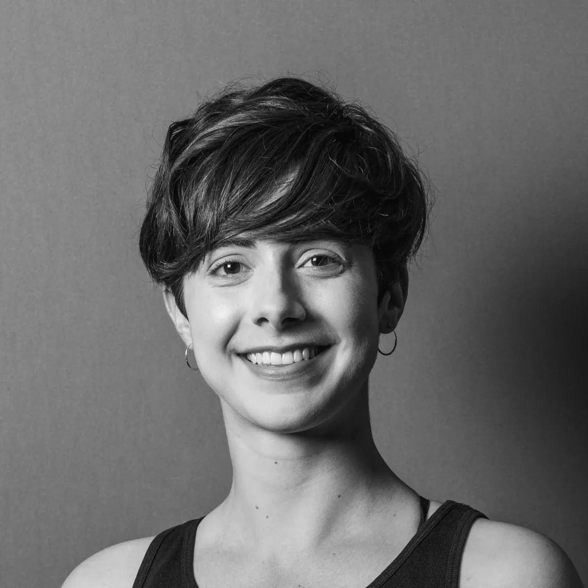

[Cassie Tarakajian](http://girlfriends.site) is a software developer, hardware engineer, creative technologist, and artist. She is a cofounder at the creative agency Girlfriends Labs. She focuses her work on creative tools, working as an engineer at Cycling ’74 and as the lead developer on the p5.js web editor. She also teaches AI’s how to love as a member of the band Lullabies for AI. Cassie will talk about p5.js Web Editor for All.

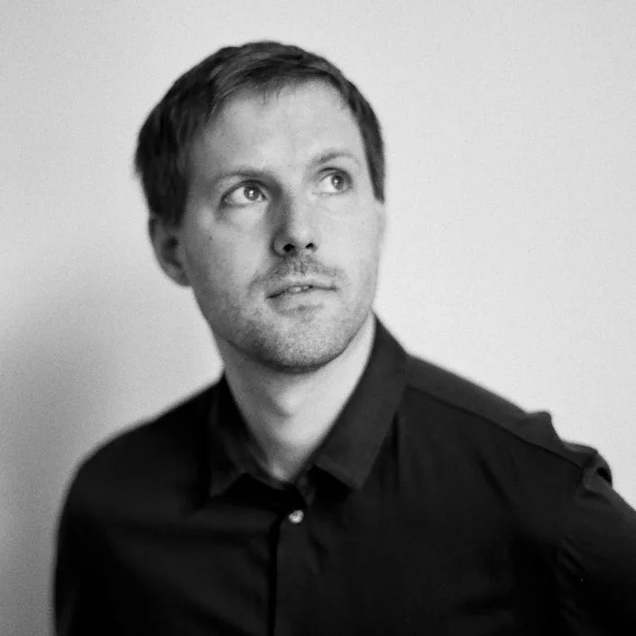

[Gottfried Haider](http://ghai.xyz/) is an artist, tool-builder and educator currently based in Vienna. Gottfriend will talk about what has happened in ARM land.

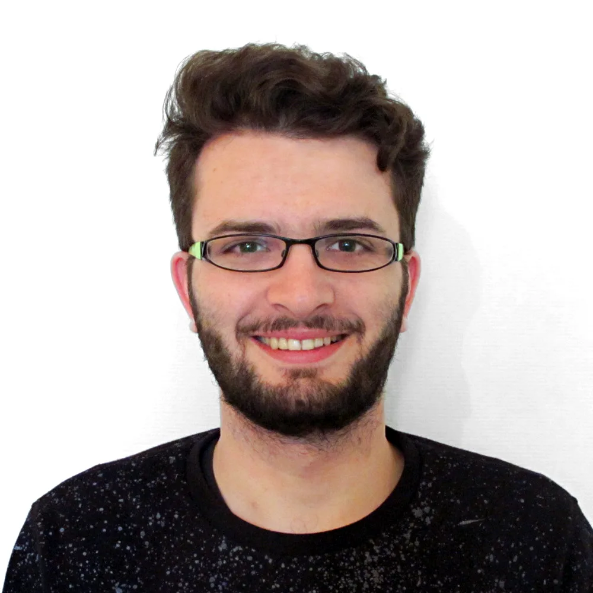

[Jakub Valtar](http://jakubvaltar.com) is a computer scientist and graphics developer turned artist. He is interested in natural sciences, lately focusing on topics such as emergence, complex systems and chaos theory. His works include interactive installations, videomixers, music videos, and live coded visuals. Apart from his own projects, he also creates software tools and artworks for other artists and works on maintaining and modernizing Processing.

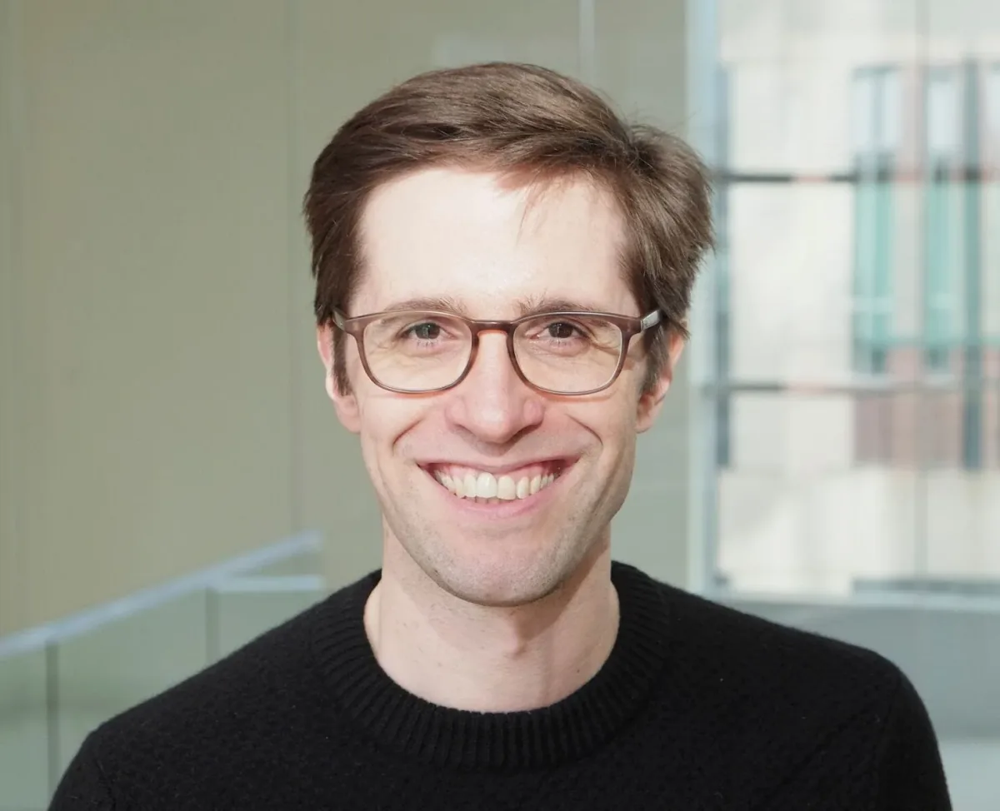

[Andrés Colubri](http://andrescolubri.net/) is a developer, artist, and scientist, as well as a long-time contributor to the Processing project. He originally studied Physics and Mathematics in Argentina, and later on carried out an MFA at the UCLA’s Design Media Arts program. He currently works at the Broad Institute, and collaborates with Fathom Information Design on visualization of complex datasets. He uses Processing to create new tools at the intersection of interaction, visualization, and computing.

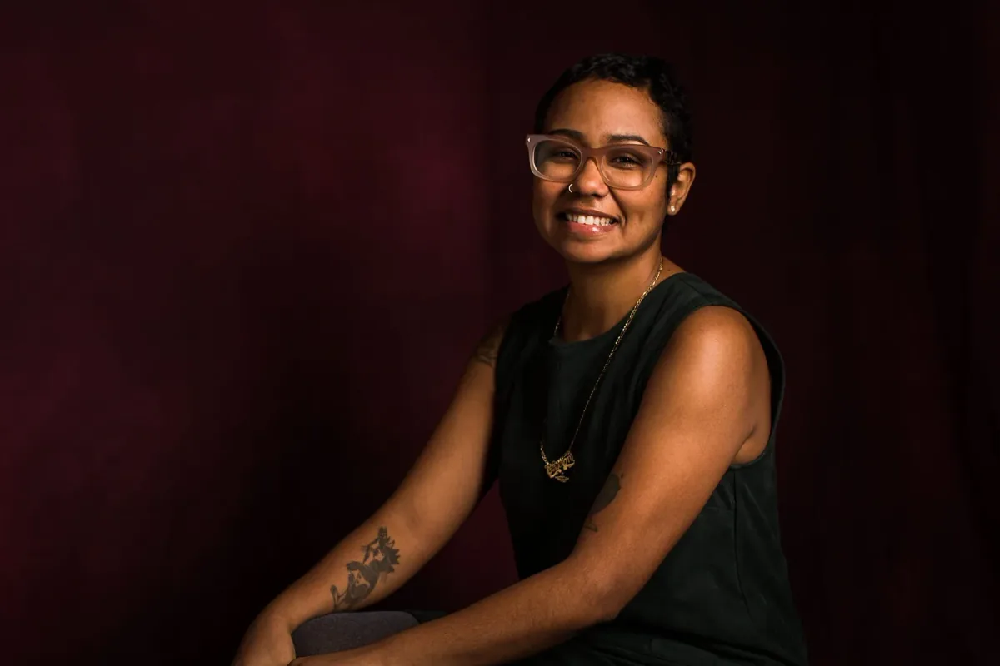

[Sharon Lee De La Cruz](http://unoseistres.com) is an artist and activist from New York City. Her work ranges from illustrations to interactive sculptures with the attempt to smash patriarchy, celebrate her awkwardness, and create accessible STEM education. She currently lives in New Jersey and is the Assistant Director of The StudioLab, a creative tech lab, at Princeton University.

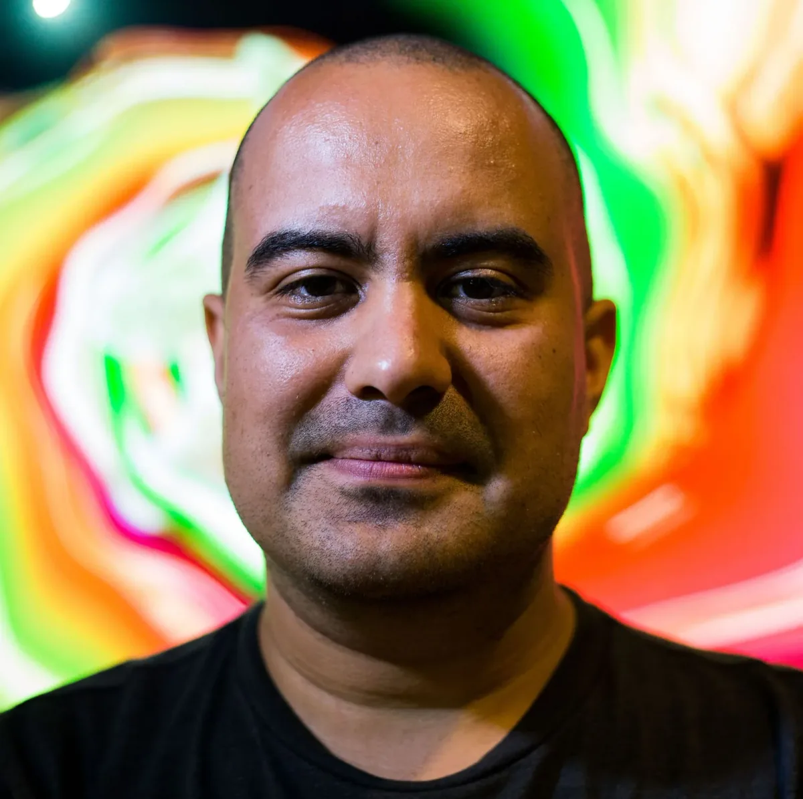

[Aarón Montoya-Moraga](http://montoyamoraga.io/) is a Chilean programmer and artist working on real-time live manipulation of audiovisual content, incorporating tools such as machine learning and awkward sensors. Research resident at NYU ITP and educator of media arts free open-source software for Spanish-speaking communities. He will talk about teaching p5.js in Spanish in Chile, launch of p5.js website and book in Spanish.

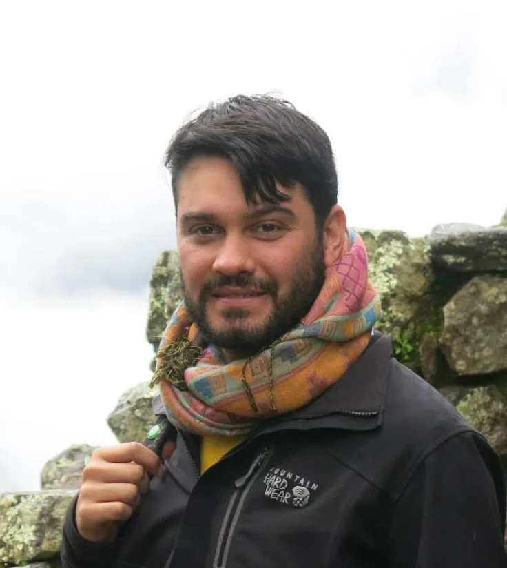

[Guillermo Montecinos](https://guillemontecinos.github.io/) is a musician, electrical engineer, programmer and educator based on Santiago de Chile. Co-founder and teacher at Coded School, currently attending SFPC fall semester.

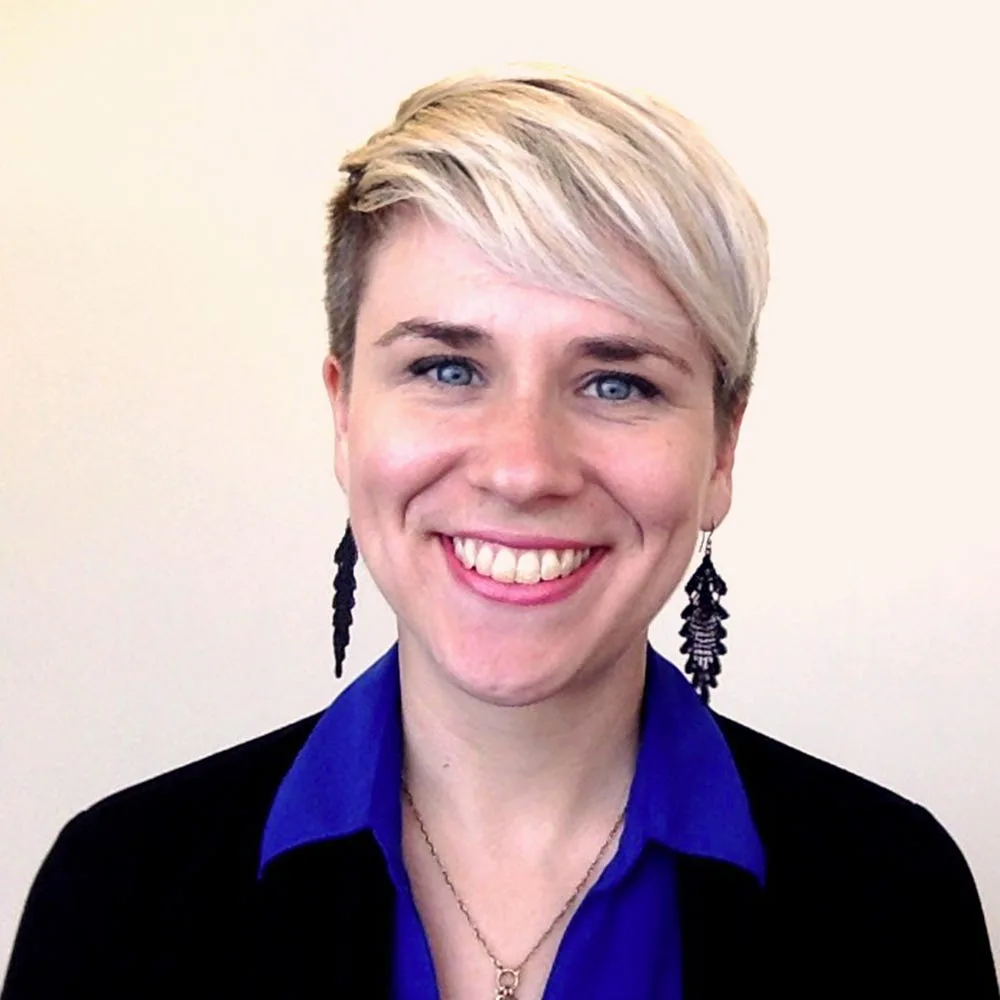

[Kate Hollenbach](http://www.katehollenbach.com) is an artist, programmer, and educator based in Los Angeles, California. She develops and examines interactive systems and new technologies relating body, gesture, and physical space. Her recent work includes phonelovesyoutoo, an Android application that lovingly watches its user’s activities by capturing video from the phone’s front camera, back camera, and screen. Through the application, Kate generates video works to understand what mobile devices see when they observe human bodies and how human presence is split between physical and virtual planes.

### Lunch Focus Groups

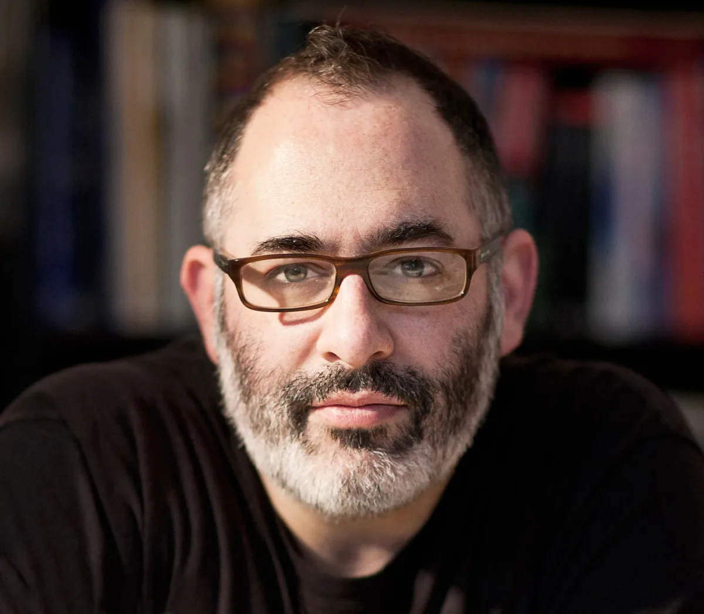

[Golan Levin](http://flong.com/) develops artifacts and experiences which explore the expressive use of computation. His work focuses on the design of systems for the creation, manipulation and performance of simultaneous image and sound, as part of a more general inquiry into the formal language of interactivity, and of nonverbal communications protocols in cybernetic systems. Through performances, digital artifacts, and virtual environments, often created with a variety of collaborators, Levin applies creative twists to digital technologies that highlight our relationship with machines, make visible our ways of interacting with each other, and explore the intersection of abstract communication and interactivity. Levin has exhibited widely in Europe, America and Asia.

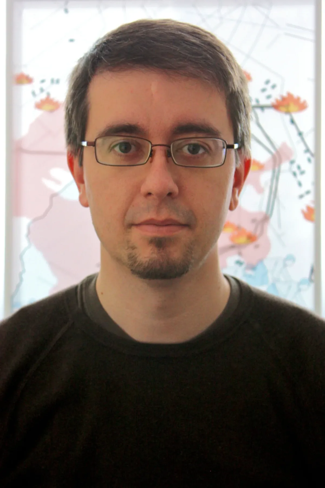

[Chris Coleman](http://digitalcoleman.art/) was born in West Virginia, USA and he received his MFA from SUNY Buffalo in New York. His work includes sculptures, videos, creative coding and interactive installations. Coleman has had his work in exhibitions and festivals in more than 25 countries and across North America. He works on several open source projects including Maxuino and organized the 2014 Processing Developer Meeting and the 2015 OpenFrameworks Education Summit in Denver while Director of his program. He currently resides in Denver, CO and is a Professor of Emergent Digital Practices at the University of Denver.

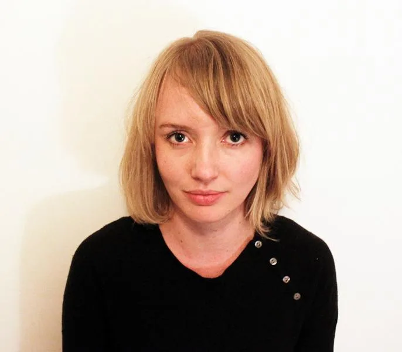

[Tega Brain](http://tegabrain.com/) is an artist and environmental engineer making eccentric engineering. Her work intersects art, ecology and engineering, addressing the scope and politics of emerging technologies. It takes the form of site specific public works, dysfunctional devices, experimental infrastructures and information systems. Tega is an Assistant Professor of Integrated Digital Media, New York University. She has been a fellow at Data & Society and the Processing Foundation.

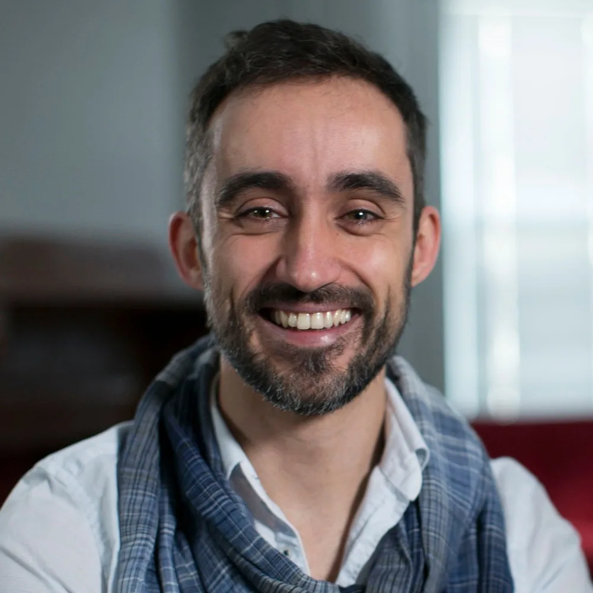

[Jose Luis Garcia del Castillo](https://rcc.harvard.edu/people/jose-luis-garcia-del-castillo-lopez) is a registered architect, and holds a Master in Architectural Technological Innovation from Universidad de Sevilla and a Master of Design Studies in Technology from the Harvard Graduate School of Design, where he is currently pursuing his Doctor of Design degree. He has worked as a structural consultant for several international firms, such as OMA, Mecanoo, and Cesar Pelli, as well as data visualization architect at Fathom Information Design. He is also the co-founder of ParametricCamp, an international organization whose mission is to spread the knowledge of computational design among designers and architects.

### Afternoon session

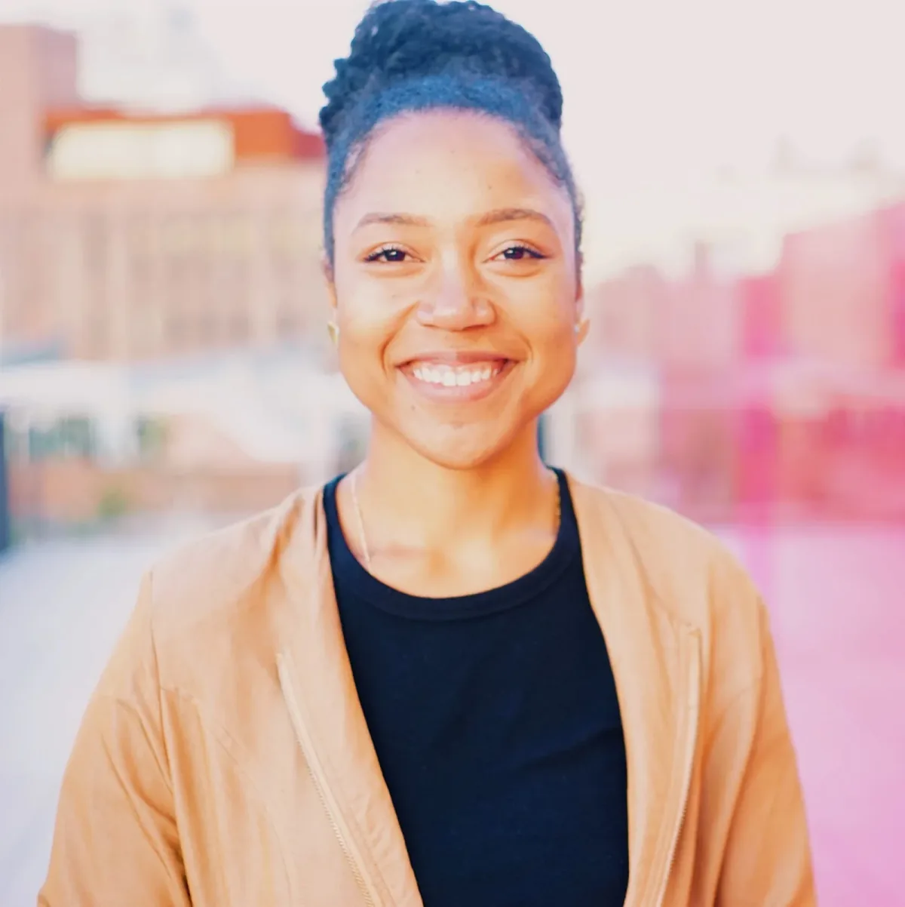

[Ari Melenciano](http://www.ariciano.com) is a designer, multidisciplinary artist, creative technologist, digital fabricator and educator. She is currently obtaining her Master’s from NYU’s interactive telecommunications program. Outside of her school workload, she is developing her creative house, bgoti; her lifestyle movement, Be Gold On The Inside; creates online video tutorials on creative technology in hopes of inspiring more women and people of color in to tech called, AricianoTV, is building NYU’s first annual new media arts, culture and technology festival called Afrotectopia as well as continuing to find new ways to merge her passions of art, design and technology to create quintessentially beautiful experiences.

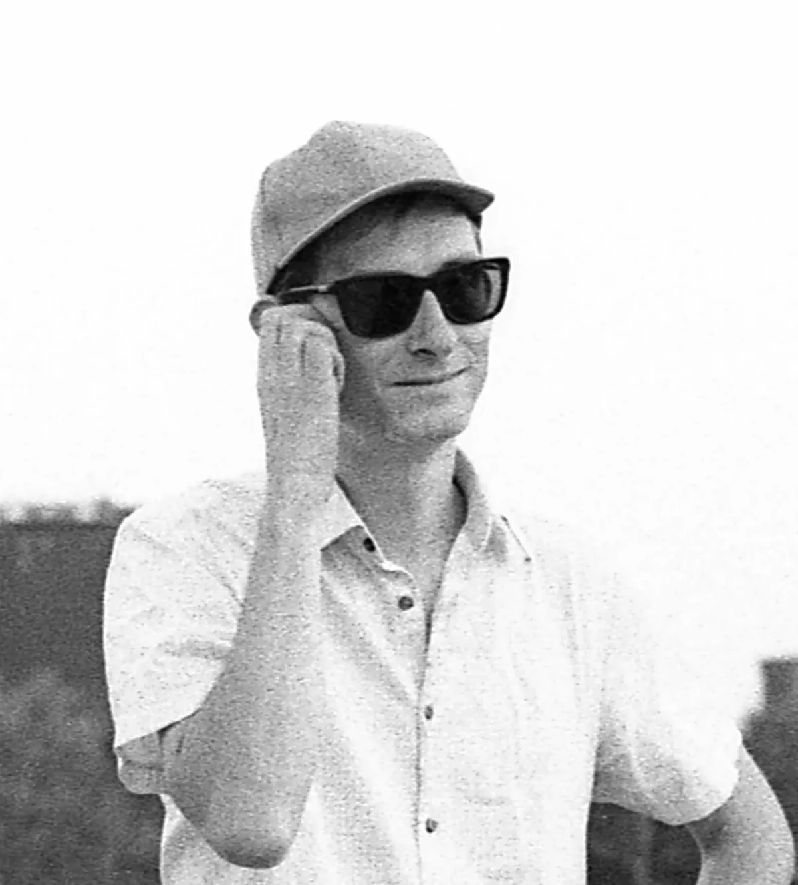

[Maxime Damecour](http://freeliner.xyz) is a multidisciplinary artist based in Montreal. His projects emerge from his curiosity and creative use of various technologies, and by leveraging human perception. His practice takes a holistic approach where transportation and installation are part of the work. His work has been featured at festivals such as the Mapping Festival Geneva, Biennale Némo Paris, Piksel Festival Bergen. Maxime also performs under the name userZero, part of the aziz!LightCrew, a DIY centric scenography crew that focuses on developing their own tools. userZero has been developing alcFreeliner, a live projection mapping software that focuses on fast improvisation made with Processing.

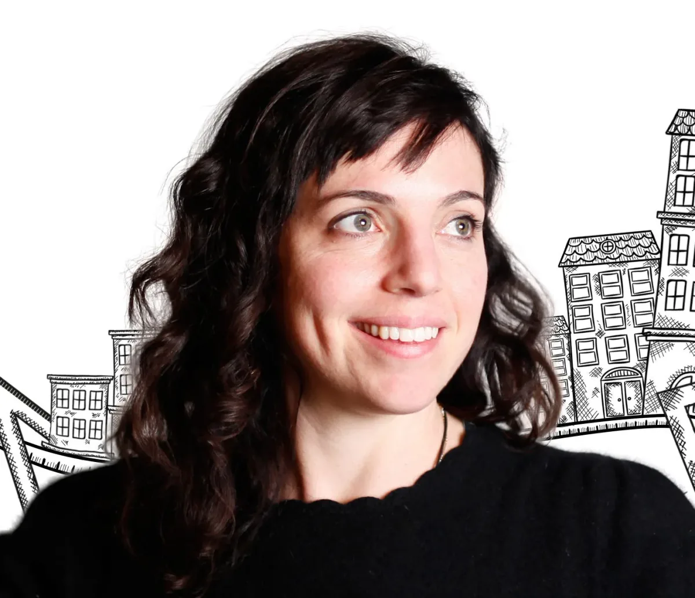

[Rosa Weinberg](http://www.leahrosaweinberg.com/teaching-portfolio/) is a Cambridge, Massachusetts-based artist and licensed architect who creates functional objects that are activated by viewer interaction. Her sculptures, wearables, and pedagogical projects have been presented in diverse contexts, including Boston Fashion Week, the Whitney Museum of Art and Lincoln Center Outdoors and have been publicized on NPR and Mashable. She is Director of Studio Development and a Coach at NuVu Studio, and co-organizer of Boston Tech Poetics.

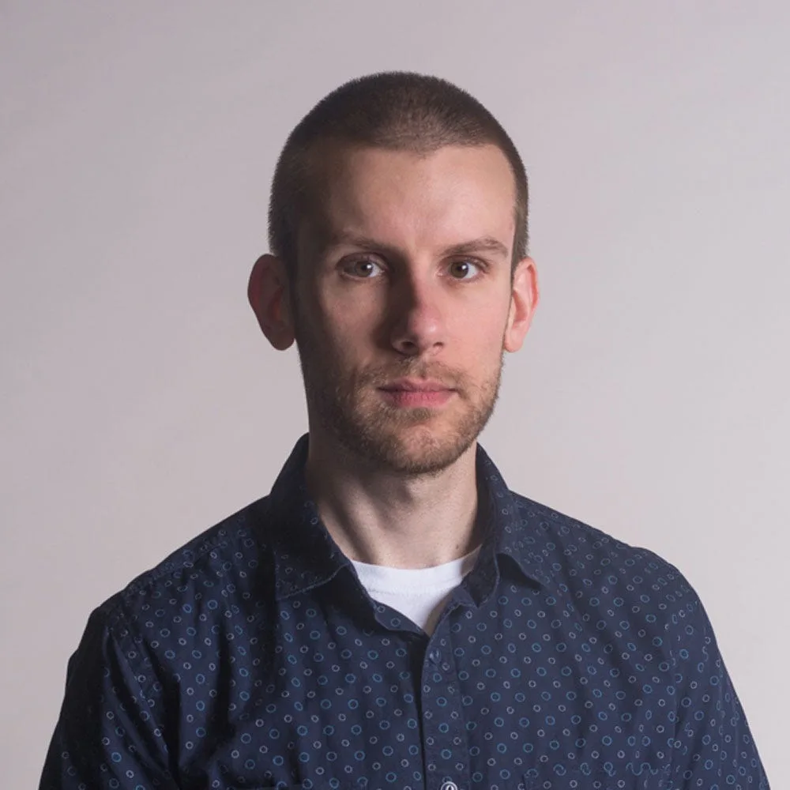

[Brad Tober](http://www.bradtober.com) is a designer, educator, and researcher whose work explores the potential of emerging code-based and interactive visual communication technologies, with the objective of identifying and investigating their relationships to design practice and pedagogy. His practice-oriented research is characterized by a speculative approach to meta-design, reflecting a shift in the role of professional practitioners from executing processes for finalized creative output to directly engaging with the development of tools facilitating the creative processes of others.

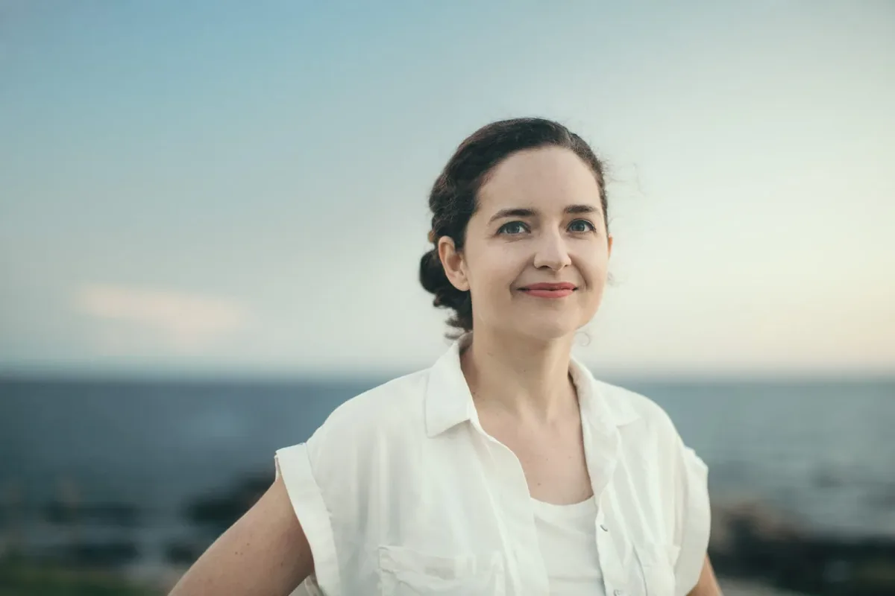

[Luisa Pereira](http://www.luisapereira.net) is an artist, engineer, and musician based in New York City. Pereira’s work has been exhibited in North and South America and Europe; recent venues include Museo de Arte Contemporáneo in Santiago de Chile, Loop Summit in Berlin, and FILE in São Paulo. Her projects have been featured in design and technology publications such as Wired magazine UK, Creators Project and Gizmodo.As an interactive designer and engineer Pereira has worked for clients like Samsung, Hermés and Google, creating interactive installations and experiences. Pereira was an inaugural member of the New Museum’s Art and Technology incubator, and a fellow at the Processing Foundation. She has taught at NYU ITP, the School of Visual Arts, the School for Poetic Computation, and most recently at the Interactive Media Arts program at NYU Shanghai.

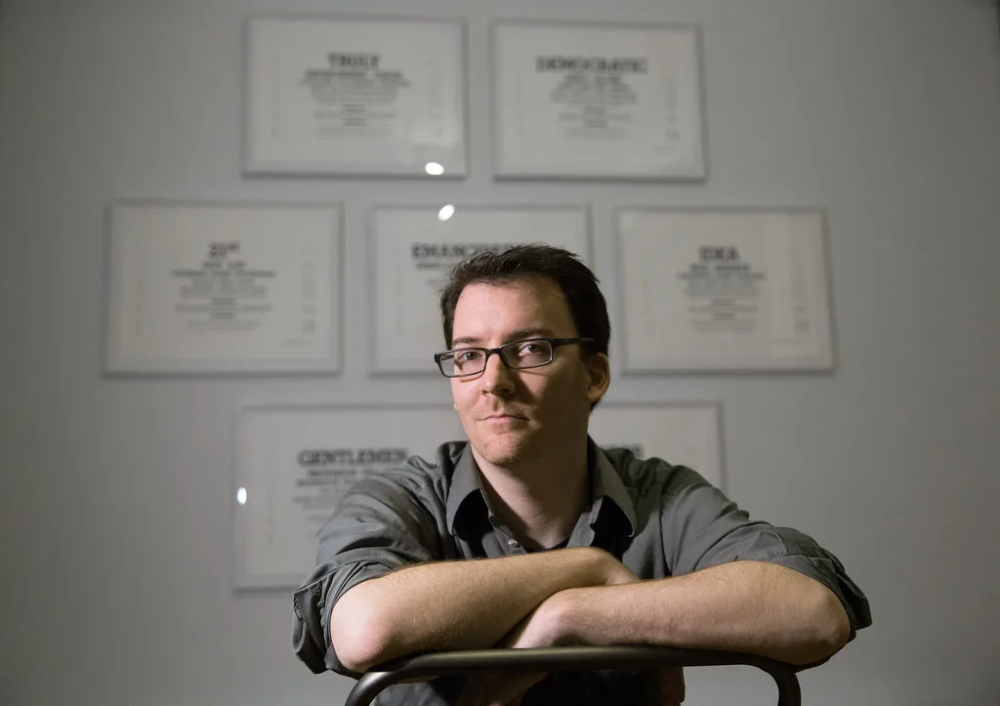

[R. Luke DuBois](http://lukedubois.com/) is a composer, artist, and performer who explores the temporal, verbal, and visual structures of cultural and personal ephemera. He holds a doctorate in music composition from Columbia University, and has lectured and taught worldwide on interactive sound and video performance. He has collaborated on interactive performance, installation, and music production work with many artists and organizations including Toni Dove, Todd Reynolds, Jamie Jewett, Bora Yoon, Michael Joaquin Grey, Matthew Ritchie, Elliott Sharp, Michael Gordon, Maya Lin, Bang on a Can, Engine 27, Harvestworks, and LEMUR, and was the director of the Princeton Laptop Orchestra for its 2007 season. He is Co-Director and Associate Professor of Integrated Digital Media at NYU.
