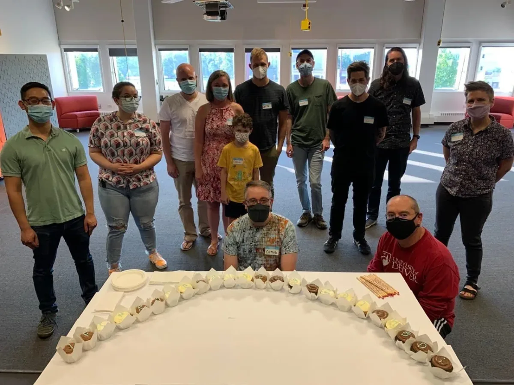
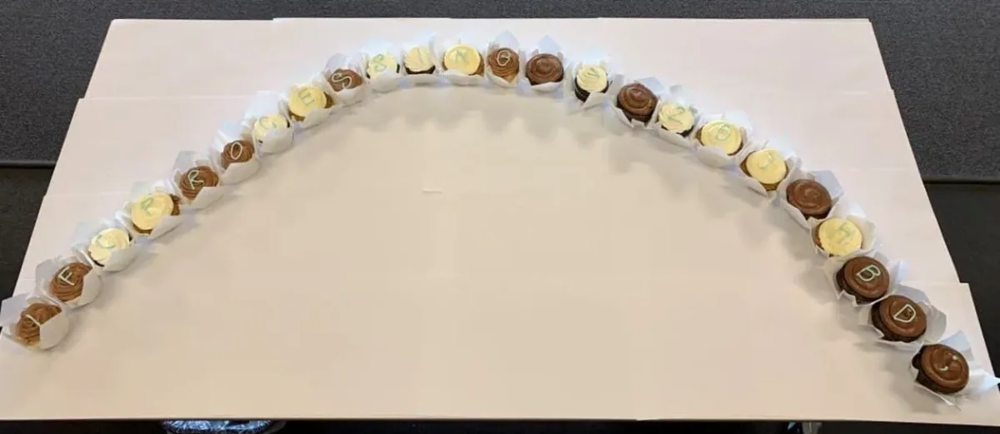
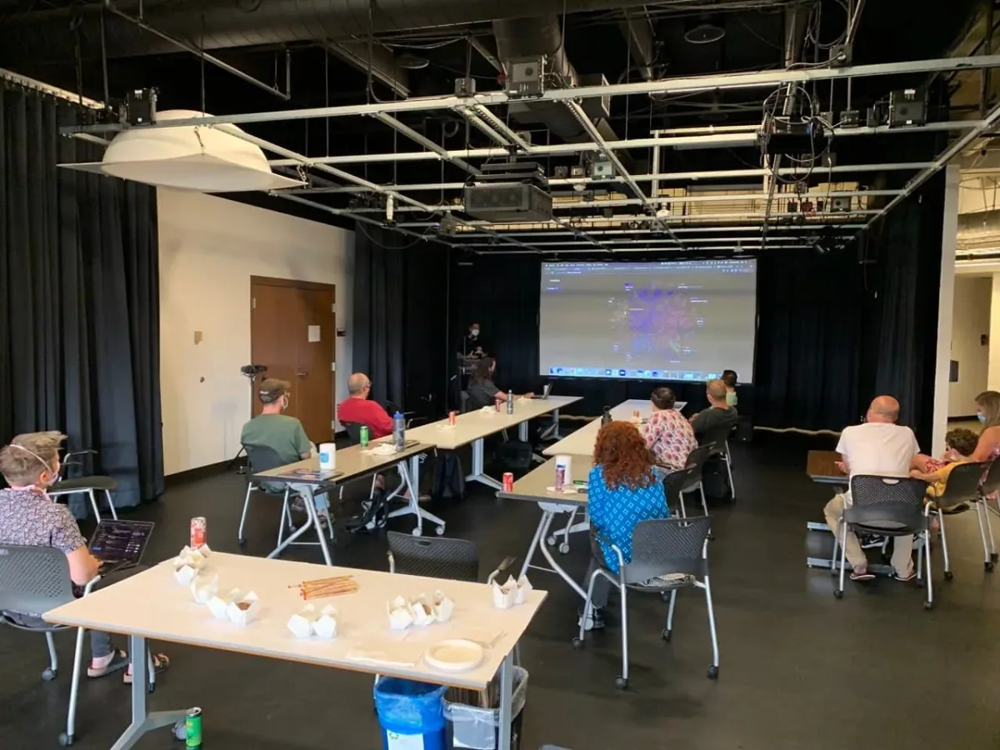

To celebrate, the Processing Foundation organized [Processing Community Day 2021](https://processingfoundation.org/advocacy/pcd-2021), a distributed, worldwide party held on August 20–22, 2021. For PCD2021, the community could participate in a number of ways, from hosting an event online or in their city, to contributing to the [20th Anniversary Processing Community Catalog](https://processingfoundation.org/advocacy/community-catalog), to sharing creative coding projects and resources at [#pcd2021share](https://twitter.com/search?q=%23pcd2021share&src=typed_query&f=live), to creating a real or virtual birthday cake at [#pcd2021cake](https://twitter.com/search?q=%23pcd2021cake&src=typed_query&f=live). Over the next couple weeks, we’ll be posting a series of articles written by some of the folks who organized a PCD2021 event. Happy 20th birthday!

---

*Attendees at the Denver, Colorado, event for Processing’s 20th anniversary, in August 2021. \[**Image description**: Photo of 12 attendees to the event standing and crouching behind a table displaying cupcakes arranged in the shape of an arc.\] Photo by Laleh Mehran.*

On the occasion of my second Processing-focused event in Denver, Colorado, members of the community came out of COVID-19 hiding to be IRL. Since we held the event at the University of Denver, we had as many COVID protocols as we did codes of conduct — with door helpers providing masks, strict capacity limits, and legally binding surveys from the university for every visitor. Despite all those restrictions, 14 people gathered to celebrate Processing with cupcakes and stories, always staying six feet apart. The cupcakes included vegan and gluten-free options, and each had a character that spelled out “IF(PROCESSING > 20) HBD;”

*24 cupcakes, that spell out IF(PROCESSING > 20) HBD; arranged in the shape of an arc on a white table. Photo by Chris Coleman.*

Attendees included participants in our Emergent Digital Practices program, and local tech workers with a creative side. Most knew one or two others, but many of us were strangers to one another. Encountering people for the first time in a social setting while wearing masks makes the process twice as awkward. But now, eating together comes with the additional joy of sharing a few smiles between bites. We were all excited to come together, but at the same time cautious because we have all been distant from strangers for more than a year.

After food and introductions, 10 of the participants stepped up to share art and design work they had created using Processing. I started us off by speaking about my work on the new Processing website tutorials, and outlining the many ways people can contribute to the platform that might not involve coding or money.

Professor Kate Hollenbach shared a celebratory Processing birthday message written in p5.js, then presented one of her artworks that connected everyone in the room as they swiped across their phone screens. An engineer from Sparkfun shared a project made in p5.js about social anxiety, loneliness, and connecting to others. A local data analyst shared some visuals that he’d made in Processing to accompany his music. Professor Rafael Fajardo shared some of his artwork that he is converting from older toolkits to p5.js.

Tim, who works remotely for Fathom Information Design, shared their COVID health visualization work with a powerful and inspiring presentation. Last, Professor Laleh Mehran shared our collaborative project “[W3FI](https://lalehmehran.com/W3FI),” which was built in Processing and explores how we can be better together online. Other attendees decided not to share but had great questions. Afterward, everyone hung out for another 30 minutes, sharing ideas and common interests, and making future connections.

The beauty of bringing people together from across the Denver region — most of whom are outside of academia — is hearing about a plethora of creative intersections. Processing is part of so many lives outside of work and school. It really is that easy yet powerful tool you can pick up after a long day, or on the weekend, to play with, learn with, and share with.

*Artist Tim Burr sharing work on a projection screen with attendees who are spread out in chairs at rows of tables. Photo by Chris Coleman.*

The event was sponsored by the [Clinic for Open Source Arts](https://clinicopensourcearts.org/) and the [Emergent Digital Practices Program at the University of Denver](https://liberalarts.du.edu/emergent-digital-practices).
