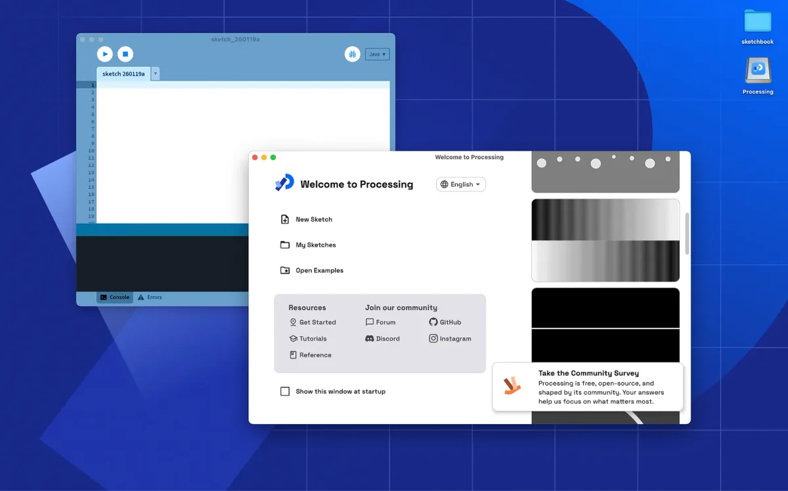
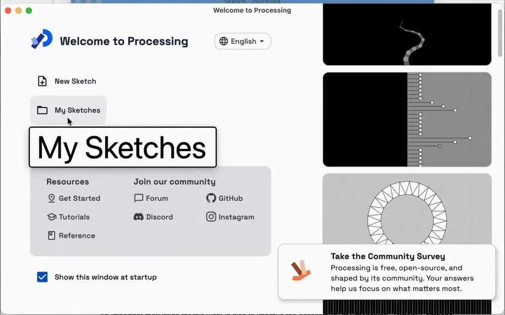
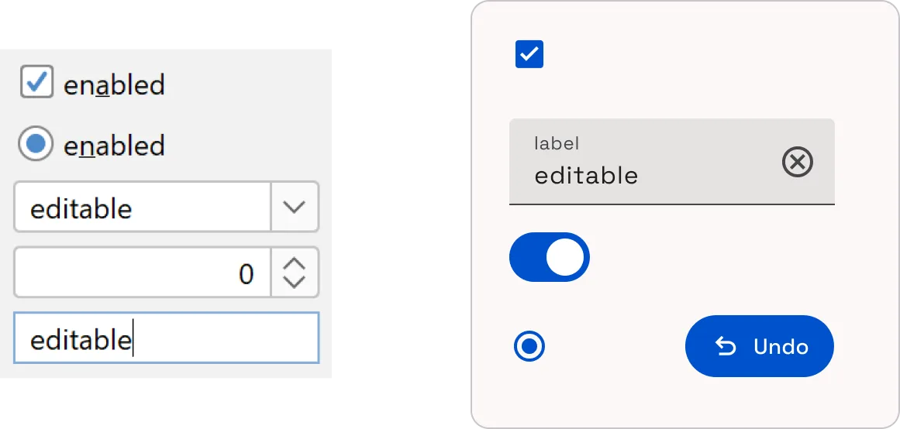
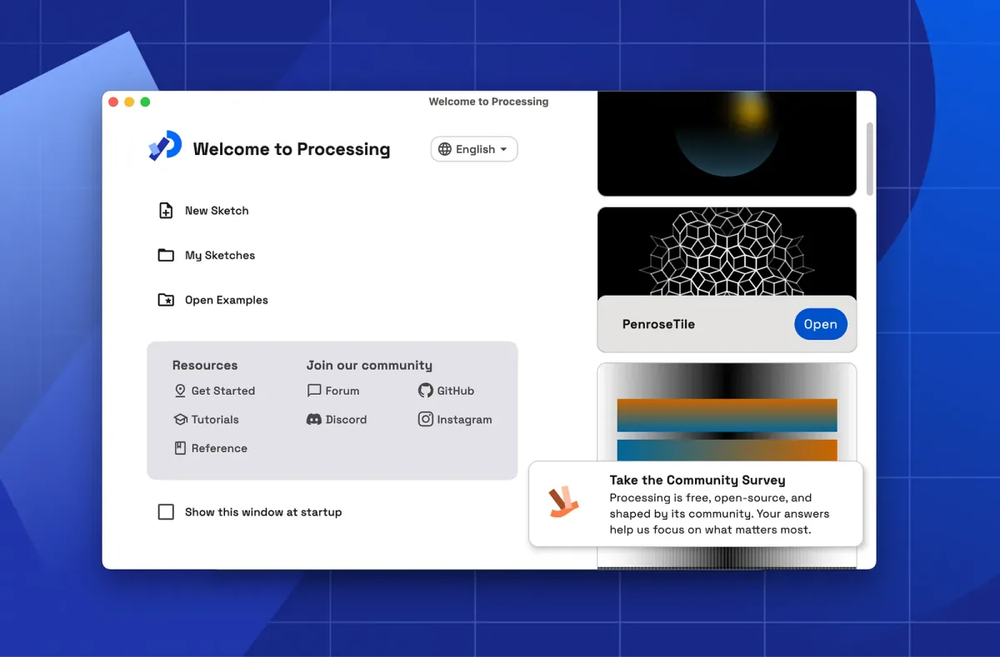
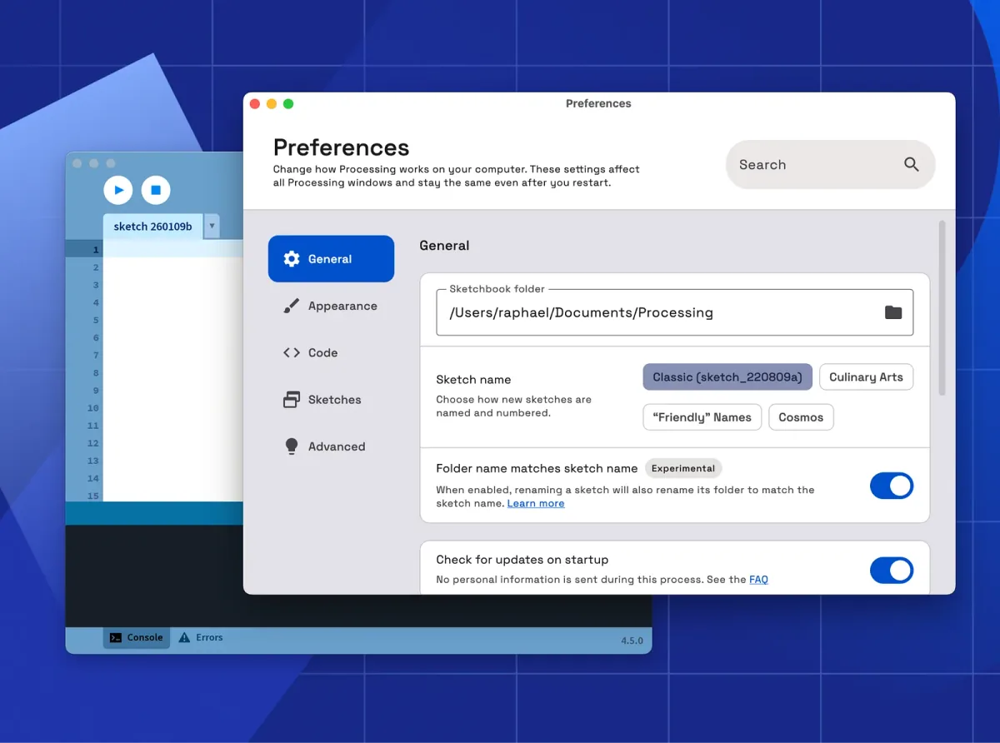
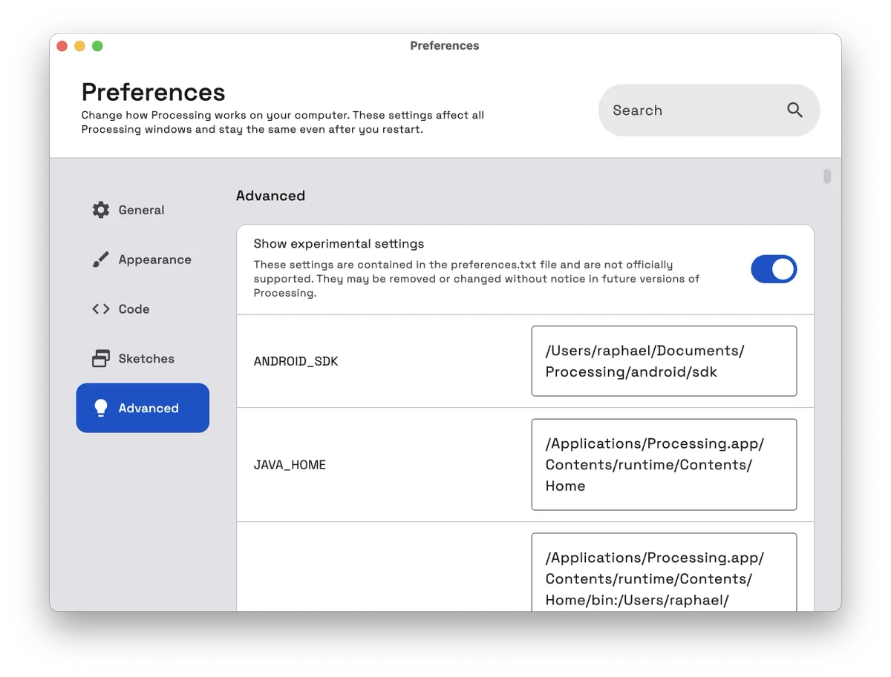

[Download Processing 4.5.1](https://processing.org/download) from the Processing website.

### Sustaining Processing

Processing has been around for 25 years, which in software years is… a lot.

That continuity is a testament to the foundations laid by Ben Fry, Casey Reas, and to the many contributors who have cared for Processing over the years. Projects like Processing do not persist by accident. They survive because people keep showing up to do the unglamorous work.

We know it is hard to get people excited about infrastructure, especially since much of this work is invisible to most users, but it is still essential. Over the past two years, [a huge amount of effort](https://www.youtube.com/watch?v=ngQwedwFyOY) has gone into [bringing Processing back](https://timrodenbroeker.de/the-future-of-processing-with-raphael-and-stef/) into a state where bug fixes and releases can happen.

Last September, we welcomed our new Processing Project Lead, [Moon Davé](https://medium.com/@ProcessingOrg/moon-dav%C3%A9-joins-processing-foundation-as-processing-project-lead-ef33efea35d4), who is already focusing on clearing the path for contributors of all skill levels, and collaborating with the contributor community to breathe new life into the project.

At this point, we are in a place we feel good about. Processing is stable, moving again, and in a shape where meaningful contributions can happen.

Now feels like a good time to be excited about Processing :)

If Processing matters to you, there are many ways to get involved! Join the [Processing Discord](https://discord.processing.org), or check out our [contributing guide](https://github.com/processing/processing4/tree/main?tab=readme-ov-file#contributing-to-processing) on GitHub.

---

### What’s new in Processing 4.5

*Full* [release notes for Processing 4.5.1](https://github.com/processing/processing4/releases/tag/processing-1312-4.5.1)

### A refreshed user interface

Over the years, the editor has held up remarkably well with its timeless minimalist design. At the same time, some parts of the interface are starting to show their age and feel dated on modern systems.

More importantly, the underlying UI code has become harder to maintain and extend. Even small fixes can take longer than they should, which slows down development and causes frustration for everyone involved.

Starting with 4.5.1, the **Welcome** and **Preferences** screens have a new refreshed design, to support better accessibility and make it easier to add new features in future versions.

The main Processing editor window stays the same, and you should not expect any other visual changes elsewhere in this version.

#### What we’re building on

Starting with Processing 4.3.1, new features have been written primarily in the [Kotlin](https://kotlinlang.org/) language. Kotlin is fully interoperable with Java, which means we can adopt it incrementally while keeping the rest of the codebase intact. This makes it possible to use newer tooling alongside the existing Java and Swing code.

For the user interface, we are using [Jetpack Compose Multiplatform](https://www.jetbrains.com/compose-multiplatform/), a modern, reactive UI toolkit built in Kotlin, together with the [Material Design 3](https://m3.material.io/) design system. This allows us to build new interface components quickly, while still integrating with the existing Swing-based parts of Processing.

Contributors who are comfortable with Kotlin and interested in this work are very welcome to get involved. Come say hi on the [Processing Discord](https://discord.gg/tJvJB6ctUJ).

#### Accessibility by default

Improving accessibility is a key motivation for this work. Processing’s underlying UI tech was not designed with modern accessibility needs in mind. If we kept everything as-is, we would keep shipping the same limitations.

Jetpack Compose for Desktop provides built-in support for screen readers, keyboard navigation, and other [desktop accessibility features](https://kotlinlang.org/docs/multiplatform/compose-desktop-accessibility.html). As parts of the interface are ported to this system, they gain these accessibility features without additional work.

That’s the key shift: not “adding accessibility”, but moving toward a UI setup where accessibility is the default.

#### New UI components

With this foundation in place, parts of the Processing interface are beginning to move to the new UI system in this release.

Material Design comes with a lot of pre-made components which make it easier to ensure consistency across all parts of the UI.

**Left: Default Swing interface. Right: Jetpack Compose with the Material Design 3 open source UI design system.**

Jetpack Compose also tends to be less verbose than Swing, which makes UI code easier to read and reason about. For example, here is the same component written in Swing and in Jetpack Compose.

**Swing**

class Processing : JFrame("Processing") {  
    init {  
        setDefaultCloseOperation(EXIT\_ON\_CLOSE)  
        val label \= JLabel("This is a label")  
        val button \= JButton("Click me")  
        button.addActionListener {  
            println("Button clicked")  
        }  
        add(label)  
        pack()  
        isVisible = true  
    }  
    companion object {  
        @JvmStatic  
        fun main(args: Array<String>) {  
            SwingUtilities.invokeLater {  
                Processing()  
            }  
        }  
    }  
}

**Jetpack Compose**

@Composable  
fun Processing() {  
    application {  
        Window(onCloseRequest = ::exitApplication, title = "Processing") {  
            Text("This is a label")  
            Button(onClick = {  
                println("Button clicked")  
            }) {  
                Text("Click me")  
            }  
        }  
    }  
}

The new **Welcome** screen adds faster ways to get started, a list of useful links, and a scrollable collection of example sketches.

In earlier versions of Processing, showing most options on a single screen worked well because there were only a handful of them. As more features were added, the **Welcome** and **Preferences** screens became increasingly cluttered, making them harder to use and difficult to expand upon.

The new Preferences are searchable, and organized into clear categories, which makes it easier to add new settings over time.

The new **Preferences** screen also makes it easier to work with experimental settings.

Previously, these settings could only be changed by manually editing the preferences.txt file. Now, they can be viewed and edited directly from within the Processing interface.

#### Incremental approach

We chose to migrate the **Welcome** and **Preferences** screens first because they are self-contained, and include most of the interface elements needed for the project (menus, cards, dropdowns, checkboxes, sliders, etc). This makes them a good place to start and test the new design.

Rather than doing a large redesign or re-starting from scratch, we chose to take a careful, incremental approach, so we can demonstrate the new system, gather feedback, and invite contributions as we move forward. This is possible thanks to [Jetpack Compose’s interoperability with Swing](https://kotlinlang.org/docs/multiplatform/compose-desktop-swing-interoperability.html).

---

### It takes a village 💙

We have already received useful feedback from the community through the beta release of Processing 4.5. Thanks to everyone who tested early versions, shared feedback, reported issues, or contributed ideas.

Want to help make Processing better? [Download Processing 4.5.1](https://processing.org/download) from the Processing website, and if you find any bugs or issues in this release, please [open an issue](https://github.com/processing/processing4/issues/new/choose) on GitHub.

Join the [Processing Community on Discord](https://discord.processing.org).

### Acknowledgment

Part of this work was made possible by [funding](https://www.sovereign.tech/tech/processing) from the [Sovereign Tech Agency](https://www.sovereign.tech/).
