#### Teaching Experience with Processing

I currently work in art and design and have been working as a professor at an art school for over 16 years, running my lab using Processing in Japan. My lab has about 20 undergraduate students and several graduate students each year, and has already produced nearly 200 graduates. Here, students work flexibly in a variety of media for group, individual, and thesis projects.

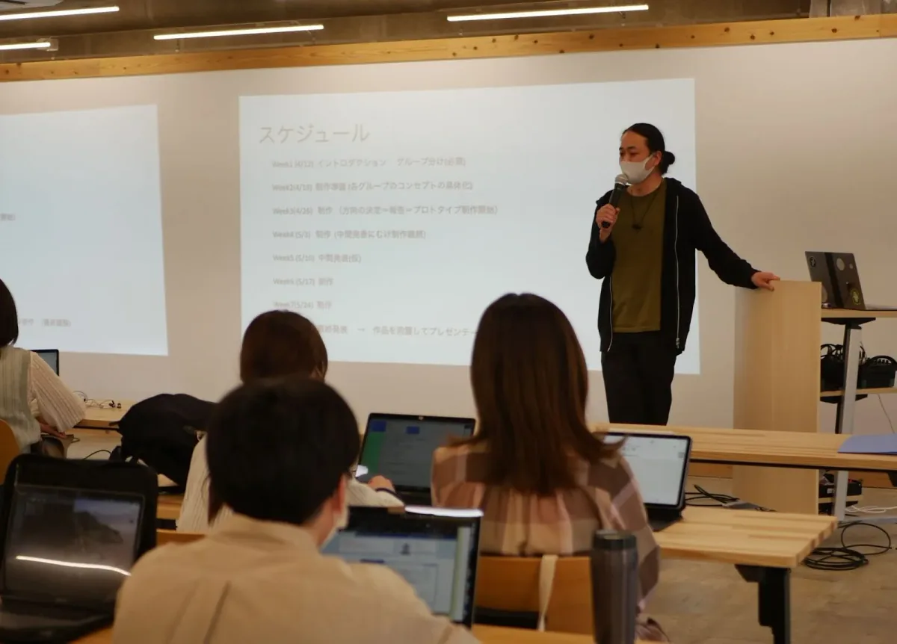

*A scene of Tetsu teaching an 8-week creative technology class.*

Processing (and more recently p5.js) is used to teach the fundamentals of software development. For Physical Computing, Processing manages data in and out through a serial connection to Arduino, creating an interactive relationship between software and hardware. Students work in creative expressions such as interactive installation, projection mapping, generative art, networked work, graphical interactive animation, and audiovisual art.

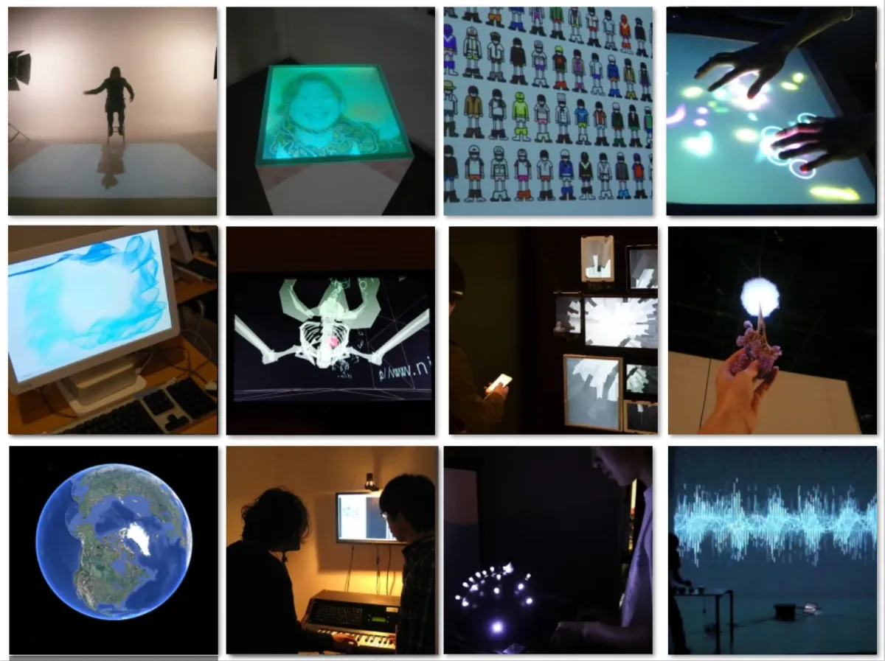

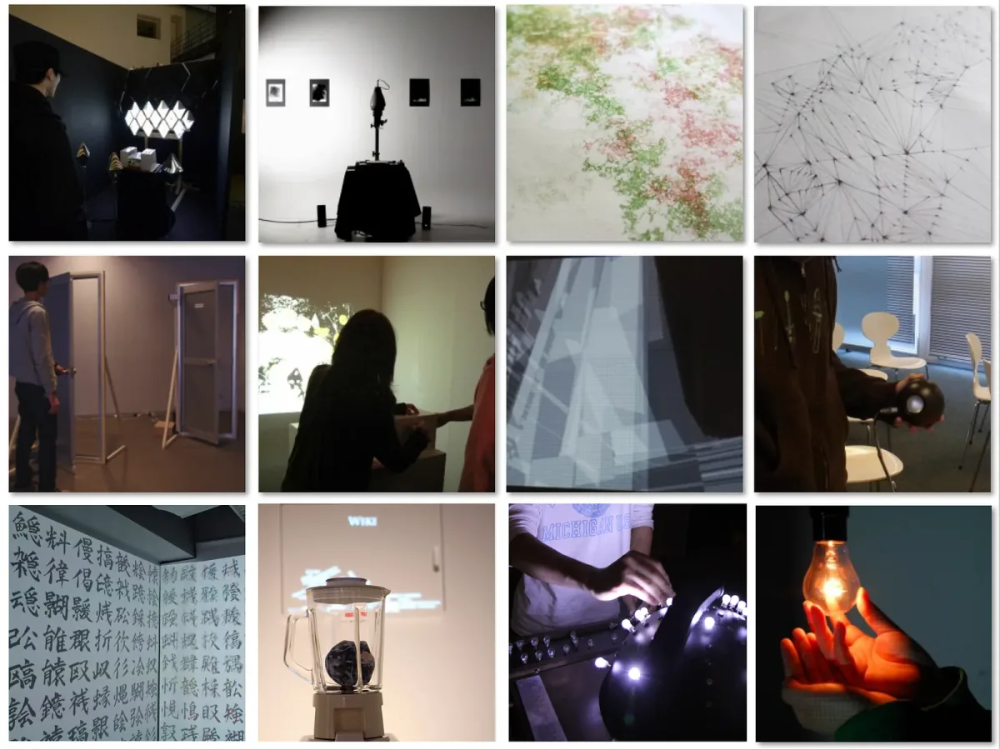

*Students’ works from the lab.*

Graduates have gone on to work in a variety of industries such as advertising, publishing, planning, printing, programming, UX/UI design, consulting, working as public officials, childcare workers, and dancers, as well as going on to pursue their own careers. I feel that the experiences they have created through my lab will lead to flexible thinking and perseverance to survive in this IT society. It is not just learning to create works through coding, but the experience of conflict and frustration in the process of creating their works. With these experiences, they can find their right paths in the rapidly developing modern software industry, and the complex and traditional cultures and customs of the past.

#### My First Encounter with Processing

I first encountered Processing in 2002, when I had just graduated from NYU’s ITP program and was a resident researcher. At that time, neither Arduino nor Processing existed at ITP. I was not originally from a science or math background, but I immersed myself in Physical Computing at ITP, writing Lingo on Macromedia Director to connect PIC microcontrollers via serial, writing Perl, and working with MIDI on PICs. I often used to create original musical instruments with my good friend Jeff Feddersen,who still teaches at ITP. I was not good at English, which is not my first language, but I could play musical instruments and draw. My great advisor [Red Burns](https://en.wikipedia.org/wiki/Red_Burns) always called me to her room on the 4th floor saying, “You don’t need to speak English for now, but you should just keep playing with technologies and express yourself with your art.”

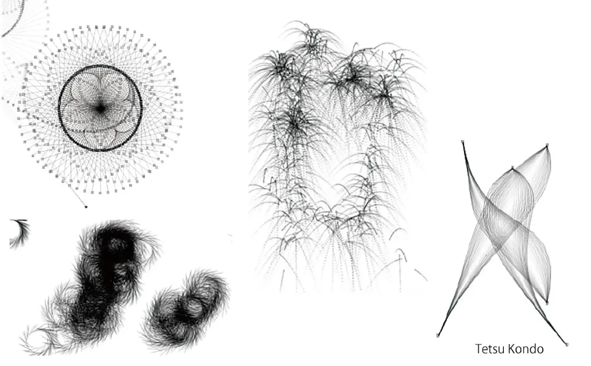

*Tetsu’s early sketches using Processing in 2003, courtesy of the artist.*

When I came across Processing, I was hooked on this language that allowed me to draw sketches as if I were working with paper and pen. Then, I emailed Casey directly from Brooklyn and helped translate the Alpha version of the [Reference pages into Japanese](http://tetraleaf.com/p5_reference_alpha/). Many people joined Processing and I was so happy to see these flows like a spring full of water. The FFT sound library accelerated my ability to express myself as it was really fun to see graphical patterns spontaneously reflecting over my music tracks and real-time audio inputs. I naturally began to learn and read books about the computational beauty of nature, fractals, and the basics of mathematics.

Since then, Processing has helped me improve my coding skills, accelerate my ability to express myself through my art, collaborate with creative friends, and get involved in a variety of projects.

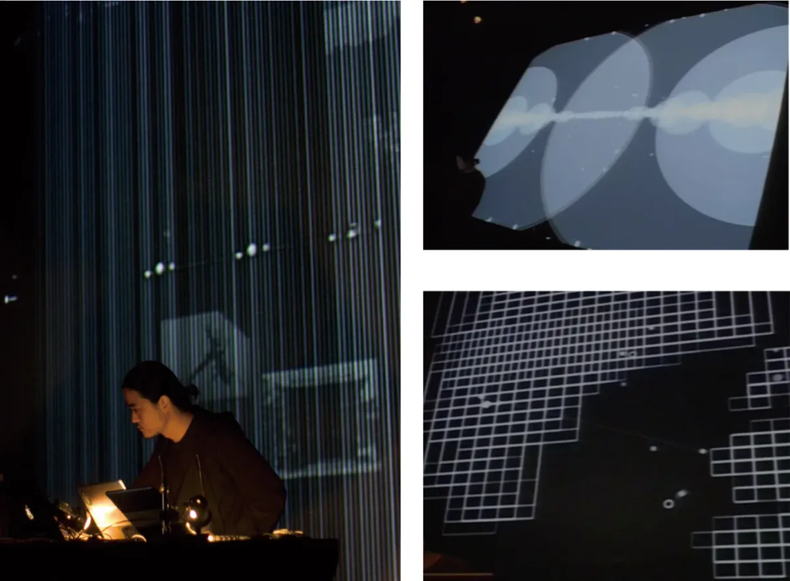

*Tetsu’s audio visual live set using FFT — FILE Hypersonica 2009*

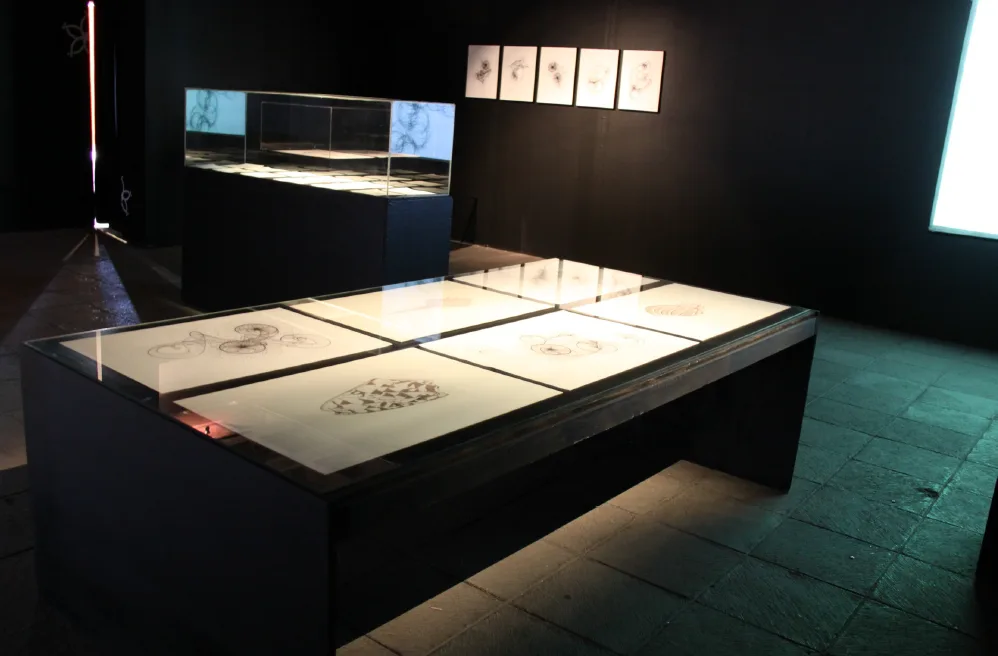

*Tetsu’s works, hand-drawings, and computational drawings at CENART Mexico, courtesy of the artist.*

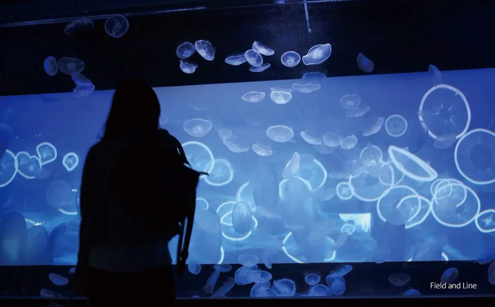

*Installation work for Jellyfish at Tokyo Skytree Sumida Aquarium with Jeff Federsen*

#### School Scenes in Japan

After returning to Japan, I was fortunate to have the opportunity to be involved in education, where I continued to teach students using Processing. Promoting programming education at Japanese art universities was a great challenge for me and led me to deepen my understanding of Japan’s old and revered education system, Japanese history, and culture up to the present day. Since I have always been interested in domestic and international culture and history, I have continued to take the time to promote media and technology education to Japanese students in a slow and steady, [*Terakoya*](https://en.wikipedia.org/wiki/Terakoya)\-like educational activity.

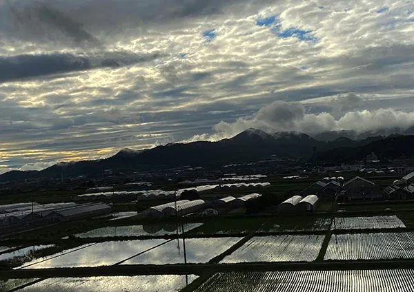

*An ordinary sight of rice fields in Toyokawa.*

*Terakoya* school was the private educational institution during the [*Edo period*](https://en.wikipedia.org/wiki/Edo_period) (1603–1867) mainly teaching reading and writing in [*Kanji*](https://en.wikipedia.org/wiki/Kanji), [*Hiragana*](https://en.wikipedia.org/wiki/Hiragana), [*Katakana*](https://en.wikipedia.org/wiki/Katakana), [calligraphy](https://en.wikipedia.org/wiki/Japanese_calligraphy), [tea ceremony](https://en.wikipedia.org/wiki/Japanese_tea_ceremony), [*ikebana*](https://en.wikipedia.org/wiki/Ikebana), sewing, [*soroban*](https://en.wikipedia.org/wiki/Soroban) (abacus), etc., for young Japanese students. *Terakoya* did not impose uniform compulsory learning but provided practical education necessary for the lives of ordinary people, and children also learned from each other. Experienced teachers developed a handcrafted, individualized curriculum based on parents’ professions and student’s wishes. They were built all over Japan.

On the other hand, children in Japan today study fixed subjects in large classes all at the same time as compulsory education from elementary school to junior high school. There is a set instructional manual for teachers, and students wear school uniforms, attend school at a set time, and compete with each other for test scores. This approach may be very good at fostering rote memorization and pattern recognition skills, but it can limit students’ ability to develop individual creativity and independent problem-solving abilities.

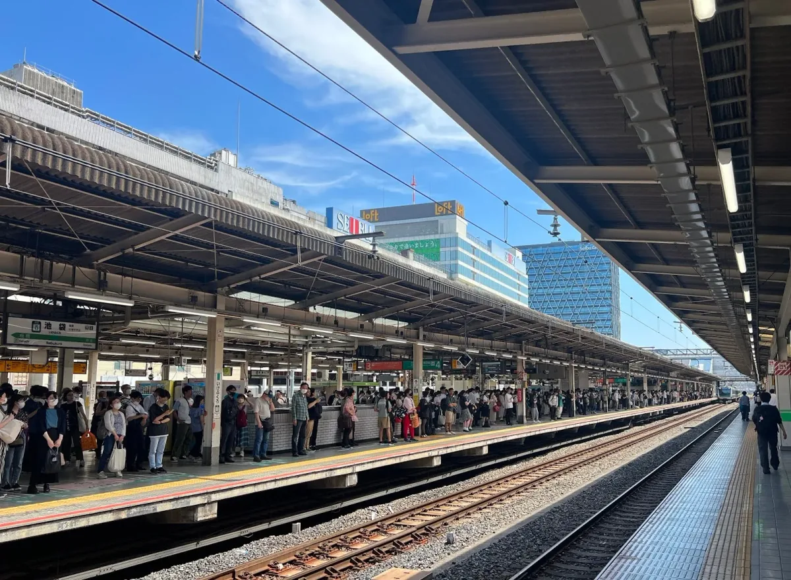

*People standing in an orderly line on the platform of Ikebukuro station in June 2023.*

Recently, there has been a shift from paper textbooks to tablets (I used to love scribbling on the textbooks), and there is a trend to adopt programming in elementary education without sufficient consideration, or a real understanding of what it entails. Many serious parents who are eager for their children to learn are being misled by money-making programming cram schools. By the practice of just playing with sample code using open source, usually most young children start disliking coding if they find it difficult and uncomfortable.

In high school, students are divided into two polarized systems of study, *Bun-kei* and *Ri-kei*, which were established by the government during the [*Meiji era*](https://en.wikipedia.org/wiki/Meiji_era) (1868–1912). *Ri-kei* are said to be studies based on practical learning, such as mathematics, engineering, science, architecture, and medicine and others. *Bun-kei* are studies for the benefit of society and people, such as literature, sociology, economics, law, and foreign languages as well as others. In this way, the career paths are divided at the point of choosing a university, and there is almost no such thing as a double major. Some students are forced to choose their life paths at a young age.

#### Teaching coding at a Japanese Art School

When I started teaching at my lab, most of the students were afraid of programming at first. Students who choose art universities may be fed up with modern Japanese education and want to carve out a different and unbounded artistic life. I recognized that a free, multi-platform, and highly flexible programming tool like Processing could resonate with art students in Japan. So, I tried as much as possible to avoid the modern Japanese approach of intimidating, tedious, and rigorous education.

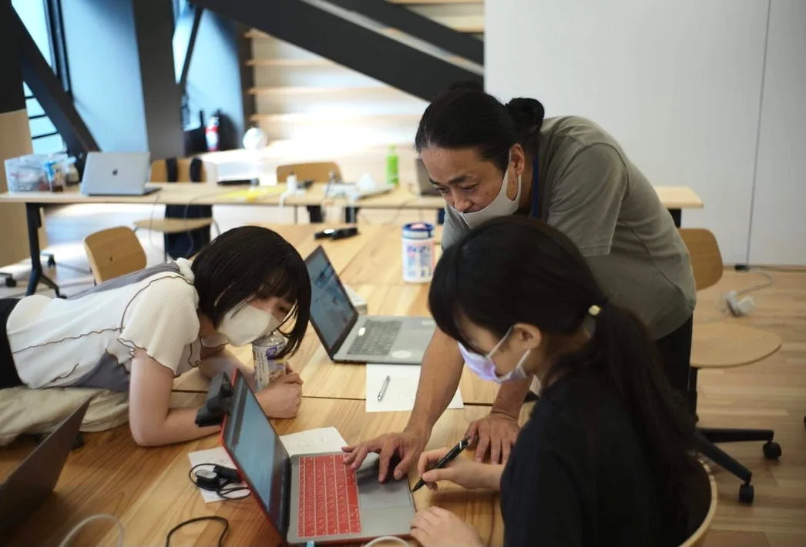

*Tetsu showing how to code with Processing among a small student group.*

When students join my lab as juniors, I carefully listen to their interests (such as manga, anime, games, music, places they frequent, etc.), artistic skills, hobbies, and so on before I try to teach fundamental electronics or programming. Some of them are interested in technology, others dislike it, and only want to work on art or music. When I assign them work, I usually team them up based on their interests.

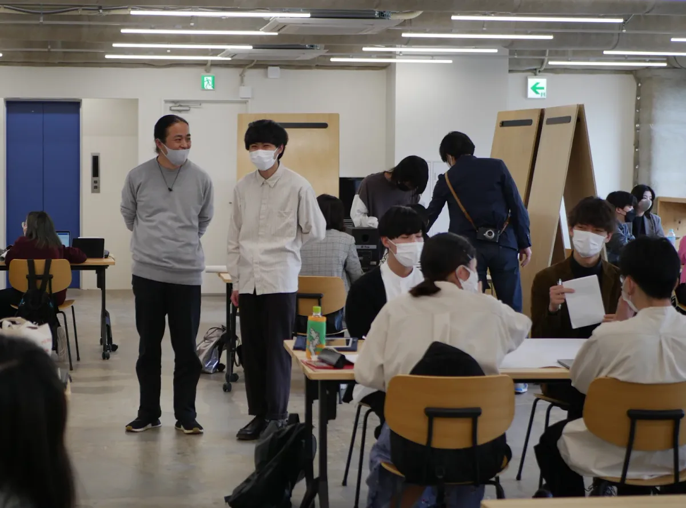

*Tetsu talking with a student assistant who supports other students.*

For the first group project (3 to 5 students in each group), I assigned them to create a work based on the theme of “Environment with Technology’’, so that students try to build their concepts from their first production together. Most Japanese students are very collaborative. For example, students who already know some programming lead the team and others try to learn from them or add their artistic creativity as much as possible. My role is to show possibilities for their production not only by merely providing sample code but also by mentoring students as they code side-by-side with the help of student assistants. I don’t discriminate based on their differences in programming skills and I tell them not to focus on tweaking parameters without fully understanding the sample code, but to be as relaxed as possible and to trust their own creativity. The most important thing is to create a flexible environment that encourages cooperation and learning from each other.

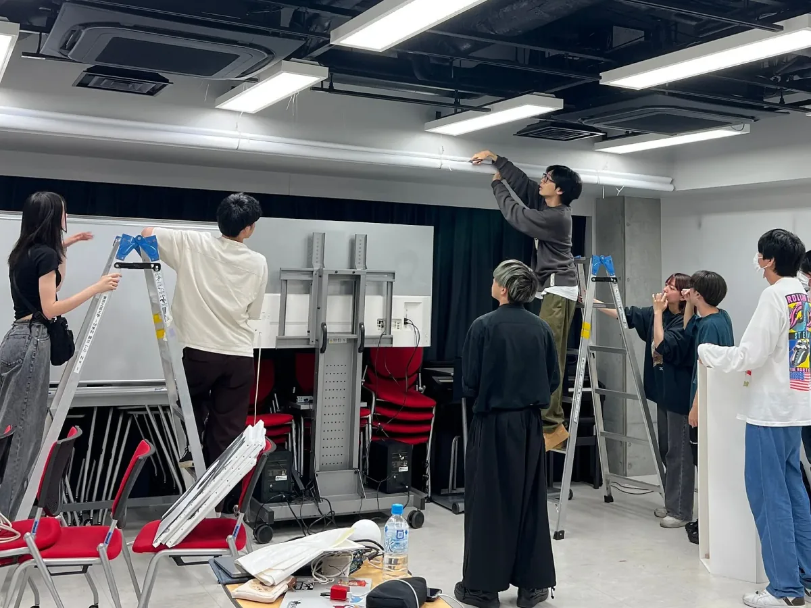

*Students setting up their projects together.*

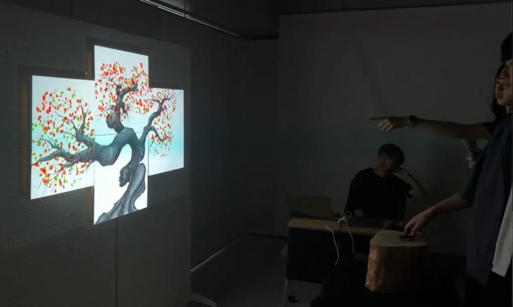

*Students’ group works in 2023 June, using a physical controller with projection mapping on hand drawing.*

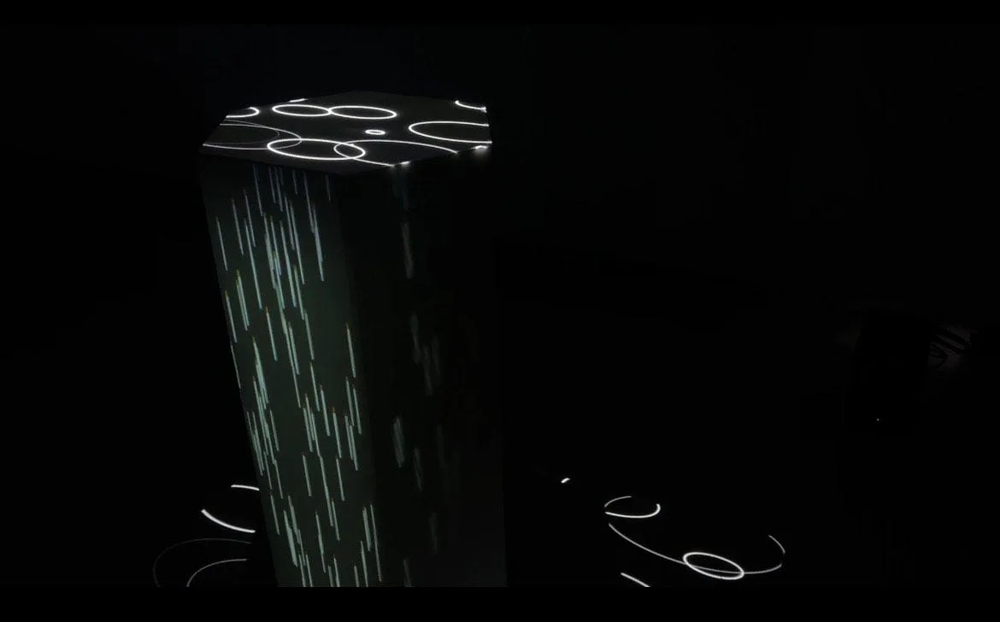

*Students’ group works in 2023 June, audio visual projection mapping.*

When working with technology, it is fun for us to learn new skills. These moments create an adrenaline rush, but the excitement fades in an instant. As a person who thinks about education, art, and code, I seek to create experiences that support lasting interest in media and technology, to make what students learn here as useful as possible for their post-graduation paths. Although the number of students I can teach at any one time is small, I feel that my goal is to help them realize their ideas and imaginations through their artwork and to work with them as they struggle to find the motivation to learn creatively in this fast-paced information society.

#### Hope for next 20 Years

Red Burns taught me that, “The computer is like a pen. You have to have a pen and know penmanship, but neither will write the book for you.” As I have learned from my experiences, she is right. No matter how fast and accelerated the IT society becomes, the direction of society will eventually be determined by human beings. Sometimes technology can be a weapon that hurts people, and sometimes it can be shaped by human ego.

I hope that Processing will continue to be used around the world for the next 20 years, as I pray and meditate for a peaceful and harmonious planet without war or discrimination today!

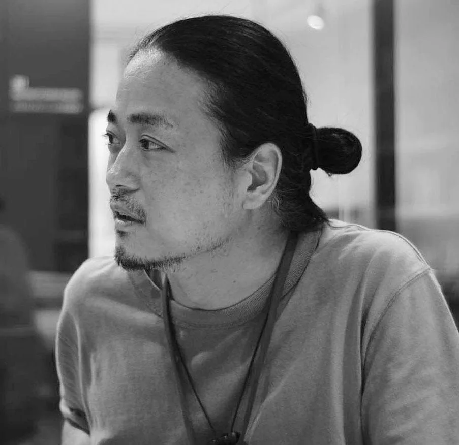

*A headshot of Tetsu Kondo.*

*Tetsu Kondo (he/him) is a Japanese designer, artist, musician, creative director and professor. He graduated from Waseda University in Tokyo and the Interactive Telecommunications Program (ITP) at New York University (NYU) Tisch School of Arts in 2002, and became a resident researcher. His breadth of expertise ranges from interactive design, user experience, advertisement, media consulting, and software development to live audio-visual programming, and art installations. He was involved in large-scale productions such as installation at Tokyo Skytree Sumida Aquarium for Jellyfish, interactive escalator at Ikebukuro Seibu department store. Also as a creative advisor, he’s worked for Google Creative Lab for the project of Japanese elderly people’s quality of life. He teaches at Tokyo Polytechnic (Kougei) University and Musashino Art University. He plays the guitar and didgeridoo, and practices meditation.*
