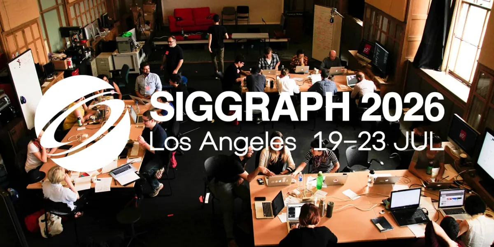

Join Processing Foundation at **SIGGRAPH 2026** to learn how
[Processing Java](https://processing.org/) and [p5.js](https://p5js.org/) are
providing a learning environment and a technical substrate for artists,
educators, and developers to create generative art and interaction design
through code.

SIGGRAPH, the premier conference and exhibition on computer graphics and
interactive techniques, takes place in Los Angeles at the L.A. Convention Center
from **Sunday, July 19 to Thursday, July 23, 2026**.

Processing Foundation will present sessions exploring the future of the
Processing ecosystem, youth-led immersive theatre, and the impact of p5.js in
educational spaces.

#### **Where to Find Us:**

#### [The State of Creative Coding: Processing Foundation Community Meetup](https://s2026.conference-schedule.org/presentation/?id=bof_136&sess=sess341)

**Monday, 20 July 2026, 2:30 pm PDT  
Room 510, 1201 South Figueroa Street**

Connect with the Processing Foundation community as we share future technical
milestones of the Processing ecosystem with 2D and 3D demonstrations. You’ll
gain insight on the R&D work currently underway to pave the path for
Processing 5.

#### [“Live from LA!”: Facilitating Personal and Political Storytelling through Immersive Youth Theater](https://s2026.conference-schedule.org/presentation/?id=gensub_395&sess=sess209)

**Tuesday, 21 July 2026, 2:00 pm PDT  
Room 501 ABC, 1201 South Figueroa Street**

Learn how p5.js tools are being used to support immersive youth-led theater
productions and political storytelling through personal narrative. Blending
dance, poetry, and projection-mapping, “Live from LA!” used p5.js tools to
support youth authorship while navigating practical constraints and safety.

#### [Art + Code: Case Study in Expanding Access with p5.js](https://s2026.conference-schedule.org/presentation/?id=gensub_555&sess=sess213)

**Wednesday, 22 July 2026, 11:05 am PDT  
Room 501 ABC, 1201 South Figueroa Street**

Widely used for making and teaching algorithmic art, how is p5.js transforming
access and expression in classrooms? Learn how p5.js tools are grounding
web-based interactive graphics for students to expand the possibilities of
creative software tools, and suggest new professional opportunities.

#### **Let’s Connect**

SIGGRAPH 2026 is a great opportunity to connect with the industry and community.
If you’re attending, we’d love to meet you. Schedule a time to connect with Xin
Xin, Co-Executive Director, at
[xin@processingfoundation.org](mailto:xin@processingfoundation.org).
