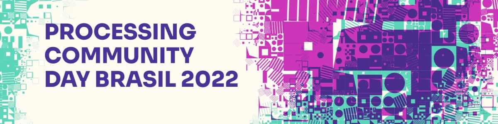
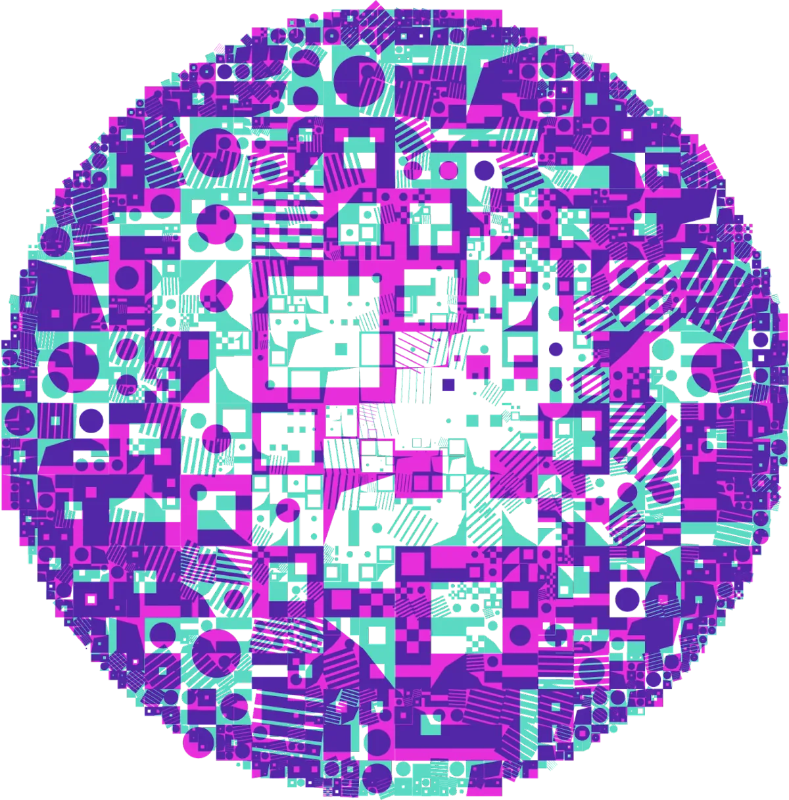
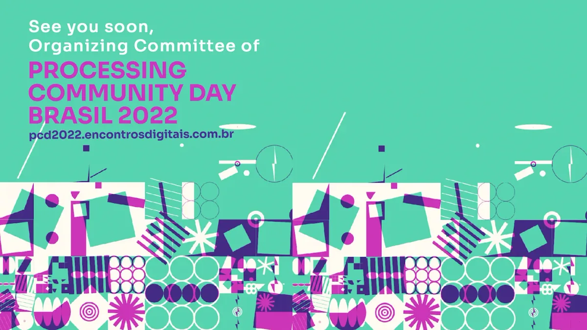
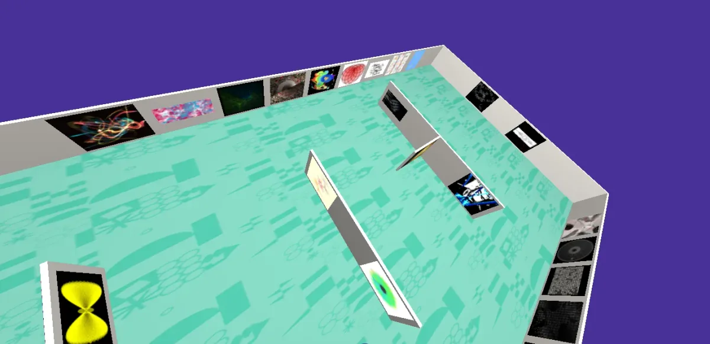

*Processing Community Day Brasil 2022 Visual Identity Title*

Processing Community Day is a unique event because it is organized voluntarily by the community and seeks to unite people to share ideas about art and technology. The event days are dedicated to exploring digital media as creative spaces. It is a fun and an excellent opportunity to learn new things and meet other people interested in art and technology.

In 2022, we organized the second national edition of the event, [Processing Community Day Brasil 2022](https://pcd2022.encontrosdigitais.com.br), the result of the collaboration of people interested in strengthening the national community of artist-programmers and promoting activities that make knowledge more accessible. The spirit of generosity is an essential element that motivates people to donate their time to share knowledge and organize the event. Seeing new people interested in learning motivates the continuation of this effort, as the idea of the event bets on diversity as an essential element for future technology to promote equity and reflect people’s interests.

-   PCD Brasil

> Editor’s note: This event received direct financial support from the Processing Foundation to help sustain and extend the work of PCD Brasil. Funds from the Processing Foundation helped pay for the video archives of the event that is publicly available to all for free. We look forward to supporting PCD Brasil again in the future and extending that support to other PCD initiatives globally.

#### PCD Brasil 2022 Content

13 activities were organized and paved the way for those who want to start in the area, adding up to 19 hours of [content published on YouTube](https://www.youtube.com/@ProcessingCommunityDayBrasil/videos) with sign language (LIBRAS) available.

1.  OPENING — [ORGANIZING COMMITTEE  
    ](https://pcd2022.encontrosdigitais.com.br/)[https://www.youtube.com/watch?v=BYb83ir6Vz0](https://www.youtube.com/watch?v=BYb83ir6Vz0&t=1118s)
2.  WORKSHOP — Introduction to programming in Javascript — With [GUILHERME RANOYA  
    ](https://www.ranoya.com/)[https://www.youtube.com/watch?v=IgcRLUcK-14](https://www.youtube.com/watch?v=IgcRLUcK-14&t=4s)
3.  LECTURE — Generative Art with Pen Plotters — With [MARCELO PRATES  
    ](https://marceloprates.github.io/)[https://www.youtube.com/watch?v=JpdP-6kArWk](https://www.youtube.com/watch?v=JpdP-6kArWk&t=5s)
4.  PERFORMANCE — The Processing Maze — With [GUILHERME SILVEIRA  
    ](https://www.guilhermesilveira.org/)[https://www.youtube.com/watch?v=liCrpecRaek](https://www.youtube.com/watch?v=liCrpecRaek)
5.  LECTURE — Autonomous Agents (and their creations) — With [MATEUS BERRUEZO  
    ](https://codigotranscendente.github.io/livro/about.html)[https://www.youtube.com/watch?v=2dYJqV2s19c](https://www.youtube.com/watch?v=2dYJqV2s19c)
6.  WORKSHOP — Image Generation with AI: a collection of tools for experimentation — With [FILIPE CALEGARIO  
    ](https://filipecalegario.net/)[https://www.youtube.com/watch?v=4nF\_33VcQ-U](https://www.youtube.com/watch?v=4nF_33VcQ-U)
7.  WORKSHOP — Video Synthesizers — creating images in Processing — With [RODRIGO REZENDE  
    ](https://www.instagram.com/rodrigorez/)[https://www.youtube.com/watch?v=6na4cgitU-0](https://www.youtube.com/watch?v=6na4cgitU-0&t=1s)
8.  TALK — Conversations about Dall-e 2, Mid journey and Stable Diffusion: Impacts on Art — PARTICIPANTS: [ALEXANDRE RANGEL](https://www.alexandrerangel.art.br/), [GUILHERME SILVEIRA](https://www.guilhermesilveira.org/), [LEO SAMPAIO](https://scholar.google.com.br/citations?user=vunj2dMAAAAJ&hl=en), AND [VANESSA ROSA](https://va2rosa.com/). MEDIATION: [SERGIO VENANCIO  
    ](https://sergiovenancio.art/)[https://www.youtube.com/watch?v=huq8TdHK5Dw](https://www.youtube.com/watch?v=huq8TdHK5Dw&t=2s)
9.  WORKSHOP — Creating with color palettes in p5.js — With [GUSTAVO MANDOLESI  
    ](https://www.instagram.com/remistura_studio/)[https://www.youtube.com/watch?v=O7Aq1NbZPm0](https://www.youtube.com/watch?v=O7Aq1NbZPm0)
10.  WORKSHOP — First steps in creative programming with Python — With [ALEXANDRE VILLARES  
     ](https://abav.lugaralgum.com/)[https://www.youtube.com/watch?v=1JOigKDODsg](https://www.youtube.com/watch?v=1JOigKDODsg)
11.  WORKSHOP — Arcade Game from scratch! — With [JOHN (INTROSCOPIA)  
     ](https://introscopia.github.io/)[https://www.youtube.com/watch?v=a9RWSq-Bx4A](https://www.youtube.com/watch?v=a9RWSq-Bx4A)
12.  LECTURE — Processing + Data: between art and design — With [BARBARA CASTRO  
     ](http://barbaracastro.com.br/)[https://www.youtube.com/watch?v=wfrmim\_rUPQ](https://www.youtube.com/watch?v=wfrmim_rUPQ&t=4s)
13.  WORKSHOP — An introduction to creative coding with an introduction to calligraphy and vice versa — With [MARIANA LEAL  
     ](https://marileal.github.io/)[https://www.youtube.com/watch?v=39xKFGmHao0](https://www.youtube.com/watch?v=39xKFGmHao0)

#### Virtual Gallery

We also organized the second exhibition of works carried out in creative coding. The 32 artworks that used programming as a tool were presented in the [virtual gallery](https://pcd2022.encontrosdigitais.com.br/galeria/). The curators organized the exhibition into three parts:

1.  Abstract, generative, and mathematical works involving sound and interactivity.
2.  Works that use figurative elements, whether of 3D or photographic origin.
3.  Typographic and graphic design work.

*Aerial view of Virtual Gallery of Processing Community Day Brasil 2022*

Virtual Gallery of Processing Community Day Brasil 2022.   
Link: [https://pcd2022.encontrosdigitais.com.br/galeria/](https://pcd2022.encontrosdigitais.com.br/galeria/)

*Circle with the Visual Identity of Processing Community Day Brasil 2022*

#### Visual Identity

The event’s visual identity was created using Processing as a tool; the concept was inspired by the community’s diversity and the programming’s creative potential. The embryo of the idea was to create a composition from small simple codes. The presentation of the creative process is available on the event [Noite de Processing’s channel](https://www.youtube.com/watch?v=Rj2hosQq_j0). More than 100 sketches were produced, and the source code used to create the graphic elements are available on [Github](https://github.com/Processing-Brasil/PCD-Brasil-2022-Gerador).

The event’s website presents the complete schedule, the gallery, and other information: [https://pcd2022.encontrosdigitais.com.br/](https://pcd2022.encontrosdigitais.com.br/)

#### Previous Editions

It is also possible to access the content produced in previous editions of the PCD in Brazil:

-   [PCD Brasil 2021](https://pcd2021.encontrosdigitais.com.br/)
-   [PCD Rio de Janeiro 2020](https://www.openprocessing.org/class/63704)
-   [PCD São Paulo 2020](https://arteprog.space/PCD-SP-20/)
-   [PCD Rio de Janeiro 2019](http://life.dad.puc-rio.br/pcd2019/)
-   [PCD São Paulo 2019](https://arteprog.space/PCD-SP-19/PT/)
-   [PCD Santa Maria 2019](http://brunoruchiga.com/pcd-santamaria/)

#### What’s next

Due to the COVID-19 pandemic, since 2020 the community began to organize the event in an online format, which made it possible to document the content and make it available for others; this was an unarguable gain in making content more accessible in the Portuguese language.

The groups that organized themselves for local editions of the event came together in 2021 to create their first national edition. As enthusiasts driven by the desire to see something new happen, and without a consideration to the dimension of what we were doing, this first edition lasted 9 days with 413 participants. It was an incredible exchange between people from all over Brazil. We decided to repeat the format in 2022 and reduce the number of activities to provide more quality in capturing and editing. We understand that the event is live, but special care is also needed to put all content on YouTube. That is why the sponsorship of the Processing Foundation was essential, as it believed in the commitment of the Brazilian community to organize it. The collective and voluntary effort can count on the help of companies specialized in editing and translation. Another difference in the 2022 edition was the commitment to communication that reached people beyond the community network, targeting the young audience in public education. For this, part of the budget was applied to sponsored posts on Instagram. Everything was speedy, and it was a great learning experience for us to do something even better in the next edition.

**We want people to believe that programming is available for them and that they can learn from a welcoming Brazilian community.**

The engagement achieved in all editions of the event shows its potential. If you want to enter the world of art and technology, these are the channels where the Brazilian community communicates; come join us:

**Telegram** — [https://t.me/programacaocriativa](https://t.me/programacaocriativa)

**Instagram** — [https://www.instagram.com/processingbrasil/](https://www.instagram.com/processingbrasil/)

**Noites de Processing** — [https://garoa.net.br/wiki/Noite\_de\_Processing](https://garoa.net.br/wiki/Noite_de_Processing)

**Encontros Digitais** — [https://encontrosdigitais.com.br](https://encontrosdigitais.com.br)

**Email group** — [https://groups.google.com/g/processing-brasil](https://groups.google.com/g/processing-brasil)

O Processing Community Day é um evento especial porque é organizado de forma voluntária pela própria comunidade, e porque busca reunir pessoas para compartilhar ideias sobre arte e tecnologia. São dias dedicados a explorar os meios digitais como espaços criativos. É divertido e uma ótima oportunidade para aprender coisas novas e conhecer outras pessoas interessadas em arte e tecnologia.

Em 2022 organizamos a segunda edição nacional do evento, o [Processing Community Day Brasil 2022](https://pcd2022.encontrosdigitais.com.br), resultado da colaboração de pessoas interessadas em fortalecer a comunidade nacional de artistas programadores, promovendo atividades que tornem o conhecimento mais acessível. O espírito de generosidade é um importante elemento que motiva as pessoas a doarem seu tempo para compartilhar o conhecimento e organizar o evento. Ver novas pessoas interessadas em aprender motiva a continuação desse esforço, pois a ideia do evento aposta na diversidade como um elemento importante para que a tecnologia do futuro promova maior equidade e seja reflexo do interesse das pessoas.

#### **Conteúdo produzido no PCD Brasil 2022**

Foram organizadas 13 atividades que abrem caminho para quem quer iniciar na área, que juntos somam 19 horas de [conteúdos publicados no YouTube](https://www.youtube.com/@ProcessingCommunityDayBrasil/videos), os vídeos foram gravados ao vivo com a participação do público, posteriormente foram editados para ficar mais dinâmicos, e por fim traduzidos para LIBRAS.

1.  ABERTURA — COMISSÃO ORGANIZADORA  
    [https://www.youtube.com/watch?v=BYb83ir6Vz0](https://www.youtube.com/watch?v=BYb83ir6Vz0&t=1118s)
2.  OFICINA — Introdução à programação em Javascript — Com GUILHERME RANOYA  
    [https://www.youtube.com/watch?v=IgcRLUcK-14](https://www.youtube.com/watch?v=IgcRLUcK-14&t=4s)
3.  PALESTRA — Arte Generativa com Pen Plotters — Com MARCELO PRATES  
    [https://www.youtube.com/watch?v=JpdP-6kArWk](https://www.youtube.com/watch?v=JpdP-6kArWk&t=5s)
4.  PERFOMANCE — O Labirinto de Processing — Com GUILHERME SILVEIRA  
    [https://www.youtube.com/watch?v=liCrpecRaek](https://www.youtube.com/watch?v=liCrpecRaek)
5.  PALESTRA — Agentes Autônomos (e suas criações) — Com MATEUS BERRUEZO  
    [https://www.youtube.com/watch?v=2dYJqV2s19c](https://www.youtube.com/watch?v=2dYJqV2s19c)
6.  OFICINA — Geração de Imagens com IA: coletânea de ferramentas para experimentação — Com FILIPE CALEGARIO  
    [https://www.youtube.com/watch?v=4nF\_33VcQ-U](https://www.youtube.com/watch?v=4nF_33VcQ-U)
7.  OFICINA — Vídeo Sintetizadores — criando imagens em processing — Com RODRIGO REZENDE  
    [https://www.youtube.com/watch?v=6na4cgitU-0](https://www.youtube.com/watch?v=6na4cgitU-0&t=1s)
8.  CONVERSA — Conversas sobre Dall-e 2, Midjourney e Stable Diffusion: Impactos na Arte — PARTICIPANTES: ALEXANDRE RANGEL, GUILHERME SILVEIRA, LEO SAMPAIO E VANESSA ROSA. MEDIAÇÃO: SERGIO VENANCIO  
    [https://www.youtube.com/watch?v=huq8TdHK5Dw](https://www.youtube.com/watch?v=huq8TdHK5Dw&t=2s)
9.  OFICINA — Criando com paletas de cores em p5.js — Com GUSTAVO MANDOLESI  
    [https://www.youtube.com/watch?v=O7Aq1NbZPm0](https://www.youtube.com/watch?v=O7Aq1NbZPm0)
10.  OFICINA — Primeiros passos na programação criativa com Python — Com ALEXANDRE VILLARES  
     [https://www.youtube.com/watch?v=1JOigKDODsg](https://www.youtube.com/watch?v=1JOigKDODsg)
11.  OFICINA — Joguinho Arcade do Zero! — Com JOHN (INTROSCOPIA)  
     [https://www.youtube.com/watch?v=a9RWSq-Bx4A](https://www.youtube.com/watch?v=a9RWSq-Bx4A)
12.  PALESTRA — Processing + Dados : entre a arte e o design — Com BARBARA CASTRO  
     [https://www.youtube.com/watch?v=wfrmim\_rUPQ](https://www.youtube.com/watch?v=wfrmim_rUPQ&t=4s)
13.  OFICINA — Uma introdução à programação criativa com uma introdução à caligrafia e vice-versa — Com MARIANA LEAL  
     [https://www.youtube.com/watch?v=39xKFGmHao0](https://www.youtube.com/watch?v=39xKFGmHao0)

### Galeria Virtual

Também organizamos a segunda exposição de trabalhos realizados em programação criativa. Os 32 trabalhos que utilizaram programação como ferramenta foram organizados na [galeria virtual](https://pcd2022.encontrosdigitais.com.br/galeria/). A curadoria organizou a exposição em 3 partes:

1.  Trabalhos abstratos, gerativos e matemáticos, que envolvem som e interatividade.
2.  Trabalhos que utilizam elementos figurativos, sejam de origem 3D ou fotográfica.
3.  E trabalhos tipográficos e de design gráfico.

Galeria Virtual do Processing Community Day Brasil 2022.   
Link: [https://pcd2022.encontrosdigitais.com.br/galeria/](https://pcd2022.encontrosdigitais.com.br/galeria/)

### Identidade Visual

A própria identidade visual do evento foi criada utilizando o Processing como ferramenta, o conceito foi inspirado na diversidade da comunidade e no potencial criativo da programação. O embrião da ideia era criar uma composição a partir de pequenos códigos simples. A apresentação do processo criativo encontra-se disponível no [canal do evento Noite de Processing](https://www.youtube.com/watch?v=Rj2hosQq_j0). Foram mais de 100 estudos produzidos, e o código-fonte utilizado para produzir os elementos gráficos encontram-se disponíveis no [github](https://github.com/Processing-Brasil/PCD-Brasil-2022-Gerador).

O site do evento apresenta a programação completa, a galeria e outras informações: [https://pcd2022.encontrosdigitais.com.br/](https://pcd2022.encontrosdigitais.com.br/)

### Edições Anteriores

É possível acessar também o conteúdo produzido nas edições anteriores do PCD no Brasil, algumas das edições foram totalmente presenciais, e dentre as informações disponíveis encontram-se o registro do evento:

-   [PCD Brasil 2021](https://pcd2021.encontrosdigitais.com.br/)
-   [PCD Rio de Janeiro 2020](https://www.openprocessing.org/class/63704)
-   [PCD São Paulo 2020](https://arteprog.space/PCD-SP-20/)
-   [PCD Rio de Janeiro 2019](http://life.dad.puc-rio.br/pcd2019/)
-   [PCD São Paulo 2019](https://arteprog.space/PCD-SP-19/PT/)
-   [PCD Santa Maria 2019](http://brunoruchiga.com/pcd-santamaria/)

### O que esperar para a próxima edição

Desde 2020, em decorrência da pandemia de COVID19, a comunidade começou a organizar o evento no formato online, o que possibilitou produzir conteúdo de forma que ficasse registrado para futuros interessados; esse foi um ganho indiscutível para tornar o conteúdo mais acessível no idioma nacional.

Os grupos que se organizavam para edições locais do evento se uniram em 2021 para criar sua primeira edição nacional. Como entusiastas movidos pela vontade de ver algo novo acontecer e sem uma referência da dimensão do que estavámos fazendo, esta primeira edição teve duração de 9 dias e 413 participantes. Foi uma troca incrível entre pessoas de todo o Brasil, e decidimos repetir o formato em 2022, mas reduzindo a quantidade de atividades para proprocionar maior qualidade da captação e edição, pois entendemos que o evento é ao vivo, mas também é necessário um cuidado especial para colocar todo o seu conteúdo no YouTube. Por isso foi fundamental o patrocínio da Fundação Processing, que acreditou no comprometimento da comunidade nacional em organizar-lo. O esforço coletivo e voluntário pode contar com o auxílio de empresas especializadas em edição e tradução. Outro diferencial da edição de 2022 foi apostar numa comunicação que alcançasse pessoas para além da rede da comunidade, especialmente um público jovem da rede do ensino público. Para isso, uma parte da verba foi aplicada em postagens patrocinadas no Instagram. Foi tudo muito rápido, e serviu de grande aprendizado para fazermos algo ainda melhor na próxima edição.

**Queremos que as pessoas acreditem que a programação está disponível para elas, e que elas têm condições de aprender junto a uma comunidade nacional acolhedora.**

Acreditamos que o engajamento alcançado em todas as edições do evento mostram seu potencial. Se você deseja ingressar no mundo da arte e tecnologia, estes são os canais onde a comunidade brasileira se comunica, vem fazer parte conosco:

**Telegram** — [https://t.me/programacaocriativa](https://t.me/programacaocriativa)

**Instagram** — [https://www.instagram.com/processingbrasil/](https://www.instagram.com/processingbrasil/)

**Noites de Processing** — [https://garoa.net.br/wiki/Noite\_de\_Processing](https://garoa.net.br/wiki/Noite_de_Processing)

**Encontros Digitais** — [https://encontrosdigitais.com.br](https://encontrosdigitais.com.br)

**Grupo de email** — [https://groups.google.com/g/processing-brasil](https://groups.google.com/g/processing-brasil)

