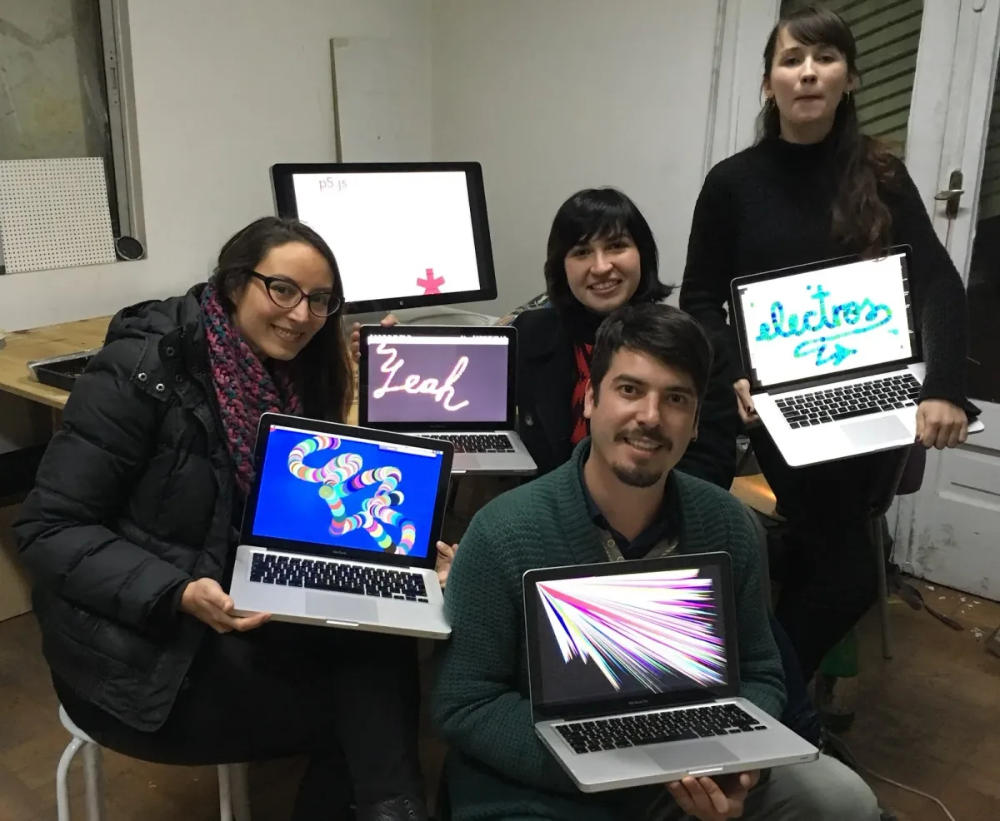
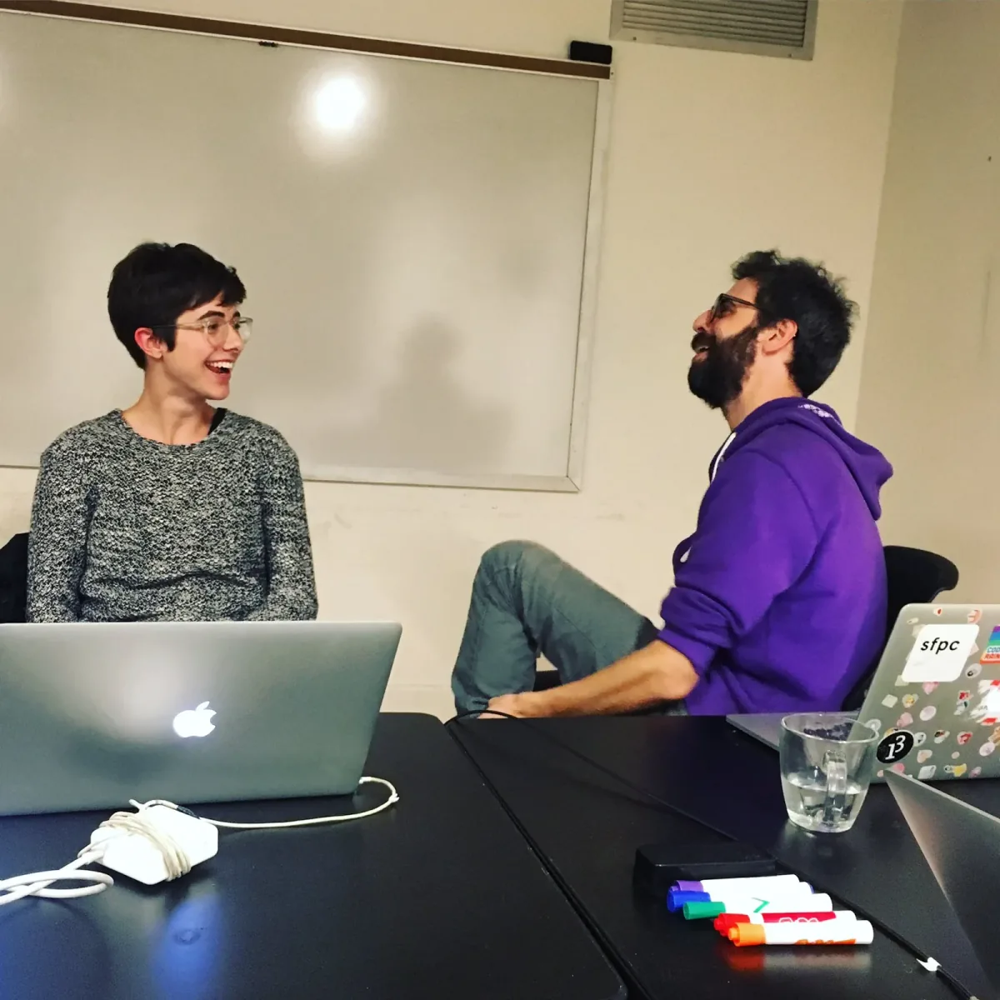
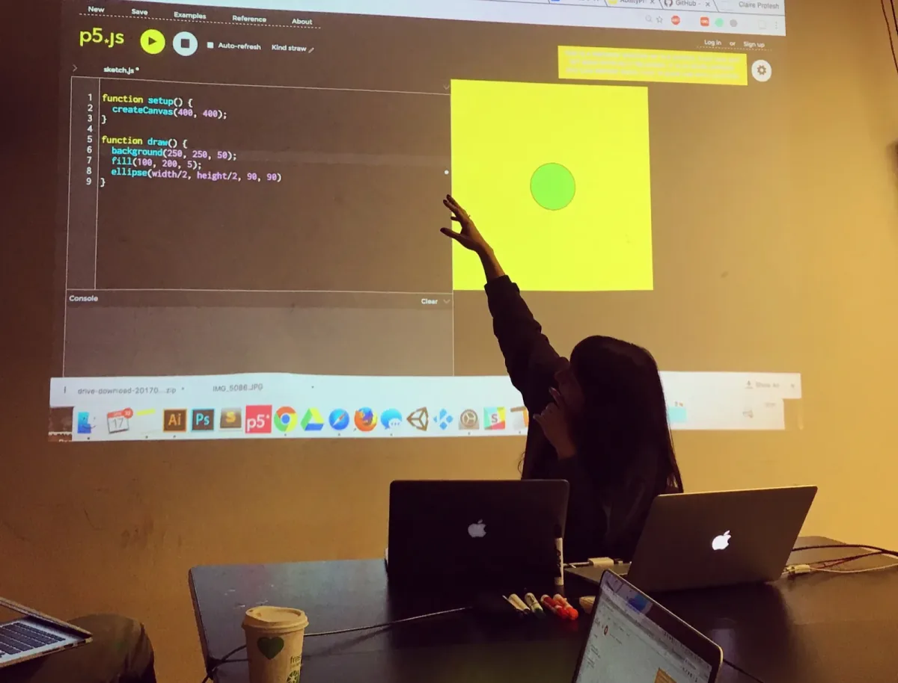
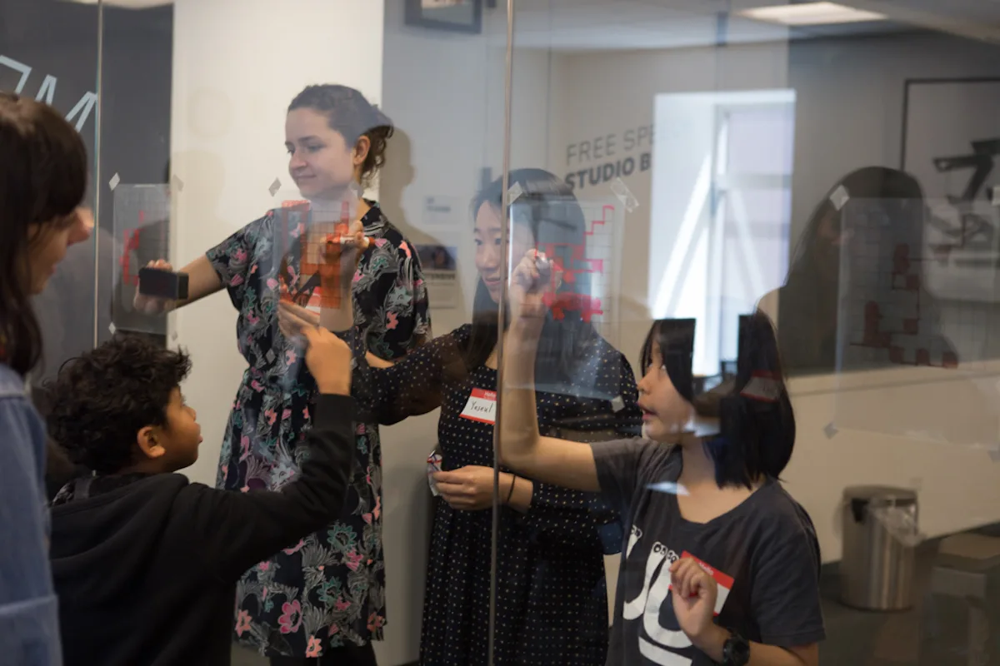
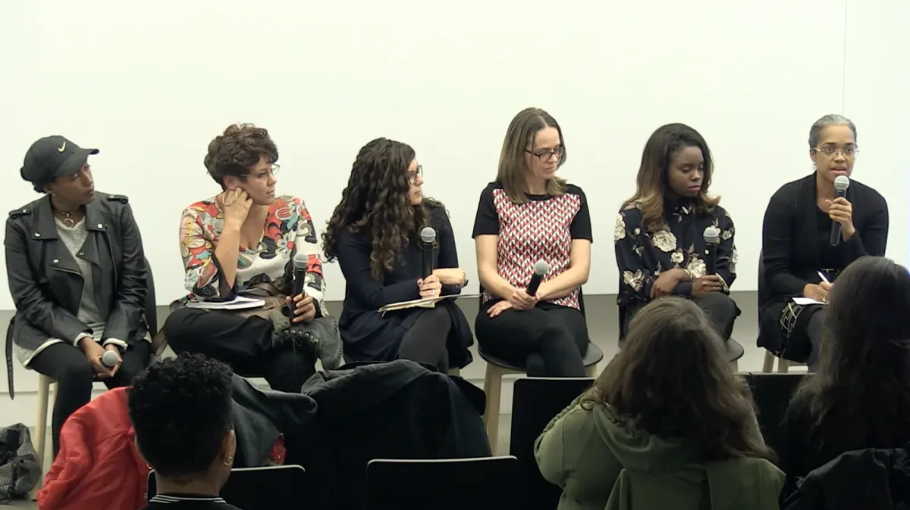
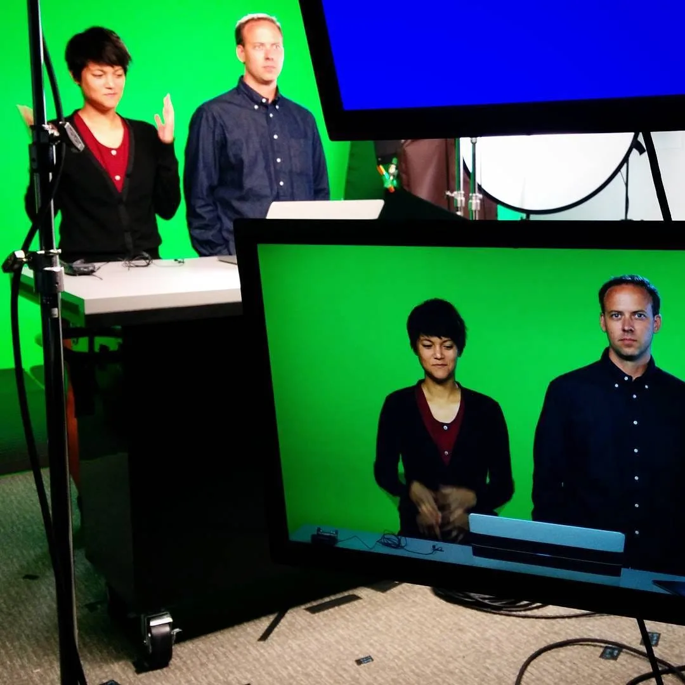
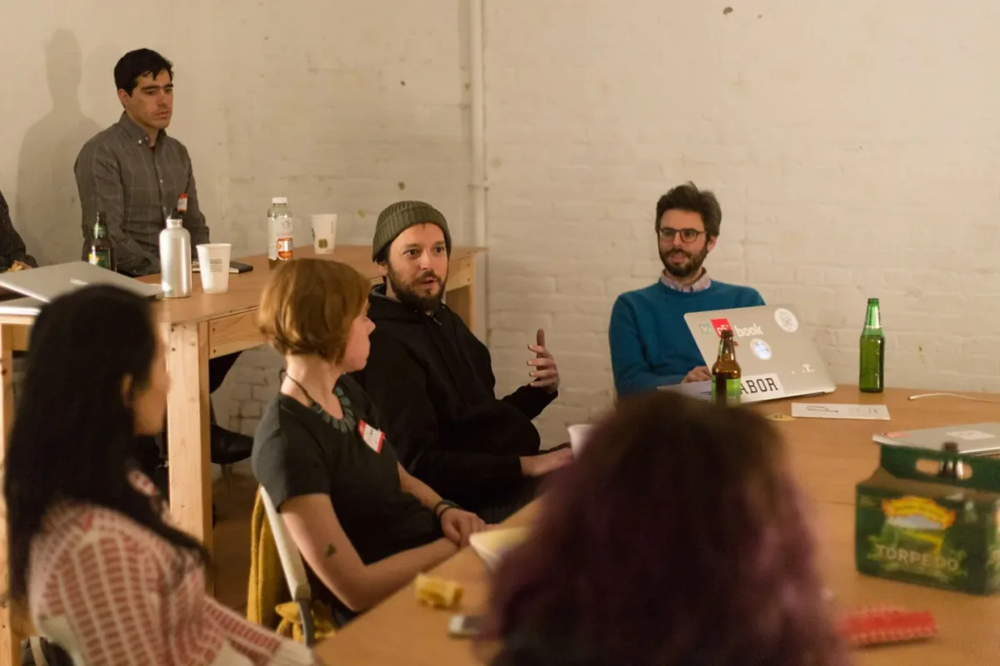

Compiled by Casey Reas

Things are always moving quickly with our software and initiatives. We don’t often take the time to summarize and publish what we’ve done, but we hope to do more of that. As a way forward, this short report summarizes our efforts in 2016. For more general information, the [Processing Foundation website](https://processingfoundation.org/) defines our long-term goals and activities.

### Software

The Foundation supports the creation and maintenance of the [Processing](https://processing.org), [p5.js](https://p5js.org), and [Processing.py](https://py.processing.org) platforms. The Processing project includes the Processing Development Environment (PDE) and the core software libraries as well as Android for Processing and support for Raspberry Pi. The p5.js project includes the p5.js JavaScript library and a new online editor in development. Processing.py is a Mode for the PDE that lets people write Processing programs with Python syntax.

#### Processing

Since the first release in 2001, Ben Fry and Casey Reas continue to lead the Processing Project. In addition, [a small team of developers](https://processing.org/people/) keeps things moving and GitHub pull requests from the community have been essential for bug fixes.

After the major release of Processing 3 in the fall of 2015, a dozen Processing releases were made throughout 2016 to improve and update the software. The major changes with Processing 3 are described in a [video created by Dan Shiffman](https://vimeo.com/140600280).

In 2016, Processing 3.1 was released in May and 3.2 was released in August, with smaller releases between. The focus was on incremental improvements and bug fixes. The final release of the year was 3.2.3 in November, which focused on improvements to the Contribution Manager, the way Libraries, Tools, and Modes are installed and updated. Also in these releases, Gottfried Haider has continued to improve the support for Processing on Raspberry Pi and other ARM devices like it. The Raspberry Pi Foundation released a wonderful [Introduction to Processing](https://www.raspberrypi.org/learning/introduction-to-processing/) video.

In July, Andres Colubri posted a major update to [Processing for Android](http://android.processing.org/) as well as a new website to better document the project. Processing for Android allows the creation of Android apps using Processing. You can run your Processing sketches on Android devices (phones, tablets, smartwatches) with little or no changes in the code.

The complete list of changes and releases in 2016 are [online on GitHub](https://raw.githubusercontent.com/processing/processing/master/build/shared/revisions.txt).

#### p5.js

The intrepid Lauren McCarthy continues to lead the p5.js project. In 2016, the p5.js software was extended into 3D with WebGL integration and OBJ 3D model loading capabilities through the work of Kevin Siwoff and Matthew Kaney. Support for XML files was added and significant bug fixes and improved documentation strengthened the existing features of the project. The complete list of changes in releases are [online on Github](https://github.com/processing/p5.js/releases).

Aarón Montoya-Moraga has been in the process of translating the website and educational materials into Spanish, and tested these resources in a series of p5.js workshops in Santiago, Chile. Look out for the launch of p5js.org in Spanish in 2017, as well as a Spanish version of *Getting Started with p5.js*.

*Participants at p5.js workshop in Santiago, Chile, led by Aarón Montoya-Moraga. (Image credit: Aarón Montoya-Moraga.)*

We also began work on a p5.js web editor, a new environment for writing p5.js code in the browser, led by Cassie Tarakajian. Shawn Van Every and Seth Kranzler developed the serial communication protocol, allowing the web editor to connect to an Arduino or other serial devices. This project has been through a series of alpha releases in 2016 and was in continuous develop and testing in fall 2016. Making this project public is a major goal for the first half of 2017.

*Cassie Tarakajian, lead developer of the p5.js web editor, discussing the project with Daniel Shiffman.*

Significant development energy in 2016 went into making p5.js more accessible. Through the [fellowship](https://processingfoundation.org/fellowships) of Claire Kearney-Volpe and work of Mathura Govindarajan, the p5.js website and web editor were made screen-reader accessible, and the web editor includes a range of other features that help blind and seeing impaired programmers. Users can set an option to give audio rather than visual feedback when there are errors, and the editor can give audio descriptions and tonal cues of what’s happening graphically on the canvas.

*Claire Kearney-Volpe demonstrates the p5.js web editor high-contrast mode and other accessibility features for a group of teachers in NYC.*

#### **Processing.py**

Allison Parrish’s 2016 [Fellowship](https://processingfoundation.org/fellowships) focused on improvements to Processing.py. The work was highly technical, but also focused on education. In addtion to fixing a number of issues with Processing.py, she created two new Processing.py tutorials, “[Processing.py on the Command Line](http://py.processing.org/tutorials/command-line/)” which shows how to break free from the Processing Development Environment to develop Processing.py sketches on the command line and “[Python, Jython and Java](http://py.processing.org/tutorials/python-jython-java/)” which covers how Processing.py brings together Python, Jython and Java.

### Advocacy and Initiatives

#### **Fellowships**

In 2016, we offered our first round of open-call Processing Fellowships. We had 45 submissions and 5 projects were selected:

-   Tega Brain and Luisa Pereira, Learning p5.js
-   Jess Klein and Atul Varma, Friendly Errors
-   Claire Kearney-Volpe, The Processing Accessibility Project
-   Allison Parrish, Processing.py
-   Digital Citizens Lab, Coding Comic

The fellowship projects are summarized in a post by [Lauren McCarthy on Creative Applications](http://www.creativeapplications.net/processing/processing-foundation-fellows-2016-open-call-for-2017/) and the idea and details of the fellowships are discussed by [Johanna Hedva in an interview with Charlotte Cotton](https://www.publicprivatesecret.org/articles-essays-interviews/interview-processing-foundation-director-of-initiatives-johanna-hedva-with-curator-in-residence-charlotte-cotton).

*Luisa Pereira and Claire Kearney-Volpe helping facilitate a sign language based p5.js workshop led by Taeyoon Choi. (Image credit: Taeyoon Choi.)*

#### **International Center of Photography Events**

The International Center of Photography (ICP) in New York featured a [series of events related to the Processing Foundation](https://www.publicprivatesecret.org/events/) during their exhibition *Public, Private, Secret*. During fall 2016, Casey Reas shared his software, the Digital Citizens Lab presented their point of view on STEM teaching, Claire Kearney-Volpe discussed accessibility within technology, and Tega Brain hosted a panel about learning to teach.

*Digital Citizens Lab hosts a panel on STEM teaching at the International Center of Photography. (Image credit: International Center of Photography.)*

#### **Online Courses**

We partnered with Kadenze, an online education platform for the arts, to create and launch two classes that can be taken for free. Dan Shiffman developed [The Nature of Code](https://www.kadenze.com/courses/the-nature-of-code/) and Chandler McWilliams, Casey Reas, and Lauren McCarthy developed [Introduction to Programming for the Visual Arts with p5.js](https://www.kadenze.com/courses/introduction-to-programming-for-the-visual-arts-with-p5-js/info). The Nature of Code launched in early 2016 and the other course launched in fall 2015.

*Lauren McCarthy and Chandler McWilliams green screening at Kadenze HQ.*

#### **Hour of Code**

For the third time, the Processing Foundation updated and presented the [Hello Processing online video tutorial](http://hello.processing.org/) as a part of the annual [Hour of Code](https://code.org/learn), a part of Computer Science Education week.

#### **Learning to Teach, Teaching to Learn**

[Learning to Teach, Teaching to Learn](https://processingfoundation.org/advocacy/learning-to-teach-teaching-to-learn-2016) was a two-day conference in New York for educators who teach computer programming in creative and artistic contexts. Hosted by the [School for Poetic Computation](http://sfpc.io/), the event brought together experienced educators to explore pedagogy, curriculum development, and how to create environments and tools for learning, specifically for interdisciplinary art practices.

*Amit Pitaru talks with teachers at *Learning to Teach, Teaching to Learn* conference at SFPC. (Image credit: SFPC.)*

#### **Women’s Center for Creative Work**

We organized two [Open Tech Lab](https://processingfoundation.org/advocacy/open-tech-lab-2016) events in collaboration with the Los Angeles Women’s Center for Creative Work. These one-night, fun and informal events aimed to support communities of specific groups who have been historically marginalized in the fields of tech, coding, art, and online activism.

### Foundation

As the ambitions of the Processing Foundation have grown, from new directions with the software to new partnerships with like-minded organizations, we have started to scale by making excellent additions to the team.

Johanna Hedva continued in 2016 as the Director of Initiatives and her direction recently shifted to Director of Advocacy. Rhazes Spell joined as the Director of Education. We have started to work with Jesse Cahn-Thompson on a number of things, including the Community Survey and upcoming Membership campaign.

The Processing Foundation is a small team and unlike larger non-profit organizations, Johanna, Rhazes, and Jesse are not working full time, they average about one day a week. We hope to be able to support full-time staff in the future to better support the software and the community.

In 2016, we expanded our Board of Advisors to four people. We were thrilled to welcome Taeyoon Choi, Phoenix Perry, and Josette Melchor to join John Maeda as advisors to the Processing Foundation.

We also launched our first [Community Survey](https://medium.com/@ProcessingOrg/community-survey-5784e4ec74fc) with the goal to learn more about the community to better focus our efforts.

### Fundraising

The good news is that we raised approximately $37,000 USD in 2016 (we’re still working on our 2016 taxes so we don’t have the precise figure at this time.) The bad news is that we spent more money than we brought in. We had money in the bank from past years to cover the shortfall, but we need to raise more money in 2017 to continue to maintain and improve the software and to further advance our public initiatives and advocacy.

The overwhelming majority of the software development is volunteered time from the Foundation Board and from the other core developers on each project. We need to hire people to work on parts of the project that don’t have volunteers and to bring people onto the team who can’t afford to volunteer. As the number of users of our software has continued to grow each year and the expectations from the community have increased, the amount of development work far exceeds the volunteer effort.

We spent much of the end of 2016 preparing to launch a Processing Foundation Membership campaign early in 2017 as a new fundraising technique. We hope this new initiative will help us to meet our goals; we need it to. Please help when and if you can and watch this space for the launch!
