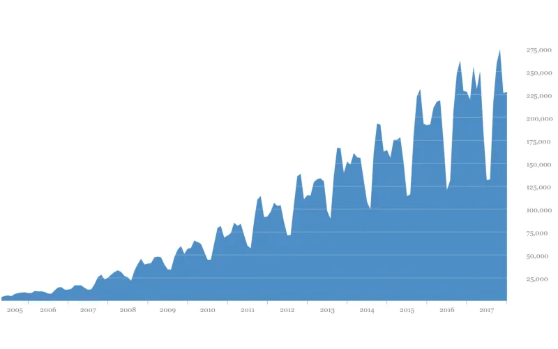
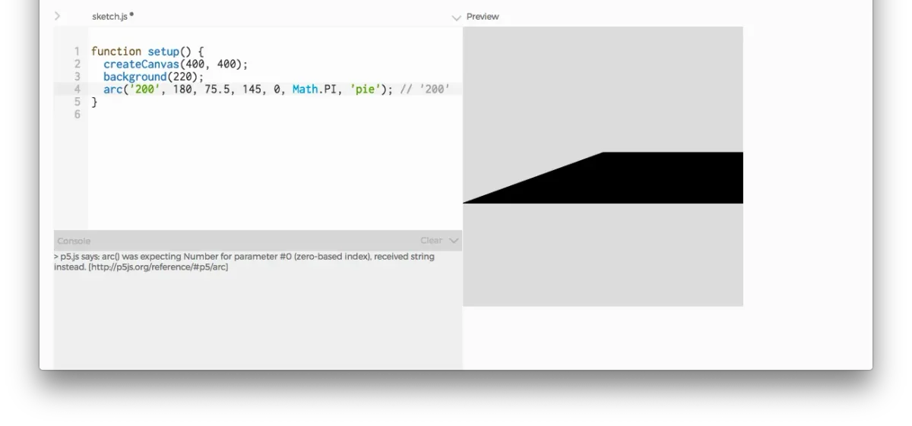
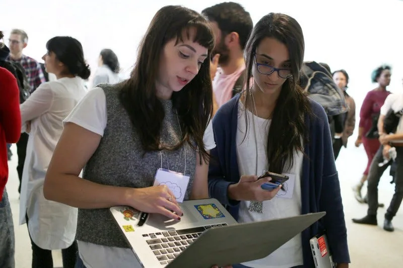
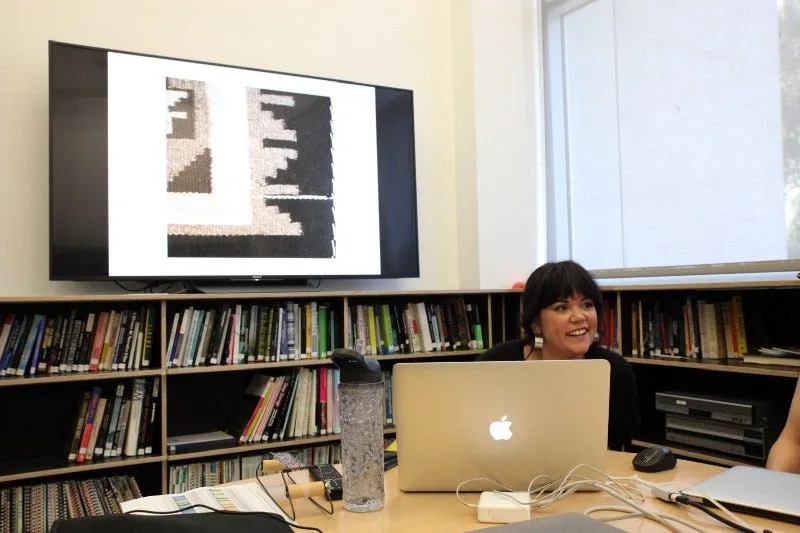
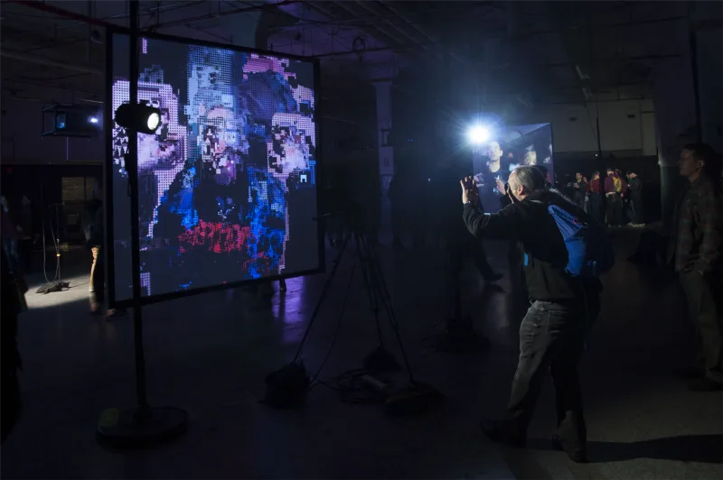

This brief report summarizes our collected efforts in 2017. For more general information, the [Processing Foundation website](https://processingfoundation.org/) defines our long-term goals and activities.

### Software

The Foundation supports the creation and maintenance of the [Processing](https://processing.org), [p5.js](https://p5js.org), and [Processing.py](https://py.processing.org) platforms. The Processing project includes the Processing Development Environment (PDE) and the core software libraries, as well as [Processing for Android](https://android.processing.org/) and [Processing for PI](https://pi.processing.org/) (support for Raspberry Pi). The p5.js project includes the p5.js JavaScript library and a new [online editor](https://editor.p5js.org/) that was officially released in 2018! Processing.py is a Mode for the PDE that lets people write Processing programs with Python syntax.

#### Processing

Since the first release in 2001, Ben Fry and Casey Reas continue to lead the Processing project. In addition, [a small team](https://github.com/processing/processing/graphs/contributors) keeps things moving, and GitHub pull requests from the community have been essential. We released eight versions of the software in 2017, moving from 3.2.4 in January to 3.3.6 in September. The number of people using the software continues to grow. The complete list of changes and releases in 2017 are [online on GitHub](https://raw.githubusercontent.com/processing/processing/master/build/shared/revisions.txt). Many of the changes were bug fixes and other improvements, such as better support for high-res displays, or fixes to address operating system differences as macOS, Windows, and Linux continue to evolve.

*Unique monthly users of the Processing software from 2005–2017. \[Image description: Blue diagram showing dates correlated with the number of people who are using the Processing software each month. The diagrams show that the number of people using the Processing software has increased year by year.\]*

#### p5.js

Major energy went into further developing the p5.js online editor, [led by Cassie Tarakajian](https://medium.com/processing-foundation/a-p5-js-web-editor-for-all-64aaa3f9d767), with help from many other contributors including [Andrew Nicolaou](https://medium.com/processing-foundation/features-and-fixes-in-the-p5-js-editor-722e4b56495e), [Jen Kagan](https://blog.jennnkagan.com/2017/08/19/google-summer-of-code-final-submission/), and [Zach Rispoli](https://medium.com/@zrispo/a-free-to-use-classrooms-system-for-p5-js-5d7b455ded08). The complete list of releases are [online on Github](https://github.com/processing/p5.js/releases). Additional updates were made to the p5 Sound library by [Jeevan Farias](http://jvn.tf/gsoc_workproduct/), mentored by Jason Sigal. A major overhaul of the WebGL renderer was led by [Kate Hollenbach](http://www.katehollenbach.com/gsoc-2017/) and [Stalgia Grigg](https://mlarghydracept.github.io/GSOC17/), mentored by David Wicks. The Friendly Error System also received a significant update from [A. Mira Chung](https://medium.com/processing-foundation/2017-marks-the-processing-foundations-sixth-year-participating-in-google-summer-of-code-d365f62fc463), mentored by Luisa Pereira. [Saksham Saxena](https://github.com/processing/p5.js/blob/master/developer_docs/project_wrapups/sakshamsaxena_gsoc_2017.md), mentored by Lauren McCarthy, made large contributions to p5.js developer operations, updating release build processes and adding github issue templates. [Aarón Montoya-Moraga](https://github.com/montoyamoraga/gsoc_2017) continued his Spanish translation work of the p5.js website and [Introducción a p5.js](https://processingfoundation.press/product/introduccion-a-p5-js/) book. Finally, [Cristobal Valenzuela](https://medium.com/processing-foundation/maps-maps-maps-f0914218c87b) created a mapping library to expand p5.js visualization capabilities, and p5 accessibility efforts continued, led by [Claire Kearney-Volpe](https://medium.com/processing-foundation/p5-accessibility-115d84535fa8).

A number of others contributed code, documentation, educational materials, and discussion online. You can view the full list of contributors [here](https://github.com/processing/p5.js#contributors), and see the instructions at the bottom of that link for instructions for adding yourself if you have contributed in any way. We put out 10 releases during 2017, with downloads from Github regularly reaching into the hundreds of thousands and over 1.5 million for the 0.5.6 release. This statistic excludes all projects linking to p5.js via Content Delivery Network (CDN), using the p5.js Web Editor, or downloading the p5.js library from another source.

*Example of help output by the Friendly Error System, updated by A. Mira Chung, running in the p5.js Web Editor. \[Image description: Code editor with some incorrect code on left, resulting in a drawing of a skewed black rectangle on the right. In the console, the error reads “p5.js says: arc() was expecting Number for parameter #0, received string instead.”\]*

#### Processing for Android

Version 4.0 was released by Andres Colubri in September 2017. It brings several improvements to the Android mode, including new functionality for creating live wallpapers, watch faces, and VR apps. [A new website was launched](https://android.processing.org/) to bring together information about the project, including new tutorials and reference entries.

#### Processing for Pi

Processing for Pi saw eight releases in 2017, which were done in lockstep with the main Processing Project. For his Processing Foundation Fellowship, Gottfried Haider explored various potential applications of this platform and created the related tooling. A [library to interface with thermal printers](https://twitter.com/mrgohai/status/889433999155896320) was created, as was one to [send the sketch output to twitter](https://twitter.com/mrgohai/status/889431008461901824). Processing for ARM devices was updated to work with newer releases of the Raspbian distribution, and started to be usable on the CHIP and [PocketCHIP](https://twitter.com/mrgohai/status/889428093294739456) as well. Support for ARM-based platforms was also added to various popular Processing libraries developed by the community, such as Greg Borenstein’s OpenCV library.

As of October 2017, Processing for Pi had been downloaded roughly 201,000 times — of which 68,000 were for the “traditional” tarball distribution, and 133,000 were for the customized Raspbian image, which was easier to install and to support. In a workshop hosted by Amsterdam-based Hackers & Designers, a group of 24 designers explored the use of this tool while considering the politics of embedded computation in everyday life.

### Processing Community Day

For the first time (in sixteen years!) we planned a day to celebrate the communities that use and support Processing Foundation software. We convened at the MIT Media Lab in Cambridge, Massachusetts on 21 October 2017 to meet and share. The “[Presenters at Processing Community Day](https://medium.com/processing-foundation/presenters-at-processing-community-day-ce0f185f15ad)” announcement holds more information. The presentations were recorded and edited and posted to a [Processing Community Day 2017 YouTube playlist](https://www.youtube.com/playlist?list=PLMVpERuYgvujgdaBluS0_LLLn8T83laaa).

[Tickets are currently on sale](https://day.processing.org/pcd-la.html) for the second Community Day, to be held in Los Angeles on 19 January 2019. We hope you can join us there or at one of the [100+ worldwide events](https://day.processing.org/pcd-ww.html).

*Claire Kearney-Volpe (left) in discussion at Processing Community Day 2017 in Cambridge, Massachusetts. \[Image description: Two standing people look at the screen of a laptop computer at the 2017 Processing Community Day.\]*

### Advocacy and Initiatives

#### Fellowships

The Processing Foundation Fellowships support artists, coders, and collectives in visionary projects that conceive a new direction for what our software and a community can do. In 2017, we offered our second annual round of open-call Processing Fellowships, and we were thrilled and overwhelmed to receive over 130 submissions. After weeks of discussion and evaluation, we selected the following projects:

-   DIY Girls, mentored by Lauren McCarthy and Jesse Cahn-Thompson
-   Gottfried Haider, mentored by Ben Fry
-   Niklas Peters, mentored by Daniel Shiffman
-   Saskia Freeke, mentored by Phoenix Perry and Johanna Hedva
-   Susan Evans, mentored by Dr. Rhazes Spell
-   Cassie Tarakajian, mentored by Daniel Shiffman and Lauren McCarthy
-   Andrew Nicolaou, mentored by Cassie Tarakajian

The fellowship projects are summarized in the post [Announcing Our 2017 Processing Foundation Fellows!](https://medium.com/processing-foundation/announcing-our-2017-processing-foundation-fellows-8b9e7c8bd2f)

#### Google Summer of Code and Rails Girls Summer of Code 2017

Last summer, we participated in Google Summer of Code and Rails Girls Summer of Code, two programs that aim to get students involved in open source software by providing a summer stipend to work on a project of their choice. Students submitted proposals to work on an aspect of Processing, p5.js, Processing.py, and Processing for Android. We were able to offer 16 positions from a field of 90 applications. The complete list of students and mentors appears in our post [Our Summer of Code has Begun!](https://medium.com/processing-foundation/our-summer-of-code-has-begun-dffc1bbddb7c)

#### Scope Lab

Scope Lab was a workshop series focused on exploring code as a creative medium with which to understand and represent diverse perspectives. The studies were framed by the questions: “Whose perspectives are represented?” “Who has access to the tools to learn and express themselves?” “How do we design tools and projects that are more inclusive?” Please see our [more complete Scope Lab report](https://processingfoundation.org/advocacy/scope-lab) for more details.

*Sarah Rosalena Brady discusses code and weaving within a Scope Lab workshop. \[Image description: Sarah Rosalena Brady presents an image of a woven textile on a screen.\]*

#### Day for Night

We were invited, along with the UCLA Arts Conditional Studio, to create the large-scale installation *Impure Functions* for the Day for Night festival in Houston. Working with a team of MFA students at UCLA, we created a series of transformations for camera and voice input for the audience to perform.

*Impure Functions installation from the Processing Foundation and UCLA Arts Conditional Studio at the Day For Night 2017 in Houston, 2017. \[Image description: Projected image of a distorted face within a dark space.\]*

#### Learning to Teach, Teaching to Learn

[Learning to Teach, Teaching to Learn](https://processingfoundation.org/advocacy/learning-to-teach-teaching-to-learn) was a one-day conference at the Moody Center for the Arts at Rice University on 15 December 2017. This event was for educators who teach computer programming in creative and artistic contexts. Hosted by the [School for Poetic Computation](http://sfpc.io/) and the Conditional Studio at UCLA, the event brought together experienced educators to explore pedagogy, curriculum development, and how to create environments and tools for learning.

*Tega Brain and Taeyoon Choi lead a discussion at Learning to Teach, Teaching to Learn at Rice University. \[Image description: A small group of seated people in discussion.\]*

### Fundraising

The overwhelming majority of the software development for Processing Foundation projects is created through time volunteered from the Foundation Board and other core developers on each project. We realized the organizational need to hire people to work on parts of the project that don’t have volunteers, and to bring people onto the team who can’t afford to volunteer. As the number of users of our software continued to grow each year, the expectations from the community have increased and the amount of development work far exceeds the volunteer effort. We continue to raise funds to support software development and to run our advocacy and initiative projects.

2017 was our most successful year to date for fundraising. As a 501(c)(3) nonprofit we file a public 990-EZ form each year with the United States government. Our gross receipts in 2017 were $92,212 USD and our total expenses were $89,823. [This was well below our target of $186,000](https://medium.com/processing-foundation/we-need-your-help-18936655ca4f), but it was our best year to date toward realizing our goals. If you became a member or donated in 2017, we are incredibly grateful. Thank you! We’re proud to say our largest source of income in 2017 was Individual Membership donations of $20.

We work for our community and stand by our core principles of access and inclusion. We want our software to reach its full potential, which we are finding seem like endless possibilities as our fellows, contributors, and community have continued to show every year since the inception of Processing. Please help us to meet our fundraising goals in 2018. [Your tax-deductible donation can be made by visiting the Processing Foundation website](https://processingfoundation.org/support).
