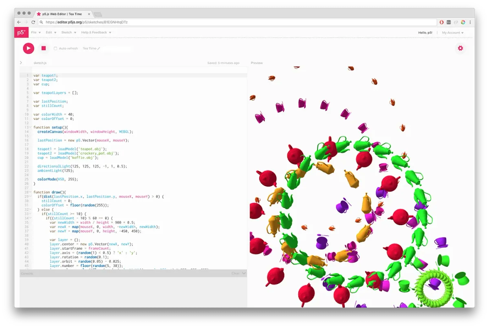
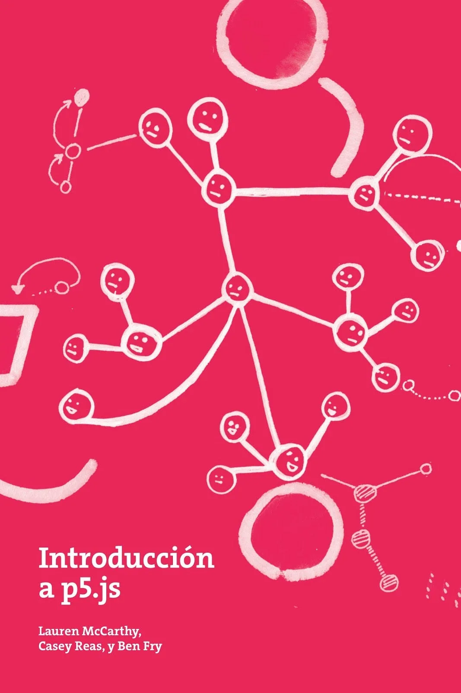
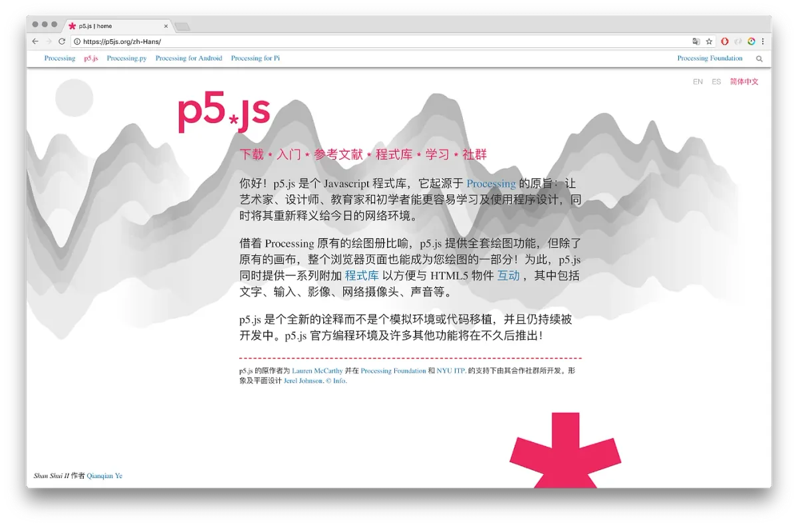
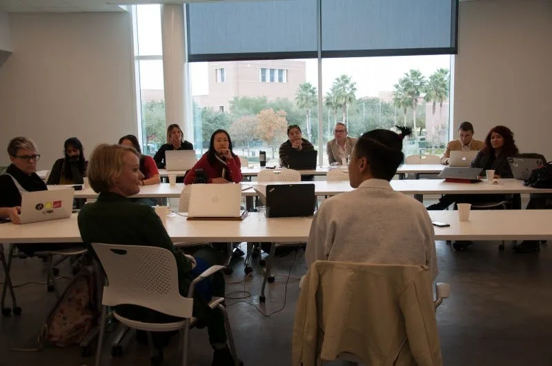

Our [Medium publication](https://medium.com/processing-foundation) publishes short- and long-form articles by members of our community, written in their own words.

### Software

The Foundation supports the creation and maintenance of the [Processing](https://processing.org), [p5.js](https://p5js.org), and [Processing.py](https://py.processing.org) platforms. The Processing project includes the Processing Development Environment (PDE) and the core software libraries, as well as [Processing for Android](https://android.processing.org/) and [Processing for PI](https://pi.processing.org/) (support for Raspberry Pi). The p5.js project includes the p5.js JavaScript library and a new [online editor](https://editor.p5js.org/) in development, now officially released in 2018! Processing.py is a Mode for the PDE that lets people write Processing programs with Python syntax.

### p5.js

The p5.js Web Editor, in development for several years, had its [first public release](https://medium.com/processing-foundation/hello-p5-js-web-editor-b90b902b74cf)! The project is led by Cassie Tarakajian, with significant contributions of software development by Andrew Nicolaou and project management by Ana Giraldo-Wingler, Liang Tang who worked on the console, and [many others](https://github.com/processing/p5.js-web-editor/graphs/contributors).

*p5.js Web Editor featuring “Tea Time” by Matthew Kaney.*

Our [p5 Accessibility](https://medium.com/processing-foundation/working-on-the-p5-accessibility-project-58a781575400) efforts continued with the work of Mathura Govindarajan and Luis Morales-Navarro, mentored by Claire Kearney-Volpe. [Aidan Nelson](https://medium.com/processing-foundation/improvements-to-webgl-mode-in-p5-js-ae5b8840ab89) and [Adil Rabbani](https://medium.com/processing-foundation/gsoc-2018-my-summer-with-processing-foundation-5e5904e816fa) made significant updates to the WebGL functionality, with mentorship from Stalgia Grigg. Tanvi Kuman improved the I/O functionality, mentored by Alice M. Chung. Sithe Ncube tested and updated mobile functionality, mentored by Lee Tusman. Vijith Assar worked on [improving the contributor-facing documentation](https://medium.com/processing-foundation/a-p5-js-dissection-manual-38959ff8522e) of p5.js, mentored by Lauren McCarthy. NYC teachers Courtney Morgan and Jose Orea continued [developing resources for educators using p5.js](https://medium.com/processing-foundation/making-processing-available-in-nyc-schools-b439eab71a9c), and Jithin K. S. created a [Dynamic Learning platform for learning Science and Math with p5.js](https://medium.com/processing-foundation/a-platform-for-algorithmic-composition-on-p5-js-271cd872d648), mentored by Saber Khan. Saber continued his initiatives to make p5.js more accessible to teachers, with the projects Creative Coding Fest and #EthicalCS, mentored by Dan Shiffman.

[Aarón Montoya-Moraga](https://github.com/montoyamoraga/gsoc_2017) completed and [launched the Spanish translation of p5js.org](https://medium.com/processing-foundation/p5-js-is-now-available-in-spanish-3d1eab9dffa0), with help from Guillermo Montecinos, and the [Introducción a p5.js](https://processingfoundation.press/product/introduccion-a-p5-js/) book, with images by Taeyoon Choi and typesetting by Tyler Yin. We also [launched p5js.org in Chinese](https://medium.com/processing-foundation/chinese-translation-for-p5-js-and-preparing-a-future-of-more-translations-b56843ea096e), thanks to the work of Kenneth Lim and Qianqian Ye.

*The *Introducción a p5.js* book was published in 2018.*

*Homepage of the [p5.js website](http://p5js.org/) in Simplified Chinese.*

There were several projects that created platforms to extend p5.js toward specific focus areas. Ari Melenciano created [Justice Factory](https://medium.com/processing-foundation/justice-factory-data-visualizations-for-empathy-93a7f2244632), a data visualization platform that highlighted human rights violations and social justice issues, mentored Jen Kagan. Chan Jun Schern created a [platform for algorithmic composition](https://medium.com/processing-foundation/a-platform-for-algorithmic-composition-on-p5-js-271cd872d648), mentored by Jason Sigal. Elgin-Skye McLaren worked on a new hello p5.js video to introduce the library to newcomers, mentored by Evelyn Masso.

A number of others contributed code, documentation, educational materials, and discussion online. You can view the full list of contributors [here](https://github.com/processing/p5.js#contributors), and see the instructions at the bottom of that link for how to add yourself if you have contributed in any way. We put out five releases during 2018, with downloads from github regularly reaching into the hundreds of thousands. This statistic excludes all projects linking to p5.js via Content Delivery Network (CDN), using the p5.js Web Editor, or downloading the p5.js library from another source.

### Processing

Processing 3.4 was the major release in 2018, with a large batch of updates and bug fixes. The complete list of changes and releases in 2018 are [online on GitHub](https://raw.githubusercontent.com/processing/processing/master/build/shared/revisions.txt). As they have done since the first Processing release in 2001, Ben Fry and Casey Reas continue to lead the Processing Project.

The Processing Sound library received a complete rewrite from Kevin Stadler, while keeping the syntax the same. This Java synthesis engine port greatly improved Processing Sound support for Android and Raspberry Pi.

[Processing for Android](https://android.processing.org/) project leader Andres Colubri released versions 4.0.1 in January 2018, through to 4.0.4 in December. These were enhancements of the major 4.0 release in late 2017 that added support for live wallpapers, watch faces, and VR apps.

Processing for Pi project leader Gottfried Haider assisted Google Summer of Code fellow Maksim Surguy in launching a site for the project at [https://pi.processing.org/](https://pi.processing.org/), to improve access and to collect tutorials and technical references.

[Processing explored a wide range of projects during Summer of Code](https://medium.com/processing-foundation/2018-google-summer-of-code-grand-wrap-up-post-c13a5ea449e8), including a full Android Processing Development Environment, a GLSL Editor, new beginner experience features, an AR renderer for Processing for Android, a Processing for Android debugger, and a native python port.

### Discourse

We launched a new community forum with the Discourse software in May 2018. This was the fifth community discussion reboot since the first Processing Alpha discussion forum started in 2002. (The archive of the first [Processing 1.0 \_ALPHA\_ Discourse](https://forum.processing.org/alpha/) is still online!) We hope you’re enjoying the new experience, and we’re grateful for the time and energy of the new and continuing moderators. We now have top-level categories for the different software projects including Processing, p5.js, Processing for Android, Processing.py, and Processing for Pi, as well as the more general categories Gallery, Teaching, and Community.

### Advocacy and Initiatives

### Fellowships

The Processing Foundation Fellowships support artists, coders, and collectives in visionary projects that conceive a new direction for what our software and community can encompass. In 2017, we offered our second annual open call for Processing Fellowships. We were thrilled and overwhelmed to receive over 130 submissions. After weeks of discussion and evaluation, we selected the following projects:

-   [Ari Melenciano](https://medium.com/processing-foundation/justice-factory-data-visualizations-for-empathy-93a7f2244632) (mentored by Dan Shiffman) worked on Justice Factory, an interactive data visualization tool that highlights social justice issues and human rights violations.
-   [Kaitie O’Bryan, Kate Lockwood, and Tom Reinartz, Jr.](https://medium.com/processing-foundation/teaching-processing-in-ap-computer-science-courses-c1ac96a0122f) (mentored by Casey Reas) created four chapters of an open-source, project-based textbook using Processing to teach Advanced Placement-Computer Science A (APCS-A) material in high schools.
-   [Saber Khan](https://medium.com/processing-foundation/building-inclusive-learning-spaces-for-students-and-teachers-60a8ea0b0a27) (mentored by Dan Shiffman) developed an Education Outreach program to support K12 educators, as well as brought Creative Coding Fest (CC Fest) to San Francisco, Los Angeles, and New York.
-   [Kirit Tanna](https://medium.com/processing-foundation/renovating-the-processing-org-website-b7f8c6a855e3) (mentored by Scott Murray) renovated the Processing.org website to enhance the overall user experience and make the site accessible on more platforms.
-   [George Boetang](https://medium.com/processing-foundation/suacode-breaking-the-coding-barrier-in-africa-with-smartphones-f41a3e432199) (mentored by Dan Shiffman) piloted his organization’s ambitious program SuaCode, an online course to teach millions across Africa how to code via smartphones.
-   [Kenneth Lim](https://medium.com/processing-foundation/chinese-translation-for-p5-js-and-preparing-a-future-of-more-translations-b56843ea096e) (mentored by Lauren McCarthy) worked on a translation of the p5.js website and documentation into Chinese.
-   [Mathura Govindarajan and Luis Morales-Navarro](https://medium.com/processing-foundation/working-on-the-p5-accessibility-project-58a781575400) (mentored by Claire Kearney-Volpe and Johanna Hedva) worked on a p5 accessibility library for blind and visually impaired users.
-   [Vijith Assar](https://medium.com/processing-foundation/a-p5-js-dissection-manual-38959ff8522e) (mentored by Lauren McCarthy) created a p5.js code repository to make documentation of the software comprehensive as well as easy to use.

The fellowship projects are summarized in the post [Introducing Our 2018 Processing Foundation Fellows!](https://medium.com/processing-foundation/introducing-the-2018-processing-foundation-fellows-a16ae4e87f80)

### Google Summer of Code 2018

Last summer, we participated in Google Summer of Code, a program that aims to get students involved in open source software by providing a summer stipend and mentorship to work on a project of their choice. Students submitted proposals to work on an aspect of Processing, p5.js, Processing.py, or Processing for Android. We were able to offer 16 positions from a field of over 100 applications. The complete list of students and mentors is detailed in our post [2018 Google Summer of Code Grand Wrap-Up Post.](https://medium.com/processing-foundation/2018-google-summer-of-code-grand-wrap-up-post-c13a5ea449e8)

### Learning to Teach, Teaching to Learn

[Learning to Teach, Teaching to Learn](https://processingfoundation.org/advocacy/learning-to-teach-teaching-to-learn) was a one-day conference at the New York University Integrated Digital Media Center on 20 January 2018. It continues a series of Learning to Teach conferences begun in 2016. These events are for educators who teach computer programming in creative and artistic contexts. Hosted by the [School for Poetic Computation](http://sfpc.io/) and the Conditional Studio at UCLA, the 2018 event brought together experienced educators to explore pedagogy, curriculum development, and how to create environments and tools for learning.

*Tega Brain and Taeyoon Choi lead a discussion at Learning to Teach, Teaching to Learn at Rice University.*

### Open Source Software for the Arts (OSSTA)

Golan Levin and Lauren McCarthy, with support from The Knight Foundation, organized a convening on Open Source Software Toolkits for the Arts (OSSTA) in Minneapolis, Minnesota. This event was a one-day conversation and “unconference,” populated by founders, maintainers, and contributors of open-source arts-engineering tools such Processing, p5.js, openFrameworks, Cinder, three.js, and more. The purpose of the convening was to generate a first step towards defining the field of OSSTA toolkits, including an articulation of their impact, as well as the challenges they face, for a wider audience. To this end, our gathering brought together leaders in the open-source arts community to have an in-depth conversation around the challenges and opportunities facing these platforms — specifically, regarding sustainability, funding, growth, management, diversity, and community building. A public report summarizing the discussions and findings will be released later this year.

### Program Manager! Welcome Dorothy!

In 2018, the Foundation introduced a new role within the organization: Program Manager. We realized the administrative, general operations, fundraising, and development of the organization required a paid staff member from the community. Dorothy R. Santos joined our team in March 2018. She has been tasked with monitoring the membership program, assisting in Google Summer of Code, seeking funding opportunities, and assisting the Board and the Director of Advocacy. She has helped raise funds to continue our Fellowship Program, and has been focused on program management, and helping the team expand in the areas of software development and general operations funding.

### Fundraising

The overwhelming majority of the software development for Processing Foundation projects is created through time volunteered from the Foundation Board and other core developers on each project. We realized the organizational need to hire people to work on parts of the project that don’t have volunteers, and to bring people onto the team who can’t afford to volunteer. As the number of users of our software continue to grow each year, the expectations from the community have increased, the amount of development work far exceeds the volunteer effort. We continue to raise funds to support software development and to run our advocacy and initiative projects.

In 2018, we had our most successful year of fundraising. As a 501(c)(3) non-profit, we file a public 990-EZ form each year with the United States government. Our gross receipts in 2018 were $92,212 USD, and our total expenses were $89,823. [This was well below our target of $186,000](https://medium.com/processing-foundation/we-need-your-help-18936655ca4f), but it was our best year to date toward realizing our goals. If you became a member or donated in 2017, we are incredibly grateful. Thank you! We’re proud to say our largest source of income in 2017 was Individual Membership donations of $20.

In September 2018, we received $67,800 from the Knight Foundation to expand on the concept of Processing Community Day. We also received $21,000 from the National Endowment for the Arts to fund the 2019 fellowships. Mozilla Open Source Software (MOSS) Partners awarded the Foundation $69,700 for p5.js software development and two fellowships focused on advancing the software.

We work for our community and stand by our core principles of access and inclusion. We want our software to reach its full potential, and, as our fellows, contributors, and community continue to show us every year, this feels like many endless and exhilarating possibilities. We are excited to see where they will take us! Please help us meet our fundraising goals in 2018. [Your tax-deductible donation can be made by visiting the Processing Foundation website](https://processingfoundation.org/support).
