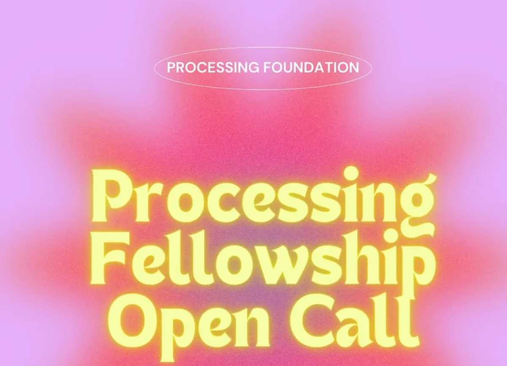

Apply now for a chance at a $10,000 stipend and make a lasting impact in the creative tech community! [https://processingfoundation.org/fellowships/fellowships-2023](https://processingfoundation.org/fellowships/fellowships-2023)

If you have questions, don’t miss our [Info Session on Monday, 12 pm PST!](https://www.eventbrite.com/e/processing-foundation-fellowship-info-session-tickets-631123175407?utm-campaign=social&utm-content=attendeeshare&utm-medium=discovery&utm-term=listing&utm-source=cp&aff=escb) Can’t attend?- No worries, a recording will be sent out after the event. Registration link: [https://www.eventbrite.com/e/processing-foundation-fellowship-info-session-tickets-631123175407](https://www.eventbrite.com/e/processing-foundation-fellowship-info-session-tickets-631123175407?utm-campaign=social&utm-content=attendeeshare&utm-medium=discovery&utm-term=listing&utm-source=cp&aff=escb)

In this article, we will go over some frequently asked questions (FAQs) about the Processing Foundation Fellowship Program to help you understand the application process, eligibility, and benefits. We aim to get you excited about applying!

### **Processing Foundation Fellowship FAQs**

#### What is the Processing Foundation Fellowship Program?

The Processing Foundation Fellowship Program is an annual initiative that supports artists, designers, activists, educators, engineers, researchers, coders, and collectives who are passionate about making a positive impact through open-source software for the arts. Fellows receive a $10,000 stipend, mentorship, and public-facing opportunities to showcase their work.

#### Who is eligible to apply for the Fellowship Program?

The Fellowship Program is open to individuals and collectives worldwide who are interested in utilizing open-source software for creative purposes. Applicants should be passionate about making a positive impact in fields like Accessibility, AI Ethics and Open Source, Ecology & The Environment, Internationalization, and Continuing Support within the open source ecosystem.

#### How do I apply for the Fellowship Program?

To apply for the Fellowship Program, please visit the [Processing Foundation website](https://processingfoundation.org/fellowships/fellowships-2023) and complete the [online application form](https://processing.formstack.com/forms/processing_fellowship_2023). Be sure to submit your application before the deadline, which is *May 15th, 2023, 11:59 PM PST*.

#### What is the selection process for the Fellowship Program?

The selection process for the Fellowship Program is based on a thorough review of all applications by the Processing Foundation team and a panel of external reviewers. The evaluation is based on the applicant’s proposed project, its alignment with the Foundation’s mission, and itsthe potential impact on the creative tech community.

#### What benefits do fellows receive?

Fellows receive a $10,000 stipend, mentorship, and public-facing opportunities to showcase their work. They also gain access to the Processing Foundation’s network of artists, designers, activists, educators, engineers, researchers, coders, and collectives to collaborate and share with for their fellowship.

#### How long is the Fellowship Program?

The Processing Foundation Fellowship Program runs for approximately three months. During this time, fellows are expected to work on their projects, and participate in mentorship sessions, and cohort check-ins.

#### Can I apply as a team or collective?

Yes, teams and collectives are welcome to apply for the Fellowship Program. If selected, the $10,000 stipend will be distributed to the collective as a whole, and not as individual payments among the collective members.

#### Do I need to be proficient in programming or coding to apply?

While programming and coding skills can be beneficial, they are not a strict requirement for applying to the Fellowship Program. We encourage individuals with diverse backgrounds and skill sets to apply, as long as they are passionate about making a positive impact through open-source software for the arts.

#### Can I apply if I am not based in the United States?

Yes, the Processing Foundation Fellowship Program is open to applicants worldwide. We encourage individuals from diverse regions and backgrounds to apply.

#### Where can I find more information about the Processing Foundation and the Fellowship Program?

For more information about the Processing Foundation and the Fellowship Program, please visit our [website](https://processingfoundation.org/) and follow us on social media ([instagram](https://www.instagram.com/processingorg/), [twitter](https://twitter.com/ProcessingOrg), [linkedin](https://www.linkedin.com/company/processing-foundation/)) or send your questions to our Programs Manager (Fellowships & Programs) at Tsige@processing.org.
