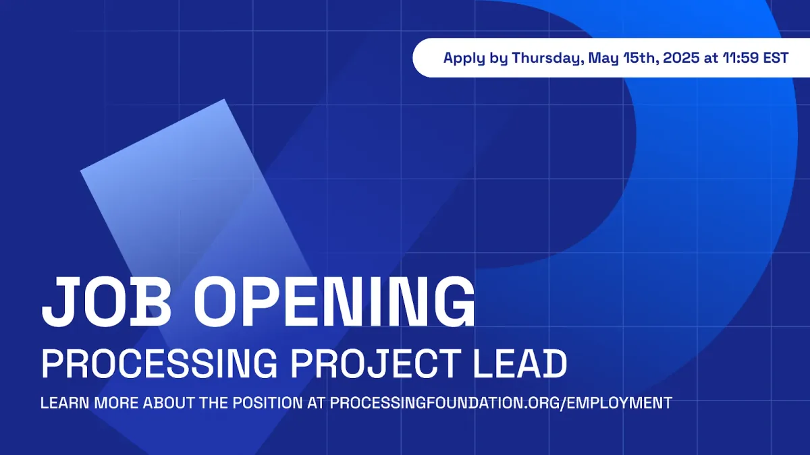

Processing Foundation is excited to announce our open call for a Processing Project Lead! This position is fully remote and begins on July 15, 2025.

**→** [Apply using our Google Form!](https://forms.gle/kCu6zCLhuVxYLi7i9)

If you prefer not to use Google Forms, you can follow [these instructions](https://drive.google.com/file/d/1F2B6al9C6WkUu0BzXyoLjQmOu1xHk9Ir/view?usp=drive_link) to apply via email. *For full consideration, please apply by Sunday, May 18, 2025, at 11:59 PM EST — Deadline extended.*

Processing is one of the most widely used open-source tools for creative coding and CS education. Since its first release in 2001, it has been instrumental in teaching coding to students, artists, and designers worldwide. It serves as a gateway into programming for people who might never have written code otherwise. Processing is supported by a vibrant community of contributors, artists, educators, and students.

As Project Lead, you will oversee the project roadmap, software development, project management, and contributor engagement to shape the future of Processing. This is a mid-level role for someone comfortable moving between code, collaboration, community governance, and broader strategic planning.

The ideal candidates care deeply about broadening access to code education, are willing to learn new skills, and are excited to co-envision the future of Processing with other stakeholders and community members. We’re looking for someone with open-source experience and a strong interest in creative coding, education, community, and accessible technology.

You will work with a diverse, geographically distributed team and support cross-project collaboration. The ideal candidate should be comfortable working with others and communicating across different time zones.

You can learn more about the Processing software and community at [processing.org](https://processing.org), or visit the [Processing4 repository](https://github.com/processing/processing4), [Processing website repository](https://github.com/processing/processing-website), and our [roadmap](https://github.com/orgs/processing/projects/32).

The [full job description is here, on our website](https://processingfoundation.org/employment/processing-project-lead). Learn more about the organization’s work on our [Processing Foundation website](https://processingfoundation.org/) and [Impact Report](https://processingfoundation.report/). If you have any questions regarding the application, please send them to [employment@processingfoundation.org](mailto:employment@processingfoundation.org).

### **About the Processing Foundation**

Processing Foundation is a 501(c)(3) nonprofit organization that supports developing and disseminating open-source software tools to facilitate K-12, postsecondary, and community-based education.
