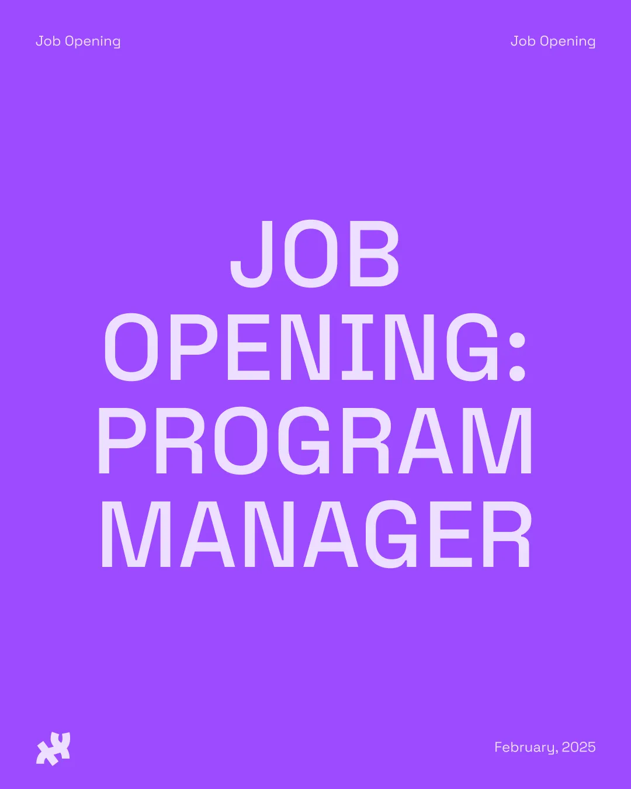

For full consideration, please submit your [application](https://docs.google.com/forms/d/e/1FAIpQLSfE9VBAm7w1ulVnAqIGcrIjyWb7ASDr1ryb9RT72YzSXAQJVg/viewform?usp=preview) by **Sunday, March 30, 2025**.

We are looking for passionate and resourceful individuals who are knowledgeable about [p5.js](https://p5js.org/) or [Processing](https://processing.org/) to apply for the Program Manager position. The ideal candidate is well-versed in event planning and execution, cares deeply about increasing access to coding education, is proactive in learning new skills, and is eager to co-envision the future of our software with project stakeholders.

[p5.js](https://p5js.org/) and [Processing](https://processing.org/) are creative coding software focused on broadening [access](https://p5js.org/contribute/access/). Rather than using a top-down leadership model, the projects values collective work and seeks guidance from communities systematically marginalized in technology and the arts. The Processing Foundation aims to provide coding education and creative expression for beginners across social strata. You can learn more about our projects on our [website](https://processingfoundation.org/). Ongoing work can be found on [Medium](https://medium.com/processing-foundation/), [GitHub](https://github.com/processing/), [Instagram](https://www.instagram.com/processingorg), [LinkedIn](https://www.linkedin.com/company/processing-foundation/?viewAsMember=true), [Facebook](https://www.facebook.com/page.processing), and [X](https://x.com/processingorg).

Processing Foundation cultivates free, open-source software to facilitate K-12, postsecondary, and community-based education. Our project ecosystems are supported by a vibrant community of contributors, artists, educators, and students. You can find the [full job description here](https://processingfoundation.org/employment/program-manager). Learn more about the organization’s work on our [Processing Foundation website](https://processingfoundation.org/) and our [Impact Report](https://processingfoundation.report/). If you have any questions regarding the application, please send them to [employment@processingfoundation.org](mailto:employment@processingfoundation.org).
