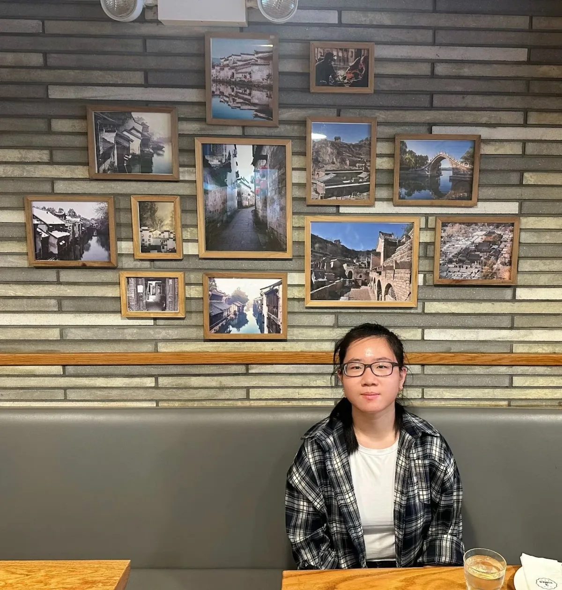
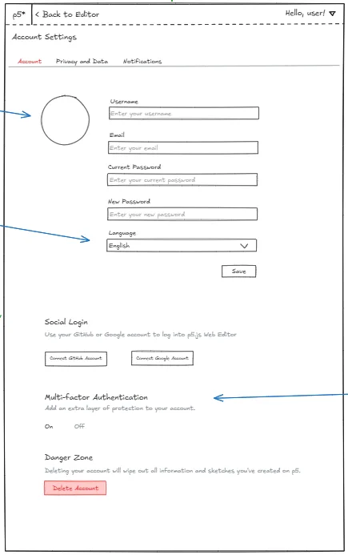
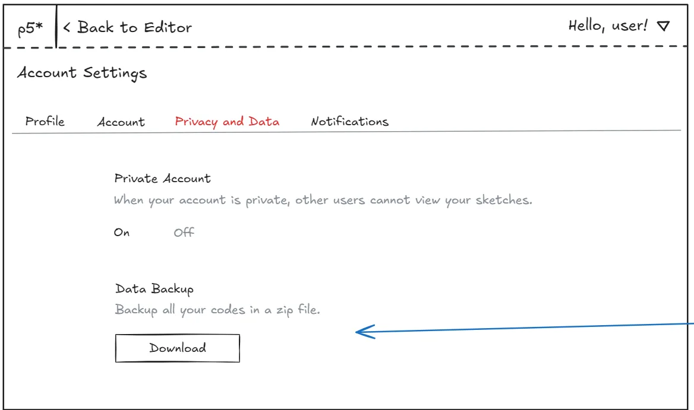
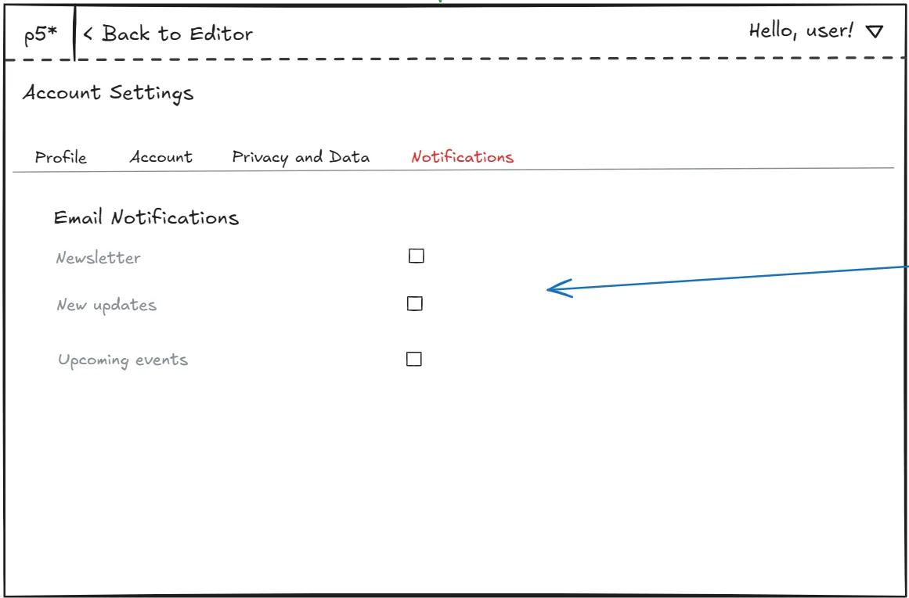

*Sonya Zheng, Processing Foundation 2025 Pathfinders Intern*

I plan to pursue a degree in Computer Science at college. My passion for Computer Science started all the way back in my freshman year of high school when my friend convinced me to join a coding club with her. The club provided Python lessons on Thursday and Web Development lessons on Friday. My first Python program was a variable initialized as my name on the first line, and a f-string inside a print function on the second line. When I clicked the run button and saw the program print “Hello Sonya”, a wave of excitement went through me. I liked how I could communicate with the computer through typing. In addition to attending the club every week, I began to self-learn by watching YouTube videos and creating side projects. The more I code, the more I am confident that I want to pursue Computer Science and become a software engineer. As a result, for the next three years of my high school, I enrolled in all the available Computer Science courses that my school had to offer.

When I signed up for Pathfinders, I was hoping to gain work and technology experience. I knew that Computer Science in school would be vastly different from Computer Science in the workplace, so I wanted to learn how to incorporate my programming skills into real-world situations. I’d say that is exactly what I gained at Processing Foundation. I get to experience the process of improving a feature in an organization. During this process, I received support from my supervisors, Rachel and Xin, who also served as my mentors.

> I also interacted with other people on the team who all gave me valuable insights regarding their experience in the technology industry.

I’d like to give a special shoutout to Rachel for coordinating a meeting between Cassie and me, and another special shoutout to Cassie for patiently answering all of my questions in the meeting. Cassie is the creator and mentor of the p5.js Editor, Vice President of the Processing Foundation, and 2017 Processing Foundation Fellow. Through the meeting, I gained many insights about the origin of the p5.js Editor and advice on how to overcome obstacles as a minority in a male-dominated field.

***Describe the environment at Processing Foundation.***

The environment at Processing Foundation felt like a tight-knit community where everyone, regardless of their background, felt belonged and welcomed. I’ve interned in several organizations before, and one thing that sets Processing Foundation apart from other organizations is the community aspect of it. In previous internships, I did not have much chance to interact with other people on the team. But in Processing Foundation, I had the opportunity to do that, and I was often asked what I wanted to gain from this internship experience. I was encouraged to explore and discover new interests.

***What did you work on during your internship?***

Over the course of two months, I gained a clearer understanding of how a technology-based organization operates. I was tasked to revamp the Account Settings page on the p5.js Editor, which involves researching, sketching, prototyping, and evaluating potential accessibility issues.

> As a student, my programming experience had been mostly limited to school projects and personal projects, where planning and prototyping were never highly emphasized. However, working with Processing Foundation exposed me to a more industry-standard and structured development process.

I started my process by researching several Account Settings from other websites. I compared and contrasted their Account Settings with the p5.js Editor’s Account Settings and noted down any common or useful features. With those features in consideration, I created [several sketches on Excalidraw](https://excalidraw.com/#json=eRwq14JkOHzSK3qW2iDK6,_Z3ZoDpaIElkGRpgdkfiug).

*The final sketch*

Later, I showcased them to Rachel and Xin. They provided insightful feedback, which I incorporated into my Figma prototype. I had no experience with Figma, but I gained a basic understanding by watching YouTube videos and practicing it hands-on.

  <iframe src="https://www.youtube.com/embed/ThbK8jwk6q8?feature=oembed" frameborder="0" scrolling="no"></iframe>

Before starting on my hard-coded prototype, Rachel introduced me to the importance of accessibility, and I did some additional research on it. With user accessibility on my mind and Figma prototype as a reference, I began to create a hard-coded prototype using HTML, CSS, and JavaScript on a cloud development platform called CodeSandbox. I chose CodeSandbox because of its resemblance to Visual Studio Code and its quick and easy project sharing feature.

  <iframe src="https://www.youtube.com/embed/3N3NRcYYgBE?feature=oembed" frameborder="0" scrolling="no"></iframe>

After completing it, I evaluated the accessibility compliance by reviewing the [A11y Web Accessibility Checklist](https://www.a11yproject.com/checklist/) and conducting tests to identify any areas that may pose an issue.

***What did you learn during this internship experience?***

During this internship experience, learning how to use Figma is one of the most valuable skills I gained. It allows me to plan my prototype on a full scale before moving on to a hard-coded prototype, which saves me a lot of time from design adjustments. Another valuable skill I learned is identifying constraints, such as budget and accessibility, and proposing possible solutions to work around them. This strengthens my critical thinking and problem-solving skills.

***What are you proud of?***

I am proud of the Figma prototype I created, considering how I was a complete beginner but managed to make it interactive. I am also proud of the final hard-coded prototype because it matches the p5.js Editor style, and it is a replica of my Figma prototype. But my proudest moment is when I posted the [Account Settings improvement design issue](https://github.com/processing/p5.js-web-editor/issues/3512) on GitHub. I felt accomplished when I clicked the “Create” button because I could finally share everything that I’ve been working on for the past two months with the public.

***Is there anything else you want to say?***

I’d like to thank Rachel, Xin, Cassie, Amy, Roxana, and everyone on the team for their guidance, advice, and support throughout this internship. I learned a lot from everyone on the team. This internship experience and everyone here have helped me grow personally and professionally.

*A special thanks to NYC DOE’s CS4All Pathfinders program for supporting this opportunity.*

Our software gets to stay **free and open-source** thanks to generous donors like you. If p5.js has brightened your day in any way, [will you consider making a monthly donation](https://donorbox.org/back-to-school-805292)?

**100% of your donations will go towards p5.js software development, and recurring donations help us plan.** Thanks to the recurring donations we’ve received in 2024, we were able to support p5.js contributors like Sonya.
