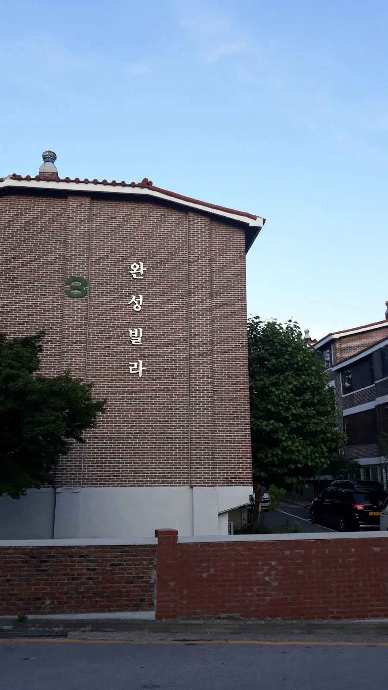
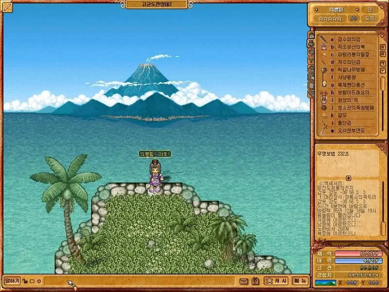
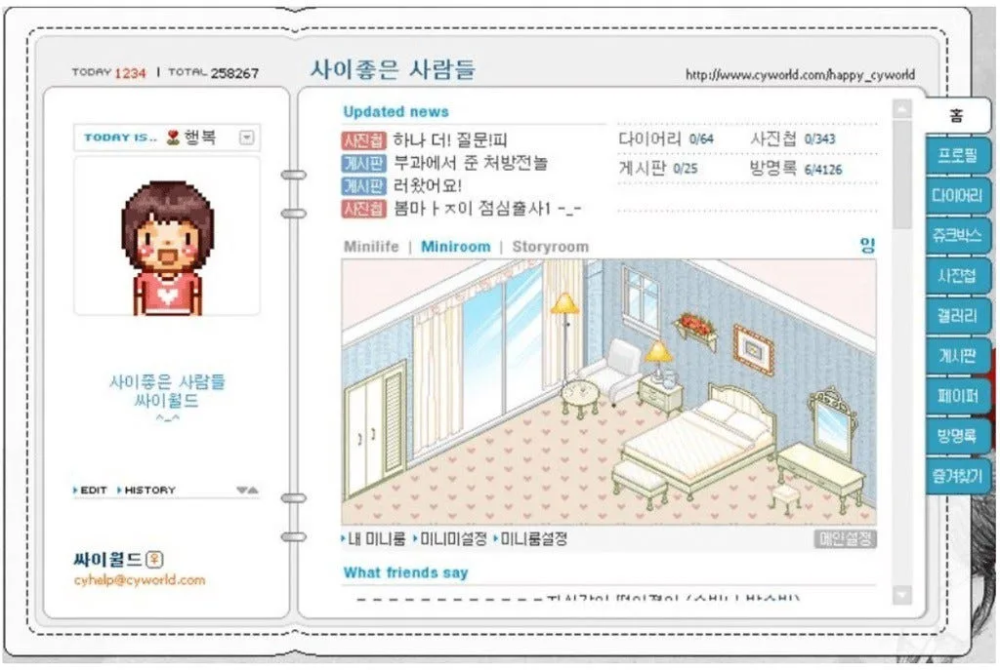
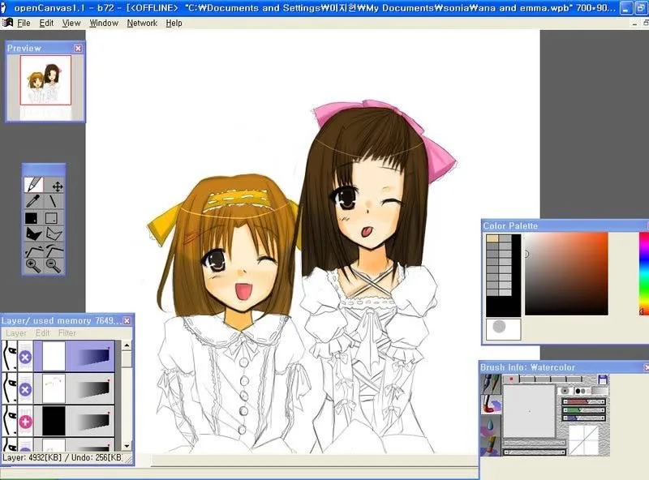
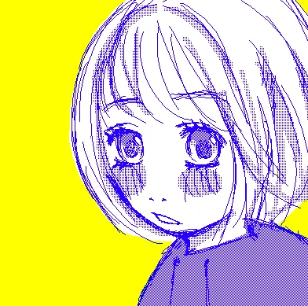

*Surround yourself with the brightest, inquisitive, and most curious minds. This guidance is something I’ve been told by mentors over the years. Suhyun “Sonia” Choi (they/them) is one of these great minds. It is such a pleasure and an honor to welcome Sonia to our team at the Processing Foundation as our Program and Communications Coordinator! You may have already noticed the incredible work they have been putting into our social media accounts as they have taken up the difficult task of serving as a connector between our organization and the thousands, if not millions, of community members using Processing, p5.js, the p5.js Editor, and Processing for Android. Yet social media is a fraction of their work, research, and projects for the Foundation. In addition to creating a desperately needed archive of press clippings, books, anthologies, and articles of over two decades of work, they have also worked on a much needed* [*Land & Digital Acknowledgement*](https://processingfoundation.org/home/land-and-digital-acknowledgements) *for our organization and the communities we serve. They have also created a graphic designer index to ensure we are staying apprised of all the wonderful work from our global community of artists and technologists amongst other important initiatives related to software maintenance, expanding upon our current educational programming, and software enhancements. They are also working on programming focused on accessibility, equity, and disability justice.*

*On top of their Foundation work, they are a gifted and extraordinary artist with such rich experiences. Between being born in Hong Kong to Korean parents to living in South Korea, the Philippines, Canada, and the United States, they have an understanding of the complex (and complicated) nature of global and racial capitalism and the deep-seated effects of colonialism. Their creative practice includes being a co-founder of the collective BUFU, which has been covered by the Village Voice, NYLON, Hyperallergic, and the Fader, to name a few. They have been an artist in residence at Eyebeam and a grantee of the Ford Foundation’s New Media Leadership initiative amongst many other accomplishments and accolades. In the introductory essays we have welcomed them to write, they write about discovering computation through family dialogue, the ways that they have honored history, and learning about stewardship through their artistic research and work. I highly recommend reading about their journey and work that led them to working with the Processing Foundation. Welcome, Sonia!*

— *Dorothy R. Santos, Executive Director*

**Trigger/Content warning:** mention of 자결 (jagyeol) or suicide as a form of protest including self-immolation, U.S. imperialism, colonialism, sweatshop labor, and industrialization.

#### Discovering Computation through Analog and Digital Technologies

I was around 4 or 5 years old when my grandma taught me how to use the abacus, during which my mom first taught me simple math. She would explain simple concepts of addition and subtraction with drawings of apples. The visual method of teaching was really helpful to my young mind. My grandma demonstrated the abacus on our wood imitation plastic veneers, moving the brown wooden beads back and forth, sliding them on the wires. I was curious about this tool as a child, fascinated by its beaded click and clack sounds, the tactile nature of it. From the exterior, the complex calculating tool looked like a fun toy. I failed to learn how to use it properly because well, I couldn’t really figure it out and I was disinterested in math. This was during the time my family lived in low-income housing in Korea, called “빌라” or “villa”. Villas, unlike the American definition, are considered low-income housing with an aspirational name derived from English. They look similar to project housing in New York City built with red or brown bricks, but they are shorter and typically do not go past five stories. Many of them sit on top of hills or elevated areas, unlike American class culture where upper class or bourgeoisie class people live at higher elevations. It’s the opposite in Korea, where low-income housing is found on top of hilly areas.

*A photo of my childhood home I took back in 2018. The name of the villa is translated as “Completed Villa”, although I would joke and call it “미완성 빌라” or “Incomplete Villa”. I was surprised to see project housing in New York City when I first moved here, because it looked very similar to some of my childhood homes.*

*My grandmother’s abacus looked similar to this one. Image courtesy of [GettyImages](https://www.gettyimages.com).*

Growing up as a child in the Philippines was unlike American high schools. The rebellious students who were perceived as bad at school might have been popular. But the students who were smart and good at everything were even more popular. I felt the pressure to be great, yet I was bad at math, loved art (still do), and I didn’t get straight A’s. My parents were also relatively lax and supported my pursuits. From an early age, I had a profound love for digital culture. A whole new world of imagination was unraveling in front of me through my laptop. Similar to the abacus, I was attracted to its tactile nature, sonic interactivity, and complexity, which on the surface, seems effortless.

<iframe src="https://www.youtube.com/embed/UQTa86FJdX0?feature=oembed" width="700" height="393" frameborder="0" scrolling="no"></iframe>

The tactility of pressing buttons with audiovisual outputs drew me in. I started using computers by playing Pokemon yellow through an emulator my mom somehow managed to download onto, what I believe was, her first laptop. As a kid, I played NetMarble, Neopets, Nexon games (Crazy Arcade, Kingdom of the Winds, Kart Rider, and Sudden Attack), Junior Naver, Cyworld, and Starcraft with my older sister. Living outside of Korea, the digital world helped me understand my Korean identity through cultural exposure. Each game felt like a portal into another world that was each its own unique expression of a burgeoning Korean digital, cultural landscape. Through Korea’s rich cultural history of gaming, its folk traditions, and the cultural importance of play, digital spaces became places of learning, play, and exploration. Growing up outside of Korea, in the Philippines, I felt connected to my Korean heritage while being exposed to an Asian identity outside of that context. As a third-culture kid, I was privileged to be exposed to multiple Asian identities while feeling rooted in my heritage. I don’t think I would have the same rich cultural and political understanding of what it means to be Asian without this background, or have the same feeling of confidence in myself if I only grew up in white neighborhoods in North America. Luckily, the Korean servers were still available for my online games in the Philippines. I especially loved Kingdom of the Winds, because it taught me a lot about Korean history and folklore I didn’t have access to growing up.

*Screenshot of [Kingdom of the Winds](https://baram.nexon.com/E221221/Intro) circa 2008. My character is in the middle dancing at the edge of an island. Korean readers: Feel free to laugh at my username, I was a tween when I made it! xD*

*Screenshot of Cyworld’s Mini homepage. [Image Source](https://www.koreaherald.com/view.php?ud=20211215000870) from Korea Herald.*

[OpenCanvas](https://en.wikipedia.org/wiki/OpenCanvas) was my first exposure to free software online. Many kids and adults who were interested in anime or were manga artists used this digital drawing software. I used it religiously with my Wacom Graphire 4 tablet (thank you, Mom) while also going on Oekaki boards (an online drawing board that doubles as a forum, popular for its half-tone tool feature). Everyday, instead of playing outside like children who had IRL friends, I lived my life online, so much so that my graphire tablet’s pen changed color from excessive use. My tablet was a digital prosthesis for my young imagination, creating drawings of selves I wished to embody that was inspired by anime culture. Drawing on this software and being a part of the [DeviantArt](https://www.deviantart.com) community at a young age fostered my love for digital culture, anime, East-Asian culture and identity, and BL (Boy’s Love/yaoi/gay anime and manga).

*WIP (Work In Progress) of a drawing I made on OpenCanvas, circa 2009? This was during the time light novels like [*Shakugan no Shana*](https://en.wikipedia.org/wiki/Shakugan_no_Shana) and [*Suzumiya Haruhi no Yuuutsu*](https://en.wikipedia.org/wiki/Haruhi_Suzumiya) were popular. This trend highly influenced my drawing style.*

*BL influence on my style. I tried using Corel Painter X during this time, too. Can you tell I’m gay from this drawing?*

*Drawing I made through the Oekaki board. This style was heavily influenced by Chica Umino, after I finished watching and reading the [*Honey and Clover*](https://en.wikipedia.org/wiki/Honey_and_Clover) series.*

#### Honoring History and Ways of Being Through Stewardship

Zooming in and zooming out, my existence on this planet came about in the context of Korea that had newly been industrialized through violent processes of American imperialism, military dictatorship, and a splitting of the country into North and South. South Korea went from being one of the poorest countries in the world to one of the richest with a high GDP in the span of 50 years. My generation is one of the first to live in this new era of technocracy and excess, which dictates the fabric of our being. During the Mid-Autumn (or Harvest Moon/Chuseok) festival, my family talked about how our cultural identity had been shaped by thousands of years of farming practices, but this is no longer the case. The Mid-Autumn festival, like many other Korean traditions, has become mostly a symbolic and spiritual gesture that connects us back to our agricultural heritage and circadian rhythms, currently fragmented in our everyday lives.

<iframe src="https://www.youtube.com/embed/ZbRv2DLB9NA?feature=oembed" width="700" height="393" frameborder="0" scrolling="no"></iframe>

The Mid-Autumn festival is one of Korea’s major holidays. Due to our past agrarian culture and economy, our calendar was based on the movement of the moon, rather than the sun, thus celebrating the Harvest Moon. The Mid-Autumn or Harvest Moon festival would be a time where people celebrated the abundance of harvest, while giving thanks to our ancestors. This was probably one of the only times of the year where people weren’t starving. It is a time when the veil between the spirit and living world becomes thin, thus creating more avenues of communication between those realms. My grandma would tell me how women in her village would dance 강강술래 (Gang-gang sullae) for days on end: a dance where women wearing hanbok (Korean traditional clothes) would hold hands, go around in a circle, and sing under a bright full moon. It is a song of revolutionary resistance against Japanese colonial forces. Although there are a few rural villages in Korea that still celebrate this way, most families in Korea use the festival as a time to come together, eat lots of yummy food, and perform jesa (ancestral worship).

I am the first generation in my dad’s family not reliant on farming. This is due to 90% of rural, farming populations moving to the cities, being wiped out by American imperialist foreign trade policies as well as military occupation, farmers dying by suicide as a form of protest, a military dictatorship, and violent processes of industrialization and urbanization. Our generation has been tasked with the daunting reality of stewarding our relationship with Earth, technology, ourselves, and each other, in the midst of climate catastrophe, ongoing occupation and colonialism, and wars. I don’t think that going back to the earth is necessarily the answer for me because of how romanticized and privileged that can be, and also my grandma would scold me and tell me how much she’s fought and worked hard for me to lead the life I lead now. There needs to be so much healing our relationship with earth that needs to happen for this to not be a Walden-esque gesture, especially for BIPOC whose relationship to earth has been traumatized by slavery, colonization, the prison industrial complex, capitalism, feudalism, patriarchy, ableism, and more. Some sort of symbiosis between objecthood, subjecthood, being object, being human, being planet, being universe, all being gay together, is something that I am trying to figure out.

In our current technocratic culture, we use the solar calendar and most of our kimchi is now imported from China. Similar to Korean gaming history, our past has evolved while maintaining a sense of its symbolic identity. In a broader sense, we live in an era of climate catastrophe, ecological systemic collapse, wars, famine, poverty; where we are living the realities that science fiction oracles like Octavia Butler warned us about. This is a time where imagination is most needed. Although it can be an immense privilege to have the capacity to dream, the worlds we want to live in and create will take so much creativity. I want and need for QTBIPOC, disabled, low-income, and other oppressed folks as much time to rest as a way of being anti-capitalist. There’s a reason why dreaming happens when our bodies are in a state of perfect rest. This is the philosophy, historical context, and perspective that informs the day-to-day decisions I make while working for an art and technology organization. Like my younger self who was first exposed to and (re)connected to my identity through a digital nativity, I look forward to creating space digitally and IRL through our softwares and public programs as a means to reimagine and create new worlds. I want our communities to produce and connect back to ourselves. As someone who does not calculate like a cyborg (because bodies like mine are racialized as computer interfaces), I’m glad to work at Processing Foundation where I can work with and support people learning code for the first time to teachers creating accessible and equitable syllabi and curriculum. I wish for our community members to have more agency over our digital selves (and for those of us who can) to be invited to support folks who aren’t. Processing Foundation is one example of an open source ecosystem that produces opportunities for more agency over our digital bodies and culture within digital and IRL worlds where this is not the case. I hope to contribute in making the Processing Foundation more accessible, approachable, and liberating for our digital selves and beyond.
