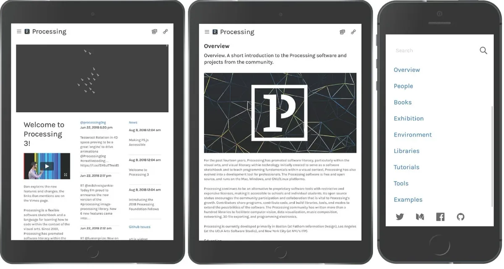
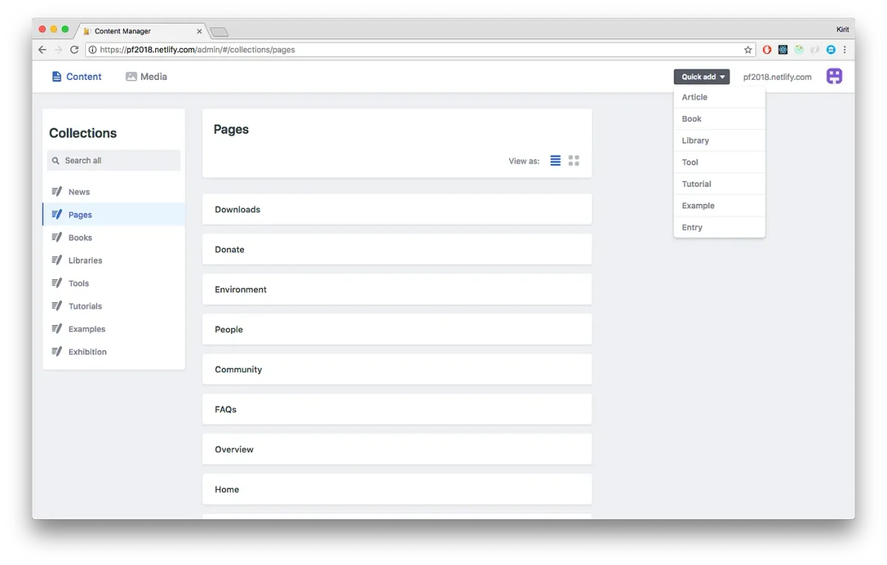
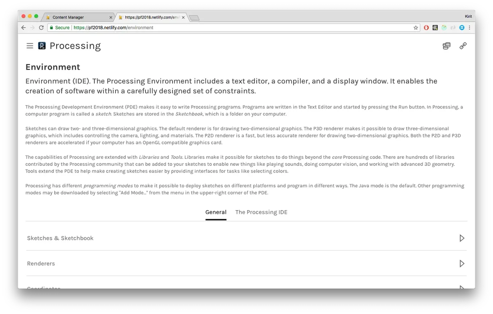
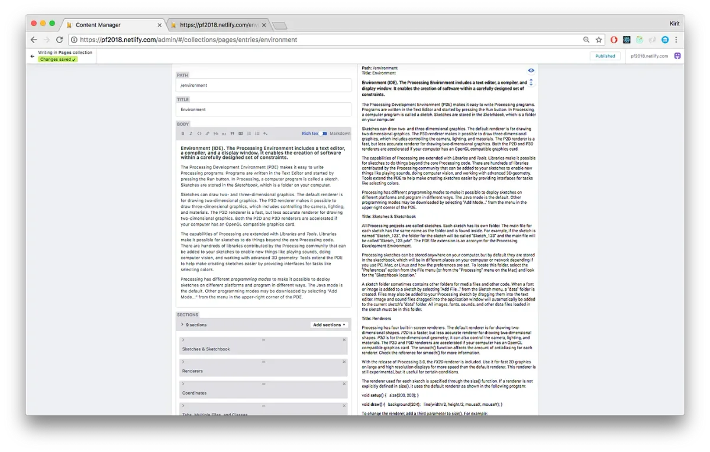

2018 Foundation Fellow

---

*The 2018 Processing Foundation Fellowships sponsored* [eight projects](https://medium.com/processing-foundation/introducing-the-2018-processing-foundation-fellows-a16ae4e87f80) *from around the world that expanded the p5.js and Processing softwares and their communities. Fellows developed work ranging from Chinese translation of the p5.js website, to workshops that teach smartphone coding in Ghana. During the coming weeks, we’ll post articles written by the fellows and interviews with them, in conversation with Director of Advocacy Johanna Hedva, that showcase and document the great work by this year’s cohort.*

---

*The top three are images of the newly renovated, responsive processing.org site; the bottom image shows the CMS dashboard. The site is responsive, thus enabling it to work across multiple devices. Page content is controlled via the Netlify CMS. \[image descriptions: top three are screenshots of the processing.org website on tablets and iPhones. The bottom image is of the content-management system.\]*

**Johanna Hedva: What did you set out to accomplish with your fellowship, and how did this evolve as you went through the work process?**

**Kirit Tanna**: Originally, we set out to revamp [processing.org](http://processing.org/) website so that it is responsive and accessible. In the initial few weeks, I worked with my mentor Scott Murray, and we learned that the whole process of authoring, build, and deploy needs improvement. So, we extended the scope of work.

The existing project structure involved custom scripts stitched together and a tight coupling of website and IDE source code (mostly due to the fact that the docs are shared). This resulted in making the process of applying simple updates very cumbersome. We deliberated on this aspect and in the end settled for a static site CMS where authors could manage content in a visual environment that is intuitive.

On the old system, to edit the website, a contributor had to make GIT repo commits, then run two sets of build scripts on the client and server. This severely limited who could contribute to the website.

In the new system, we use a CMS so contributors just login, write content in markdown, and *voilà*! This massively reduces the amount of time needed to make updates or add new content, which enables the Processing team to open things up to more contributors in the community.

We set out with the following goals:

1.  Site will use modern architecture, though pages will be output as static HTML;
2.  For the initial release, the sitemap will remain largely consistent;
3.  Apply responsive layout so that site works across devices;
4.  Site will be built with accessible (screen-reader friendly) UI components;
5.  Revise the page layouts so that the information is more easily absorbed, especially considering the site will now be available to view on devices with smaller screens;
6.  Add new features — news, syntax highlighting, responsive images, search, etc.;
7.  Improve the build process;
8.  Improve the authoring experience, including implementation of a CMS that eases contributions to the website (now you can author pages on the website without cloning repositories and setting up a complex build process);
9.  Automate deployments;
10.  Examine how the Reference section is built and find places for improvement;
11.  Tagging content across different sections to open up opportunities to search and browse content in many different ways (for example, a user interested in physics simulations can just tap a “physics” tag and be presented with all related examples, tutorials, and exhibition projects);
12.  Apply new design;
13.  Migration.

The current state of the site can be found [here](https://pf2018.netlify.com/).

*The top image shows a styled page, CMS view of a managed page, shown at bottom. This depicts how pages are managed within the CMS by setting up fields that describe the content (kind of like meta-data) and grouping related content. \[image descriptions: Top image is a screenshot of a page on the processing.org website. The bottom image shows the content-management system view of the same page.\]*

**JH: What were some unforeseen challenges that you encountered? How did you work through them?**

**KT**: There were a few challenges:

*Synching up with Scott for progress updates* —

This became a challenge for me at one point partly due to the unexpected nature of my day job during the period. However, we later settled on a schedule which suited both of us better and it was smooth from that point onward.

*Building a new responsive website with all pre-existing features and revised page layouts with CMS integration in eight weeks* —

Thankfully, I’ve been doing React development in my day job for well over the past year and this helped me as I was aware of several tools and techniques that could boost the development effort. We used Gatsby, a static site generator which has a great set of built-in features, and also a useful set of extensions contributed by the community.

*Restructuring content and site structure* —

Early on in my fellowship period, I sent my proposal for changes to the site’s structure and content organization. Scott and I deliberated, discussing shortcomings and improvements. Casey and Scott helped clarify the approach, which was to start simple and achieve more if time permitted. This took the pressure off: I’d started out much more ambitiously but realized how complicated some of the implementation was.

We looked through each of the sections at how the information architecture could be improved. Each page was evaluated from an authoring perspective so the content could be classified as fields that could be managed using the Netlify CMS.

*P5.js widget for code samples* —

We’re using the [p5.js widget](https://toolness.github.io/p5.js-widget/), however, there was a need to hide the javascript code given that the Processing.org website is about the Java flavor of Processing. After looking for options, I ended up customizing the p5.js widget source code by forking the repository. This is one of the best things about open-source software.

**JH: Were there any references or examples that you engaged with, which informed your approach?**

**KT**: The main reference sites used as guidelines were:

[https://processingfoundation.org/](https://processingfoundation.org/)

[https://p5js.org/](https://p5js.org/)

For inspiration around content and structure, I looked up other websites for tools used in creative coding:

[https://openframeworks.cc/](https://openframeworks.cc/)

[https://libcinder.org/](https://libcinder.org/)

[https://vvvv.org/](https://vvvv.org/)

As mentioned previously, originally I didn’t set out to do as much as we ended up doing. The original goal was only to give the site a visual uplift that was also accessible and mobile-friendly.

**JH: What work is there still to do?**

**KT**: From the initial to-do list, I was able to accomplish items 1–9. We did revamp the layouts and overall design to a great extent. This was done in view of responsiveness and simplifying pages with dense content such as the Environment and Libraries.

For the rest of the items, I started examining each task, but they require significant effort to revise, and we just ran out of time. Applying a new design requires involvement from other members on the team, so it was deferred for later.
