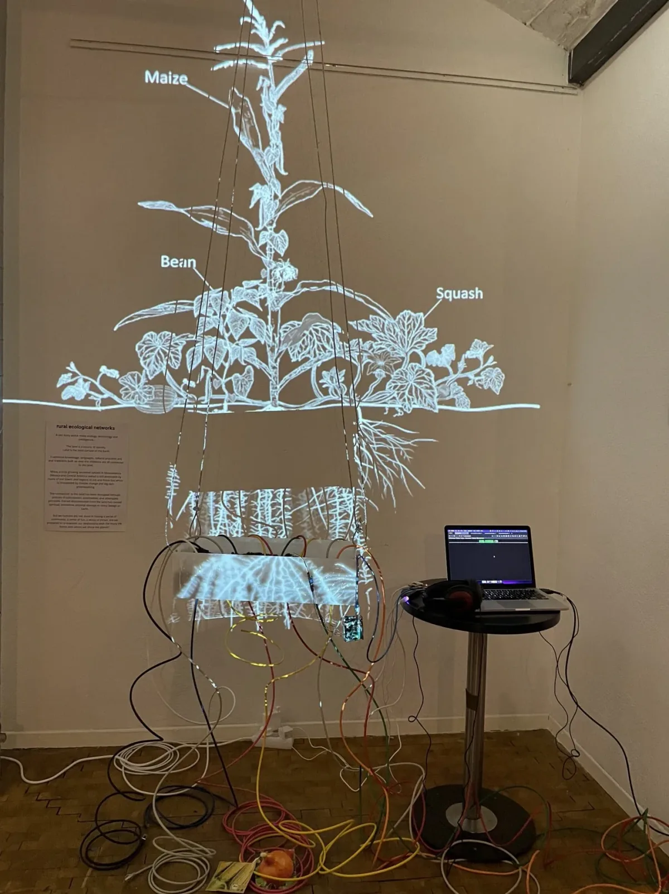

Tell us about yourself.

My name is Yadira Sanchez. I am from a small town called Quebrantadero in Mexico and I’ve been around these lands for the last few months.

My fellowship project for Processing is called Technological Ecologies, Rural Technological Ecologies, to be more precise. It is about the technologies that are in rural ecosystems and in native ecosystems in Mexico. The project tries to co-create a space with children and youth from my rural community and in partnership with a friend of mine, who is a Nahua activist and Nahuatl language teacher. We’re trying to come together to open up technology, especially p5.js and creative coding so that children and youth in our communities can access these technologies and also use it for creative purposes.

During the fellowship, the first few weeks, I was able to do some workshops with children and youth from my community. During this time, it was a little informal. The first session we talked about technology in general and what they thought about it, a lot of stuff just came up as we normally thought. Children are super curious, and I was really amazed by the questions they asked as well. This was a really good chance to also find out more about how they thought about or interacted with technology in general. I really wanted to make sure some of the funding from the fellowship went to the children from my community who attended the workshop. For me, it’s really important that children from rural native communities are compensated for the time they are giving their knowledge or imagination into co-creating these spaces. It was an experience, for them and for me because we all previously interacted in working in an art practice context, without the technology side of it. It was really nice to start talking about how to, for instance, create artistic pieces, digitally speaking, with code.

**What were some challenges you encountered during the fellowship?**

The biggest challenge was organizing timing for the workshop. During summertime, there’s always a lot of activities going on in our community for kids and youth. Finding the time for them to do another activity was kind of tricky. Also to be able to do a workshop and find a space that had internet was maybe the most challenging thing. We don’t have very good internet in our community. When it comes to p5.js, I know that we can download it, but it also requires access to a lot of computers.

What we did is actually, we went to another friend of mine, who is a very active member of the community and organizes a lot of art workshops. We agreed that we would bring the computers that we have access to so that we could organize kids around a set of computers and then share the main bits of what we wanted to talk about. It was kind of an experiment as well, because first we had the idea of using some of the primary school or the secondary school internet labs. But we couldn’t get access, so we had to find a way to bring as many computers as possible. Three of the kids had their own computers, but the rest of the kids didn’t. We managed to pair them up and everyone had access to a computer.

To give some context, the first session was quite informal and we generally chatted about technology and types of technology that they were into or that they knew.

Then the second workshop was more about what they thought about certain technologies and a little bit of talking about what it means to hack from a community point of view. This was really interesting because I wanted to introduce the idea of coding in a way to them that would make sense. The third session was more about actually engaging in coding and doing an exercise.

I wasn’t sure how to introduce the concept of creative coding in a way that was easy for them — I think it was the context of teaching something where you don’t know how it’s going to land. They received it pretty well. I think they had so many ideas of how to use it in the future. I’m not in my community right now, but in December, we’re planning to do more stuff with the platform as well. That workshop was a good introduction for them to see how things work and to try putting images in and then using simple code, put images of their surroundings onto other images. They really liked it.

The workshop was actually held at a friend’s house who was doing a painting workshop, and so we were already in the mindset of painting and drawing. One of the things that came up was little ways around using p5.js to draw yourself into pictures and the environment.

The kids also thought a lot about poetry and how they could use p5.js to perceive our rural environment, and to portray it creatively with elements that are useful around our rural ecosystems, like the specific trees that we have there.

I also had some hardware material, and I showed them this — where you can put sensors into the plants and it produces sounds, and you can modify the sounds with software, and the kids were really fascinated by this.

My friend who is a sculptor was thinking about how we could use the software and technology as well, to co-create with the kids. I’m really excited to do more of this experimentation in December.

**What are some of the joyful moments from your project?**

The first one that comes to mind is definitely the excitement. I was a bit nervous about how it was going to land for them, but they were extremely interested in learning, and excited about how they could use p5.js in the future. I think seeing how the kids want to keep being involved in using technology in a creative way is very exciting.

**What are some words of advice for future fellows?**

I would say believe in your idea. I was very hesitant to apply in the first place. I wasn’t sure if my idea was of any interest — you get these ideas in your head where you don’t know if it’s going to land well on the other side. I was really excited to apply, and I really believed in the project because it had been on my mind a lot. So yes, believe in your project and in your idea.

*Yadira Sánchez is a creative researcher, experimenting with software and hardware and examining the role technology plays in our everyday lives and ecosystems. Engaging and actively dismantling the tech-violent pipelines reinforcing hegemonic structures. Reimagining and co-creating spaces where technologies and art are pluriversal and liberatory. During this project Yadira will be developing and co-designing the portal and the fellowship engagement.* [https://pueblerina.glitch.me/](https://pueblerina.glitch.me/) *Follow Yadira on* [twitter](http://twitter.com/yadira_sz) *and* [instagram](http://instagram.com/yadira.sz)*.*

*David Marcelino Cayetano, of Nahua–Aztec ancestral roots, has been dedicated to audio–visual art, photography, muralism, poetry, and music from the worldview of his original peoples, for more than seven years. He is a teacher of his native Nahuatl language and a promoter of traditional medicine, knowledge of which was passed on to him by his grandparents. Co-founder of “Speak Nahuatl”, a collective school of Native languages. He published a book on the legends of nature and sacred places of the Huasteca “Kamanaltlajtolmej Xilitlan / Narratives in Náhuatl de Xilitla”.*

*Throughout his career he has documented the wisdom of his ancestors such as language, dances, medicine ceremonies, traditions, customs, etc.*

*David has served as a community authority in his own community with the position of Municipal Delegate. He studied civil engineering at the Regiomontana University. During his stay in Monterrey, he was a producer and host of the TV/Radio program “Voces Originarias” on TuVoxTV. He has also made murals from his ancestral worldview and is passionate about everything related to the traditional medicine of his ancestors, which was passed on to him, as well as teaching classes of Náhuatl. He currently makes Indigenous cinema and is the co–founder of the independent film production house “Bironga Films”, which has presented his audio–visual works in the National Cinema, National Mask Museum, Institute of Anthropological Research, National School of Languages, Linguistics and Translation of UNAM, academic spaces and international film festivals. Follow David on* [instagram](https://instagram.com/tlatoanitsin)*.*
