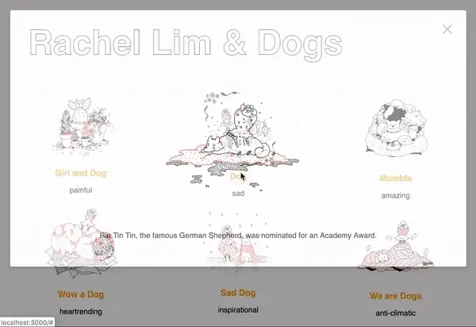
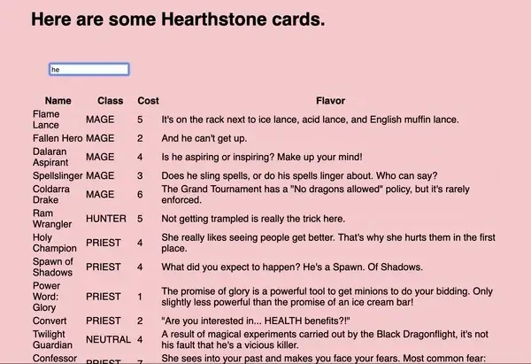
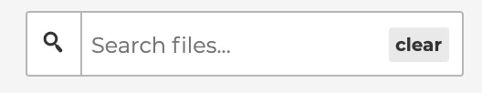
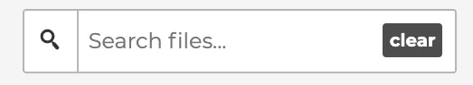

This summer was the Processing Foundation’s eighth year participating in Google Summer of Code, where we work with students on open-source projects that range from software development to community outreach. Over the next few weeks, we’ll be posting articles written by some of the GSoC students, explaining their projects in detail. The series will conclude with a wrap-up post of all the work done by this year’s cohort.

---

My first encounter with coding was during a Programming 101 class in a dimly lit classroom, with drab textbooks and equally drab lectures. I thought it wasn’t for someone like me; it was so dry and technical. However, my introduction to the p5.js Web Editor was a game changer: I found it accessible, vibrant, and, most importantly, fun! I especially loved the randomly generated titles and refused to change any of them, despite having an increasingly harder time navigating through my sketch list. To help make finding my (and your) sketches a little easier, I worked with Cassie Tarakajian to create a search bar for the p5.js Web Editor.

#### *Learning Phase*

Before this project, I had never been involved with open source or programmed outside of a classroom setting. I began the summer learning best contribution practices, how the web editor is structured, and why it was organized that way. I was introduced to [Git](https://git-scm.com/), [React](https://reactjs.org/), and [Sass](https://sass-lang.com/). I then worked with two issues to learn how to make visual and functional changes within the web editor.

The first issue had a design that led to questions about its intention and implementation within the code, and was put on hold for further discussion. Although it was unable to be resolved, I learned that implementing design through code was not always straightforward; frequent communication between the programmer and designer is pivotal to the process.

*Mock portfolio site with pop-up modals.*

*Live search process through a list of Hearthstone cards.*

I also created a portfolio site with pop-up modals to understand React components and how data is being passed between them. I added a mock search bar that searched within a list of [Hearthstone cards](https://hearthstonejson.com/). I first created one with only React and then re-made it adding [Redux](https://redux.js.org/) and [Reselect](https://github.com/reduxjs/reselect). Assembling these examples was helpful in learning these libraries and repeating the same process for the web editor.

#### *Search Bar*

*Search bar in neutral state*

*Search bar in active state*

I used designs uploaded to Zeplin as visual guides for how the search bar would appear in its [neutral](https://app.zeplin.io/project/55f746c54a02e1e50e0632c3/screen/59413d89c2b5318d69be12d3) and [active](https://app.zeplin.io/project/55f746c54a02e1e50e0632c3/screen/59413d88cda26c1669f83fea) state. I ran into some questions involving other aspects of the designs, which showed the search icon as a toggle for hiding and viewing the search bar. I was unsure as to whether a search button would be necessary as the results would be presented live. I turned to some resources on [best practices for a search bar](https://uxplanet.org/design-a-perfect-search-box-b6baaf9599c) to finalize decisions, which advised providing prominent access, a search button, and a magnifying-glass icon.

The search bar, placed within the modal that displays a list of the user’s sketches, has a search icon that serves as a search button, a text input area, and clear button. The color scheme of the buttons and border are dependent on the theme.

*Live search happening as search query is being typed.*

The search bar is live, which means that the sketchlist is filtered as the user types. To prevent the list from getting filtered after every keystroke, this filter function was throttled, or arranged to happen periodically after every set time frame. The search icon button will also call the filtering to happen if pressed. If the user wishes to clear their query, the clear button will reset it to an empty string. The search query also gets refreshed whenever the sketch list overlay is re-opened.

Overall, my time with Cassie and p5.js has been incredibly warm and educational. I hope others encountering the web editor or the larger p5.js community feel as welcomed and empowered as I did, and are able to search through their sketches with ease!
