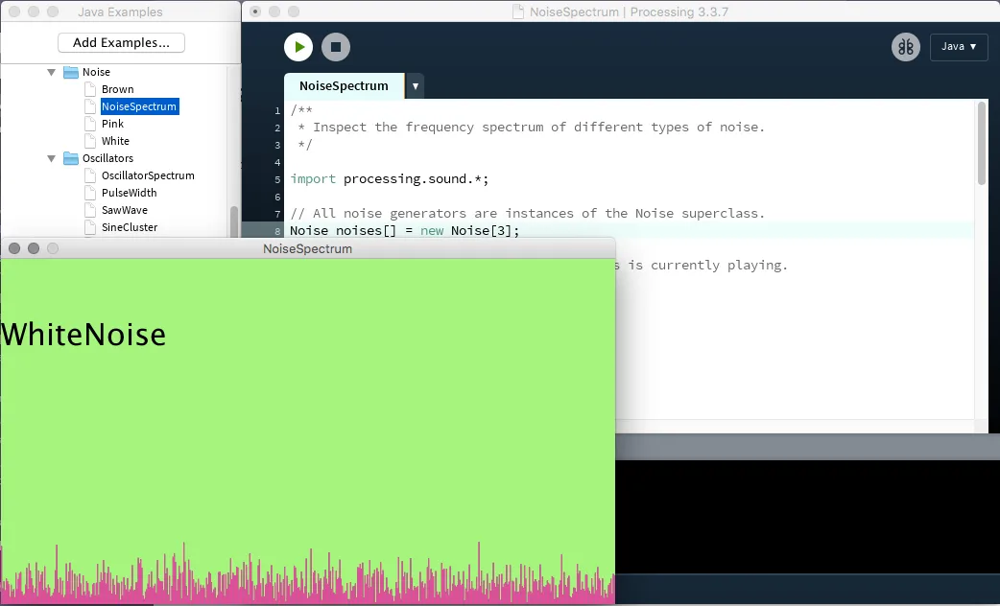
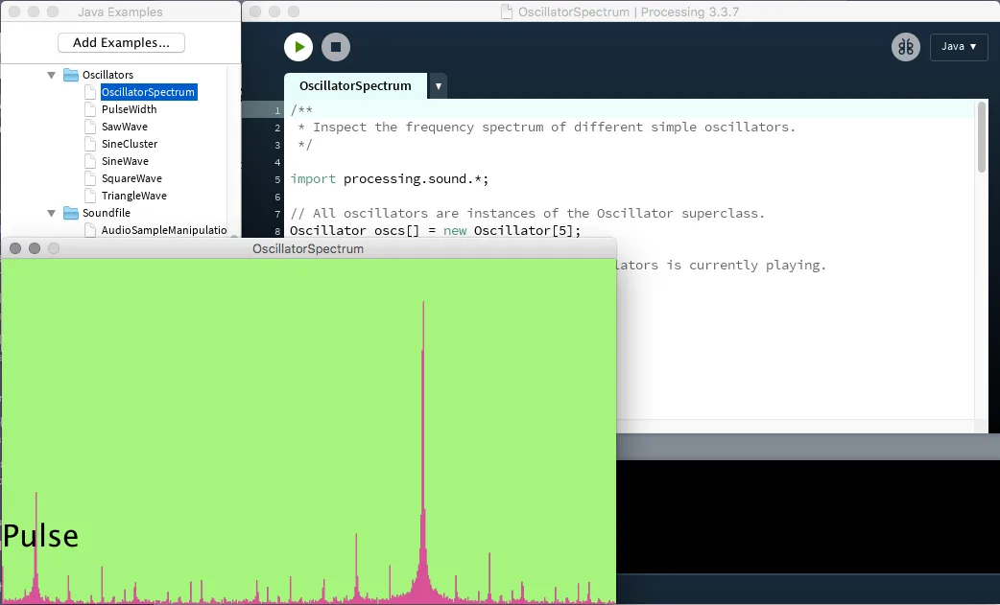

Google Summer of Code 2018

mentored by Casey Reas

---

*This summer was the Processing Foundation’s seventh year participating in Google Summer of Code. We received 112 applications, a significant increase from previous years, and were able to offer 16 positions. Over the next few weeks, we’ll be posting articles written by some of the GSoC students, explaining their projects in detail. The series will conclude with a wrap-up post of all the work done by this year’s cohort.*

---

*New example sketches combine Processing’s graphics functions with the Sound library to help explore concepts from the audio domain in an interactive manner. This example explores different types of noise. \[image description: A window of Processing code for a program named “NoiseSpectrum” is shown in the background. In the foreground is the resulting program, which shows a window with a green background, the text “WhiteNoise,” and at the bottom of the window, a sound graph is rendered in hot pink.\]*

While Processing is first and foremost intended as a tool to explore coding in the context of the “visual” arts, many media artworks feature both visuals *and* sound. Consequently, the ability to augment sketches with audio has long been a part of the history of Processing. While digital sound synthesis is an art in itself, over the years many efforts have been made to provide access to different sound synthesis frameworks inside Processing. These efforts can be appreciated most easily by looking at the [long list of contributed sound libraries](https://www.processing.org/reference/libraries/#sound).

Since Processing version 3, there has also been an official Sound library geared toward the core design and educational principles of Processing, though instead of showing off the complexity of a fully fledged unit-generator-based synthesis library, it offered a minimal interface allowing new users to load and play back sound files, as well as perform simple generative sound synthesis, analysis, and applying effects.

Now several years old, the original Sound library has started bumping up against its limitations, especially in terms of the demands of the many new computing platforms that Processing sketches can now be run on. As a result, it was time for the library to receive a thorough overhaul, with several goals in mind:

1.  **Full compatibility with the original Sound library**:

By keeping the API (function names and signatures) of the old library, sketches written for the old Processing Sound can be run with the new one without any changes to the code;

2) **Improved support for non-PC devices**:

ARM platforms such as Android and Raspberry Pi have become increasingly popular in the past years, so it should be possible to sketch code on a PC, then run it on another device with the same results (and vice versa);

3) **Improved and new example sketches**:

The original Sound library came with a number of example sketches appropriate for various levels of users. Apart from a general overhaul and improved documentation of the existing examples, there was also room for new ones demonstrating new functionalities, such as device-specific use cases for Android.

*New example to reveal the frequency spectrum of different oscillators. \[image description: A window of Processing code for a program named “OscillatorSpectrum” is shown in the background. In the foreground is the resulting program, which shows a window with a green background, the text “Pulse,” and at the bottom of the window, a sound graph is rendered in hot pink.\]*

As the underlying synthesis engine for the rewrite, we chose Phil Burk’s [JSyn](https://github.com/philburk/jsyn), which had in fact already been the basis of *Sonia*, one of the first sound libraries for Processing 1.x. By choosing a seasoned and reliable sound synthesis engine written purely in Java, full hassle-free support for Android and Raspberry Pi platforms came (almost) out of the box. JSyn’s rich tool library also allowed us to implement some new functionalities requested by users, such as low-level access to sound buffers that allows for [scrambling and re-sampling of sound files](https://www.processing.org/reference/libraries/sound/AudioSample.html).

As of August 2018, the new JSyn-based Sound library that I wrote over the summer has been adopted as [Processing’s default sound library, version 2.0.0](https://github.com/processing/processing-sound). It can be installed from Processing’s Contribution Manager, and we welcome all issues and feedback over at the [Processing Discourse](https://discourse.processing.org/c/processing/processing-libraries) as well as the Github [issues page](https://github.com/processing/processing-sound/issues).
