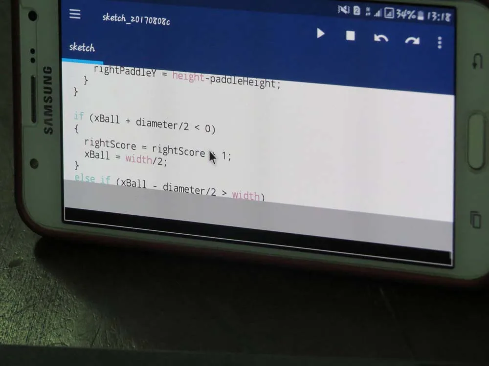
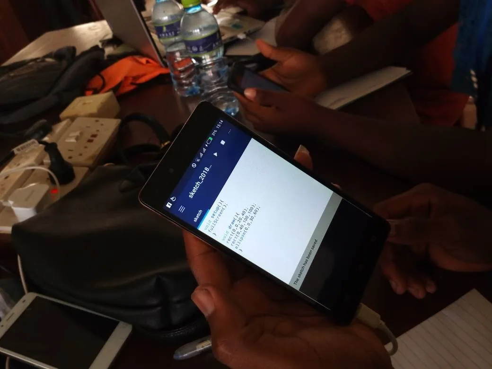
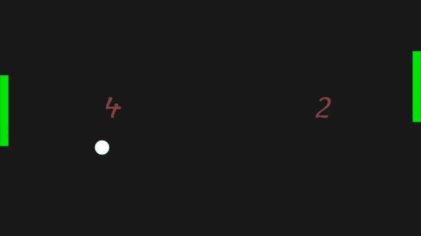
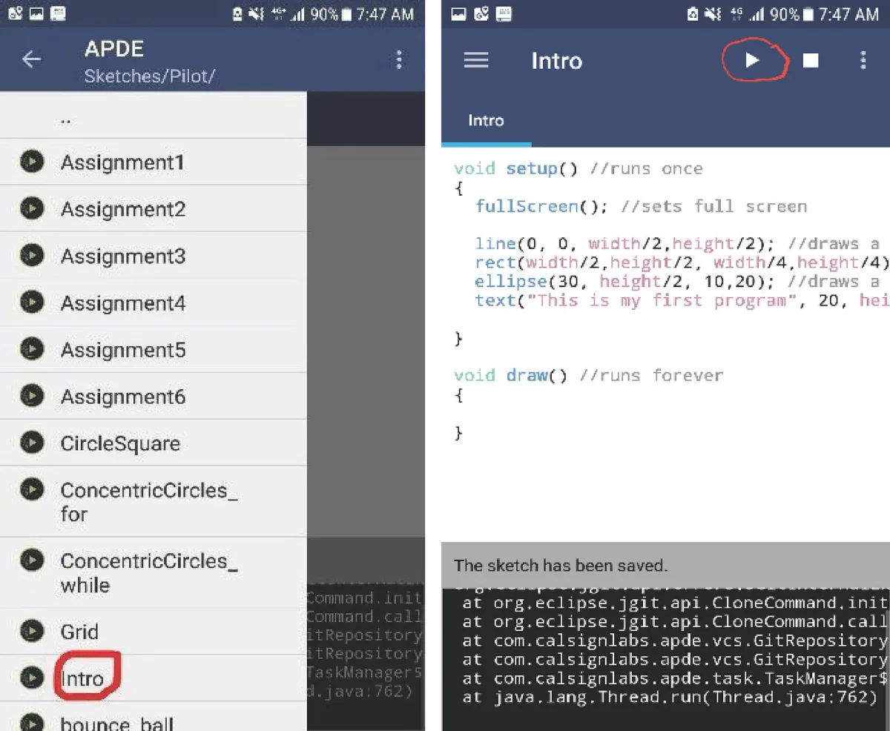
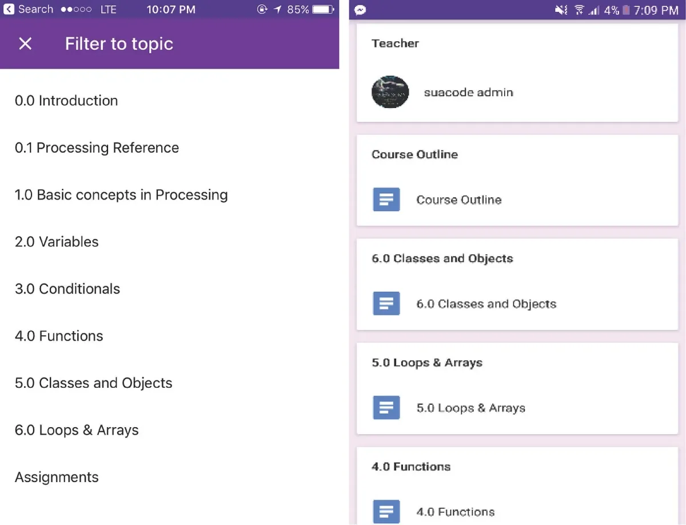
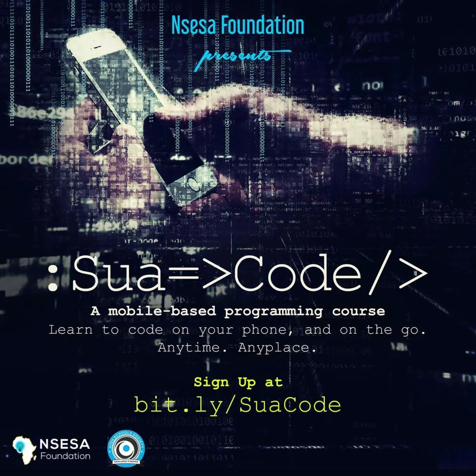

2018 Processing Foundation Fellow

---

*The 2018 Processing Foundation Fellowships sponsored* [eight projects](https://medium.com/processing-foundation/introducing-the-2018-processing-foundation-fellows-a16ae4e87f80) *from around the world that expanded the p5.js and Processing softwares and their communities. Fellows developed work ranging from Chinese translation of the p5.js website, to workshops that teach smartphone coding in Ghana. During the coming weeks, we’ll post interviews with the fellows, in conversation with Director of Advocacy Johanna Hedva, that showcase and document the great work by this year’s cohort.*

---

*Processing code written on a smartphone. \[image description: A photograph of a Samsung smart phone showing the code for a Processing sketch.\]*

**Johanna Hedva: Can you walk us through your fellowship project? What did you set out to do and what did you accomplish?**

**George Boateng**: My fellowship project aimed to take advantage of the proliferation of smartphones to address Africa’s digital gap by introducing high school and college students in Ghana to programming using the Processing language. In this project, I sought to develop a coding curriculum based on the Processing programming language, and then deliver it online via smartphones through a pilot program of 30 high school and college students living in different parts of Ghana.

I created the course curriculum along with lesson notes, programming exercises, and assignments. The course files and links to the notes are all on github [here](http://bit.ly/SuaCode-Files). The course was divided into two parts, with the first part introducing basic programming concepts and the second introducing more advanced concepts. After completing the course, I hosted the course online via Google classroom, a free learning management system.

The SuaCode pilot was advertised via social media, and high school and college students were invited to apply for the 30 spots. Over 100 students applied with 30 being selected. Out of the 30 students who were selected and invited to take the course, we had mainly seven students consistently completing the assignments (one of whom was from Ethiopia). The seven students completed part one of the course (consisting of four assignments), resulting in the building of a pong game. Unfortunately, no student completed the second part of the course (consisting of two assignments), which sought to teach more advanced programming concepts.

Students coded the assignments using the Android app, APDE. I graded the students’ assignments and gave feedback for improvement. For each assignment submission, the students included a reflection essay describing among several things whether the lesson and assignment was fun, challenging, etc. They also described their experience coding the assignment with their smartphones. Overall, the students enjoyed the lessons and assignments, and they reported an easier experience coding on the smartphone over time.

*Students coding on a smartphone. \[image description: Two pairs of hands holding smartphones displaying code for Processing sketches.\]*

**JH: Give us some background on why coding on phones is important in the context of Ghana. Why phones and not computers?**

**GB**: There is a proliferation of smartphones in Ghana with more people having access to smartphones than laptops. For example, a survey of 29 students who participated in my organization’s innovation bootcamp, Project iSWEST, in 2017 revealed that only 25 percent had laptops, but 100 percent had smartphones. Hence, smartphones provide a huge opportunity to reach a larger pool of people.

Also, besides the fact that phones are cheaper and more accessible than laptops, a huge part is the convenience of being able to code anywhere and any time with the smartphone.

Below are some of the comments about the experience coding on a smartphone from our students who participated Project iSWEST 2017:

“I did more coding in the car than at home.”

“It makes learning easier for those without laptops since you can still get to code and have the experience.”

“Though it’s slow it’s very good because you can code almost anywhere. You don’t need a laptop to code.”

“It’s was a delightful experience because you could code on your phone in traffic which a laptop would have been difficult to achieve.”

“The use of smartphones for programming helps to erase the mindset that you only need a computer to learn programming.”

Additionally, coding on a phone gives a huge opportunity to be very innovative with reference to teaching students how to code. For example, the coding curriculum can be designed around students building mobile-first programs such as games that run on phones, which are a more exciting way to introduce programming, which is exactly what I did in this project.

*Snapshot of the pong game built by a student. \[image description: A screenshot with a black background, a white circle, the numbers 4 and 2 depicting two players, and two green rectangles representing the pong game paddles.\]*

**JH: What are some of the challenges you ran into during the fellowship, and how did you find solutions?**

**GB:** One of the main challenges I had was that students would submit their code for the assignments without checking if it met all the specifications outlined for the assignment. And since I was concerned about competency-based learning in which students are expected to master concepts before moving to the next module, I ended up giving feedback on their code with the opportunity to resubmit. This back and forth went on generally for about three to four times for all four assignments before the students’ code met all the necessary specifications. This process was very labor intensive, but I felt it was necessary to ensure they understood all the concepts in each lesson. Because of this experience, I started exploring an automatic approach for giving feedback on assignments, and I plan to develop that for our next pilot.

Another challenge we had was that only a small sample (seven of the 30 students) who signed up actually completed the assignments, and for those who completed, it took two months rather than the estimated one month. I sent an email to find out the reason. It ended up being that most students were taking their examinations during the time the pilot was running, making it difficult to dedicate time to completing the assignments. This insight was useful because it showed that it’s necessary to make sure the program does not run during the examination period. Additionally, in the future, we can have mentors assigned to students to check up on them especially when they are falling behind schedule.

*Top: Screenshots of APDE app (for coding). Bottom: Screenshot of Google classroom app (for hosting course and viewing lesson notes). \[image description: Screenshots of different smartphone interfaces of apps for coding.\]*

**JH: What do you hope your students took away from the course?**

**GB:** I hope students developed critical thinking, problem solving, and basic coding skills. I believe these skills were acquired as the students completed the assignments and built the pong game, which was my evaluation metric.

**JH: What’s next for you and what you’ve developed with this fellowship? How will you take it into the future?**

**GB**: My immediate next step is to review the feedback from the students and incorporate them into changes for future pilots. Additionally, as a next big step, I plan to develop some algorithms and code that will automatically review the assignment submissions of students and give feedback about the changes needed to be made, especially if their code doesn’t meet all the requirements. This development is a non-trivial one because the assignments for this course produce graphical outputs. Nonetheless, I plan to focus on building this solution before the next pilot. It is a worthwhile venture as it will significantly reduce the manual work and automate the process of giving students feedback. This solution will also aid in scaling the program to more students. I also plan on collaborating with the creator of the APDE app so that the feedback I received from the students will be used to improve the app.

*Poster for recruiting students for the pilot of SuaCode. \[image description: A black image with white and yellow text that reads: “Nsesa Foundation presents: Sua =>Code/> A mobile-based programming course. Learn to code n your phone, and on the go. Anytime. Anyplace. Sign up at bit.ly/SuaCode”.\]*
