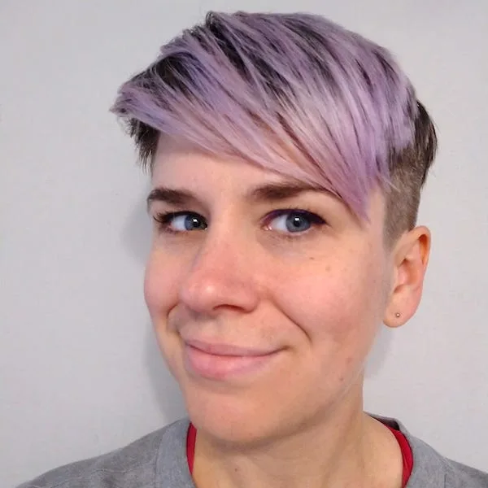
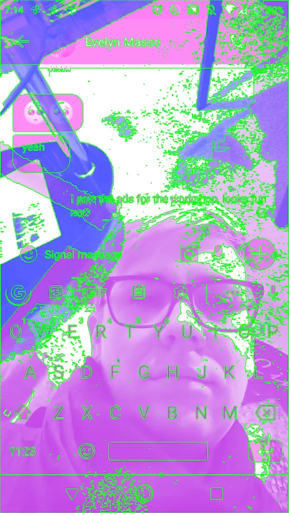
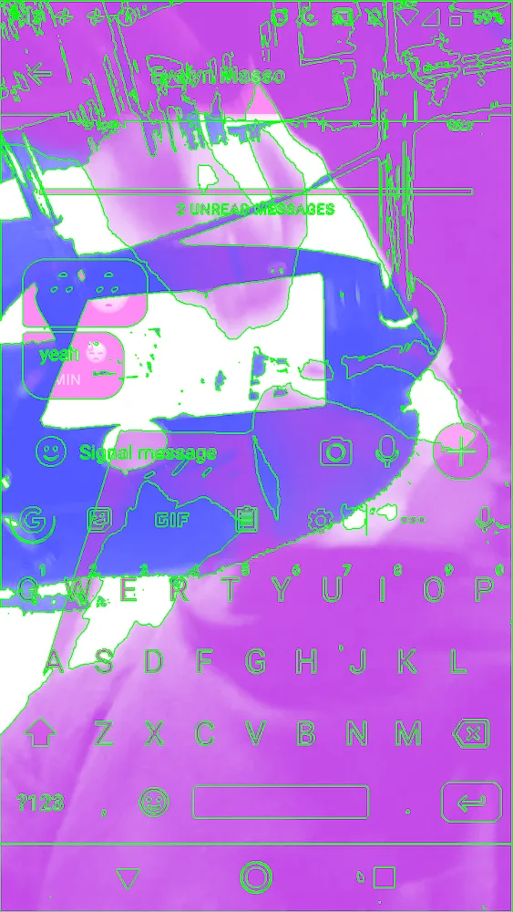

[#SupportP5 campaign](https://medium.com/processing-foundation/supportp5-this-giving-season-6dea3f70ffa3) *was launched on #GivingTuesday 2019 as an effort to raise funding for Processing Foundation’s software development, accessibility initiatives, educational programming, and annual Fellowship program. This campaign is our most ambitious campaign to date. The artists featured in the #SupportP5 campaign series have generously donated their artwork. We hope you take time to learn more about them, their practice, and consider contributing to keep our work going into 2020 and beyond! To support Kate’s work and contribute to the #SupportP5 campaign,* [click here](https://donorbox.org/supportpf2019-fundraising-campaign)*.*

*[Kate Hollenbach](http://www.katehollenbach.com/) is an artist, programmer, and educator based in Chicago, Illinois, and Los Angeles, California. She develops and examines interactive systems and new technologies relating body, gesture, and physical space. Her recent work includes “*phonelovesyoutoo*,” an Android application that lovingly watches its user’s activities by capturing video from the phone’s front camera, back camera, and screen. Through the application, Kate generates video works to understand what mobile devices see when they observe human bodies and how human presence is split between physical and virtual planes. Kate’s art practice is informed by years of professional experience as an interface designer and product developer. Formerly Director of Design and Computation at [Oblong Industries](http://www.oblong.com), she led an interdisciplinary team of designers and programmers to develop cutting-edge user experiences for collaborative environments and new interaction models for gestural devices. She oversaw the design of Mezzanine, the company’s flagship product. Mezzanine is in use today by clients including IBM, Accenture, CBRE, and Sonos. Kate holds an MFA from [UCLA Design Media Arts](http://dma.ucla.edu) and a B.Sc. in Computer Science and Engineering from MIT. Kate is currently teaching interactive media design and programming courses at DePaul University School of Design in the College of Computing and Digital Media.*

Portraits of the everyday and the impossibility of knowing each other intimately are a fitting metaphor for the way we are bombarded by images both unintentional and intentional. In Chicago-based artist Kate Hollenbach’s work, *USER\_IS\_PRESENT*, the title seems like a play on the Marina Ambromovic’s iconic work *The Artist is Present*, but the work itself, which uses a grid of images of its users, is a divergent perspective from Ambromovich’s. In this case, the user is the center and focus of the work: An installation of video portraits serves as documentation that simultaneously captures images of users via the front and back camera. Regarding the approach, Kate notes, “The rendering technique creates an effect where the recordings from the device depict a space that is between physical and virtual realities: it blends elements of user, interface, and environment. The work examines the tensions of interface design for new technologies, from the collection or sensing of data to the systems of habits created from that data.” The compression of the videos recalls Doreen Masey’s idea of time-space compression, and how we might understand time and space through the detection and sensor-ing of human movements. When the images merge together and coalesce, the work enables us to see simultaneity when our vision only allows one singular, myopic perspective. This work has been revamped and re-envisioned for *Computer Visions*, limited edition prints for the #SupportP5 campaign.

**Computer Visions* (2019), by Kate Hollenbach, *which is available when you donate to the #SupportP5 campaign. To support Kate’s work and contribute,* [click here](https://donorbox.org/supportpf2019-fundraising-campaign)*.**

*Computer Visions* (2019) combines elements of the user’s environment and their smartphone or mobile device screen. Kate uses the technique she developed for two previous artworks, entitled *USER\_IS\_PRESENT* and *phonelovesyoutoo*. Both works capture the user, their immediate environment, and their activities (i.e., texting, etc.) through the image capture capabilities of their smartphone. The images are produced through light analysis of the shapes and images captured from the front camera, back camera, and the screen itself. From there, the images are compiled to create one image.

For the limited edition prints of *Computer Visions* available through our fundraiser, Kate turns the camera on herself and fellow p5.js contributor and dear friend Evelyn Masso (they granted full permission!). She, then, let the software run for several days and wrote a Processing application to create a series of images from the captured footage. The image captures led Hollenbach to think through the combination of virtual and physical presences of two important relationships in her life. The majority of her work examines these human-computer interactions on a level of working through ways that our devices might capture how we are viewed, and how we might view the world and each other through our screens.

**Computer Visions* (2019), by Kate Hollenbach, *which is available when you donate to the #SupportP5 campaign. To support Kate’s work and contribute,* [click here](https://donorbox.org/supportpf2019-fundraising-campaign)*.**

Kate shared with us what the Processing and p5.js community have meant to her over the years. Here’s what she said:

> Creating software is a fundamental part of my creative process: it helps me to understand the limits, possibilities, and risks of technological systems. I understand Processing, p5.js, and related open source projects as platforms that give creators agency to program their own tools as alternatives to expensive, closed-source applications for creative media. For me, this means that even when I start a new project that requires learning a lot of new technical skills, there is usually a Processing or p5.js library I can lean on to make a quick sketch. Often, the sketch evolves into a finished project.

> I used Processing for the first time in 2004. It’s been a part of my creative practice for most of my career! I learned a lot about graphics programming and interactivity from the Processing documentation and examples at a time when other toolkits required many steps just to get graphics to appear on screen. Now there are many toolkits that can offer this, and while no tool is free of politics, I’m grateful for an option that is community-driven and supports open-source work. I appreciate the community and the project’s emphasis on education and accessibility, and how that’s evolved and expanded over time.

As a community-driven organization, we aim to work with individuals who have a deep investment in serving the contributors’ community. Kate has been an incredible community leader and served on a multitude of projects and initiatives as a mentor to new contributors, as well as an educator. Processing Foundation is fortunate to have her work as a part of our #SupportP5 campaign and we are grateful for her continued work and guidance.
