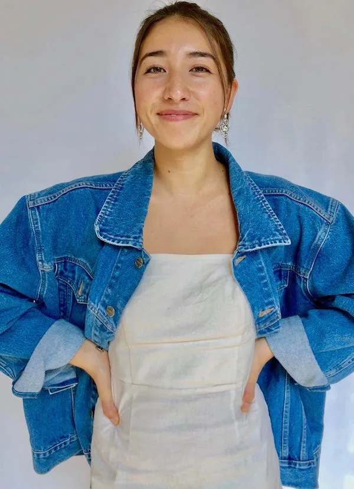
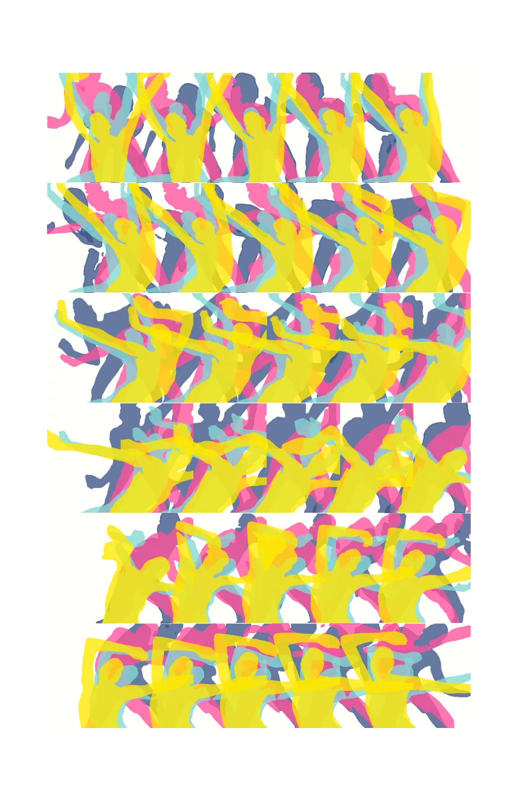

[#SupportP5 campaign](https://medium.com/processing-foundation/supportp5-this-giving-season-6dea3f70ffa3) *was launched on #GivingTuesday 2019 as an effort to raise funding for Processing Foundation’s software development, accessibility initiatives, educational programming, and annual Fellowship program. This campaign is our most ambitious campaign to date. The artists featured in the #SupportP5 campaign series have generously donated their artwork. We hope you take time to learn more about them, their practice, and consider contributing to keep our work going into 2020 and beyond! To support Maya’s work and contribute to the #SupportP5 campaign,* [click here](https://donorbox.org/supportpf2019-fundraising-campaign)*.*

*[Maya Man](http://sasj.nl/) is an artist and technologist based in New York City. Currently, she’s building experiments at the [Google Creative Lab](https://experiments.withgoogle.com/) after completing the [fiver](https://www.creativelab5.com/) residency program. Maya graduated cum laude from [Pomona College](https://www.pomona.edu/) with a double major in Computer Science and Media Studies with a focus in digital production. She spends most of her time creating [weird web things](https://www.instagram.com/p/BqJCY9NFyiB/), dancing in [studios](https://www.instagram.com/p/BzgAQEbAwKn/) and [public spaces](https://www.instagram.com/p/Brl1ro5AQpX/), and maintaining her love/hate relationship with the internet (mostly love though).*

An artist and dancer that has left an indelible mark in the Processing community is Maya Man. Her passion for creating art through code along with her dance and movement practice is unparalleled. As a graduate of Pomona College, she double-majored in Computer Science and Media Studies, with a focus in digital production, and continues to make art at the intersections of art and technology. She joined the Google Creative Lab team after completing their [fiver](https://www.creativelab5.com/) residency, which enables residents to create a wide array of creative projects. Since then, she’s worked on Chrome extensions such as [Glance Back](https://glanceback.info/), which lets users create a digital photo diary that takes sporadic photos — asking the user, “What are you thinking?” — and saves the files locally. Maya wanted to create the extension as a response to the question of how much quality time we spend in front of our devices.

She also created the [PoseNet Sketchbook](https://googlecreativelab.github.io/posenet-sketchbook/), which is a series of web experiments exploring the relationship between movement and machine. The fun and playful interface allows users to to create visuals with their bodies and transform speech and movement into text. It was the platform she used when working with choreographer Bill T. Jones.

**Not a picture but an event* (2019) by Maya Man, riso print #3, 11"x17"*, which is available when you donate to the #SupportP5 campaign. To support Maya’s work and contribute,* [click here](https://donorbox.org/supportpf2019-fundraising-campaign)*.**

For the #SupportP5 campaign, Maya donated the artwork, *Not a picture but an event (2019)*. The title of the work is inspired by the 1952 essay “The American Action Painters,” by art critic Harold Rosenberg. Maya wrote the following, in response to Rosenberg’s essay as context for her own piece:

> As a dancer and new media artist, this analysis speaks to my own practice nearly 70 years \[after Rosenberg’s essay was published\]. *Not a Picture but an Event* works through my own interpretation of “gesture to canvas” in the digital age. Instead of moving around a physical canvas to apply paint, I am moving in front of a webcam on my computer to apply color to the pixels rendering my form on the screen. I am essentially collapsing the process of movement to mark (via the p5.js program) while also lengthening the process of movement to physical color on final canvas (printed via Risograph). The computer program I wrote to generate this piece considers the process of Risograph printing and, like the Riso machine, creates the final image layer by layer.

With all of the projects Man has worked on, she also expressed what the Processing and p5.js community have meant to her. Here’s what she said:

> After my first year of studying Computer Science in college, I attended [the first-ever p5.js conference](https://processingfoundation.org/advocacy/p5-js-contributors-conference-2015) at Carnegie Mellon University, where I met this wonderful community of people who not only loved to code, but also were creating art, thinking about inclusion, and prioritizing access and education. In an often overwhelming world of technology, this space felt like home. As someone who grew up loving math, physics, and, separately, dance and art, it was truly life changing to realize these interests did not need to exist solely in parallel.

> Wanting to make my own creative projects using code, it was a dream to have access to open source tools such as p5.js and Processing to bring my ideas to life. Both the well-written software and the thoughtful documentation made it simple for me to begin sketching and exploring my own artistic practice with code as my medium. Now working full-time as an artist and technologist, it is clear that the journey I have taken would not have been possible without access to these resources. I still use p5.js/Processing to teach workshops, prototype ideas, and encourage newcomers from all disciplines to learn to code.

> Processing/p5.js continue to be prime examples of ~really good technology~ that make it easy to get started, and make it important to give back to the community that they intend to serve.

At Processing Foundation, we’re thrilled Maya considers what we’re doing to be “really good technology.” We couldn’t agree more. Accessibility and inclusion are core tenets of the work we do, aligned with the [trifecta of key elements that Casey and Ben have emphasized as central to the success of Processing: *education, language, and community*](https://medium.com/processing-foundation/a-modern-prometheus-59aed94abe85). Processing Foundation is fortunate to have Maya’s work as a part of our #SupportP5 campaign, and we are grateful for her continued participation and guidance. To learn more about Maya’s artwork, dance practice and creative process, visit the numerous links below.

  <iframe src="https://player.vimeo.com/video/378801329?app_id=122963" frameborder="0" scrolling="no"></iframe>

[Paint me in pixels so I can dance forever](http://mayaontheinter.net/paintme/): Two editions of this series was shown at the Contemporary and Digital Art Fair (CADAF), in Miami at Mana Wynwood, during Art Basel for FASCIA BLUES — a femme-focused digital art installation co-curated by [As We Are](https://asweareagency.com/) and [Her Visions](https://www.instagram.com/hervisions_/).

This past year, Maya’s team at the Google Creative Lab collaborated with Bill T. Jones to create [Body, Movement, Language](https://experiments.withgoogle.com/billtjonesai): a collection of PoseNet and voice experiments that allow people to explore the intersections of art, technology, identity, and the body. Maya said, “This was a dream project for me because it combined everything that I love into a single process, which is really what I love about the whole creative technology world. I wrote about my experience in a blog post titled ‘[Mixing Movement and Machine](https://medium.com/artists-and-machine-intelligence/mixing-movement-and-machine-848095ea5596).’”

She was also named one of [Dance Magazine’s 25 to watch](https://www.dancemagazine.com/inside-choosing-25-to-watch-2517166045.html) for 2020!

[More by her: Maya Man](https://www.morebyher.com/home/more-by-maya-man-artist-tech)

[Uses this](https://usesthis.com/interviews/maya.man/)
