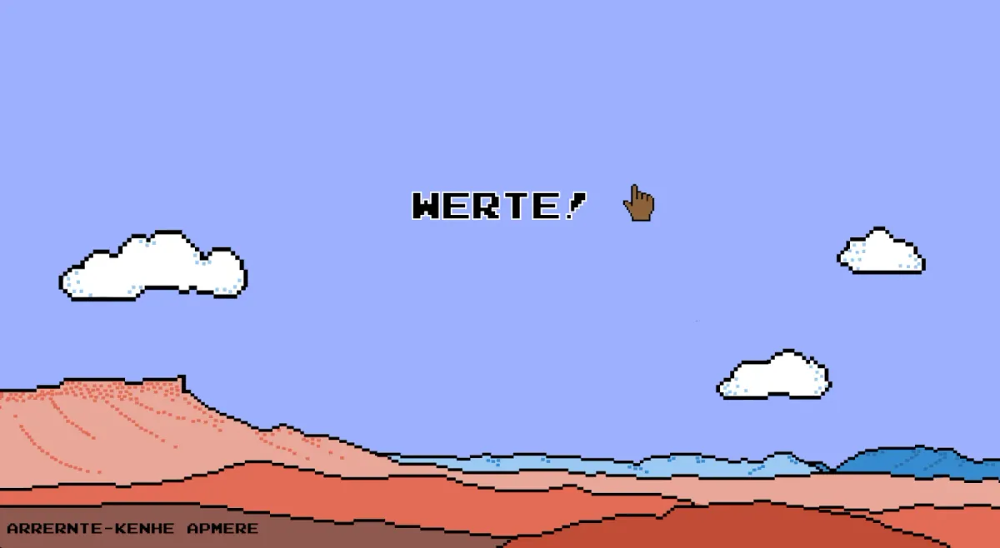
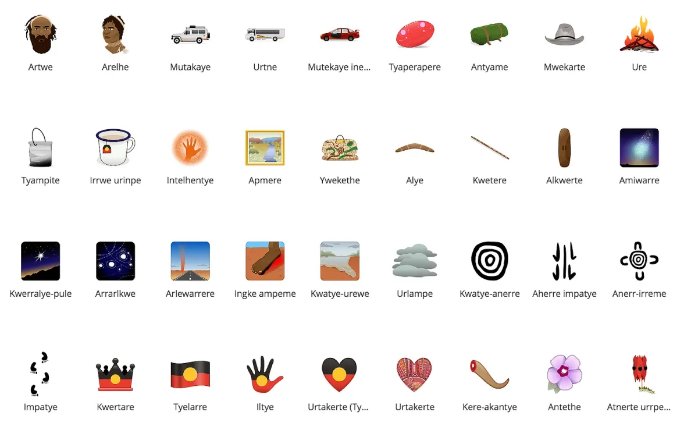
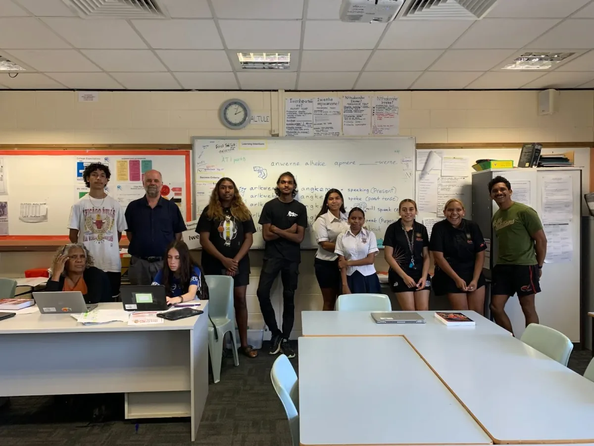
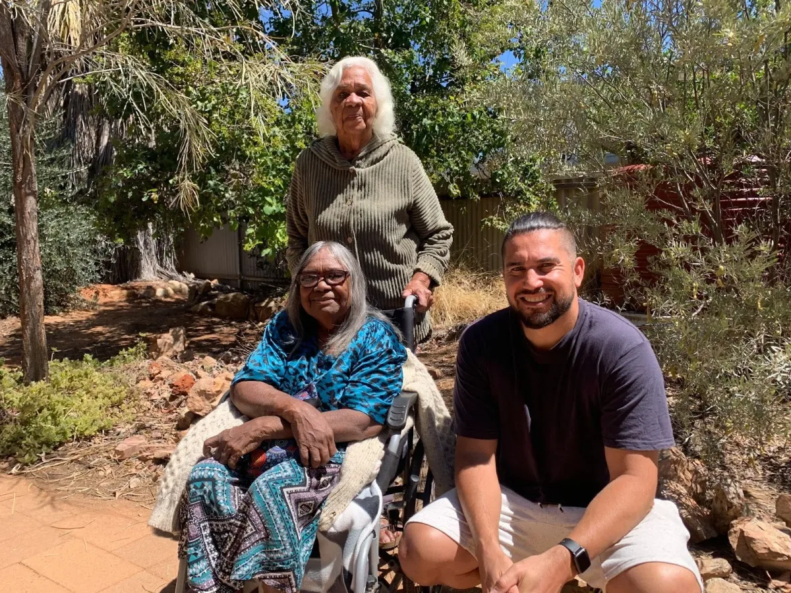
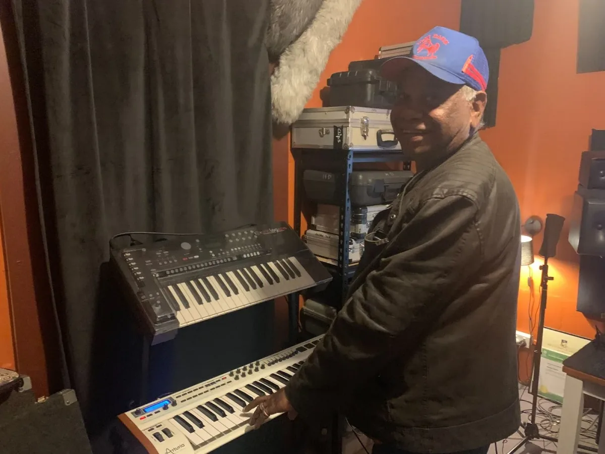
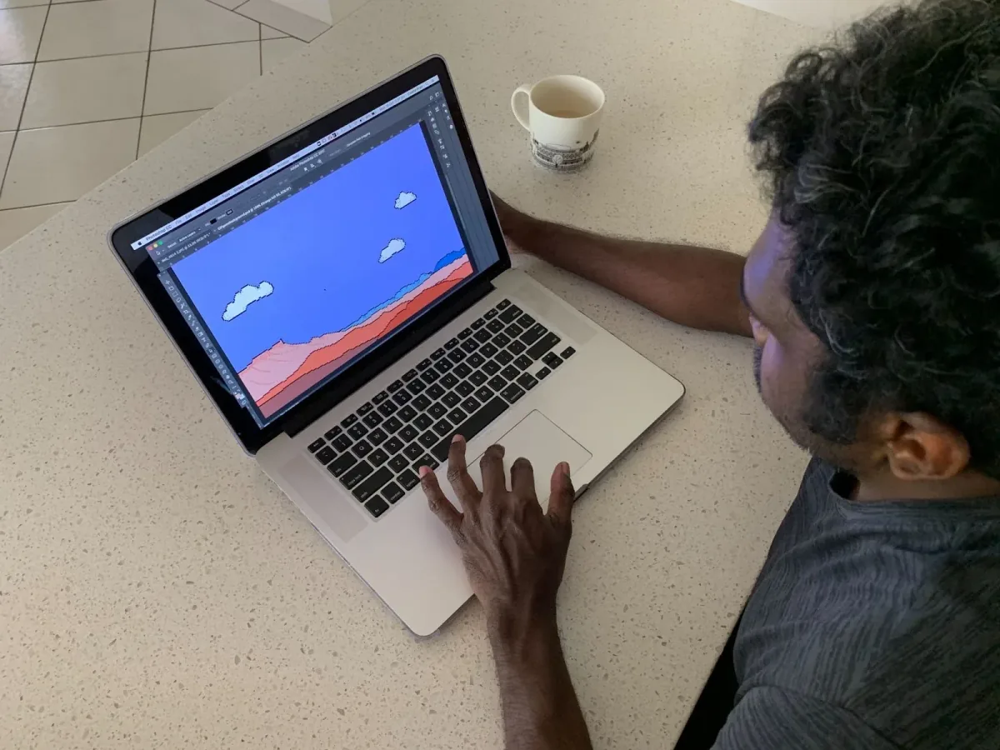
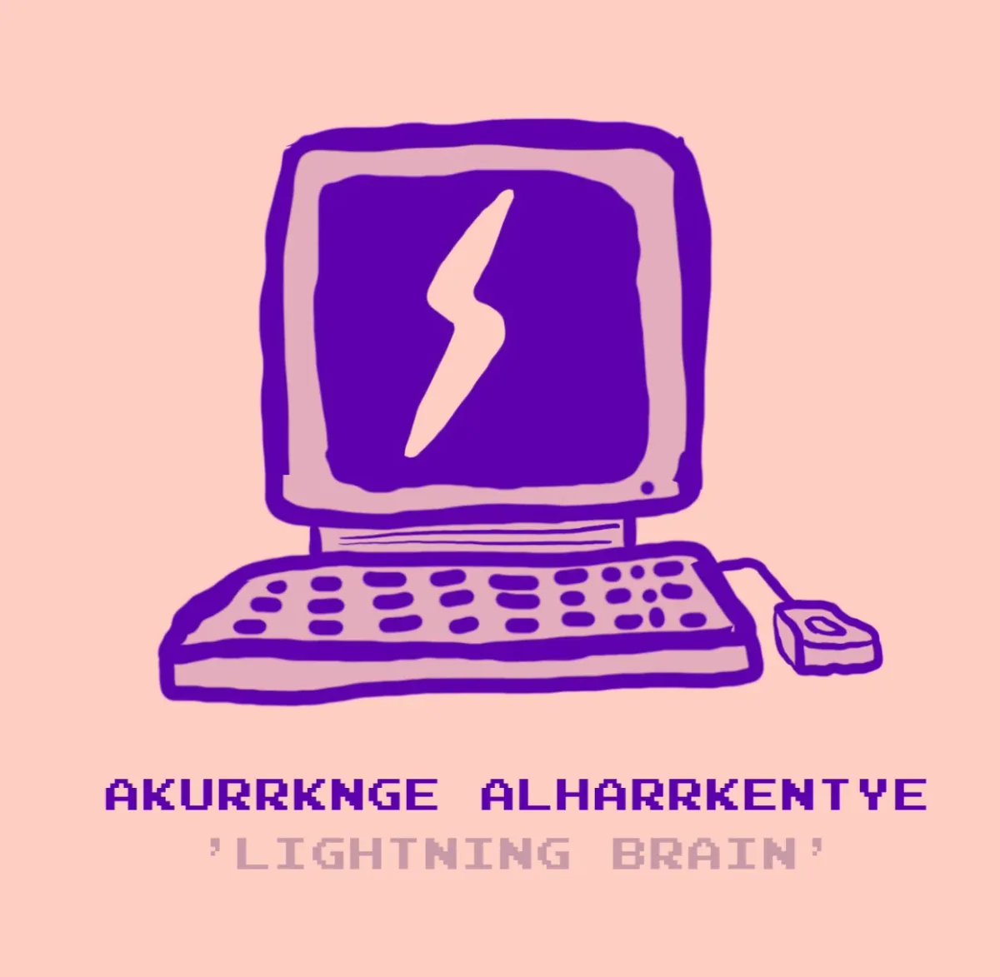

*For the sixth year of our annual Fellowship Program, we aimed to better support the new paradigm of remote and online contexts and socially distanced communities. We asked applicants to address at least one of four Priority Areas that, to us, felt especially important for finding ways to feel more connected right now: Accessibility, Internationalization, Continuing Support, and AI Ethics and Open Source. Additionally, we sponsored four Teaching Fellows, who developed teaching materials that will be made available for free, and are oriented toward remote learning within specific communities. We received 126 applications and were able to award six Fellowships, with four Teaching Fellowships. We are excited to note that this is our most international cohort ever, with Fellows based in Australia, Brazil, India, Mexico, Philippines, Switzerland; and in the U.S. in California, Portland, and New York. Over the next few weeks, we’ll be posting articles written by the fellows, or interviews with them, where they describe their projects in their own words. For an archive of our past Fellows* [*click here*](https://processingfoundation.org/fellowships)*, and to read our series of articles on past Fellowships,* [*click here*](https://medium.com/processing-foundation/https-medium-com-tag-pf-fellowships-la/home)*.*

---

*[*Kwene-akerle atnanpintyeme*](https://editor.p5js.org/indigemoji/full/Pf201Xh3x) is a prototype for a voice-activated computer game, designed and made with p5.js and ml5.js, by a group of 16 year-old students and the collective Indigemoji, that teaches the Arrernte language, one of more than 300 First Nations languages across Australia. It is made by 2021 Processing Foundation Fellows Indigemoji, a collective of artists, linguists, and technologists who first came together in 2018 to create an Arrernte set of emoji reflecting the traditional language of Mparntwe/Tyuretye in Central Australia. Their Github is [https://github.com/Indigemoji-Australia/indigemoji-app](https://github.com/Indigemoji-Australia/indigemoji-app) \[**Image description**: A computer graphic of a desert landscape with blue sky and clouds. In the center is the word “WERTE!” with a brown emoji hand pointing up. In the bottom left corner is the word, “ARRERNTE-KENHE APMERE.”\]*

### **Akaltyele anthetyeke awetyeke**

#### **“To teach to listen”**

The words “kwene-akerle atnanpintyeme” in Eastern and Central Arrernte, the traditional language of Mparntwe in the central desert of Australia, describe a kind of downward motion.

[*Kwene-akerle atnanpintyeme*](https://editor.p5js.org/indigemoji/full/Pf201Xh3x) is also the name of a prototype for a voice-activated computer game, designed and made with p5.js and ml5.js by a group of 16 year-old students in their Arrernte class at Centralian Senior School in Mparntwe as part of our 2021 Processing Foundation Fellowship (available [here](https://editor.p5js.org/indigemoji/full/Pf201Xh3x)). In the game, *atnengkwe,* or emoji animals, fall from the sky. To save them, you must say and pronounce their names correctly by the time they reach the ground. It’s a fun way to learn their names and practice your Arrernte.

Eastern and Central Arrernte is one of more than 300 First Nations languages across Australia. Some are sleeping, while some — like ours — is wide awake with about 2,000 remaining speakers. Our language is us. It is inseparable from our relationship with our landscape, our ancient stories, and who we are to each other. But we worry about our language. Our young people are surrounded by English, a dust which has blown in. We are working to wipe it back so you can see what was always there, what belongs there.

*Australia’s first set of First Nations emoji, created by Indigemoji through eight weeks of workshops with nearly 1,000 people. \[**Image description**: An encyclopedia of emojis of Arrernte words and their corresponding images.\]*

We are a collective of young people, senior linguists, artists, and creative technologists that come together every now and then to experiment with language and technology. We first formed in 2018 to create Indigemoji, Australia’s first set of First Nations emoji, through eight weeks of workshops with nearly 1,000 young people at the Alice Springs Public Library. We made a sticker set of 90 Arrernte emojis representing life and culture on *Arrernte-kenhe ampere* (Arrernte Country), available through a free app. Our goal was to decolonise the internet by embedding our language online and showing our young people that their language and culture matters. While it achieved that — our app has been downloaded over 50,000 times — our senior Arrernte, or “emoji bosses” as we call them, were always clear that anything we could do to encourage our young people to actually *speak* was worth trying.

Our technologies have long shaped this place. The colonial story here also begins with a new kind of technology, when thousands of poles and wires of the Overland Telegraph Line were woven through our landscape — without our consent — to connect our countries with the chatter of the rest of the world. The new animals that came with the work crews and settlements that grew out from the line changed our lives and our landscape forever. One hundred and fifty years on, new kinds of wires and connections have been transforming our lives, as the internet pulses through our soil and through the air — another colonising force.

The *Kwene-akerle atnanpintyeme* game grew from a broader project called *Akaltyele anthetyeke awetyeke*, which roughly translates as “to teach to listen.” It is an investigation of machine learning and broader concepts of artificial intelligence by the Year 10 Arrernte class at Centralian Senior College. We had heard about some of the work around First Nations languages and artificial intelligence happening around the world and wondered: What is it? Could it offer ways to practice or preserve our language? Can a machine *understand* Arrernte? And whose place is it to teach the machines? The future of our language lies with our young people. They will be the ones to make decisions about our language, so we wanted them to understand how this technology works.

*The students in the Applied Languages program at Centralian Senior College, Australia, where they speak multiple languages like Eastern and Central Arrernte, Western Arrarnta, Pitjantjatjara, and Anmatyerr. \[**Image description**: A photograph of eleven people in a classroom, most of them standing against a whiteboard with language and grammar notes.\]*

These students are our future language leaders. As part of a Certificate II in Applied Languages, the program at Centralian Senior College is all about building pathways and showing young people that their language is also something that offers job opportunities. The students come together four times each week from different schools around Mparntwe, and many speak multiple languages like Eastern and Central Arrernte, Western Arrarnta, Pitjantjatjara, and Anmatyerr.

  <iframe src="https://www.youtube.com/embed/yiFPFDKXo8I?feature=oembed" frameborder="0" scrolling="no"></iframe>

We began their journey by bossing a robot (enacted by a human) around the classroom. We thought robots were smart, but it turns out you have to tell them *exactly* what to do. You have to program them. But with what? And how? We learned about data by getting a box of Smarties — a kind of candy, like M&Ms — and classified them by colour, arranging them into data visualisations. We then used Teachable Machine to train our computers to recognise those colours. Then we ate the data.

Our language is data too. We began to experiment with building a dataset from hundreds of recordings of the different Arrernte animal names. We had to record ourselves saying the words over and over and over again to train a model. Bit by bit, the computer began to recognise our words. But it was a process: If there were too many boys’ voices, it had trouble understanding when a girl was speaking. We learned that this is a bias in the dataset. We also accidently mispronounced one of the animal names, so we had to start again. (*Aherte* and *arerte* are similar, but not the same. One is a bilby, the other means “crazy”!)

We need our language bosses, people like Veronica Perrule Dobson, Kathleen Kemarre Wallace, and Joel Perrule Liddle, to check our work and help build the dataset, making sure it is exactly right. It made us think more about what the cultural protocols might be to train a dataset like this. For that reason, we have decided not to share our dataset for now. While we want to share our language, we also want to care for it and know what is done with it and our voices. Data sovereignty is important to us.

*Kathleen Kemarre Wallace and Veronica Perrule Dobson, two elders, or senior Arrernte, whom we call “emoji bosses,” with Indigemoji member Joel Liddle Perrule. \[**Image description**: A photograph of three people, two seated and one standing, all smiling at the camera. They are outside in a garden.\]*

We worked with graphic designer Graham Wilfred Jr. to design the game, who took inspiration from arcade games. We asked Western Arrarnta country singer Warren H. Williams (we’re big fans!) to make us some sounds for the game. He recorded them on a keyboard for us. We then built a p5.js sketch with our graphics, sound, and Teachable Machine model. Our mentor Yining Shi and the Processing Foundation worked with us every week, helping us to make changes and try things out. And the game was made.

*Western Arrarnta country singer Warren H. Williams wrote the musical score for the game. \[**Image description**: A photograph of a man smiling at the camera while playing a keyboard in a room with musical equipment.\]*

*Trying out the [*Kwene-akerle atnanpintyeme*](https://editor.p5js.org/indigemoji/full/Pf201Xh3x) *game. \[****Image description****: A photograph of a person on a laptop playing the game. On the screen there is a computer graphic of a desert landscape. Beside the person is a coffee cup on a table.\]**

While we had learned so much about machine learning, we realised that we were only understanding it one way, through English. There is no Arrernte word for computer, for example. To truly consider these ideas, we needed to look at them through an Arrernte lens, to understand them our way. So one day in class we spent hours trying to translate key concepts into Arrernte. Could “computer” translate as “to type,” or is it a kind of “thing”? What algorithms hide in our language? What metaphors are there for data? Is it like sand? Is “training” a machine the same thing as “teaching” it? Is artificial intelligence even smart? Or is it “fake” knowledge?

*After a long process of thinking about how exactly to translate the word “computer” into Arrernte, we decided on *akurrknge alharrkentye,* which means “lightning brain.” \[**Image description**: A graphic of an illustration of a desktop computer, with a bolt of lightning on the screen. Below it are the words: “AKURRKNGE ALHARRKENTYE. ‘LIGHTNING BRAIN.’” The background is pale pink and the computer and text are purple.\]*

We took these ideas to Arrernte linguists and emoji bosses Veronica Perrule Dobson, Kathleen Kemarre Wallace, Joel Perrule Liddle who spent many weeks thinking through what these terms should and could be. There are, of course, no direct translations for these concepts. They translated computer as *akurrknge alharrkentye* which means “lightning brain,” for example. These new terms are built on old language. It is deep language, every word deliberate. Every word existing in the closest relationship with the one next to it to build meaning. They are listed below. You can also listen to them. Listen to understand.

They also had another message.

**Itirrentye arrekantherre akurnentye-ileme akurrknge alharrkentye-le akwetethe anperlte-aneme. Akethe-ke-ame arrantherre alkngwirreke?**

**Your thinking becomes bad if you’re always on the computer. Have you mob forgotten about the outside?**

Play [*Kwene-akerle atnanpintyeme*](https://editor.p5js.org/indigemoji/full/Pf201Xh3x) here.

[See and listen to the full list of translations, or read more about the full team here.](https://www.indigemoji.com.au/akaltyele-anthetyeke-awetyeke)

---

*Indigemoji was mentored by* [*Yining Shi*](https://1023.io/)*, who served as a mentor for 2020 ml5.js Fellow Andreas Refsgaard.*
