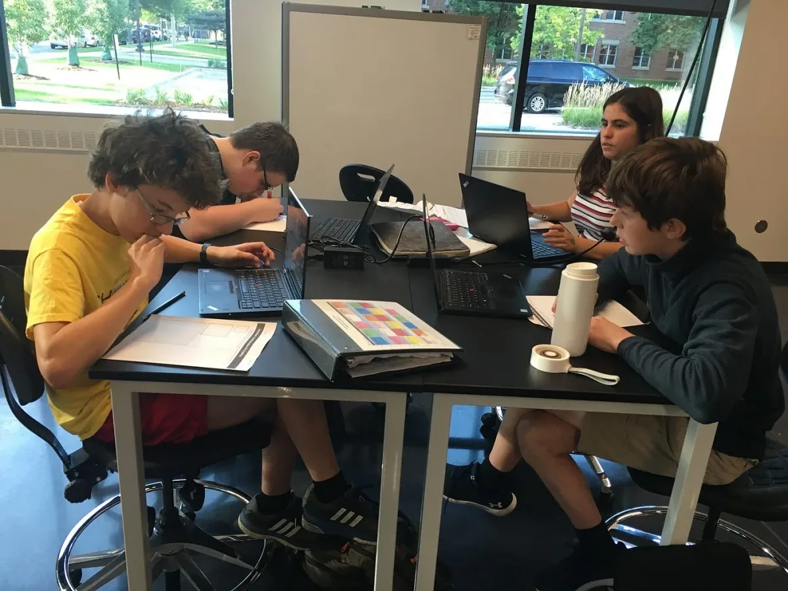
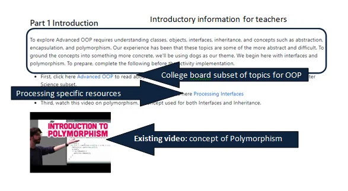
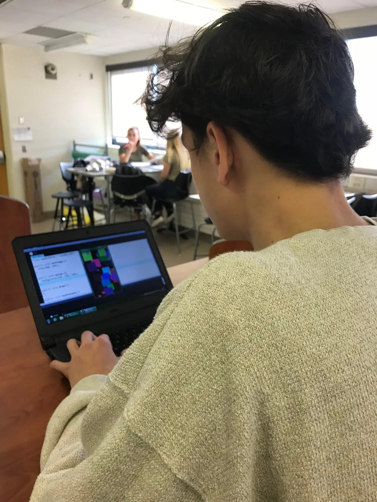
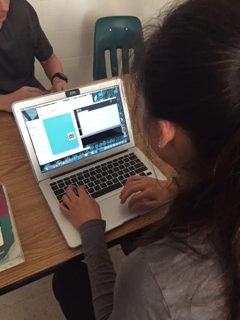

2018 Foundation Fellows

---

*The 2018 Processing Foundation Fellowships sponsored* [eight projects](https://medium.com/processing-foundation/introducing-the-2018-processing-foundation-fellows-a16ae4e87f80) *from around the world that expanded the p5.js and Processing softwares and their communities. Fellows developed work ranging from Chinese translation of the p5.js website, to workshops that teach smartphone coding in Ghana. During the coming weeks, we’ll post articles written by the fellows and interviews with them, in conversation with Director of Advocacy Johanna Hedva, that showcase and document the great work by this year’s cohort.*

---

*High school students in a computer programming class work on a lab assignment similar to those created for this project. \[image description: Four students at a desk, working on computers.\]*

---

**Johanna Hedva: How did this project get started and what did you accomplish with your fellowship?**

**Kate Lockwood:** All three of us teach computer science, including the Advanced Placement Computer Science A (AP CS A) course, in high schools in the Twin Cities metro area in Minnesota. Initially we met through our local chapter of the Computer Science Teachers Association and realized we had a common interest in making our AP CS A courses more engaging for our students. Like many CS teachers, we are the only computer scientists at each of our schools, so we started setting up regular times to get together and compare notes. We’d had several meetings where we expressed our frustration with Java and how difficult it was for some students to see Java as their first programming language. Based on these discussions we came up with the idea to try teaching a large portion of the class in Processing.

Most of the currently available curriculum resources available for AP CS A are in Java, and since the College Board requires a very specific set of skills, it was important that any Processing resources cover the same outcomes.

We ended up with the beginnings of an online resource for teachers. We decided to make our resources teacher-facing so that they could be customized to fit the needs of individual classes and teachers. We are excited about the idea of getting more teachers involved in both using our resources and in contributing their own. To help encourage participation, we’ve submitted proposals to several conferences to host Processing workshops focused on building a community of teachers using Processing in AP CS A and similar introductory courses.

*This screenshot shows a portion of the resources for advanced OOP topics. This overview shows our curation-based approach to creating instructional materials. We first give some background information on the topic, then link to curated resources that teachers can use to review the topic themselves, or directly pass on to students. We focus on making sure teachers understand (1) what portions of the topic are required knowledge for the college board test, (2) how that topic is implemented in Processing, and (3) any additional resources that will help the students understand the topic. \[image description: A screenshot of the Github resource for Advanced OOP.\]*

**JH:** What were some of the challenges that came up, and what solutions emerged?

**Kaitlyn M. O’Bryan:** There is a lot to balance as a teacher, and we found this balancing act to be challenging. We were trying to balance student-centered and creative coding challenges with meeting standards for the AP test, and trying to balance front-loading instruction with project-based learning. We knew that our endpoint was to increase student engagement, but finding the right balance between these factors was tricky for our team. Our periodic meetings helped us bounce ideas off one another and consider pros and cons of each choice we made. Since we all teach in different contexts, we were able to draw from our varied experiences with students to help shape our decisions in developing this resource.

**Thomas J. Reinartz, Jr:** The Fellowship provided tangible, useful goals and products that we can begin to use in our teaching this year. We first decided what our top four topics would be, divided those up, and convened throughout the summer to check in on progress and completion. We have completed four modules that include some teaching strategies, assessment, and project ideas:

1.  An introductory module covering variables and if/else statements for users of the resources to get familiar with Processing. After this module we chose topics that were more advanced and aligned with topics commonly tested in AP CS free response questions;
2.  2D arrays;
3.  Inheritance and interfaces;
4.  Strings.

When working on this project we thought of ourselves more as curators of existing tutorial material. There are so many great Processing resources out there, we didn’t want to reinvent the wheel. What we did was find really good resources to link to and then provide some ideas for assessments and how to tie the materials to the College Board curriculum.

Perhaps the most significant challenge was maintaining some consistency with each module, but over time, we were able to bridge the differences. While these modules are ready to go, we do not yet see them as “final” in the sense that they will continue to grow and be shaped by our actual implementation and practice. We’d also like to build out the “book” further as we revise them to more accurately address the gaps in our materials.

**KL**: For me one of the challenges was thinking about making the resources we developed useful to as broad a range of teachers as possible. I have a pretty set way I like to run my classes and lab sessions, so thinking about how to create materials that would be equally applicable in other classroom environments was a challenge at first. I think that working together as a team was helpful in overcoming this. We all have different teaching styles and different student populations, so comparing how each of us would teach each unit helped to make each set of resources more broadly useful.

*An AP CSA student working on the first project where students learn to read and interpret the documentation from Processing. \[image description: The camera points over the shoulder of a student, showing the screen of their computer as they work on a Processing sketch.\]*

**JH**: What comes next for you all? How will your fellowship work be continued?

**KO**: Having started the school year, I’ve added some additional projects and tasks to the work we did this summer and will refine these as we go. It’s so interesting to see how the tasks we developed actually play out once they are in the hands of students. I learn a lot from implementing these ideas with real students. It’s exciting to see them react to movements they create onscreen and how they have a drive to personalize so many aspects of the tasks.

**KL**: I plan to use the materials in a class I’m teaching. I think that trying them out on students in a classroom setting will help me refine the sections I worked on. I’ll be able to do another round of revisions to address any problems I encountered using the labs and to add additional resources I used with my students. I also plan to continue to add to the project, by adding additional topics and alternate materials to some of the sections we’ve already built.

The other big next step for me is to work on our workshops. We put proposals for workshops into both the TIES and SIGCSE conferences. If one or both get accepted we’ll need to work on developing a three-hour workshop on using Processing in CS1/AP CS A. I also think the workshops would be a great opportunity to get more educators involved in using Processing and potentially contributing to the project.

**TR**: For me, this is just the first step in a longer process. Eventually, I would like to use Processing exclusively for the course. But that may take some time to work out the details. The process would include revision efforts for the current modules and additions to units are not currently there. We also plan to provide outreach opportunities for teachers. There are at least two conferences this year, and we plan to offer workshops for computer science teachers.

*Student working on project involving variables in Processing. \[image description: The camera points over the shoulder of a student as they work on a laptop. A Processing sketch is shown on screen.\]*
