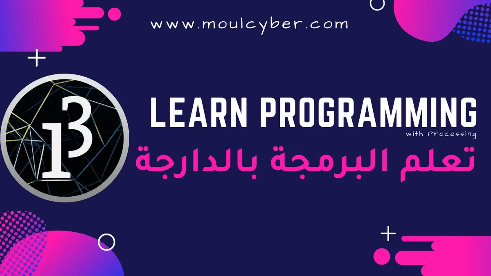
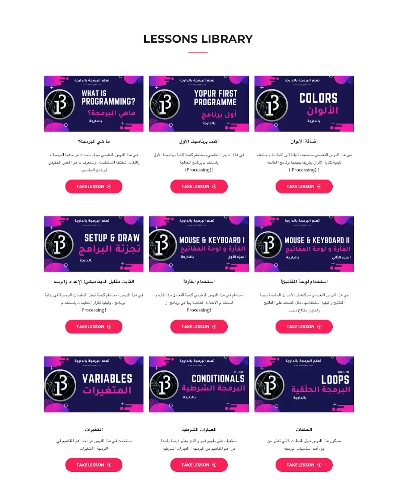
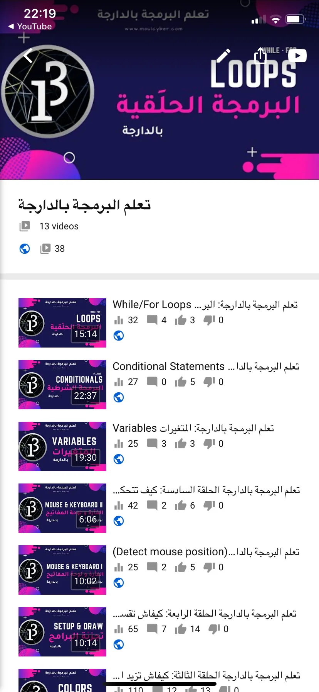
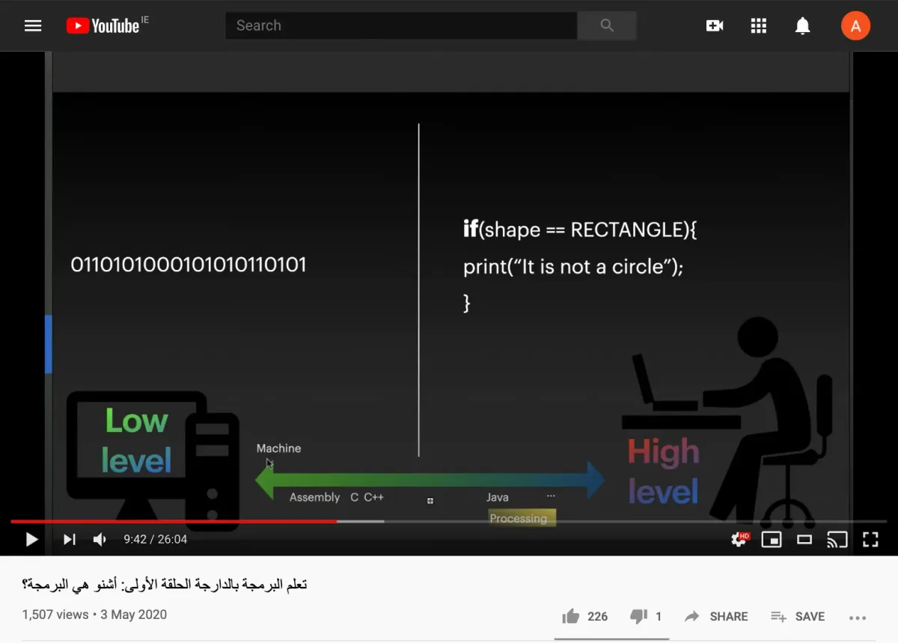

The 2020 Processing Foundation Fellowships sponsored six projects from around the world that expanded the p5.js and Processing softwares and nurtured their communities. In collaboration with NYU’s [Interactive Telecommunications Program](https://tisch.nyu.edu/itp), we also sponsored four Fellows to work on [ml5.js](https://ml5js.org/). Because of COVID-19, many of the Fellows had to reconfigure their projects, and this year’s cohort, both individually and as a whole, sought to address issues of accessibility and inclusion in their projects. Over the next couple months, we’ll be publishing our annual wrap-up articles on how the Fellowship projects went, some written by the Fellows in their own words, and some in conversation with Director of Advocacy Johanna Hedva. You can read about our past Fellows [here](https://medium.com/processing-foundation/https-medium-com-tag-pf-fellowships-la/home).

---

*[Abdellah Iraamane](https://www.linkedin.com/in/aairaamane/)’s project is called “[Moul Cyber,](https://moulcyber.com/)” which is a Moroccan term that refers to the person who runs a cyber cafe. Moul Cyber features a YouTube channel and website that offers Processing tutorials in Arabic. Abdellah is a Moroccan software engineer and social activist based in Dublin, Ireland. He has been working on youth development projects aiming to enhance and build the capacities of rural and suburban youth, alongside a full-time career as a developer. He likes clean code and pizza, and strives to achieve universal access to quality education. Abdellah was mentored by [George Boateng](https://www.linkedin.com/in/georgegboateng/), who was a Fellow in 2018, and served as a mentor for Prince Steven Annor, a 2019 Fellow.*

What an interesting year 2020 has been so far, a year of re-thinking and re-imagination. Over the last few years, I have attended numerous talks where the speaker demanded the same things: “let’s rethink this, let’s re-imagine that.” Sadly, not a lot of re-thinking and re-imagination happened. In 2020, however, it’s almost as if the world is asking for change, for a paradigm shift in our activities and much of what we have always deemed “the normal flow of things.”

I joined this year’s Processing Foundation Fellows on a mission to re-think how children in remote areas of my country, Morocco, learn to code. I believe the concepts of creative coding to be a catalyst for continuous engagement with programming curricula in schools, especially for students who have not written a single line of code before. The main aim of my project was to ascertain the hypothesis that teaching programming through engaging and enjoyable “artistic” sessions will result in a much higher adoption rate and fewer dropouts; and should be the de-facto standard in schools around the world, as opposed to teaching the syntax of one of many programming languages that may or may not stand the test of time.

My mentor, George Boateng, attempted to implement a similar initiative two years ago, in a 2018 Fellowship, albeit a little different. His project, which you can read about [here](https://medium.com/processing-foundation/suacode-breaking-the-coding-barrier-in-africa-with-smartphones-f41a3e432199), proved highly scalable and successful among children of multiple African countries, which further served as motivation for my own project.

My project focused on communities with very little to no knowledge of code, in remote villages in the rural southern regions of Morocco. The context there is particular: there are no educators qualified to teach code in schools. The approach then is to conduct coding sessions in local schools using Processing and creative coding.

Now comes the re-imagination part: How do I deliver a classroom-based model without a classroom? Not having much of a choice, I called my mentor and said “Okay, I had traveled to the schools and gathered partners on the ground, but I can’t do any of what I had planned in a country that is locked down.” We discussed the best ways to organize the project: *Do we split the material into lectures? Do I invite students to a virtual classroom and build an interactive program together, which will teach them the fundamentals of computing? Can we target specific age groups while doing things online?*

*The Moul Cyber Lesson page.*

And many more questions that required answers. We both agreed that the main differentiator of the project is the language: that I would deliver creative coding lectures using the Processing software in Arabic, something that hasn’t yet been done. Delivering an educational project online is much, much tougher than it would be on the ground. You don’t know your audience, or their interests, or their language, among other things. In a classroom, you’d at the very least target a specific age group, or specific interests.

I opted to deliver content on a YouTube channel, [available here](https://www.youtube.com/channel/UCUat7CXKGgaq2LwVW_hGq_Q/videos), due to its large user base in Morocco, and the tight integration with social networks and not being confined to a specific platform. I called the project “Moul Cyber,” a Moroccan term referring to the person who owns a cyber cafe. I also created a website, available [here](https://moulcyber.com/), that holds much of the basic Processing documentation in Arabic, split into fundamental programming sections, along with the video lessons.

*Moul Cyber’s YouTube channel*

Soon after uploading my first video, which introduced programming and the Processing language in a fun way, I was surprised that it had been viewed over 1,000 times in less than 48 hours. It also took my channel from 50 to 400 subscribers. I got questions and replies on Youtube, Facebook, and even LinkedIn, many of which asked for more content. At the end of every lesson I had a piece of homework to be solved by the students, which served to prepare them for the next video lesson. Although I did not explicitly ask for submissions, I got two to four submissions on average.

As the videos and discussions went on, I was approached by two NGOs working in Morocco, with partnership ideas aiming to better leverage the concept of the project on the ground once restrictions imposed by the COVID-19 pandemic are lifted. And we intend to explore this further in the very near future in a rural area of Morocco that we have already agreed upon.

The level of engagement with the video lessons, despite the little to no sponsored promotion, along with the website traffic, are primary indicators that creative coding is indeed a successful approach for beginners to learn programming. Primary and secondary school students in Morocco rarely find IT content in Arabic online, as these topics are usually covered in high school in French, a language they are not familiar with in the beginning of their academic journey. Offering such content in Arabic is thus crucial to the success of this initiative. Furthermore, catching the attention of NGOs is a further assertion that the traditional model of teaching code may not be the most optimal.

Creative Coding is about re-thinking and re-imagining how we teach code. More work is to be done; I merely explored, within the limitations of 2020, whether or not there is demand for a new way to teach code in Arabic, and there clearly is, for at least two types of stakeholders: learners and education activists. If this is something that interests you, maybe you could further my work, and that of George’s, and deliver content in more languages, or contribute to the Processing docs, or explore better ways to deliver educational content online!

I know I will continue working on this once life is back to the “new normal” soon.

