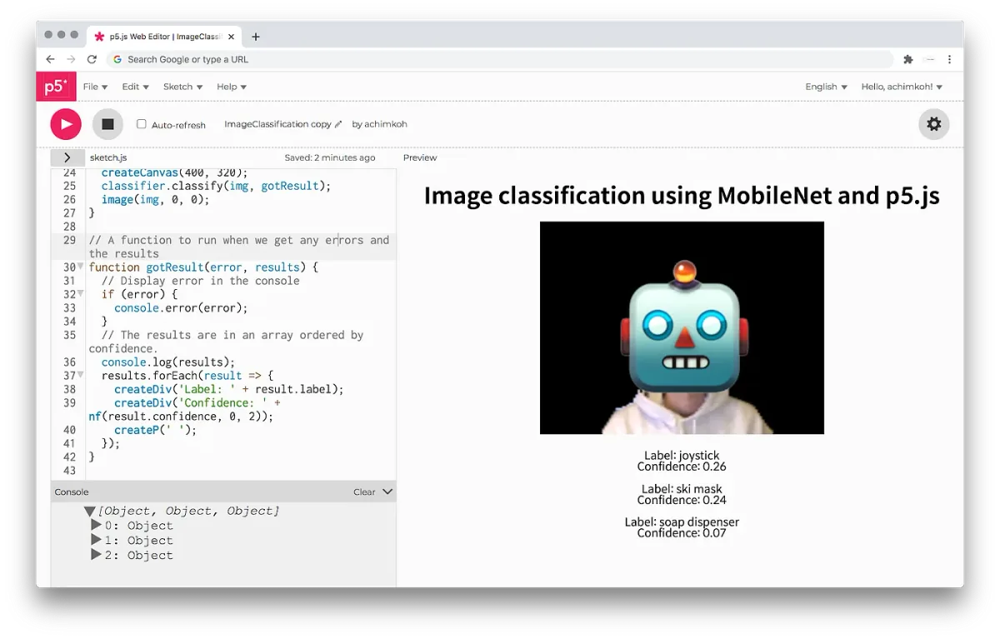
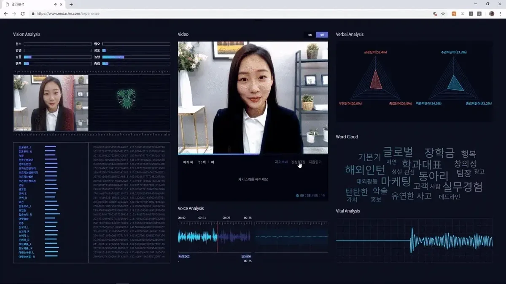

The 2020 Processing Foundation Fellowships sponsored six projects from around the world that expanded the p5.js and Processing softwares and nurtured their communities. In collaboration with NYU’s [Interactive Telecommunications Program](https://tisch.nyu.edu/itp), we also sponsored four Fellows to work on [ml5.js](https://ml5js.org/). Because of COVID-19, many of the Fellows had to reconfigure their projects, and this year’s cohort, both individually and as a whole, sought to address issues of accessibility and inclusion in their projects. This is the last interview in our series of wrap-up articles on how the Fellowship projects went, some written by the Fellows in their own words, and some in conversation with Director of Advocacy Johanna Hedva. You can read about our past Fellows [here](https://medium.com/processing-foundation/https-medium-com-tag-pf-fellowships-la/home).

*(Image descriptions are included in the caption when they are too long to fit in alt text.)*

---

*A screenshot from Achim’s workshop tutorial, from his project “Critical Machine Learning with ml5.js.” [Achim Koh](https://scalarvectortensor.net/) is a programmer, translator, and educator, currently based in Seoul, who works around the techno-politics of machine learning, digital culture, and knowledge production. He is interested in technological literacy that enables social progress and democratization rather than simply reproducing existing power structures. Image courtesy of Seoul Museum of Art. Achim was mentored by [Joey Lee](https://jk-lee.com/). \[image description: A web browser displays the p5 web editor. The source code is displayed on the left side of the screen. The result of the executed code is displayed on the right side: the title reads “Image classification using MobileNet and p5.js”. An image of a person from the chest up, whose face is covered by a robot emoji, is shown. Underneath, the caption reads: “Label: joystick, Confidence: 0.26, Label: ski mask, Confidence: 0.24, Label: soap dispenser, Confidence: 0.07”.\]*

**Johanna Hedva: Hi Achim! Can you tell our readers what your project is about? What are your intentions and goals with this project?**

**Achim Koh**: Thanks for asking! With Critical Machine Learning with ml5.js, I aimed at creating some educational material for a critical understanding and usage of machine learning and AI, using ml5.js as the central tool; and activating said materials in South Korea’s local context through workshops.

The project is closely tied with another fellowship I did in early 2020 ([which you can see here](https://jjgg.info/)), in which I started fleshing out my rationale for a critical pedagogy of AI in the South Korean context. It is also an update to a previous online readings list I built for an interdisciplinary approach to machine learning and AI, curated by sub-themes like black box and bias.

The project is partly a response to industry- and government-driven AI initiatives, which typically cast AI as mainly a vocational skill, as previous coding education initiatives tended to do with software programming. Ultimately, this work intends to use p5.js and ml5.js in order to build resources that help people think critically about technology, power, and knowledge. I believe that critical thinking is an integral part of any practice that operates between art and technology, and this project makes that belief explicit.

**JH: Your Fellowship is currently still underway, with some upcoming workshops in South Korea on December 6 and December 13. What will the workshops offer? How do people attend?**

**AK**: The workshops will provide an introduction to machine learning through a combination of hands-on exercise and discussion. Participants will learn basic concepts of machine learning and train their own machine-learning model in the browser using tools like ml5.js and Teachable Machine. We will also discuss some key questions to ask about machine-learning applications, and what our relationship with the technology should be.

I have planned two online sessions, one on Sunday, December 6, and another on Sunday, December 13. To register, or read more info, [click here](https://www.notion.so/Critical-Machine-Learning-with-ml5-js-online-workshops-fe276b28fea745cfa7c4c003bff92684).

Sessions will be in Korean, and participants will need a desktop computer or laptop with a Google Chrome browser installed, a keyboard and mouse, a webcam, and speakers (or headphones).

The workshops are geared towards people who identify as artists or activists interested in technology; are curious about AI and machine learning but don’t know where to start; and/or are interested in tech literacy and education.

Here is a list of some things that will be addressed in the workshops:

-   How to train an image-classification machine-learning model using Teachable Machine
-   Using pre-trained models in ml5.js
-   Building a small ml5.js application using a custom-trained model from Teachable Machine
-   High-level discussion of how machine learning works
-   Key questions to ask as a user of machine-learning technology
-   Different components of the technological infrastructure of machine learning
-   Examples of real-world machine-learning applications
-   Our relationship with machine learning and related technologies

On the other hand, some things that will not be covered in this workshop include:

-   How to become a machine learning specialist
-   Cool tricks that will get you good scores in machine-learning competitions
-   “All you need to know about AI”
-   Breakdown of state-of-the-art models and research papers

**JH: I’d love to hear you talk more about how we might approach a critical understanding of machine learning. What are the implications? What might it look like for machine learning to engage with critical thinking? And what happens when there isn’t as much critical thinking as there ought to be?**

**AK**: A good starting point to consider is that technology is not neutral; it is shaped by its socio-historical contexts, and in turn shapes the world around it. To think critically about technology is to be aware of its situated nature, the values and human decisions that permeate it. To state the obvious, machine learning did not come out of nowhere; it is a field informed by decades of modern computer science and statistics, and its recent rise to prominence would not have been possible without the preceding social change that produced big data. Being at its core an automation technology, machine learning has powerful implications economically, politically, culturally.

The works of [Cathy O’Neil](https://weaponsofmathdestructionbook.com/), [Meredith Broussard](https://mitpress.mit.edu/books/artificial-unintelligence), and [ProPublica](https://www.propublica.org/article/machine-bias-risk-assessments-in-criminal-sentencing), among others, provide examples of what can go wrong by applying predictive models to sensitive decisions. Recently, partially thanks to public health concerns caused by COVID-19, AI-based interviews that predict applicants’ social skills and job competence are becoming more commonplace.

*Screen capture of an AI-based interview system in action. Retrieved from [https://www.midashri.com/intro/process/ai-interview/v4](https://www.midashri.com/intro/process/ai-interview/v4). \[animated gif description: Screen capture of an AI-based interview system in action. A video of an applicant speaking in the center of the screen is surrounded by visualizations of data analysis results, including: emotion analysis based on facial expression, a list of facial features, voice analysis, sentiment and subjectivity analysis of spoken words, a word cloud, and a vital analysis graph.\]*

**AK**: Many of these cases deploy automated decision-making systems in the name of efficiency and objectivity, but in doing so add layers of opacity to systems that need transparency.

Other times, there is also straight-up weird stuff like this:

*An advertisement for AI-based language tutoring. Retrieved from [https://twitter.com/soyrev/status/1320150518111457280](https://twitter.com/soyrev/status/1320150518111457280). \[animated gifdescription: In a mobile advertisement, an asian woman is having a conversation with a 3D-rendered white male avatar. The avatar asks: “How come you are so pretty without any religion? Can I get your number?” The woman responds: “Here. I guess you’re the reason I am pretty.” To which the avatar replies: “You will be blessed.”\]*

**AK**: A few helpful things to keep in mind when dealing with these types of applications are to ask how the technology was made, and by whom. For machine-learning applications, these translate to questions like: Who designed the models? Where and when does the data come from? Does the application perform similarly across different targets, or does it not work well for certain groups of people or objects? In addition, one might ask why the companies or governments are doing what they do, making what they make, i.e., what drives them.

**JH: Machine learning seems to have huge potential, not only for artists and technologists as a tool to use in their practices, but also for the audiences of these works. As you rightly say, this is a different kind of potential than the corporate kind, and as with any technology there needs to be a care and criticality around what it’s used for and why, and by whom and for whom. Can you speak a little about why you see machine learning being so vital right now, and what forms of thinking would be useful to meet it with? It strikes me that developing critical thinking for it is a form of literacy, of making sense of the meaning it produces. Does that chime?**

**AK**: The potential seems two-sided. On the one hand, you have machine learning as a tool that opens up new possibilities. One thing that is often said is that automating mundane tasks opens up time and space for more creative projects. But it is also that different tools and affordances can shape the way we think. This prospect extends a certain technological vision shared by people like Vannebar Bush, Douglas Engelbart, and Alan Kay. On the other hand, the difficulties of creating a well-performing machine-learning model might mean that the practice is a mostly corporate or state-led endeavor, where machine learning is more of a tool of capitalism and surveillance. These aren’t mutually exclusive possibilities, as the history of computing has repeatedly demonstrated.

The broadening application of machine learning in different fields and its increasing inclusion in common parlance, as well as developments such as South Korea’s plan to create 100,000 jobs in AI and software, suggest that this is a great time to discuss whether those applications are developed and deployed in a way that people want and need. Such discussion would be informed by machine-learning literacy, as you said.

Technological literacy comes in many flavors: sometimes it signifies tool-fluency, as in knowing how to use specific tools towards an end to greater effect. Literacy can also mean a structural-infrastructural understanding, or knowing how a certain tool works and how it is made. Yet another way to interpret the term is what people’s relationship with the tool is, how the tool came about and what its consequences are — things I mostly think of when using the term critical thinking. My workshop operates on the assumption that all these components of literacy are complementary and non-mutually-exclusive.

**JH: Many of our Fellows had their projects change completely because of COVID-19. Did this happen to you? What has been the most difficult issue you encountered in the project? How did you work through it?**

**AK**: The uncertainty around logistics due to changing social safety protocols, especially when it comes to hosting workshops, has been a slowing factor. While pivoting to an online-video format, a somewhat unfamiliar territory for me, was somewhat challenging, I think I over-complicated things by stressing out too much about the logistics; I kept going on tangents believing I needed to build myself more scaffolding (e.g. attempt organizing extra projects that might potentially help with the ml5.js project) and ended up getting gobbled up by these new tasks. The Foundation as well as my mentor Joey Lee have been thankfully very understanding of the circumstances; Joey has especially been supportive in and helpful in redirecting my focus away from my scope-creep tendency towards achievable goals and setting up small deadlines.
