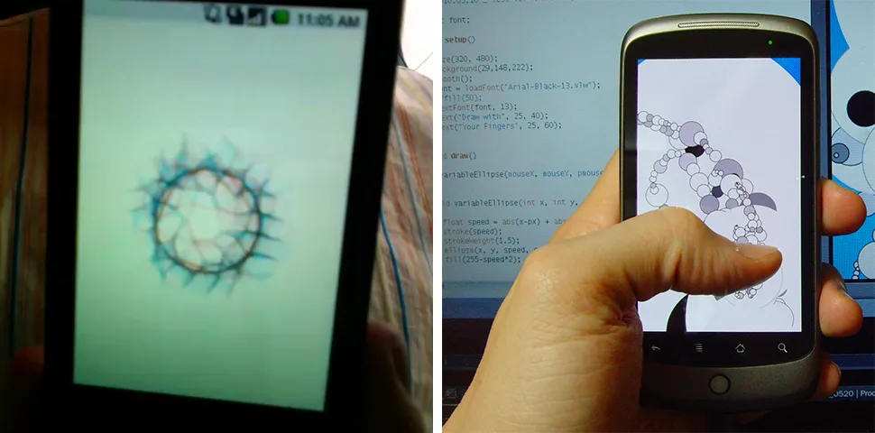
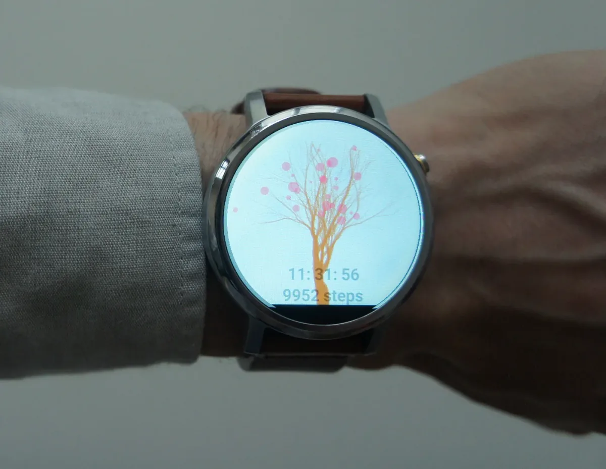
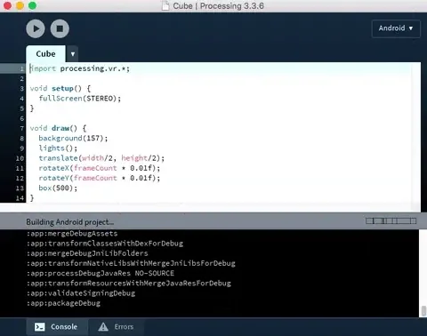

2017 marks the Processing Foundation’s sixth year participating in [Google Summer of Code](https://summerofcode.withgoogle.com/). We were able to offer sixteen positions to students. Now that the summer is wrapping up, we’ll be posting a few articles by students describing their projects.

post written by [Andres Colubri](http://andrescolubri.net/)  
GSoC students: [Sara Di Bartolomeo](https://picorana.github.io/) and [Rupak Das](https://github.com/rupak0577)

mentored by [Gottfried Haider](http://ghai.xyz/)

---

The Android version of Processing recently reached an important milestone: version 4 of the Android mode, supporting the most recent releases of the Android Operating System, and enabling the creation of live wallpapers, watch faces, and Virtual Reality apps. Together with an [updated site](http://android.processing.org/) and an [upcoming book](http://www.apress.com/us/book/9781484227183), we are very excited to see what the Processing community will create with the new Processing for Android. This milestone would have not been possible without the help and support from many dedicated people at the Processing Foundation, Google Creative Lab New York, and Google Summer of Code program — the latter of which, specifically the projects of Sara Di Bartolomeo and Rupak Das, I will describe in more detail in this post.

Processing for Android has been around for a while. After initial conversations with Andy Rubin, the creator of Android, back in February of 2009, Ben Fry got Processing code from Casey Reas to work on the G1 phone, the first commercially released device to use Android. Ben and Jonathan Feinberg then wrote the foundations of the Android mode, which have been in use ever since. At the time, I had the opportunity to make my first contribution to the core of the Processing project by writing the 3D engine in the Android mode, which eventually became the basis for the OpenGL renderer in the desktop version of Processing as well.

*Left: Processing code running on the G1 phone in 2009. Right: Processing sketch running on the Nexus One in 2010.*

However, the Android platform did not remain static. Since its first public release in 2009, it grew to become the most widely used mobile operating system worldwide, with many changes in its architecture and functionality along the way. With Processing for Android, we tried to follow up these changes to make sure that the Android mode is up-to-date and supports new devices and features. As I mentioned, the latest version of the mode lets you create VR and watch face apps, introduced in the past few years with Google VR and Wear.

*Watch face created with the latest version of the Android mode.*

It’s worth noting how smartphones became the primary, if not only, computing device many people use on a regular basis. On one hand, it is natural to marvel at this feat of technology that put personal computers in the pockets of a significant percentage of the world’s population. But on the other hand, we should ask ourselves how much control and ownership we have over the software that runs on these devices, and perhaps more importantly, on the data that they collect continuously about our interactions, habits, and whereabouts. A project like Processing can play an important role in answering these questions, by making the programming of mobile devices more accessible to their own users.

The open source aspect of Android has significantly helped us to develop Processing for Android, and to maintain it over the years. An important piece of this work is enabled by the Google Summer of Code (GSoC) program, which provides funding for college students from around the world to work on open source projects, paired with a mentor from the project. We were very lucky to have exceptionally talented students tackling challenges in Processing for Android, starting with [Imil Ziyaztdinov](https://www.google-melange.com/archive/gsoc/2014/orgs/processing/projects/imilka.html) and [Mohammad Umair](https://omerjerk.in/index.php/2015/08/15/gsoc-2015-the-processing-foundation/) in the 2014 and 2015 editions of GSoC, respectively.

This year, we had two students working on Android-specific projects within Processing: [Sara Di Bartolomeo](https://picorana.github.io/google_summer_of_code/2017/07/03/gsoc3.html) and [Rupak Das](https://procandsoc17.wordpress.com/2017/08/25/final-report/). What made their contributions very special is that they were key to this new release of the Android mode: Rupak worked on the underlying code inside the Android mode that does the heavy lifting by building the Processing sketches into Android apps, and updating the Android SDK. The transition from Ant to Gradle as the build system in the Android SDK posed a significant challenge. Since the Android mode originally used Ant, and Google removed Ant support from the SDK a few months ago, Processing for Android became incompatible with the latest versions of Android. Fortunately, Rupak was able to integrate [Gradle tooling](https://docs.gradle.org/current/userguide/embedding.html) into the Android mode, which allowed us to move forward.

*Building a Processing sketch with Gradle.*

Sara, with mentorship from [Gottfried Haider](http://ghai.xyz/), complemented Rupak’s work by creating a fully featured VR audio visualization that demonstrates what is possible with the new VR support in Processing for Android. Sara’s [VR Audioscape app](https://play.google.com/store/apps/details?id=com.picorana.vraudioscape) combines FFT algorithms for real-time audio analysis with generative landscapes that represent the music track currently played on the device. All the source [is available on GitHub](https://github.com/picorana/VR_audioscape) for those interested in learning more about the techniques she applied in this project.

*VR Audioscape app.*

As Processing for Android marches into 2018 with exciting new possibilities, we invite you to explore creative and unexpected uses of our little pocket computers!
