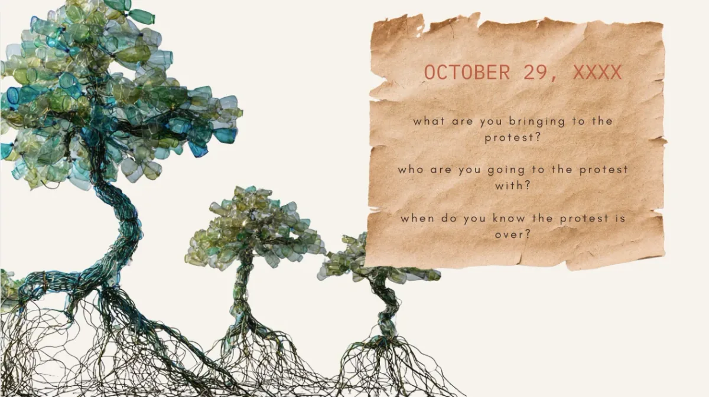
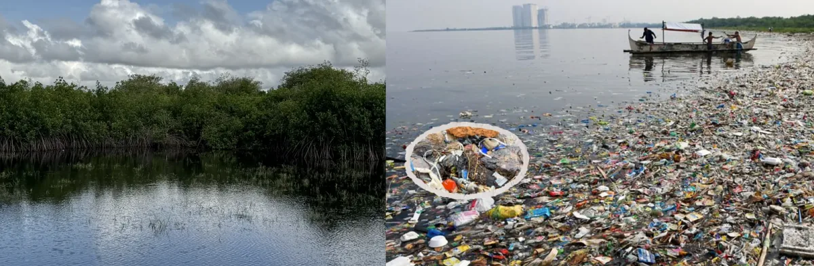
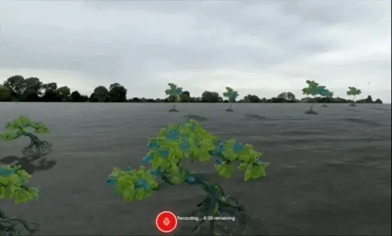
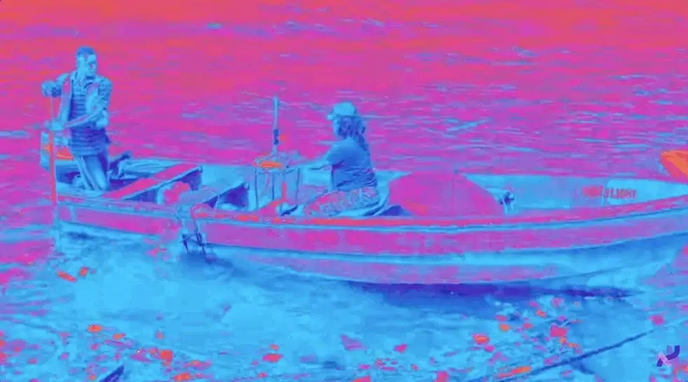

  <iframe src="https://www.youtube.com/embed/A6Umn0vHhzQ?feature=oembed" frameborder="0" scrolling="no"></iframe>

#### Fellowship Project: The Future Protest

-   Artists: [Maryam Kazeem](https://maryamkazeem.com/) and [Jubril Olambiwonnu](https://github.com/JubrilO)
-   Links: [Project Website](https://www.irantipress.com/programmes#future)

“I’m really interested in prompting the public as a way of making meaning,” Maryam Kazeem says, reflecting on the shift from working with small artistic cohorts to creating a project that is open to “anyone and anybody participating.” She views these collective gestures of recordings as a “dream space” where the act of protest functions as a generative “glitch” that creates an opening in the world as we know it.

In their shared narrative, participants offered a startlingly intimate inventory for their imagined futures: they brought musical instruments, love, sandwiches, their kids, and “the end of war and violence.” They envisioned marching alongside ancestors and the next generation, declaring that the protest would only be over “when the seeds bloom and we are free from pain.” For Maryam and Jubril Olambiwonnu, the technical lead on the project, these contributions represent a form of radical publishing where archival words finally touch the water, transforming a digital exercise into a living site of collective research.

*Speculative mangrove forms emerge from digital rendering of plastic waste, visualizing the ecological transformation of the Lagos Lagoon. Alongside them, a “future protest” prompt invites participants to imagine collective action.*

The concept of The Future Protest emerged from a central, unsettling question: how can a body of water that has been systematically erased, sand-filled, and polluted become a site for speculative recovery? The project, a collaboration between Maryam, a writer and researcher based in Lagos, and Jubril, a software engineer and creative coder in London, responds to the ongoing ecological and socio-political displacement along the Lagos Lagoon, Nigeria. Their vision was not to merely document loss, but to create a sonic archive; a digital and eventually physical space where the act of imagining a protest creates a “glitch” in the dominant narrative of urban degradation.

In interpreting this year’s Processing Foundation Fellowship theme “Data Storytelling,” the project explores the friction between data, often seen as a rigid tool of state surveillance or outsider documentation, and storytelling, which in the context of Lagos is expansive, messy, and deeply relational. The Future Protest seeks to hold these together, treating the sound of a voice as a living energy capable of doing something in the water.

*A contrast between past and present conditions of the Lagos Lagoon: thriving mangrove ecosystems alongside today’s reality of pollution and plastic waste. The juxtaposition reflects the environmental transformation at the center of The Future Protest.*

The history of the Lagoon is one of forced transformation. Before British colonization, the area was a lush network of wetlands and mangrove forests that protected the land and provided a sanctuary for both wildlife and human communities. Under the guise of malaria mitigation, the colonial administration initiated a campaign of land reclamation, eradicating the mangroves and fundamentally altering the city’s relationship with its water. Today, that legacy persists in the form of untreated industrial waste and the displacement of waterfront communities.

This reckoning takes a startlingly literal form in the project’s technology. When a participant records a “future protest,” a poethic algorithm developed by Jubril analyzes the recording. Crucially, the algorithm does not only listen to the words, but also the pauses and gaps where the speaker catches their breath or searches for a thought. These moments of silence generate 3D animations of speculative mangrove trees. However, these are not the lush green trees of the pre-colonial era; they are constructed from digital renderings of the plastic bottles and trash that currently choke the Lagoon.

*A simulated lagoon environment where speculative mangrove forms emerge in response to recorded voices. The interface invites participants to contribute “future protests,” transforming sound and silence into living digital landscapes.*

“I got so excited when we first came up with this idea of thinking about silence as data,” Maryam recalls. “To take someone speaking and, from a poetic point of view, derive meaning from when they are not speaking felt incredibly impactful.” For Maryam, a writer who describes herself as formerly “technology-averse,” the fellowship transformed her understanding of data from something clinical into something poetic.

The project’s ethos mirrors the distinct talents of its creators. Jubril brought the technical rigor of a software engineer to a creative experiment, while Maryam provided the conceptual framework of speculative research and radical publishing. This April, Maryam will launch “[The Library on the Lagoon](https://www.youtube.com/watch?v=50qAiPnhSnU)”, an immersive installation where passenger responses are transcribed by a typewriter that powers a trash collection wheel in the water.

*Participants navigate the Lagos Lagoon in a speculative performance where typed “future protests” generate energy to propel the boat. The gesture transforms writing into action, linking language, movement, and environment within a living, participatory system.*

Through the medium of speculative sonics, The Future Protest suggests that the simple act of saying “no” to the current state of the world can create a pathway for navigating the future. It treats the Lagoon as a site where words can touch the water and do something in the water, turning the act of archival documentation into a living exercise in discovering alternative futures. It is an invitation to look at the waste, the silence, and the water, and see a space where the “glitch” of protest might finally let the ecosystem hear itself again.

---

The Processing Foundation Fellowship supports artists and creative technologists developing open-source creative tools and practices that expand access to creative technology. Through financial support, mentorship, and community partnerships, fellows create tools, artistic works, and research that contribute to a more open and accessible creative coding ecosystem.

-   Learn more about the Fellowship → [here](https://processingfoundation.org/fellowships)
-   Support programs like this → [here](https://processingfoundation.org/donate)
