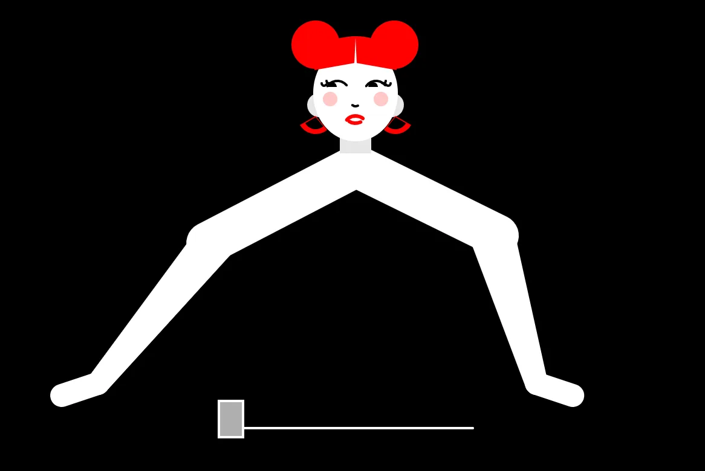
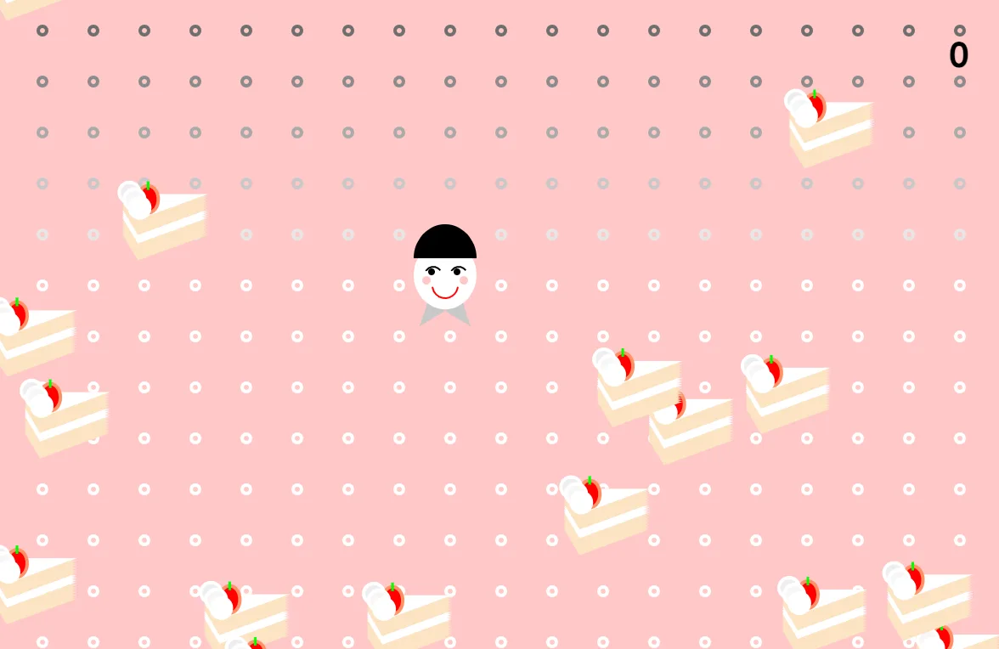
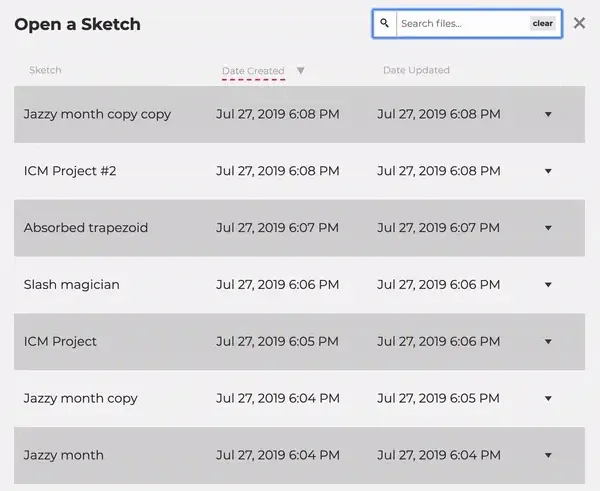

*Portrait of Rachel Lim.*

#### *A Note of Gratitude from Cassie*

It has been a wonderful, life-changing experience leading the p5.js Editor project for the past six years. Rachel and I have grown together in our careers — the computational media course that Rachel was in was my first time ever teaching a graduate course. It feels like kismet to be working together again and I am so excited for what she will bring to this project. A huge thank you to the p5.js community for all of the support over the years, I am grateful for everything it has given me.

*— Cassie Tarakajian*

Growing up, I moved around often. Both of my parents worked in different locations, and I was raised by my great-grandmother. In an endeavor to converge our varying circumstances, for several years I found myself juggling between different homes, schools, and communities on a rotating basis. Throughout my attempts to adapt to my ever-changing environment, my shy childhood self struggled to process and find the words to convey how I felt existing in what seemed like perpetual uncertainty. In those moments, I often felt soothed by the gentle balm of simply spacing out and lying still — slowly but deeply steeping within the colors, textures, and contours of the world around me. This past time of observing transformed into a love for absorbing and creating imagery, which eventually led me to study studio art and art history.

I’ve always lacked confidence in traditionally STEM spaces, and never imagined myself seeking them out on my own accord. However, college was a place for many firsts: my desire to spend time with my first college crush led me to enroll in my first programming course, where the professor briefly introduced our class to the practice of using computers and code to create art. I didn’t know what was happening or what it even really was, but I was intrigued by how a few lines of code could nurture life and interactivity into images in ways that traditional mediums couldn’t.

I took a few more computer science courses, but was disappointed when I wasn’t experiencing the same thrill. Although the courses and their instructors were both wonderful and thoughtfully comprehensive, I found it difficult to fully engage with their technical emphasis and almost clinical nature. Ultimately, I mostly ended up struggling through the course content. Compared to when I first started, I graduated college feeling like I understood less about what I learned, what my future held, or what I even wanted to do. Despite all these unknowns, I still held my eagerness to learn more about computers and art, which led me to the Interactive Telecommunications Program (ITP) at NYU.

*Three screenshots of Rachel’s homework assignments from Cassie’s Introduction to Computational Media course at ITP.*

At ITP, I was first introduced to p5.js and the p5.js Web Editor during an introductory computational media course taught by Cassie. I was reckoned by the warmth, support, and encouragement to experiment that radiated from their class, and the larger ITP and Processing community: it was a complete reversal of the classroom culture I was initially intimidated by and had expected to encounter. During this course, I also realized I was searching for a way to relate to the subject and gain a contextual understanding throughout the computer science courses I took in college. Creating, experimenting, and thinking critically about programming in tandem with their technicality was what I found most exciting about coding. As I continued to learn and create within this community, for the first time, I genuinely felt equipped to approach programming with confidence.

*A demonstration of Rachel’s Google Summer of Code project for the p5.js Web Editor, where a live search is happening as a search query is being typed.*

During the [2019 Google Summer of Code](https://processingfoundation.org/advocacy/google-summer-of-code/google-summer-of-code-2019) offered by the Processing Foundation, I first learned about the web development process under Cassie’s mentorship. My project was creating [a search tool for users’ sketches within the p5.js Web Editor](https://medium.com/processing-foundation/search-bar-for-sketches-in-the-p5-js-web-editor-e6e9cda3909d). When I started it, I didn’t realize learning about the code and technologies upholding the web editor would be its own disorienting hurdle. Despite the many hours I spent in confusion, I felt amazed and touched by what I was able to achieve when given the space to learn under compassionate guidance. Using what I’ve learned from my project, I’m grateful for the opportunities I’ve had to provide Katie Liu and Annie Zheng support for their amazing Google Summer of Code projects: [adding alt text to the examples on the p5.js website](https://medium.com/processing-foundation/adding-alt-text-e2c7684e44f8) and [CONNECT: 2022 p5.js Showcase](https://medium.com/processing-foundation/announcing-google-summer-of-code-2022-projects-and-a-few-more-77043ab4d0b4).

After that experience, I hoped to aid others, particularly those who are in a similar place of discouragement, in fostering the same empowerment and support by ensuring that they had access to educational spaces with the safety to experiment and explore. I’m super excited to continue working with Cassie and the Processing team. I look forward to contributing to, maintaining, and blooming the creativity, inclusivity, and warmth that emanates from its community!

**Rachel Bio  
**[Rachel Lim](https://raclim.cool) (she/her) is a Korean-American programmer who is a developer within the educational technology space. Her works explore articulating vulnerability with gentleness and humor. She holds a master’s degree from the Interactive Telecommunications Program at NYU, where she also received a BA in Art History. In her spare time, she loves crafting and running outdoors.

**Cassie Tarakajian  
**[Cassie Tarakajian](https://cassietarakajian.com) (they/them) is an Armenian-American educator, technologist, and artist based in Chicago, IL. Their work centers around creating accessible and inclusive tools for making art, and interrogating the relationship between technology and pop culture. They are the creator of the p5.js Editor, an open-source in-browser code editor for creative coding in p5.js, supported by the Processing Foundation. They are also an adjunct professor at New York University’s Interactive Telecommunications Program (NYU ITP), teaching creative coding, web development, and making cursed content. They are a Y8 and Y9 member of NEW INC’s Art + Code Track, and in the past have held residencies at NYU ITP, Pioneer Works, and the STUDIO for Creative Inquiry at Carnegie Mellon.
